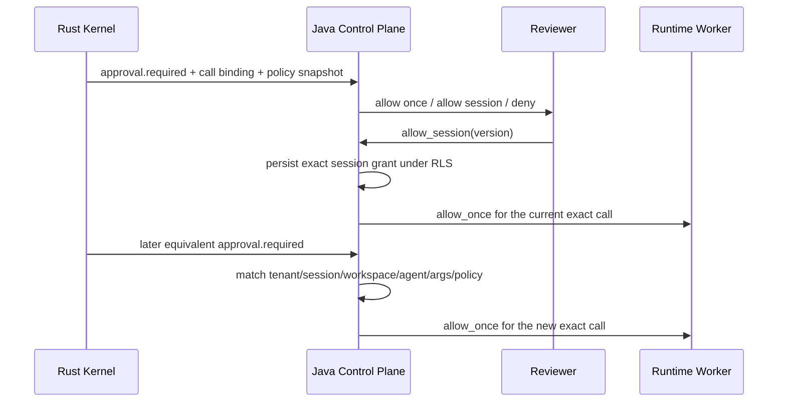

# ADR-0026：策略绑定的会话级 Tool 授权

## Status

Accepted

## Context

只提供 `allow_once` 会让同一会话中完全相同的只读 Tool 反复打断用户；但按 Tool 名称建立会话白名单会把
一次具体授权错误扩张成对任意参数、任意实现和任意 Agent 版本的授权。在多租户 PaaS 中，审批还可能跨
Worker 重启恢复，因此不能只放在进程内存中。

Codex 的 `ApprovedForSession` 把可序列化审批 key 存入会话内 `ApprovalStore`，所有 key 精确命中时免审；
OpenClaw 除了绑定 argv、cwd、Agent、Session 和环境摘要，还携带规范化策略快照，并在延迟决定执行前确认
策略没有收紧。两者都不支持本平台所需的 Tenant/Application RLS、Workspace 单写围栏和跨 Worker 权威恢复。

## Decision

1. Kernel 对每次待审批 Tool 产生两类摘要：
   - `binding_digest`：包含 call ID，只约束当前调用和当前 Worker 决定；
   - `session_scope_digest`：不含 call ID，覆盖 Tool 名称、完整参数和策略快照，用于识别后续等价调用。
2. 策略快照固定覆盖 `effect`、`approval`、`sandbox`、`implementation_digest` 和排序去重后的
   `required_scopes`。控制面校验快照与实际执行请求一致并保存摘要，不接受不完整快照。
3. `allow_session` 只对 `pure`、`idempotent` 生效；`non_idempotent`、`unknown` 继续只允许本次或拒绝。
   在跨语言数字规范化契约完成前，含浮点数的参数同样只提供 `allow_once`/`deny`，不会阻断当前审批。
4. Grant 绑定 Tenant、Application、Session、Workspace、AgentVersion、Tool、完整参数摘要和策略摘要，受
   PostgreSQL RLS、复合外键和唯一约束保护。Session 非 `active` 时 Grant 自动失效。
5. 新请求只有所有绑定完全一致才自动命中；参数、实现摘要、隔离等级、Scope、AgentVersion 或 Workspace
   任一变化都重新进入人工审批。V1 不支持通配参数或 Tool 名称级放行。
6. 控制面是会话 Grant 的权威匹配方。命中后，当前具体调用仍以 `allow_once` + 当前 `binding_digest`、
   approval version、attempt、Worker incarnation 和五分钟有效期下发，Worker 不接收可扩张的会话白名单。
7. `allow_session` 是 Session 生命周期内的授权，不等同于 Codex ExecPolicy amendment 或 OpenClaw
   `allow-always`。持久策略修订必须另建有审计、撤销和策略版本的资源 API。

## Consequences

### Positive

- 减少重复审批，同时不会把一次具体授权扩大为 Tool 名称白名单。
- 相比 Codex 的进程内 Session cache，可跨 Worker 重启恢复并留下租户级审计事实。
- 相比 OpenClaw 面向本机命令的长期 allowlist，本方案将授权限制在 Session 和不可变 AgentVersion 内。
- Worker 只消费当前调用的精确决定，Grant 逻辑集中在有 RLS 和版本锁的控制面。

### Negative

- 参数完全相同才命中，时间戳、随机 ID 等高变参数会继续触发审批。
- V1 没有通用参数语义匹配器，便利性低于 Codex 的工具专用 key 和 OpenClaw 的命令 allowlist。
- Session Grant 尚无独立查询/撤销 API；关闭 Session 会停止匹配，但记录保留到数据生命周期清理。
- 当前跨语言摘要使用递归键排序 JSON；浮点参数明确降级为 allow-once，后续需以标准化编码和跨语言
  golden fixture 扩大可移植参数范围。

## Alternatives Considered

- **只按 Tool 名称授权整个 Session**：参数和实现可漂移，拒绝。
- **把 `allow_session` 直接下发 Worker 缓存**：重启丢失且难以审计、撤销和执行 RLS，拒绝。
- **直接复制 Codex ApprovalStore**：本地体验成熟，但没有分布式租户与 Worker fencing，拒绝直接移植。
- **直接采用 OpenClaw `allow-always`**：生命周期过宽且命令语义不适用于通用 Tool schema，留待独立策略资源。
- **对所有副作用类型开放会话授权**：模糊失败可能重复外部副作用，拒绝。

## References

- Codex：`codex-rs/core/src/tools/sandboxing.rs`、`codex-rs/protocol/src/protocol.rs`
- OpenClaw：`src/infra/exec-approval-policy-snapshot.ts`、
  `src/infra/system-run-approval-binding.ts`、`src/infra/exec-approvals-authorization.ts`
- 本平台：`runtime/crates/kernel/src/lib.rs`、`control-plane/.../ToolApprovalScope.java`
- 本平台：`V17__session_scoped_tool_grants.sql`、`ApprovalCard.vue`
