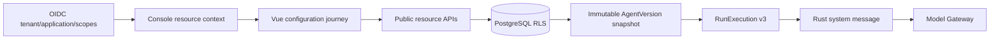

# ADR-0027: Application-scoped runtime configuration and immutable execution snapshots

## Status

Accepted

## Context

The control plane already stores Projects, Workspaces, Agents, AgentVersions, Sessions, and
ModelPolicies, but native development seeds one fixed combination and the Console can only list
complete Run targets. The declared Workspace and Session create APIs have no Java implementation;
Agent and ModelPolicy creation are not yet part of the public contract. In addition,
`AgentVersion.spec.instructions` is persisted but is not included in the Java-to-Rust execution
command, so changing an Agent's instructions does not change model behavior.

The private Beta needs a real external-customer journey without adding another process or allowing
the Console to become an authorization boundary. A configuration created by one Application must
not be visible or writable by another Application in the same Tenant. A queued or recovering Run
must continue to use the immutable AgentVersion it selected, even if a later version is published.

Codex starts a thread from an effective snapshot containing model, provider, working directory,
instructions, approvals, sandbox, and thread-scoped configuration. OpenClaw's onboarding flow
creates a concrete Agent workspace and resolves Agent-specific model configuration before running.
Both make the selected runtime configuration effective, rather than storing display-only metadata.

## Decision

1. Add application-scoped create APIs for Workspace, Agent, immutable AgentVersion, ModelPolicy,
   and Session. IDs are server generated. `tenant_id` and `application_id` come exclusively from
   the workload's OIDC claims; clients cannot select either trust boundary in request bodies.
2. Add a read-only Console BFF projection that returns the authenticated Application and its
   Projects. The Console uses this projection to begin configuration, then calls the same public
   resource APIs available to SDK clients. The BFF does not perform final authorization.
3. Every repository write joins through Project to the claimed Application inside the same
   transaction in which PostgreSQL RLS is set. An absent or unauthorized parent is reported as
   not found. Names are unique within their immediate parent to make retry mistakes visible.
4. AgentVersion numbers are allocated while locking the parent Agent. A version contains bounded
   instructions and an explicit delegated-scope set. Versions are never updated in place.
5. Advance the internal Run execution command to schema version 3 and include the selected
   AgentVersion instructions. Rust validates the field, inserts it as a system message before the
   user message, and includes its digest in checkpoint compatibility checks. Recovery obtains the
   same immutable version snapshot from PostgreSQL.
6. The local Worker may lazily create only its UUID-derived Tenant/Workspace directory beneath the
   configured native workspace root. Public resource creation does not grant filesystem, shell, or
   network permissions; only the existing trusted native Tool boundary can access that directory.
7. Add dedicated `resources:read` and `resources:write` scopes. Existing Run and Approval scopes do
   not imply configuration authority.

## Consequences

### Positive

- The native Console no longer depends on hard-coded Workspace, AgentVersion, Session, or
  ModelPolicy IDs.
- UI, SDK, Scheduler, recovery, and Rust Worker observe one effective versioned configuration.
- Application isolation is enforced both by authorization claims and relational joins under RLS.
- No Docker, VM, Kubernetes component, or new resident process is introduced.

### Negative

- The UI performs a visible sequence of resource creates; a user can stop midway and retain valid
  incomplete resources until lifecycle management is added.
- The first Beta ModelPolicy shape exposes only the currently implemented single-provider routing
  mode; Provider Registry and BYOK remain separate work.
- Execution command schema v3 requires synchronized Java/Rust contract changes.

### Neutral

- Projects remain IAM/platform-provisioned for this stage. The Console selects an existing Project
  but does not create Applications or Projects.
- Session title is optional metadata and does not alter execution semantics.

## Alternatives Considered

**Keep the fixed native seed as the only setup path.** Rejected because it proves infrastructure,
not a customer configuration journey.

**Add one Console-only endpoint that atomically creates every resource.** Rejected because it would
make the BFF a second resource API, hide intermediate lifecycle boundaries, and be unusable by SDK
clients.

**Send instructions from the browser in every Run request.** Rejected because the instructions
would not be bound to the immutable AgentVersion and could diverge during retry or recovery.

**Let Java create local workspace directories.** Rejected because cloud control planes must not
write directly into Worker filesystems. Local materialization belongs to the Worker execution
boundary.

## References

- Codex `codex-rs/app-server-protocol/src/protocol/v2/thread.rs`
- Codex `codex-rs/config/src/thread_config.rs`
- OpenClaw `src/commands/agents.commands.add.ts`
- OpenClaw `src/agents/agent-scope-config.ts`
- OpenClaw `src/agents/model-fallback-candidates.ts`
- ADR-0024: Native macOS development runtime
- ADR-0026: Policy-bound session Tool approval
