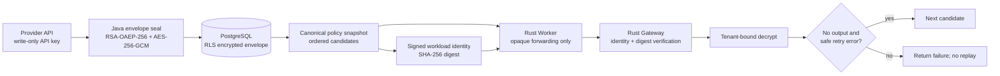

# ADR-0028: Tenant Provider Registry, BYOK envelope encryption, and safe failover

## Status

Accepted

## Context

The runtime previously loaded one Provider and plaintext credential from Model Gateway process
environment. That was sufficient to prove protocol adapters, but it did not make a ModelPolicy
effective, could not isolate tenant-owned credentials, and could not express an ordered fallback
chain. A multi-tenant PaaS also cannot trust a Worker to select endpoints, alter credentials, or
retry an operation after model output or a Tool Call has already escaped.

Codex has mature provider configuration, environment and command-backed credential loading,
bounded request/stream retries, and transport fallback. Its primary execution path still resolves
one effective provider for a turn and is not a tenant Provider Registry. OpenClaw builds ordered
provider/model candidates, classifies failover errors, maintains cooldown state, and stops
fallback after committed work. Those semantics are useful, but its configuration and secret
ownership are designed around a personal Gateway rather than a PostgreSQL-authoritative PaaS.

## Decision

1. `model_providers` and ordered `model_policy_candidates` are application-scoped PostgreSQL
   resources. Every row carries immutable `tenant_id`; composite foreign keys and RLS enforce the
   same Tenant/Application boundary used by Workspaces and Agents.
2. Provider creation accepts an API key only as write-only input. The Java control plane generates
   a random AES-256-GCM data key, encrypts the API key with AAD `tenant_id:provider_id`, and wraps
   the data key with the Model Gateway RSA public key using OAEP SHA-256. Only the envelope is
   stored. API responses and logs never return the secret or envelope.
3. The Scheduler creates a canonical immutable ModelPolicy snapshot containing ordered provider
   IDs, protocol, endpoint, model, and encrypted envelope. `RunExecution` v4 carries the Base64
   snapshot plus SHA-256 digest. Workload identity v3 carries the same digest.
4. The Worker only forwards snapshot bytes and digest. It cannot decrypt credentials. The Gateway
   verifies the signed identity binding and recomputes the snapshot digest before resolving any
   route. A credential envelope is bound to its Tenant and Provider ID, so copying it to another
   tenant or provider fails closed.
5. The Gateway decrypts credentials immediately before constructing request routes and keeps them
   in zeroizing, redacted wrappers. Local development uses a generated RSA-3072 key pair; the
   control plane receives only the public-key path and the Gateway receives only the private-key
   path. `dev-clean` removes both. Production must replace file keys with a Vault/KMS adapter and
   audit every decrypt; this ADR does not claim production KMS integration.
6. Ordered failover is allowed only when the current attempt emitted no model event and the error
   is explicitly retryable `rate_limited`, `timeout`, or `unavailable`. Authentication, billing,
   protocol, context, and capability errors never switch candidates. Once text, Tool Call, usage,
   or any other event is emitted, failure is returned without replay.
7. Legacy schema-v2 invocations may continue using the process-level Provider during migration.
   Dynamic schema-v3 invocations require a configured route resolver and fail closed otherwise.

## Consequences

### Positive

- A ModelPolicy now selects real tenant-scoped Provider routes instead of display-only metadata.
- Worker compromise does not reveal BYOK plaintext or authorize endpoint/snapshot substitution.
- The retry boundary prevents duplicated model output and Tool side effects.
- The PaaS gains stronger tenant and audit boundaries than either reference project's local-user
  configuration model.

### Negative

- The snapshot contains ciphertext and is therefore larger; it is capped at 256 KiB and eight
  candidates.
- RSA file keys are suitable only for local development. Production KMS integration, rotation,
  revocation, health cooldown, and precise provider egress policy remain required.
- Candidate pricing is not yet part of the Provider resource, so dynamic routes currently use
  zero pricing and depend on the Run token/cost budget until metering metadata is added.

## Alternatives Considered

**Send a Vault reference to the Worker.** Rejected because it expands Worker authority into the
provider credential domain and makes workspace or Tool compromise more damaging.

**Store encrypted credentials but let the Worker choose endpoints.** Rejected because a compromised
Worker could substitute an exfiltration endpoint while retaining a valid workload token.

**Retry every retryable error across candidates.** Rejected because a timeout after partial output
or a Tool Call can duplicate externally visible work.

**Fork Codex provider configuration or copy OpenClaw's Gateway ownership model.** Rejected because
neither provides the required Tenant/Application/RLS authority boundary. Their retry and fallback
semantics are referenced selectively instead.

## References

- Codex `codex-rs/model-provider-info/src/lib.rs`
- Codex `codex-rs/core/src/responses_retry.rs`
- Codex `codex-rs/core/src/client.rs`
- OpenClaw `src/agents/model-fallback-candidates.ts`
- OpenClaw `src/agents/model-fallback-runner.ts`
- OpenClaw `src/agents/model-fallback-attempt.ts`
- OpenClaw `src/agents/failover-error.ts`
- ADR-0006: Provider Adapter and credential egress
- ADR-0008: Model policy and dispatch identity
