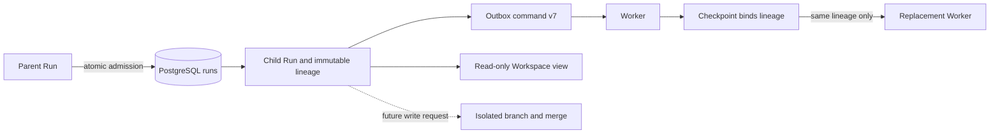

# ADR-0030: Durable subagent lineage and admission authority

## Status

Accepted

## Context

Codex has a process-local Agent registry with global spawn-slot reservation, depth checks, role
configuration, context forking, and child lifecycle operations. OpenClaw persists child session
relationships and applies configurable global, parent-child, and depth limits. Those designs are
useful references, but process memory and operator configuration are not sufficient authority for
a multi-tenant control plane where a Run can move between Workers or resume from a checkpoint.

The platform also gives each Workspace one fenced write owner. A child cannot safely share its
parent's write lease merely because both Runs belong to the same Agent tree.

## Decision

1. PostgreSQL `runs` is the authority for Agent lineage. A root Run has effective
   `root_run_id = id`, no parent or delegation, depth zero, and role `primary`. A child stores an
   explicit root Run, parent Run, unique delegation identifier, depth, and non-primary role.
2. The initial maximum child depth is three. The database rejects malformed, self-referencing, or
   deeper lineage independently of API and scheduler checks.
3. `RunExecutionCommand` schema v7 carries the immutable lineage snapshot and the subset of role
   definitions the current Run may delegate. The scheduler derives both
   from the database; callers and Workers cannot nominate or rewrite their own ancestry.
4. Worker checkpoints bind the lineage snapshot. Recovery with a different root, parent,
   delegation, depth, or role fails closed even when the replacement has a newer owner epoch.
5. A spawn transaction locks the parent Run and atomically enforces all of the following:
   role allowlist from the immutable AgentVersion, maximum depth, at most eight active children per
   parent, delegated scopes as an intersection with the parent, and child budget no greater than
   the parent's remaining reservable budget.
6. Initial child execution receives a read-only Workspace view. A child that needs to write must
   use an isolated Workspace branch and an explicit merge; it never shares the parent's live write
   lease.
7. The admitted child Run and its `run.queued` Outbox message are committed in the same
   transaction. The same delegation and identical intent return the existing child; reusing the
   delegation for changed input, role, or budget is rejected.
8. This ADR establishes identity and admission authority only. It does not claim that Worker-side
   spawn, wait, message, result aggregation, cancellation propagation, or branch merge APIs already
   exist.

## Consequences

### Positive

- Lineage survives scheduler, Worker, and node restarts and remains tenant-bound.
- Recovery cannot silently change a child Agent's role or authority.
- Admission can be made race-safe across many control-plane replicas.
- Concurrent attempts cannot oversell one parent's conservatively reservable budget.
- The design preserves the existing single-writer fencing invariant.

### Negative

- A spawn requires a parent-row-locking control-plane transaction instead of a purely local Worker
  operation.
- Parallel write-capable children require branch and merge support before they can be enabled.
- The v6 envelope increases command and checkpoint state slightly.

## Failure Modes

- Missing or inconsistent v7 lineage or role catalog: reject before Run acceptance.
- Checkpoint lineage differs from the scheduled Run: reject recovery as an identity mismatch.
- Parent is terminal, depth is exceeded, role is not allowed, capacity is exhausted, or budget and
  scopes are not a subset: reject the spawn transaction without creating a child Run.
- Ambiguous concurrent admission: the parent row lock and unique delegation identifier select one
  durable outcome; retries return the existing outcome.

## Implementation Evidence

- `JdbcSubagentAdmissionRepository` performs the parent row lock, immutable role lookup, scope
  subset check, active-child count, conservative budget reservation, child insert, and Outbox insert.
- `JdbcSubagentAdmissionRepositoryIntegrationTest` proves exact replay, delegation conflict,
  ninth-child rejection, depth rejection, scope escalation rejection, budget exhaustion, and two
  concurrent requests contending for one parent budget.
- Runtime actual-usage enforcement is a separate concern documented in ADR-0031. The admission
  balance does not yet subtract the parent's own consumed model usage.

## Alternatives Considered

- **Copy Codex's process-local Agent registry:** rejected as the authoritative layer because state
  would be lost or split across Workers; its lifecycle and role semantics remain implementation
  references.
- **Copy OpenClaw session keys and user configuration:** rejected as a tenant security boundary;
  persisted parent metadata and admission diagnostics remain useful references.
- **Let parent and child share one Workspace write owner:** rejected because it defeats owner epoch
  fencing and makes crash recovery nondeterministic.
- **Encode lineage only in JSON:** rejected because normalized columns, composite tenant foreign
  keys, uniqueness, indexes, and database checks are required for atomic admission and audit.

## References

- Codex `codex-rs/core/src/agent/control/spawn.rs`
- Codex `codex-rs/core/src/agent/registry.rs`
- Codex `codex-rs/core/src/agent/role.rs`
- Codex `codex-rs/core/src/tools/handlers/multi_agents/spawn.rs`
- OpenClaw `src/agents/child-admission.ts`
- OpenClaw `src/agents/subagent-depth.ts`
- OpenClaw `src/agents/subagent-spawn-plan.ts`
- OpenClaw `src/agents/subagent-launch-authorization.ts`
