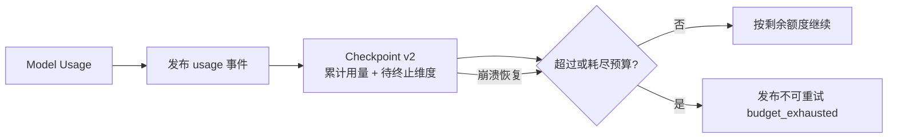

# ADR-0031: Checkpointed runtime budget ledger

## Status

Accepted

## Context

A Run can execute several model turns, cross a Tool approval boundary, or resume on a replacement
Worker. Passing the original `max_tokens` to every model turn permits cumulative overspend, while
terminating immediately on an over-budget usage event can lose the authoritative usage record if
the Worker fails between model completion and event publication.

Codex records per-thread usage and has a mature turn lifecycle, but its process-local spawn slots
are not a tenant budget transaction. OpenClaw persists rich child execution and completion state,
including usage in collector results, but does not provide the control-plane budget authority
needed here. The platform therefore needs an explicit, checkpointed runtime ledger in addition to
the conservative child budget reservation from ADR-0030.

## Decision

1. The Worker cumulatively records model-reported input tokens, output tokens, and cost in integer
   units. Provider `cost_micros` is compared with `max_cost_cents * 10_000`.
2. Every subsequent model invocation receives only the remaining token allowance. A Run cannot
   reset its budget by entering a new model turn or moving to another Worker.
3. A usage event is emitted and checkpointed before a budget terminal event. If the usage exceeds
   the limit, the checkpoint also stores the pending exhaustion dimension.
4. After the usage event is durably acknowledged, the Worker publishes one non-retryable
   `run.failed` event with `kind=budget_exhausted` and the exhausted dimension.
5. Recovery from a checkpoint with pending exhaustion terminates the Run without reinvoking the
   model. Checkpoint schema v2 stores usage and pending exhaustion while accepting schema v1 with
   zero prior usage.
6. Reaching the token or cost limit exactly may still accept a model `Stop` completion. It may not
   begin a further Tool/model turn. Exceeding either limit always terminates after recording usage.
7. Duration remains in the shared budget contract but is not considered enforced until a
   monotonic-clock deadline survives checkpoint and recovery. The control plane must also combine
   actual parent usage with delegated reservations before it can expose a globally exact balance.

## Consequences

### Positive

- Multi-turn and recovered Runs cannot silently reset token or cost consumption.
- The authoritative usage event is not lost merely because terminal publication fails afterward.
- Crash recovery cannot duplicate a model call after an already observed over-budget response.
- Exact-limit successful responses are preserved instead of being misclassified as failures.

### Negative

- Usage and terminal publication require two durable event boundaries and one extra recovery state.
- Correctness depends on Provider usage reporting; missing usage must be handled by a future
  estimation or policy layer.
- Duration and parent-actual-usage accounting remain explicit incomplete work.

### Neutral

- Checkpoint schema v2 is larger but remains backward compatible with v1.

## Failure Modes

- Crash before usage PubAck: JetStream redelivery repeats the unacknowledged event path.
- Crash after usage PubAck but before terminal: the checkpointed pending dimension restores as a
  terminal action without another model request.
- Exact limit followed by a Tool Call: reject the additional turn as budget exhausted.
- Provider usage exceeds integer limits or is malformed: fail closed at the adapter/protocol
  validation boundary rather than wrapping counters.

## Alternatives Considered

- **Pass the full Run limit to every turn:** rejected because cumulative use can exceed the budget.
- **Emit only the terminal event:** rejected because it loses billable usage and weakens audit.
- **Publish usage and terminal from one in-memory step:** rejected because a Worker crash leaves an
  ambiguous replay boundary.
- **Keep the ledger only in PostgreSQL:** deferred; the Worker still needs a checkpoint-local
  decision that survives replacement without a synchronous database dependency in the data path.

## References

- ADR-0030 durable subagent lineage and admission authority
- Codex `codex-rs/core/src/agent/control/spawn.rs`
- OpenClaw `src/agents/spawn-pipeline.ts`
- OpenClaw `src/agents/subagent-registry.types.ts`
- `runtime/apps/worker/src/lib.rs`
- `runtime/apps/worker/tests/assignment.rs`
- `runtime/apps/worker/tests/transport.rs`
