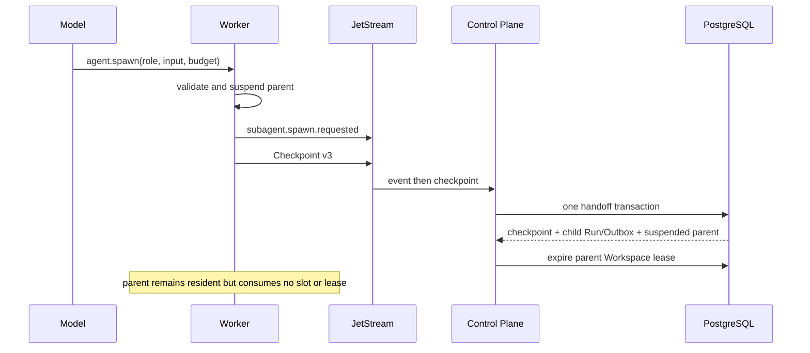

# ADR-0032: Checkpoint-first subagent handoff

## Status

Accepted

## Context

ADR-0030 made PostgreSQL the authority for subagent lineage and admission, but did not connect a
model-issued spawn request to the parent Run lifecycle. Codex can create an in-process child Thread
after reserving a slot and persists enough V2 identity data to recover its Agent graph. OpenClaw's
spawn pipeline is richer across completion and restart, but dispatch occurs before registry commit
and later failures require compensating cleanup.

The platform cannot dispatch a child that needs the same Workspace while its parent still owns the
fenced write lease. It also cannot release the parent before a checkpoint durably contains the
pending delegation: a Worker or control-plane crash in that interval would lose the Tool Call that
must eventually receive the child result.

## Decision

1. `RunExecutionCommand` schema v7 carries only subagent roles whose scopes are a subset of the
   current Run authority. Depth-three Runs and Runs without `agent:spawn` receive no spawn Tool.
2. The Worker exposes those roles through the built-in `agent.spawn` model Tool. It validates the
   requested role and budget against the command and remaining runtime budget. It never launches a
   local process for this Tool.
3. A spawn request receives a deterministic delegation UUID and a SHA-256 binding over the parent
   execution identity, Tool Call, role, input, and budget. The Kernel emits
   `subagent.spawn.requested` and moves the parent to `suspended`.
4. Worker Checkpoint schema v3 persists the exact pending request and role catalog. Recovery rejects
   role drift and waits for the durable delegation outcome rather than calling the model again.
5. The control plane records the request event without changing the authoritative Run status. Only
   a matching suspended checkpoint can trigger admission.
6. Migration V22 and the checkpoint transaction atomically persist the checkpoint, run the
   ADR-0030 admission checks, create the child Run and RunQueued Outbox record, mark the parent
   dispatch suspended, return Worker capacity, and expire the parent's Workspace lease.
7. A suspended parent remains resident in Worker memory for now, but is excluded from heartbeat
   capacity and active lease assignments. JetStream PubAck proves broker durability, not successful
   control-plane handoff, so the Worker must not physically discard parent state until a later
   control-plane acknowledgment protocol exists.
8. Result delivery, parent resume, and cancellation propagation are specified by ADR-0033. This
   decision still does not claim timeout arbitration, wait/send operations, or parallel read-only
   Workspace snapshots.

## Consequences

### Positive

- A child cannot start before the parent delegation is reconstructable from a durable checkpoint.
- Child creation, capacity accounting, and Workspace lease handoff have one PostgreSQL outcome.
- Replayed events and checkpoints cannot create a second child or change the delegation intent.
- The model sees only immutable roles already filtered by tenant, AgentVersion, depth, and scope.
- A broker acknowledgment cannot cause premature loss of the only recoverable parent state.

### Negative

- A suspended parent temporarily consumes Worker memory even though it consumes no execution slot.
- Parent and child execute serially on one Workspace until read-only snapshots or isolated branches
  are implemented.
- A rejected admission still needs an explicit control-plane outcome and parent recovery path; it
  cannot be represented as a local Tool error after the Worker has published the checkpoint.

## Failure Modes

- Unknown role, missing `agent:spawn`, malformed arguments, or budget escalation: reject in the
  Worker before suspension.
- Request event without a matching suspended checkpoint: retain the parent as running and create no
  child.
- Checkpoint digest, attempt, sequence, owner epoch, or fencing mismatch: reject the handoff.
- Control-plane transaction failure: create neither child nor partial lease transfer; the broker
  redelivers the checkpoint.
- Exact request or checkpoint replay: return the existing durable outcome.

## Implementation Evidence

- `agent-protocol` execution schema v7 and `SubagentSpawnRequest` validation.
- `agent-kernel` suspended transition and `subagent.spawn.requested` event.
- `agent-runtime-worker` built-in Tool exposure, deterministic binding, Checkpoint v3, role-drift
  rejection, suspended recovery action, and capacity/lease heartbeat exclusion.
- `V22__durable_subagent_handoff.sql` and
  `JdbcSchedulerRepositoryIntegrationTest.durableSubagentCheckpointAtomicallyQueuesChildAndReleasesParentWorkspaceLease`.
- Java native gate at this stage: 122 tests passed with one optional live test skipped. Later result
  delivery evidence is recorded by ADR-0033.

## Alternatives Considered

- **Dispatch then register like OpenClaw:** rejected because compensating cleanup cannot make a
  multi-tenant child dispatch and Workspace lease transfer atomic.
- **Create the child when the event arrives:** rejected because the parent checkpoint may still be
  missing after a Worker crash.
- **Drop the parent after JetStream PubAck:** rejected because broker durability is not a
  control-plane transaction acknowledgment.
- **Share the parent's live Workspace lease:** rejected because it violates single-writer fencing.
- **Run the subagent as a local process:** rejected because it bypasses tenant scheduling, workload
  identity, budget authority, and edge/cloud placement.

## References

- Codex `codex-rs/core/src/tools/handlers/multi_agents/spawn.rs`
- Codex `codex-rs/core/src/agent/control/spawn.rs`
- Codex V2 Agent identity and edge restoration
- OpenClaw `src/agents/spawn-pipeline.ts`
- OpenClaw `src/agents/subagent-spawn-request.ts`
- OpenClaw `src/agents/subagent-registry.types.ts`
