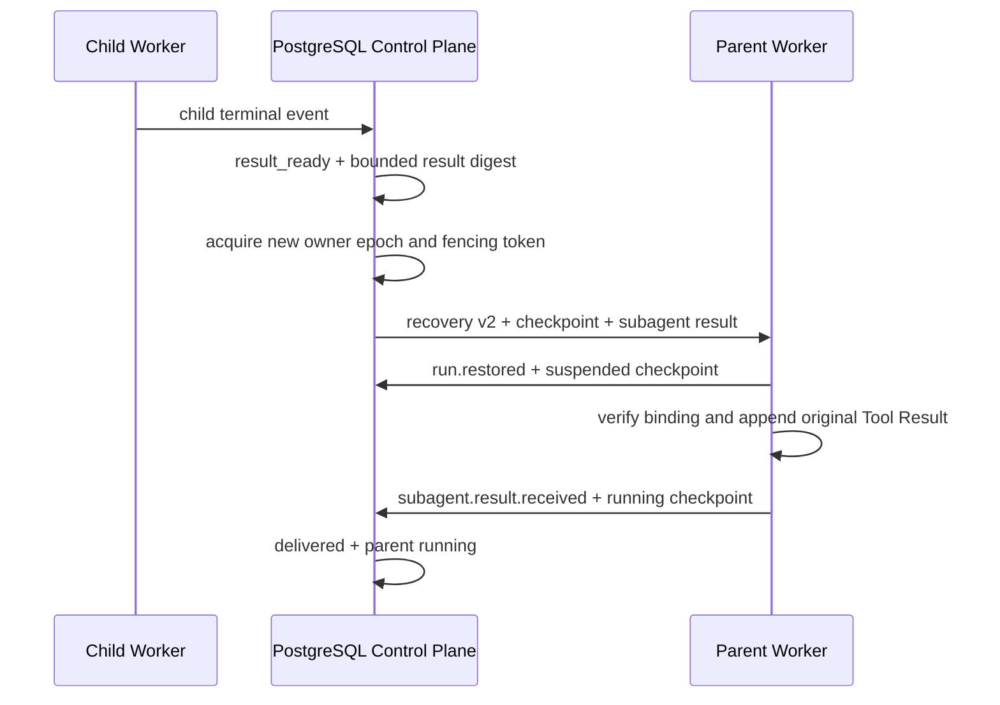

# ADR-0033: Durable subagent result delivery and tree cancellation

## Status

Accepted

## Context

ADR-0032 stops a parent Run only after its pending delegation is checkpointed and atomically hands
the Workspace to a child Run. The missing reverse path is harder than an in-process `wait`: the
child can finish on another Worker, the parent may no longer be resident, and a completion may race
with cancellation or message redelivery.

Codex returns child state through its persisted Agent graph and rich in-process collaboration tools.
OpenClaw keeps separate durable execution, completion, delivery, retry, kill-reconciliation, and
requester-wake state. The platform needs the same lifecycle safety while preserving PostgreSQL as
the multi-tenant authority and Workspace single-writer fencing.

## Decision

1. Migration V23 extends `subagent_calls` with the child terminal event, terminal status, bounded
   result JSON, result digest, delivery attempt, and delivery receipt.
2. A child terminal transaction releases its execution resources and changes exactly one matching
   call from `child_queued` to `result_ready`. Successful text is reconstructed from durable
   `model.output.delta` events and bounded before storage; failures retain the classified terminal
   payload.
3. Reconciliation locks a ready call, acquires a fresh Workspace owner epoch and fencing token, and
   creates a new parent attempt. The recovery command schema v2 carries the exact child result and
   its digest; ordinary fault recovery remains read-compatible with schema v1.
4. The Worker first publishes `run.restored` and its suspended checkpoint. It then verifies the
   result against the checkpointed Tool Call, appends a tool-role result with the original
   `tool_call_id`, emits `subagent.result.received`, checkpoints the running parent, and invokes the
   model again.
5. The control plane accepts the receipt only for the delivery attempt and exact delegation,
   binding, child Run, child terminal event, and result digest. It atomically marks the call
   `delivered` and the parent `running`.
6. Cancelling a parent recursively locks its non-terminal descendant tree. Every dispatched Run
   receives an attempt/Worker/incarnation-bound cancellation command; undispatched descendants are
   completed locally as `cancelled`. Open calls become `cancelled`, so late child results cannot
   restore the parent.
7. A terminal event may close the current dispatch while it is `accepted` or `suspended`. All
   tenant, session, attempt, Worker incarnation, sequence, digest, and event-transition checks stay
   mandatory; this narrow exception lets a checkpointed parent acknowledge a cancellation without
   reopening normal event mutation on an old attempt.

## Consequences

### Positive

- Child completion is recoverable without depending on one Worker process remaining alive.
- Result redelivery cannot target another Tool Call or revive a cancelled delegation.
- Parent continuation receives a normal Tool Result, so provider adapters need no subagent-specific
  prompt protocol.
- A fresh Workspace fence makes the reverse handoff obey the same single-writer rule as spawn.

### Negative

- Completion text aggregation is intentionally bounded and does not yet preserve arbitrary child
  attachments or structured collector output.
- Result dispatch currently uses the normal reconciler cadence; dedicated wake-up latency and
  retry backoff metrics remain future work.
- Wait, message, steer, close, timeout arbitration, and read-only parallel Workspace views remain
  outside this decision.

## Failure Modes

- Result digest or checkpoint binding mismatch: terminate the recovery command without invoking the
  model.
- No healthy Worker or unavailable Workspace lease: keep the call `result_ready` for reconciliation.
- Duplicate reconciliation before receipt: `delivery_attempt_id` prevents a second dispatch.
- Parent cancellation before receipt: mark the call `cancelled`; a late receipt cannot match it.
- Suspended parent cancellation acknowledgement: accept only the current suspended attempt and
  finish that dispatch; stale attempts and non-terminal mutations remain rejected.
- Child non-success terminal state: deliver a Tool error rather than retrying the child implicitly.

## Implementation Evidence

- `V23__durable_subagent_results.sql`.
- `agent-protocol` recovery v2 and `SubagentResultDelivery` contract tests.
- `agent-kernel` and `agent-runtime-worker` result receipt, transcript re-entry, checkpoint ordering,
  and recovery-action tests.
- `JdbcSchedulerRepositoryIntegrationTest` result handoff, delivery idempotency, and cancellation
  tree tests.
- Java native gate: 123 tests passed with one optional live test skipped; Rust workspace tests,
  formatting, and Clippy with warnings denied passed.

## References

- Codex `codex-rs/core/src/tools/handlers/multi_agents/spawn.rs`
- Codex `codex-rs/core/src/agent/control/spawn.rs`
- OpenClaw `src/agents/spawn-pipeline.ts`
- OpenClaw `src/agents/subagent-registry.types.ts`
