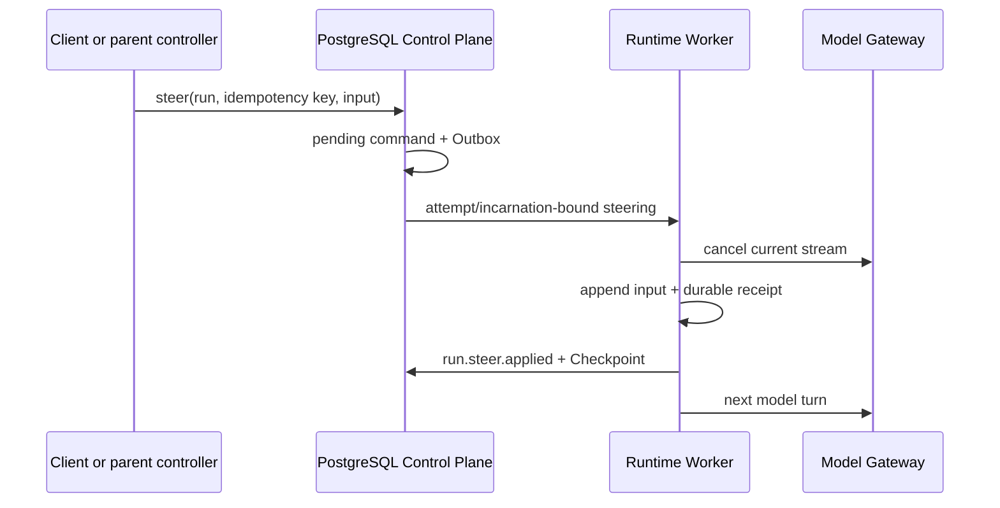

# ADR-0034: Durable, checkpoint-first Run steering

## Status

Accepted

## Context

Codex `send_input(interrupt=true)` interrupts an in-process Agent turn and queues new input. Its
`wait_agent` observes an in-memory status channel, while `close_agent` shuts down the persisted
Thread subtree. OpenClaw steering aborts the current child execution, clears queued follow-ups,
persists a replacement generation, and redispatches the child with the new instruction.

This platform already covers two parts differently: a parent implicitly waits through a suspended
Checkpoint and durable child-result delivery, and `:cancel` closes the whole non-terminal Run tree.
The missing operation is a message that can redirect a running Run without depending on one Worker
process. A transport acknowledgement alone is insufficient: the model must never see the input
twice after a Worker crash, and a delayed command must not target a replacement attempt or another
tenant.

## Decision

1. `POST /v1/runs/{run_id}:steer` requires `Idempotency-Key` and a non-empty UTF-8 input of at most
   32 KiB. PostgreSQL stores the command before publishing it.
2. Each command is bound to Tenant, Run, current attempt, Worker, Worker incarnation, input digest,
   issue time, and a validity window of at most five minutes.
3. Steering is accepted only while the Run is `running` and no approval, subagent handoff, or Tool
   side effect is unresolved. Those states require an explicit decision or cancellation instead of
   silently abandoning work.
4. The Worker cancels the current model stream, discards its buffered post-command output, rotates
   the model cancellation token, appends the new user input, and emits `run.steer.applied`.
5. The steering receipt and updated transcript enter the Checkpoint before the command is
   acknowledged or a new model turn starts. Exact redelivery returns the same receipt.
6. If the Worker fails before the receipt, Recovery schema v3 rebinds the still-pending steering
   command to the replacement attempt. The replacement Worker restores the Checkpoint, applies the
   steer, checkpoints it, and only then invokes the model.
7. This operation continues the same public Run and budget. It does not create a hidden replacement
   Run or reset usage.

## Consequences

### Positive

- Steering survives Worker replacement and message redelivery without duplicating model input.
- Tenant, attempt, and incarnation fencing are stronger than a process-local mailbox.
- The same Run keeps its audit trail, budget, Workspace lease, and event sequence.
- Refusing to steer across unresolved side effects avoids ambiguous Tool execution.

### Negative

- A steer cannot currently pre-empt an approval, Tool execution, or suspended subagent handoff.
- Discarded partial model output remains visible in the event history but is not included in the
  next transcript; the applied steering event marks the boundary.
- Multiple pending steering commands are serialized; queue compaction and operator prioritization
  remain future work.

## Alternatives Considered

- **Copy Codex's in-memory input queue.** Rejected because a Worker crash would lose the message or
  make replay ambiguous.
- **Copy OpenClaw's replacement Run.** Rejected because it fragments public Run identity and can
  reset budget or Workspace ownership unless another durable generation protocol is added.
- **Treat steer as cancellation plus a new Run.** Rejected because clients asked to redirect work,
  not terminate its audit and budget lineage.
- **Allow steering during any Tool state.** Rejected because non-idempotent side effects cannot be
  safely abandoned or replayed.

## Failure Modes

- Stale attempt or Worker incarnation: terminate the command without changing the Run.
- Input digest mismatch or expired command: reject before transcript mutation.
- Crash after Checkpoint but before receipt processing: recovery reads the receipt and republishes
  the same event identity.
- Crash before Checkpoint: Recovery v3 applies the pending command to the new fenced attempt.
- Late output from the cancelled model stream: discard it until that generation reports cancelled.
- The control-plane ledger does not yet receive a terminal negative receipt for an expired or
  permanently rejected direct envelope. Such a command can remain pending until recovery or a
  future reconciler resolves it; this is a known Beta gap, not a successful steer.

## Implementation Status

Implemented in PostgreSQL migration V24, Java REST/service/scheduler recovery, Rust protocol and
Worker transport/checkpoint recovery, and the Vue Console. Unit and integration tests cover
idempotency, fencing, UTF-8 byte limits, old-stream discard, exact redelivery, and Recovery v3.
A dedicated real-browser mid-stream steering journey and terminal negative-receipt reconciliation
remain required before declaring the operation production-complete.

## References

- Codex `codex-rs/core/src/tools/handlers/multi_agents/send_input.rs`
- Codex `codex-rs/core/src/tools/handlers/multi_agents/wait.rs`
- Codex `codex-rs/core/src/agent/control.rs`
- OpenClaw `src/agents/subagent-control.ts`
- OpenClaw `src/agents/agent-steering-queue.ts`
