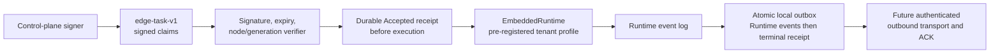

# ADR-0104: Signed Edge Task execution and durable local outbox

- Status: Accepted
- Date: 2026-08-13
- Scope: Rust Edge task contract, local Edge Node core, Embedded Runtime integration

> Update 2026-08-13: ADR-0105 supersedes the device-identity, enrollment,
> capability-discovery and exact-generation portions of this boundary. The
> task/outbox and recovery decisions below remain authoritative.

## Context

ADR-0103 completed the signed multi-tenant workload identity inside the Rust
data plane, but `runtime/apps/edge-node` was still a logging-only process. An
Edge adapter needs a transport-neutral boundary that can reject forged or
stale work before model or Tool egress, reserve an idempotency key before any
side effect, execute through the same multi-tenant Runtime as cloud and local
hosts, and retain events/results across process and network interruption.

This milestone must run natively on the development Mac. It cannot require
Docker, Java, PostgreSQL, NATS or a control-plane service. It also must not
pretend that a local library API is device enrollment or an authenticated
network protocol.

## Decision

1. `EdgeTaskClaims` schema 1 binds task, target node and generation, complete
   `RuntimeInvocationContext`, Run/Session, Workspace owner epoch, bounded
   input and a validity window of at most 24 hours. Schema 1 deliberately maps
   one task to one standalone Run, so `session_id == run_id`.
2. `edge-task-v1` uses Ed25519. The protected material includes version, key ID
   and exact encoded claims; the node accepts at most 16 explicitly trusted
   control-plane keys so a rotation overlap is possible. Tokens are limited to
   64 KiB and are verified before Runtime admission or network egress.
3. The node persists an `Accepted` receipt before invoking the Runtime. A task
   ID is permanently bound to the signed-task digest; the same digest is a
   duplicate, while a different digest under the same ID fails closed. A Run ID
   is likewise bound to only one task, so another signed envelope cannot
   execute the same Run before duplicate event sequences reveal the collision.
4. The node uses `EmbeddedRuntime` and therefore selects only a pre-registered
   immutable profile. Provider credentials and filesystem roots do not enter
   the task. The caller-supplied Workspace owner epoch is preserved in the
   actual Run command and Checkpoint instead of being replaced by a local
   default. The store advances a durable tenant/application/Workspace epoch
   high-water mark before execution and rejects a lower epoch. Workspace-level
   execution locks order local owners; this is local fencing, not a distributed
   lease issuer.
5. Every replayable Runtime event is rebound to task, node/generation, full
   invocation identity and owner epoch. Runtime sequence must start at 1 and
   remain contiguous; payload digests are rechecked and one payload is limited
   to 1 MiB. Events are appended before the corresponding receipt in one
   atomic node-state snapshot.
6. If the Runtime reached a durable terminal event but the process died before
   the Edge receipt commit, a replacement derives the terminal receipt from
   Runtime evidence without reissuing the model or Tool work. Without terminal
   proof it returns `indeterminate`; it never guesses that a side effect is safe
   to replay.
   An expired but correctly signed duplicate may read or reconcile its existing
   reservation; expiration can never authorize new execution.
7. The local outbox has a monotonic sequence, bounded cumulative cursor and a
   maximum read batch of 256. Acknowledged records are pruned only after the
   cursor is within the emitted range. Snapshot reload rejects any
   unacknowledged outbox or Runtime-event sequence gap.
8. One state root is bound to one exact node ID and generation and guarded by a
   Unix advisory single-writer lock. State is written to a new 0600 file,
   synchronized, atomically renamed and followed by a directory sync. A state
   root cannot be reopened merely with different process arguments and become
   another node.
   Persisted receipts/events must carry that exact identity, and an unbound
   state is valid only while completely empty.
9. The JSON snapshot is an intentionally bounded local substrate: at most
   10,000 task receipts and 10,000 pending outbox records. It is not the final
   high-volume store; durable SQL/embedded-log migration is required before a
   long-lived production node can rely on automatic retention.
10. Embedded profiles canonicalize state roots before checking ownership, so
    lexical or symbolic aliases cannot let two tenant Workspaces share state.
    Runtime events synchronize file data before becoming observable; new log
    directory entries and atomic Checkpoint replacements are synchronized too.
    Read or parse errors fail closed rather than becoming empty history. This
    correctness-first per-event synchronization needs benchmarking or framed
    group commit before high-volume production use.

## Failure modes and invariants

| Failure | Required result |
| --- | --- |
| Token tampering, unknown key or expired authority | Reject before Runtime or provider access |
| Task targets another node or generation | Reject before reservation |
| Same task ID with another signed payload | Reject as an identity conflict |
| Another task ID names an existing Run | Reject before Runtime execution |
| Lower Workspace owner epoch follows a higher one | Reject before reservation and egress |
| Duplicate completed delivery after restart | Return the durable receipt; do not execute again |
| Crash after Runtime terminal event but before Edge terminal receipt | Rebuild from durable Runtime events; do not execute again |
| Crash with no terminal proof | Report `indeterminate`; do not replay automatically |
| Missing/tampered Runtime or outbox record | Fail closed during commit or restart |
| Two processes open one state root | Only one writer acquires the root |
| Another node identity opens the root | Reject the identity/generation mismatch |
| Remote disconnect before upload | Retain unacknowledged local records for a future adapter |

## Explicit non-goals

- Device private-key creation, enrollment, attestation, certificate issue,
  rotation or revocation.
- Outbound mTLS/gRPC/WebSocket, reconnect/backoff, heartbeats, uploader or
  authenticated remote ACK. `pending_outbox`/`ack_outbox` are local adapter
  APIs, not control-plane authority or delivery proof.
- Capability discovery and operator approval of the declared node surface.
- Continuing `waiting_approval` or `suspended` work. Resumption must use a new
  signed command carrying a strictly newer Workspace owner epoch; replaying the
  original task token is not recovery authority.
- Signed approval/MCP-input/cancel commands and durable resume orchestration.
- A node-wide distributed owner lease, cross-Gateway fencing, Windows locking,
  offline Workspace branches or three-way merge.
- Exactly-once external side effects. The guarantee is durable reservation,
  duplicate suppression and fail-closed uncertainty.
- Autonomous scanning of `Accepted` work and safe receipt garbage collection.
  Recovery currently needs exact task re-delivery; re-signing with a new
  validity window changes its digest.

## Alternatives considered

- **Reuse the short-lived workload token directly.** Rejected because its
  audience and Worker incarnation semantics do not bind an offline target node
  or task payload.
- **Copy OpenClaw's online Node invoke path.** Rejected as the persistence
  boundary because its generic invocation/result state is connection-local;
  its device pairing and reconnect design remain the reference for the next
  transport milestone.
- **Use Codex app-server/exec-server recovery as the node protocol.** Rejected
  because its reconnect buffers are process-local and it has no signed Edge
  task envelope or persistent node-generation task ledger.
- **Call the Kernel directly.** Rejected because it would bypass the existing
  multi-tenant profile admission, model routing, Tool/MCP and durable Host
  semantics.
- **Introduce SQLite immediately.** Deferred until the transport and retention
  workload are measurable. The current bounded atomic snapshot keeps this
  native milestone small while making its operational ceiling explicit.

## Consequences

The repository now has a real signed Edge execution substrate rather than only
a binary placeholder. It is stronger than either reference project on the
narrow cross-process generic task receipt/outbox boundary, but much less mature
than OpenClaw as a device product and less broad than Codex as an interactive
Agent execution product. The next milestone must build identity enrollment,
capability negotiation and authenticated outbound delivery around this core;
it must not duplicate the Runtime state machine in the transport adapter.

## References

- Codex source snapshot `ff352fab6209dc0f9d13fc0036ed3f9404682b2c`
- OpenClaw source snapshot `58b4b9430457e91b44f0ccce73ad1b6c6bb11e28`
- `docs/evidence/2026-08-13-signed-edge-task-runtime-loop.md`
