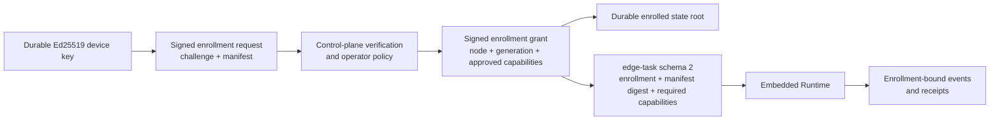

# ADR-0105: Edge device enrollment and capability-bound task authority

- Status: Accepted
- Date: 2026-08-13
- Scope: Rust device identity, enrollment grant, Edge task schema and durable node generation

## Context

ADR-0104 proved signed Edge task execution and durable local replay, but the
node ID and generation were still supplied by the embedding process. That was
not device identity: a caller could choose an identity without proving
possession of a durable key, and a task could not be tied to an operator-
approved capability surface.

This milestone must remain native on macOS and require no Java, Docker,
database, broker or network service. The local protocol must therefore prove
the cryptographic and durable state transitions without claiming that an
authenticated outbound transport or a production enrollment service exists.

## Decision

1. A node state root owns one Ed25519 device key. The device ID is derived
   from SHA-256 of the raw public key. On Unix the directory is mode 0700 and
   the identity file is mode 0600; symlinks, non-regular files, malformed key
   material and public/private mismatches fail closed. Creation uses a
   synchronized staging file and create-if-absent install so concurrent starts
   converge on one key.
2. `edge-enrollment-request-v1` proves possession of that key and binds a
   one-time challenge ID and nonce, the device public key, runtime/platform/
   architecture, and a declared capability manifest. Requests expire within
   five minutes and are limited to 64 KiB and 64 capabilities.
3. `edge-enrollment-grant-v1` is signed by one key from the bounded control-
   plane trust set. It binds enrollment ID, exact device key, node ID,
   monotonically increasing node generation, manifest digest and the approved
   capability subset. A grant is valid for at most 24 hours, bounding offline
   revocation lag until online revocation exists. `runtime.agent.execute` is
   mandatory for an executable enrollment.
4. A `VerifiedEdgeEnrollment` can only be created by grant verification; its
   fields are read-only outside the crate. The store and `EdgeNode` do not
   accept raw node identity arguments or an unverified grant.
5. `EdgeTaskClaims` schema 2 binds the active enrollment ID, capability
   manifest digest and required capability set. Before reservation or model/
   Tool egress, the node requires an exact enrollment/digest match and
   `required ⊆ approved`. This is node dispatch authority; Tool scopes and
   approvals remain separate Runtime policy and cannot be granted by the
   device manifest.
6. The durable state snapshot schema 2 records the device key identity,
   enrollment, grant digest and current node generation. Initial enrollment
   requires an empty ledger. A generation successor requires the same device
   and node, a strictly larger generation and no non-terminal receipt. Older
   generation receipts/outbox records remain replayable and cannot be relabeled
   as the new generation.
7. Every reserved task, Runtime event and receipt carries the enrollment ID
   and capability-manifest digest. Completion under another enrollment fails
   closed. Workspace owner-epoch and task/run one-to-one fences from ADR-0104
   remain independent and mandatory.

## Non-functional requirements

| Property | Bound |
| --- | --- |
| Enrollment request lifetime | at most 5 minutes |
| Offline enrollment grant lifetime | at most 24 hours |
| Enrollment token size | at most 64 KiB |
| Declared/approved/required capabilities | 1 to 64, normalized names |
| Device key durability | synchronized local file and directory commit |
| Local key confidentiality | owner-only file baseline; OS keystore/TPM is future hardening |
| Runtime dependency | native filesystem and loopback only for acceptance |

## Failure modes and invariants

| Failure | Required result |
| --- | --- |
| Copied request without the device private key | Signature verification fails |
| Replayed request under another challenge/nonce | Reject before grant issue |
| Grant for another key, manifest or excess capability | Reject enrollment |
| Grant older than 24 hours | Reject enrollment |
| Task for another enrollment or unapproved capability | Reject before reservation and egress |
| Same state root reopened as another device/node | Reject |
| Lower or same-but-different generation replaces current state | Reject |
| Generation advances while work is non-terminal | Reject and retain old evidence |
| Receipt/event changes enrollment binding | Reject commit or reload |

## Explicit non-goals

- Outbound mTLS/WebSocket/gRPC, reconnect, heartbeat, capability upload,
  authenticated remote ACK or remote task inbox.
- A server-side challenge store, operator UI, certificate authority, active
  revocation feed, device attestation, Secure Enclave/TPM integration or key
  recovery.
- Approval/cancel/MCP-input envelopes, automatic `Accepted` scanning, safe
  receipt GC, offline Workspace branching or three-way merge.
- Seamless generation handoff while non-terminal work exists. This milestone
  fails closed rather than transferring uncertain side effects.

## Reference comparison

- Codex snapshot `ff352fab6209dc0f9d13fc0036ed3f9404682b2c` has mature
  remote-control client pairing/revocation and Agent execution semantics, but
  the inspected path is not a generic multi-tenant Edge execution grant tied
  to a persistent task/outbox ledger.
- OpenClaw snapshot `58b4b9430457e91b44f0ccce73ad1b6c6bb11e28` is the
  primary device reference: stable Ed25519 identity, pairing generation,
  approved node surface, reconnect and revocation are broader and more mature.
  This platform deliberately adds explicit Tenant/Application/Workspace task
  identity, capability-digest binding and cross-process receipt authority.

## Consequences

The Rust Edge core now has a real device-to-enrollment-to-task authority chain
that is usable without the Java control plane. It is still a transport-neutral
library, not a production connected Edge Node. The next Edge milestone is an
authenticated outbound session with enrollment/certificate rotation,
capability negotiation, signed ACK evidence and revocation; approval/cancel/
resume follows after that transport can carry a newer owner epoch safely.

Update on 2026-08-13: ADR-0106 completed the authenticated outbound session,
signed ACK and online revocation portions. Certificate/Enrollment automatic
rotation, dynamic capability negotiation and approval/cancel/resume remain open.

## Evidence

- `docs/evidence/2026-08-13-edge-device-enrollment.md`
- `runtime/apps/edge-node/tests/edge_enrollment.rs`
- `runtime/apps/edge-node/tests/edge_runtime_loop.rs`
- `runtime/apps/edge-node/tests/edge_task_verification.rs`
