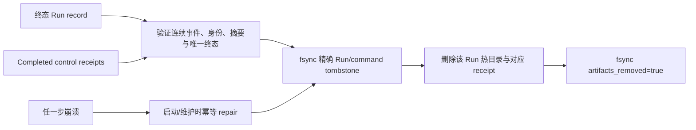

# ADR-0111：Crash-safe 终态账本、精确墓碑与有界本地保留

状态：Accepted（2026-08-15）

## 背景与非功能约束

ADR-0110 证明 100 Profile 混合执行的内存、FD、准入和控制收据有界，但每个终态 Run 的 record、event、
Checkpoint 与 control receipt 仍永久占据热目录。直接删除会丢失 Run ID/command ID 的重放围栏；永不删除
则使恢复扫描和本机磁盘随历史无限增长。

本阶段要求：

- PostgreSQL、NATS 或外部归档均不可成为独立 Rust Runtime 完成一次 Run 的依赖。
- 只回收具有连续、摘要正确且与 Run record 一致的终态事件证据；`Running`、等待审批、`suspended`、
  `indeterminate` 和存在未完成 `Accepted` control receipt 的 Run 永不自动回收。
- 删除前必须先持久化可精确拒绝旧 Run/command 重放的证据；任一提交点崩溃后均可幂等恢复。
- Workspace 与进程内 tenant 都有硬上限；无法安全回收时必须在模型或 Tool 副作用前失败关闭。
- M1 Pro 16GB 上以 1000 个真实 HTTP/SSE Run 验证热目录、恢复扫描、RSS 和 FD 有界。

## 决策

1. 每个 canonical Workspace state root 保存 checksum-bound `terminal-ledger.json`。Run tombstone 绑定完整
   invocation、Run/input digest、owner epoch、终态事件 ID/sequence/digest/status/time；control tombstone
   绑定 command ID、command digest、Run、applied epoch 与终态。
2. 回收顺序固定为“墓碑 durable commit → 删除精确 artifacts → cleaned durable commit”。第一步是重放
   安全提交点；第二步或第三步崩溃只留下可重复清理的 `artifacts_removed=false`。
3. eligibility 必须从完整本地 event log 证明 sequence 从 1 连续、payload digest 正确、完整 invocation 与
   Run 一致，并且最后终态事件与 durable Run state 一致。任何读取错误、损坏、缺失或模糊状态 fail-closed。
4. `EmbeddedRuntime` 在 Unix 上对每个 state root 持有非阻塞 `flock` 生命周期租约；同一持久根不能同时由
   两个 Runtime 维护。非 Unix 不宣称进程间租约，墓碑查询每次从磁盘重载。
5. 保留策略同时限制单 Workspace 和同一 `EmbeddedRuntime` 内的 tenant 聚合目录/墓碑。锁顺序固定为
   tenant → Workspace；达到 tenant 目录上限时可以从同租户另一个 Workspace 回收合格终态。如果只剩活动、
   等待或 `indeterminate` 证据，则新 Run 在创建 durable record 和出网前被拒绝。
6. 自动维护只在热目录达到 hard cap 时批量回收到保留目标，避免每个 Run 都解析和重写增长中的 JSON
   账本。显式维护仍立即回收到目标。墓碑容量耗尽时不覆盖旧证据，而是停止回收并最终失败关闭。

## 备选方案

- **直接删除终态目录**：拒绝。Run ID 和 control command 可在进程重启后重新触发模型或副作用。
- **永久保留完整 Run**：拒绝。热目录、恢复扫描和磁盘与历史线性增长。
- **Bloom filter/概率去重**：拒绝。误判会拒绝合法 Run，漏判会重放副作用，且不能提供审计证据。
- **每个墓碑一个文件**：暂不采用。写路径简单，但 1000+ 小文件会把恢复扫描和 inode 压力重新带回热路径。
- **单个摘要保护 JSON 账本**：本地里程碑采用。实现和崩溃语义简单，但写放大和启动扫描只适合有硬上限
  的本机账本；后续必须分段并接入外部归档 authority。

## 后果与风险

### 正面

- 终态热数据可回收，同时保留精确幂等与审计围栏；GC 崩溃不会忘记已执行工作。
- 同进程多 Workspace 的 tenant 容量首次成为真实执行约束，而非仅配置字段。
- 独立 Runtime 继续不依赖 Java、数据库、消息总线、容器或控制面。

### 负面

- 当前账本仍是单 JSON：984 个墓碑约 1 MiB，替代 Runtime 扫描约 1 秒；它有界但不是长期大规模存储。
- tenant 聚合只覆盖同一 `EmbeddedRuntime` 注册的 state roots。跨进程、跨节点或动态 Profile 的全局配额
  仍需外部 authority。
- Session/子代理树中没有根 `run.json` 的目录目前记为 unmanaged 并保守保留；尚未形成图感知保留。
- 非 Unix 平台没有等价内核文件租约，因此不能把当前单写证明外推到 Windows。

## 下一目标

实现 Session/子代理树感知的保留图与分段终态账本，并用多 tenant、多 Workspace 的长期 churn 证明查询、
启动和迁移成本不会随单文件账本逼近上限而退化。该目标仍只属于 Rust Runtime 内核。

## 参考

- `docs/evidence/2026-08-15-terminal-ledger-retention-and-1000-run-churn.md`
- Codex state runtime 的 thread delete/retry graph 与 log retention 实现
- OpenClaw task/cron/audit store 的 terminal retention、recovery-first maintenance 与分区上限实现
