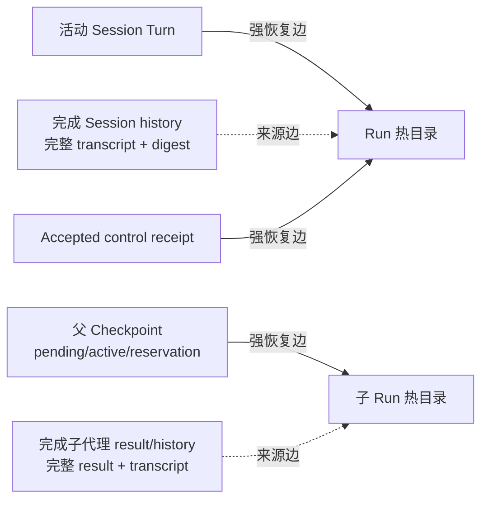

# ADR-0112：图感知 Run 回收与分段终态账本

- 状态：Accepted
- 日期：2026-08-15
- 范围：Rust Runtime Host / Embedded Runtime；不进入 Edge、Java、GUI 或外部数据库

## 背景

ADR-0111 已证明终态 Run 可以先提交精确 tombstone，再删除热目录，并在 1000 个真实 HTTP/SSE Run 中把
热目录保持在 16 个。但它仍有三个结构性缺口：

1. 只有 `run.json` 的根 Run 可治理；root Session Turn 与子代理 Run 会留下无 `run.json` 的 unmanaged
   目录。
2. 扫描只看单个 Run，没有区分“仍用于恢复的强引用”和“Session/子代理历史中的来源引用”。前者不能删，
   后者已经内嵌完整 transcript/result，永久保留热目录反而会造成泄漏。
3. `terminal-ledger.json` 每增加一个墓碑都重写全部历史；虽然 984 个墓碑仍约 1 MiB，但写放大会随
   Workspace 生命周期线性增长。

Codex 参考提交 `ff352fab6209dc0f9d13fc0036ed3f9404682b2c` 在 SQLite 中持久化 spawn edge，并在
`thread/delete` 前解析完整子树；删除关联数据后，spawn edge 与 thread row 最后删除，使失败后仍能发现并
重试同一棵树。OpenClaw 参考提交 `58b4b9430457e91b44f0ccce73ad1b6c6bb11e28` 已把 Session 行、归档
transcript、磁盘预算和按 Session 的 `pruned_max_sequence/historyGap` 分开治理，并在 SQLite 行提交后才清理
不再被任何 Session 引用的制品。

本项目不能直接依赖 SQLite：Runtime 的当前验收要求是可嵌入、纯本地、无外部服务即可完成 Run。因此吸收
二者的“先解析图、最后删除权威边、明确历史缺口”原则，保留文件存储实现。

## 决策

### 1. 引用图分为两种边



- **强恢复边**：活动 Session Turn；非终态父 Checkpoint 中的 `pending_subagent`、
  `pending_subagents`、`active_subagents` 与 `subagent_budget_reservations`；未完成 control receipt；
  waiting approval、suspended、running 与 `indeterminate`。任一存在即禁止回收。
- **来源边**：完成的 `SessionConversationTurn.run_id` 与完成的 `SubagentResultDelivery.child_run_id`。
  这些对象已经保存完整 typed transcript/result 和摘要，只要求 tombstone 保留来源证明，不要求保留事件、
  Checkpoint 和模型路由临时文件。
- Session 文件或非终态 Checkpoint 无法解析时，maintenance fail-closed，不用“未发现引用”推断安全。

### 2. Session 与子代理 Run 进入同一治理模型

`LocalRuntimeHost` 在 root Session Turn 和每个新子代理执行前写完整多租户 `LocalRunRecord`，并在审批等待、
MCP 暂停、取消或终态后更新同一记录。身份、输入、owner epoch 与既有记录冲突时拒绝覆盖。

提交顺序固定为：

1. 写 Running Run record；
2. 执行并持久化事件/Checkpoint；
3. 写对应终态或等待态 Run record；
4. 将完成 transcript/result 提交到 Session 或父 Run；
5. maintenance 重新解析图后才允许回收子目录。

因此“子 Run 已终态但父结果尚未提交”的崩溃窗口仍由父 Checkpoint 的 pending/active 边保护；完成提交后，
来源对象自包含，热目录可安全删除。

### 3. 终态账本升级为 manifest + 分段存储

schema 2 的目录结构为：

```text
retention/
  terminal-ledger-manifest.json
  active-00000000000000000003.json
  segments/
    segment-00000000000000000000.json
    segment-00000000000000000001.json
    segment-00000000000000000002.json
```

- 每个封存段最多 256 个 Run tombstone，内容、数量和摘要由 manifest 描述；封存段全部
  `artifacts_removed=true`，之后不可变。
- 新 tombstone 只写当前 active segment。active 满 256 条且全部清理后，写成新封存段，再写下一 active，
  最后原子替换 manifest。manifest 是唯一权威，未引用的中间文件不自动合并。
- tombstone 仍保存完整 invocation、Run/input binding digest、owner epoch、终态事件 ID/sequence/digest；
  control tombstone 与其 Run 留在同一段。
- 容量统计只需验证 manifest 与 active；启动索引和候选扫描会重新读取并校验所有封存段。这样日常统计不把
  历史长度放大为每 Run 的重复读取成本。
- Runtime 重启只调度恢复图的根。父 Checkpoint 仍引用的 child Run 不作为独立恢复根；父恢复流程沿
  spawn tree 驱动 child。否则父子会同时推进同一 child 的 owner epoch，形成双执行者。

### 4. 旧单文件迁移与崩溃顺序

发现合法 schema 1 `terminal-ledger.json` 且没有 schema 2 manifest 时：

1. 验证旧文件完整摘要；
2. 按 256 条确定性写入封存段，未完成清理的 tombstone 必须留在 active；
3. 写新 active；
4. 原子提交并同步 manifest；
5. 最后删除旧文件。

步骤 4 前崩溃，旧文件仍是唯一权威；步骤 4 后崩溃，新 manifest 已是唯一权威，旧文件只是可清理遗留。
普通回收仍遵守 tombstone fsync → 删除精确 Run/receipt → active segment 标记 cleaned 的顺序。

## 失败模式与边界

- manifest、任一引用段、Session 文件或非终态 Checkpoint 摘要/结构错误：拒绝 maintenance。
- active tombstone 尚未清理：启动只读 active 即可幂等删除；封存段禁止包含此状态。
- manifest 提交前留下新 segment/active：忽略；下次使用同一确定性 segment id 重写，不把孤儿文件当历史。
- 完成历史保留来源 ID，但本阶段没有公开 `historyGap`/cold archive API；tombstone 容量耗尽仍 fail-closed。
- 非 Unix 平台仍缺跨进程 state-root 生命周期锁；本 ADR 不改变 ADR-0111 的平台边界。
- 父 root Run 由直接 `LocalRuntimeHost::execute` 创建且没有统一 Run record 时仍会显示为 unmanaged；本阶段
  修复 Session/子代理目录，不借机重构所有旧 standalone API。
- 父/子都写 Run record 后，首次全工作区门禁真实暴露了“双恢复”竞争：replacement 同时调度父与 child，
  child owner epoch 被其中一方推进后另一方以 stale epoch 失败。现在恢复前先解析非终态父 Checkpoint，
  只调度图根；原失败用例在专项 6/6 与全工作区并发环境均通过。

## 容量与验收

- 封存段：每段最多 256 Run；active 只在迁移或一次大批提交的短暂窗口可超过该值，随后同步轮转。
- 1000 个真实 HTTP/SSE 顺序 Run：16 热目录、984 tombstone、70 个文件、约 1.17 MiB，最终维护扫描
  0.934 秒，总耗时 110.617 秒，FD 12→12。
- 4 tenant × 3 Workspace × 32 Run：384 个真实 Run 在 36.64 秒内完成；每 Workspace 最终 6 个热目录、
  26 个 tombstone；替代 Runtime 保留精确 replay fence。
- root Session 的首个热 Run 删除后，替代 Host 能从 Session 自包含 transcript 继续第二 Turn。
- 两个并行子代理的 Run record 均进入回收；删除子 Run 热目录后，父 Checkpoint/result 图仍存在。
- Rust 全工作区 694 项中 688 通过、0 失败、6 个外部 live 用例显式忽略；Clippy
  workspace/all-targets/all-features `-D warnings`、格式与差异门禁通过。

## 取舍与未采用方案

- **立即改用 SQLite**：查询、事务和分页更成熟，但会改变当前纯文件嵌入契约并扩大迁移面；留给持久层可插拔
  接口阶段。
- **只要历史出现 Run ID 就永不删除**：实现简单，但把审计来源误当恢复依赖，Session/子代理长期运行必然
  泄漏。
- **删除所有完成子 Run，不解析父状态**：会破坏“子终态已落盘、父结果未提交”的崩溃恢复窗口，拒绝。
- **继续单 JSON 文件并提高容量**：不解决写放大，也无法形成可验证的冷段边界，拒绝。

## 参考源码

- Codex：`codex-rs/state/src/runtime/threads.rs` 的 spawn descendant 查询与
  `delete_threads_strict`
- Codex：`codex-rs/app-server/src/request_processors/thread_delete.rs`
- OpenClaw：`src/config/sessions/store-maintenance-operations.ts`
- OpenClaw：`src/config/sessions/session-accessor.sqlite-archive.ts`
- OpenClaw：`src/sessions/session-state-events.ts` 的 `pruned_max_sequence/historyGap`
- OpenClaw：`src/config/sessions/archive-compression.ts`
