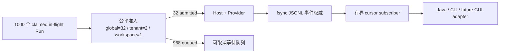

# ADR-0113：本地有界在途容量与持久事件订阅

- 状态：Accepted
- 日期：2026-08-15
- 范围：Rust Embedded Runtime；不进入 Edge、Java、GUI 或外部基础设施

## 背景

“1000 active Run”若解释为 1000 个同时构造的 Host、模型连接和 Tool 进程，会把本地 M1 Pro 16GB 当成
生产集群，既浪费资源，也无法代表共享多租户 Runtime 的正确调度。真正需要验证的是：Runtime 能否接住
1000 个不同租户/Workspace 的在途身份，同时把昂贵执行严格限制在可配置并发内，并让排队取消、执行取消、
事件慢消费者和重连全部有界。

Codex 参考提交 `ff352fab6209dc0f9d13fc0036ed3f9404682b2c` 使用 resource-key 队列串行化冲突请求，
模型响应流使用容量 1600 的 Tokio channel 并在发送端等待。OpenClaw 参考提交
`58b4b9430457e91b44f0ccce73ad1b6c6bb11e28` 使用可取消的 Session admission/identity lock，Node 进度流
串行发送 16 KiB 块并在可暂停生产者上施加背压。两者都提供了局部背压原则，但所查源码没有本项目同口径的
进程级 global/tenant/Workspace 共享容量门禁。

## 决策

1. 本地扩展门禁固定为 **1000 个 claimed in-flight、32 个 admitted Host/Provider**；排队者只持有 Run
   身份所有权与准入等待，不构造 Host、Provider 连接或 Tool 进程。日常快速门禁建议为 256/16；1000 个
   真正同时执行只在专用或分布式环境验收。
2. admission 继续执行 global、tenant、Workspace 三层上限与 tenant round-robin。队列 future 被取消时以
   RAII 释放；执行中取消通过 durable control receipt 收敛。
3. 删除 `LocalRuntimeHost` 的 unbounded live event sink。事件先写入并同步 `events.jsonl`，订阅者只从持久
   日志按 exclusive sequence cursor 读取；慢订阅者填满自己的 channel 后等待，不阻塞 Agent 执行。
4. 单订阅容量为 1..256；单进程最多 256 个订阅、总计 1024 个缓冲槽；事件日志单行写入与读取统一限制为
   256 KiB。身份不一致、序列缺口、损坏或超长行均 fail-closed。
5. 本阶段的 1000 是容量/调度语义，不宣称 1000 真并发吞吐、生产 SLA 或分布式配额权威。

## 非功能验收

| 指标 | 本地扩展门禁 |
| --- | --- |
| 在途与真实执行 | 1000 claimed；32 admitted；968 peak queued |
| 多租户 | 20 tenant、200 Profile/Workspace；tenant≤2、Workspace≤1 |
| 取消 | 500 queued abort + 16 active durable cancel，最终无 owner/queue 残留 |
| 公平 | 首轮覆盖 20/20 tenant；释放 16 槽后晋升至少 8 tenant |
| 事件 | capacity=1 的慢订阅不阻塞 Run；cursor 重连事件 ID 精确一致 |
| 本机资源 | 增量 RSS≤512 MiB；FD peak-baseline≤160；最终≤baseline+16 |
| 时限 | 120 秒内完成本门禁 |

最终 Rust 全工作区 695 项中 689 通过、0 失败、6 个外部 live 用例显式忽略；Clippy
workspace/all-targets/all-features `-D warnings`、格式与差异门禁通过。

## 失败模式与取舍

- 排队 future 消失：在 durable Run acceptance 与 Provider 前释放队列和执行 owner。
- 活跃 Run 取消：连接断开、终态 `cancelled` 与 control receipt 必须一致，禁止将断流当成功。
- 慢/断线消费者：不缓存无界广播；重新从 durable cursor 读取。
- 事件损坏、越界或身份混入：发送 typed error 后关闭订阅，不跳过缺口。
- 旧 `replay_events` 仍一次性读取完整热日志；本阶段只保证新 Embedded subscription 有界，旧 IPC attach
  必须在下一 Event Cursor 阶段迁移，不能把它误报为全调用面有界。
- 未采用 1000 个本地真连接：会测到机器资源上限而非调度正确性。
- 未采用丢弃旧事件或无界 broadcast：前者破坏审计/续传，后者允许任一客户端放大内存。
- 未引入 Docker、NATS 或数据库：它们不是独立 Runtime 本地容量语义的必要条件。

## 后续边界

下一阶段应把 channel close、已回收历史和序列缺口收敛为版本化、协议中立的 Event Cursor 结果契约，供
Java/CLI/GUI 适配器稳定消费，并替换旧的 bulk `replay_events`；真实 1000 执行并发留到专用环境，不回灌
为本地日常目标。

## 参考源码

- Codex：`codex-rs/app-server/src/request_serialization.rs`
- Codex：`codex-rs/core/src/client.rs` 的 `RESPONSE_STREAM_CHANNEL_CAPACITY`
- OpenClaw：`src/sessions/session-lifecycle-admission.ts`
- OpenClaw：`src/process/gateway-work-admission.ts`
- OpenClaw：`src/node-host/node-invoke-progress.ts`
