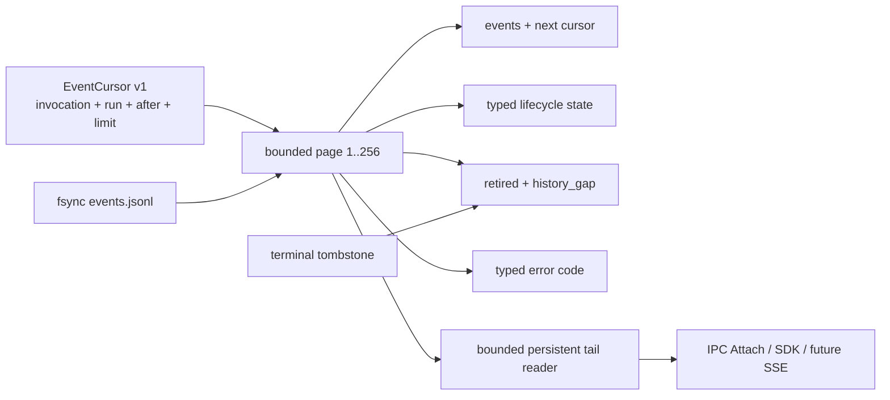

# ADR-0114：版本化 Runtime Event Cursor 与显式流边界

- 状态：Accepted
- 日期：2026-08-15
- 范围：Rust Embedded Runtime / 本地 IPC；不进入 Edge、Java、GUI 或外部基础设施

## 背景

旧 `EmbeddedRuntime::replay_events` 与 daemon `attach` 只有 `after_sequence → Vec<Event>`：调用会把命中
事件全部装入内存，daemon 还会每 20ms 从头读取完整 JSONL。连接关闭无法区分正常终态、等待审批、暂停、
历史已回收、游标超前和存储损坏，Java/CLI/GUI 适配器只能猜测。

Codex 参考提交 `ff352fab6209dc0f9d13fc0036ed3f9404682b2c` 的模型流使用容量 1600 的有界 channel，
App Server 将 live Thread listener 与连接生命周期分离。OpenClaw 参考提交
`58b4b9430457e91b44f0ccce73ad1b6c6bb11e28` 的 Session state 查询限制为 1..200，并在删除事件前先写
`pruned_max_sequence`；`historyGap` 只由真实 prune watermark 判断，不从稀疏序号推测。

## 决策

1. 新增 schema 1 `RuntimeEventCursorRequest/Page`。请求绑定完整 invocation、Run、exclusive sequence cursor
   与 1..256 limit；页面返回 next cursor、earliest/highest、`has_more`、`history_gap`、事件及生命周期状态。
2. 生命周期显式为 running、cancelling、waiting approval、suspended、interrupted、terminal 或 retired。
   terminal event 是提交权威；若事件已经终态而 `run.json` 因崩溃晚一步，Cursor 仍报告终态。两者真正冲突则
   fail-closed。
3. retired 页面不伪造事件。tombstone 提供终态 ID/sequence/digest；只有请求 cursor 落在已删除范围内才
   `history_gap=true`，已经确认到 terminal sequence 的客户端不会被误报缺口。
4. 错误代码固定为 unsupported schema、invalid request、not found、cursor ahead、identity mismatch、corrupt
   log、storage unavailable；IPC 使用 typed `EventCursorError`，不要求客户端解析字符串。
5. 订阅项变为 `Event | Boundary`。Boundary 显式携带最终 cursor、history gap 和状态；慢消费者仍受单订阅
   1..256、进程 256 subscriptions/1024 slots 限制。
6. live subscription 只在启动时做一次完整一致性检查，之后保留同一文件 reader 跟随追加内容；不再轮询时
   反复全量读取。Legacy `Attach` 由该订阅实现并保留旧 Event/Finished wire 兼容；新 SDK 使用 EventCursor。
7. 事件行继续统一限制 256 KiB，并验证完整多租户身份、严格连续 sequence 与 payload SHA-256。只有完整
   nil identity 的旧单用户日志可兼容空 digest，当前格式清空摘要会被拒绝。
8. `EmbeddedRuntime::replay_events` 暂留为既有 Edge consumer 的兼容 shim；Runtime Host/IPC 新集成面禁止
   使用。移除它属于未来 Edge 迁移，不在暂停 Edge 的本阶段暗改其 receipt 语义。

## 非功能与失败语义

| 边界 | 规则 |
| --- | --- |
| 页面内存 | 每页最多 256 事件；不返回无界 Vec |
| 实时内存 | 单订阅≤256，进程≤256 订阅/1024 缓冲槽 |
| 身份 | tenant/application/workload/Workspace/AgentVersion/model policy/Run 全匹配 |
| 完整性 | sequence 从 1 连续；terminal 后禁止追加；payload digest 必须匹配 |
| Retention | tombstone-before-delete 是 history gap 唯一权威 |
| 断线 | next sequence exclusive cursor 重连，事件 ID 不重不漏 |

最终 Rust 全工作区 696 项中 690 通过、0 失败、6 个外部 live 用例显式忽略；Clippy
workspace/all-targets/all-features `-D warnings`、格式与差异门禁通过。

- torn/超长/空行、非法 JSON、序列缺口、摘要篡改：`corrupt_log`，不跳过。
- 游标高于已提交序号：`cursor_ahead`，不返回假空页。
- Run 已回收：返回 retired boundary；是否缺历史由 tombstone terminal watermark 精确决定。
- 订阅者断开：只释放自己的 task/permit，不取消 Run。
- 当前随机分页请求仍需从文件头验证到 cursor，CPU 为 O(日志长度)；实时订阅已用持久 reader 避免重复扫描。
  若长日志 profiling 证明分页扫描成为瓶颈，再增加 digest-bound sparse index，不提前引入数据库。

## 未采用方案

- **只靠 channel close**：无法表达审批、暂停、retired 和损坏，拒绝。
- **从 earliest sequence 推测 gap**：序列可能稀疏，且不能证明删除实际发生，拒绝。
- **无界 broadcast/整文件 Vec**：慢客户端可放大内存，拒绝。
- **立即加入 SQLite/NATS**：扩大独立 Runtime 依赖，且不是修复本地契约的必要条件，拒绝。
- **立即维护稀疏字节索引**：增加崩溃一致性面；当前尚无长单 Run 的性能失败证据，暂缓。

## 参考源码

- Codex：`codex-rs/core/src/client.rs` 的 `RESPONSE_STREAM_CHANNEL_CAPACITY`
- Codex：`codex-rs/app-server/src/message_processor.rs` 的 Thread listener 生命周期
- OpenClaw：`src/sessions/session-state-events.ts` 的 `listSessionStateEventsSince`
- OpenClaw：同文件 `pruneSessionStateEvents` 的 watermark-before-delete
