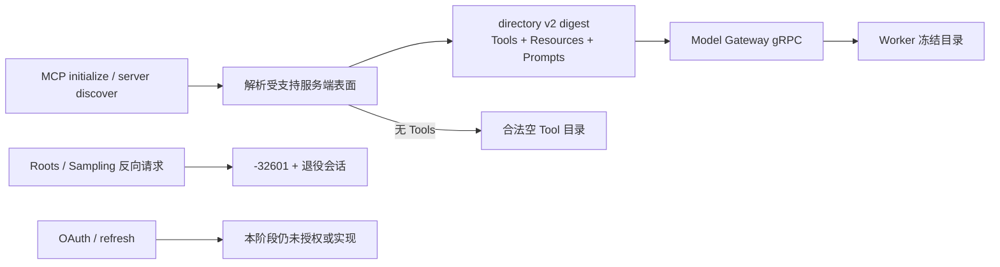

# ADR-0115：MCP 服务端能力目录与反向权限防火墙

- 状态：Accepted
- 日期：2026-08-15
- 范围：Rust Runtime 的 HTTP、stdio、Model Gateway gRPC 与 Worker；不进入 Java、GUI、Edge 或外部凭证服务

## 背景

旧实现把 MCP 可用性等同于 `tools` capability：一个只提供 Resources 或 Prompts 的合法 Server 会被当成
协议错误。另一方面，Roots 与 Sampling 是 **Client 向 Server 授予的反向能力**，不能因为 Server 声明了
其他表面，或因为未来增加 Resources/Prompts 查询，就被顺便打开。

Codex 参考提交 `ff352fab6209dc0f9d13fc0036ed3f9404682b2c` 已提供有超时的
`list_resources`、`list_resource_templates`、`read_resource`，并在每个操作前后处理 OAuth refresh/persist；
其 client service 的定制反向入口集中在 elicitation。OpenClaw 参考提交
`58b4b9430457e91b44f0ccce73ad1b6c6bb11e28` 已提供分页 Resources/Prompts 与 read/get，默认 client
capabilities 为空，仅在 MCP Apps 显式开启时添加 extension。两者都没有把 Roots/Sampling 当成默认权限。

## 决策

1. 新增协议中立 `McpServerCapability::{Tools,Resources,Prompts}`。它只描述 Server 可查询的表面，不是
   delegated scope、Tool 执行许可或反向调用许可。
2. HTTP 2025 initialize、HTTP 2026 `server/discover` 与 stdio 使用同一规则：capabilities 必须是对象；
   Tools/Resources/Prompts 的值也必须是对象；至少出现一个本 Runtime 支持的服务端表面。未实现的其他
   Server capability 不获得权限，也不阻止已知安全表面工作。
3. 只声明 Resources/Prompts 的 Server 是合法的空 Tool 目录，不发送 `tools/list`。任何 `tools/call` 仍要求
   Tools capability、冻结目录摘要、Tool 名与既有审批/副作用策略全部通过；Gateway 为调用新建会话时必须
   再验证该会话仍声明 Tools，不能沿用发现会话的权限结论。
4. 目录摘要升级为 domain-separated v2，并绑定受支持 capability 集合以及排序后的 Tool 名与 schema；
   description 只用于展示，不作为授权摘要。
   因此同一 Run 内从 Resources-only 变成 Tools-enabled，或 Tools schema 变化，都会触发目录漂移并拒绝调用。
5. Model Gateway `McpListToolsResponse` 升级为 schema 2，显式传递服务端能力。Worker 对 schema 1 只保留
   “历史响应等价于 Tools-only”这一条兼容推断；schema 2 的未知值、空集合、无 Tools 却带 Tool rows，及
   未来未知 schema 全部 fail-closed。
6. Roots 与 Sampling 属于反向 Client capability，继续不声明。2025 Server 发出对应 JSON-RPC request 时，
   Runtime 按原 request ID 返回 `-32601` 并退役会话；2026 MRTR 只接受 Run 已冻结且 delegated scope 允许的
   `elicitation/create`，不把反向请求恢复到新协议。
7. 凭证仍只在 Model Gateway 域打开 sealed envelope；Worker、Checkpoint、事件和日志不得获得明文。
   OAuth onboarding、refresh token 轮换和租户 credential-store indirection 尚未实现，不用静态 bearer 假装
   已对齐 Codex。
8. 本 ADR 只建立安全目录与升级边界。客户端可调用的 bounded Resources list/read、Prompts list/get 尚未
   暴露为稳定 Rust/gRPC 接口，是下一小阶段，不把 capability 可见性误报为操作已完成。

后续状态：上述第 8 项已由 ADR-0116 完成；本 ADR 保留当时的阶段边界，不再代表当前实现状态。

## 非功能与失败语义

| 边界 | 规则 |
| --- | --- |
| 响应体 | 单次 MCP 响应最多 256 KiB；Tool 目录最多 64 项 |
| 多租户 | HTTP/gRPC 请求继续绑定完整 workload identity 与授权 Server digest；Worker 不解封凭证 |
| 目录漂移 | 支持的 capability 或 Tool schema 变化会改变 digest；已冻结 Run 失败关闭 |
| 兼容升级 | schema 1 仅推断 Tools-only；schema 2 精确携带已支持表面；未知 schema 不降级 |
| 反向权限 | Roots/Sampling 默认拒绝；只有显式冻结的 Elicitation 走持久审批/续传 |
| 本地资源 | stdio 仍受 session cap、idle TTL、进程组回收与请求 timeout 约束 |

最终 Rust 全工作区精确列出 708 项：702 通过、0 失败、6 个外部 live 用例显式忽略；Clippy
workspace/all-targets/all-features `-D warnings`、Rust 格式和差异门禁通过。`target` 作为 14 GiB 可复用
增量缓存保留，未执行 `cargo clean`。全量行为门禁使用 `--test-threads=8`，匹配本机资源边界。

- malformed capability：协议错误，不进入模型出口。
- Resources/Prompts-only：初始化成功、Tool rows 为空、不会误发 `tools/list`。
- 无 Tools 的目录却返回 Tool rows：Worker 视为不一致响应，拒绝挂载。
- Server 在 Run 中增加 Tools：目录 digest 改变，既有 Run 不获得新增执行权。
- Server 在发现后、调用新会话中撤销 Tools：Gateway 在副作用前返回目录漂移，不发送 `tools/call`。
- OAuth token 过期：当前没有安全 refresh contract，必须显式失败；不得把 refresh token 下发 Worker。

## 未采用方案

- **把 Resources/Prompts 包装成普通模型 Tool**：会混淆只读目录与 Tool 副作用/审批语义，暂不采用。
- **声明 Roots/Sampling 后在回调里再检查**：先声明就扩大了协议权限面，且崩溃恢复更难，拒绝。
- **schema 1 静默解释新 capability**：旧客户端无法证明其含义，拒绝；只保留历史 Tools-only 推断。
- **在独立 Host 保存 OAuth refresh token**：破坏 egress credential domain，也没有轮换/撤销权威，拒绝。

## 参考源码

- Codex：`codex-rs/rmcp-client/src/rmcp_client.rs:640-697` 的 Resources 操作与 OAuth refresh/persist
- Codex：`codex-rs/rmcp-client/src/elicitation_client_service.rs:92-155` 的受限反向请求处理
- OpenClaw：`src/agents/agent-bundle-mcp-runtime.ts:247-258` 的默认 client capabilities
- OpenClaw：同文件 `1103-1175` 的 Resources/Prompts 操作
