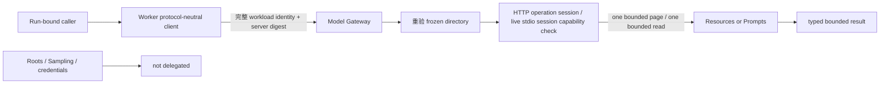

# ADR-0116：有界 MCP Resources 与 Prompts 读取接口

- 状态：Accepted
- 日期：2026-08-15
- 范围：Rust Runtime 的 HTTP、stdio、Model Gateway gRPC 与 Worker；不进入 Java、GUI、Edge 或 OAuth onboarding

## 背景

ADR-0115 已将 Tools、Resources、Prompts 纳入 Run 冻结的 MCP capability directory，但只有 Tool 操作可执行。
若直接透传 MCP JSON，Java、CLI 和未来 GUI 会绑定具体 MCP 修订；若自动遍历所有分页，恶意 Server 又能用无限
cursor 链拖垮共享 Runtime。Resources/Prompts 是 Server 向 Client 提供的只读内容，也不能因此获得 Roots、Sampling
或任意 Tool 权限。

Codex 参考提交 `ff352fab6209dc0f9d13fc0036ed3f9404682b2c` 提供分页 Resources list/read，并在内核侧用
独立只读 Tool 供模型选择；OpenClaw 参考提交 `58b4b9430457e91b44f0ccce73ad1b6c6bb11e28` 的 MCP facade
提供 Resources list/read 与 Prompts list/get。OpenClaw 会主动遍历全部分页，这不适合共享多租户 Runtime 的默认边界。

## 决策

1. 新增协议中立 Rust 类型：`McpResourcePage/Descriptor/Content` 与
   `McpPromptPage/Descriptor/Argument/Message/Result`。Resource blob 在 Gateway 解码为 bytes；Prompt content 保留
   为经大小和结构校验的 JSON，以兼容后续内容类型而不泄漏 MCP 传输细节。
2. 新增四个稳定操作：Resources `list/read`、Prompts `list/get`。每次只获取 Server 的一个分页；cursor 完全
   opaque，由调用方显式续页。Runtime 不自动遍历 cursor 链，也不提供会丢失 Server cursor 语义的本地截断分页。
3. 每页最多 64 项、cursor 最多 2 KiB、read 最多 16 个 content、prompt 最多 32 条 message、prompt 参数最多
   32 项；单个远端响应继续受 256 KiB 总上限。超过任一限制即 fail-closed，不返回部分结果。
4. 四个操作都携带完整 immutable invocation identity、workload token、Run 授权的 MCP Server snapshot 和
   `frozen_catalog_digest`。Gateway 先重验目录摘要；HTTP 在执行操作的新会话中再次确认 capability，stdio 则在
   当前已协商的持久会话中重验冻结目录与 capability。stdio 不为每次只读操作重启子进程，因为 MCP capability
   与分页 cursor 都可能依赖会话生命周期。Server 声明 capability 只是事实，不是授权。
5. Gateway 是 sealed credential 唯一解封域；Worker、Checkpoint、事件、日志与 stdio local Host 不获得云端凭证。
   stdio 使用同一协议中立结果和限制，但其信任来源是本机显式配置，不伪装成已验证的网络 workload identity。
6. Resources/Prompts 当前作为 Runtime API 能力，不自动注册为远端普通 MCP Tool。后续模型入口若采用 Codex 风格，
   只能注册 Runtime 自有、明确只读且受同一 Run/Server 绑定的内核 Tool；不得把 Server 自己的只读声明当审批豁免。
7. Roots 与 Sampling 继续不声明并拒绝；OAuth onboarding、refresh/persist 与撤销仍是下一阶段，不能以静态 token
   或把 refresh token 下发 Worker 的方式替代。

## 非功能与失败语义

| 边界 | 规则 |
| --- | --- |
| 多租户 | 每次 gRPC 都验证完整 workload identity 与 Run 授权的 Server digest |
| 资源治理 | 单页、单 read、条目数、参数数、cursor 与总响应体都有硬上限 |
| capability 撤销 | HTTP 新会话不再声明对应 surface 时，在读取前失败关闭；stdio 以当前会话和目录漂移门禁拒绝 |
| 目录漂移 | capability 集或 Tool schema 与 Run 冻结摘要不符时拒绝 |
| wire 升级 | 新 RPC 从 schema 1 开始；未知 schema、未知 role、畸形 JSON 不降级 |
| 凭证 | 仅 Gateway 解封；结果不含 Authorization、refresh token 或 envelope 明文 |
| 可移植性 | HTTP 2025/2026、stdio 与 gRPC 对外返回相同 Rust 类型 |

## 未采用方案

- **自动拉取所有分页**：OpenClaw 桌面进程可接受的便利，在共享多租户 Runtime 中会形成无界远端工作量，拒绝。
- **把 MCP 原始响应直接作为稳定接口**：会让所有嵌入方绑定 MCP 修订并重复实现安全限制，拒绝。
- **将 Resources/Prompts 当普通远端 Tool**：混淆内容读取与 Server Tool 副作用权威，拒绝。
- **只在首次发现时检查 capability**：Server 可在 Run 中撤销能力；HTTP operation session 必须重验，stdio
  持久会话也必须重验冻结目录，不能只信启动时缓存。
- **本地截断超大 Server page**：会让下一 cursor 跳过被截掉的数据，破坏分页正确性，改为整页拒绝。

## 参考源码

- Codex：`codex-rs/rmcp-client/src/rmcp_client.rs:640-697`
- Codex：`codex-rs/core/src/tools/handlers/mcp_resource.rs:54-197`
- OpenClaw：`src/agents/agent-bundle-mcp-runtime.ts:261-284,1103-1175`
