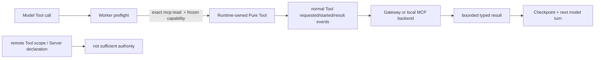

# ADR-0117：Runtime 自有 MCP 只读 Tool 与 Resource Templates

- 状态：Accepted
- 日期：2026-08-15
- 范围：Rust Agent Loop、Worker、独立 Runtime Host、HTTP/stdio MCP、Model Gateway gRPC；不进入 OAuth、Java、GUI 或 Edge

## 背景

ADR-0116 已提供协议中立的 Resources list/read 与 Prompts list/get，但这些操作只能由嵌入方调用，模型在
Agent Loop 中不可见。Codex 参考提交 `ff352fab6209dc0f9d13fc0036ed3f9404682b2c` 将
`list_mcp_resources`、`read_mcp_resource`、`list_mcp_resource_templates` 注册为 Runtime 自有只读 Tool；
OpenClaw 参考提交 `58b4b9430457e91b44f0ccce73ad1b6c6bb11e28` 在持久 MCP session facade 中提供
Resources、Resource Templates 与 Prompts。

远端 Tool 授权 `tool:mcp:<server>` 允许潜在副作用，不能被解释成“也允许把 Server 内容自动发送给模型”。
Prompt 内容尤其可能包含指令注入；Server 广告 Resources/Prompts 也只是能力事实，不是读取授权。

## 决策

1. Runtime 注册五个固定内核 Tool：`list_mcp_resources`、`read_mcp_resource`、
   `list_mcp_resource_templates`、`list_mcp_prompts`、`get_mcp_prompt`。前三个对齐 Codex 命名；后两个补齐
   已验证的 Prompts 客户端面。
2. Tool 只在至少一台已发现 Server 同时满足对应 capability 与独立 `mcp:read:<server>` delegated scope 时
   对模型可见。每次调用必须显式指定 Server；Worker 在创建执行请求前再次验证名称、Run-frozen capability、
   frozen catalog digest 和 scope。`tool:mcp:<server>` 不隐式授予读取权。
3. 这些 Tool 由 Runtime 拥有，descriptor 固定为 `Pure + Allow + Federated`。`Allow` 来自 Run 冻结的独立读取
   scope，不采信 Server annotation；执行仍走普通 Tool requested/started/result、Checkpoint、取消和恢复链，
   不另造旁路事件。
4. Resource Templates 进入与 ADR-0116 相同的协议中立 Rust/gRPC/HTTP/stdio 契约。每次只返回一页，最多
   64 项；cursor、URI template、名称、响应体及 wire schema 全部有界并 fail-closed。
5. 模型可见结果另设 128 KiB 序列化上限。过大内容返回确定性 Tool error，不截断为貌似完整的数据；binary
   Resource 以 Base64 表达且受同一上限。API 调用方仍可使用 ADR-0116 较宽但有界的 typed bytes 接口。
6. Prompt message 只能保持 `user`/`assistant` 低权限内容，绝不提升为 system/developer 指令。读取结果作为普通
   Tool Result 进入 transcript；下一次模型调用受现有 Token/费用/持续时间预算约束。
7. core Tool definition digest 绑定实现版本以及每台获批 Server 的 frozen directory digest/capability；恢复必须
   重发现并重建完全相同的绑定，否则在模型或网络出站前 fail-closed。

## 非功能与失败语义

| 边界 | 规则 |
| --- | --- |
| 多租户 | 完整 invocation identity、workload token、Server snapshot、目录摘要与独立 read scope 同时成立 |
| 资源治理 | 单页/单请求、条目数、cursor、远端响应与模型可见输出均有硬上限；不自动遍历所有页 |
| 可靠性 | Pure 请求可在无副作用证据下重试；Tool 事件和 Checkpoint 先后关系复用现有恢复链 |
| Prompt 安全 | 远端内容永不变成 system authority；未知 role/畸形 content 整体拒绝 |
| 升级 | 新 gRPC RPC/response 从 schema 1 开始；未知 schema 不降级；core implementation digest 版本化 |
| 可移植性 | HTTP 2025/2026、stdio、云 Gateway 与独立 Host 使用相同 Tool 名和协议中立结果 |

## 未采用方案

- **直接把 `tool:mcp:<server>` 当读取授权**：会把旧副作用授权静默扩大到数据出站，拒绝。
- **把每台 Server 的 Resource/Prompt 生成为普通远端 Tool**：会增加名称冲突和 Tool 数量，并把 Runtime
  权威混同 Server 自述，拒绝。
- **自动遍历所有 Server/所有分页**：OpenClaw 单用户 facade 的便利在共享 Runtime 中是无界远端工作量，拒绝。
- **Prompt 作为 system message 注入**：远端内容无权修改 Agent 指令层级，拒绝。
- **结果超限后静默截断**：截断 JSON/Prompt/Resource 会伪造完整性，改为确定性失败。

## 风险与后续

- HTTP 2025 外部 Server 可能将 cursor 绑定具体 session；真实兼容矩阵未验证前不能宣称所有实现分页兼容。
- Resource 内容的数据等级、租户 DLP 和模型地域策略目前只由 Run/Server 授权间接约束，尚无独立内容分类器。
- OAuth onboarding、PKCE、refresh/persist/revoke 仍未实现。

## 参考源码

- Codex：`codex-rs/core/src/tools/handlers/mcp_resource/*.rs`
- Codex：`codex-rs/rmcp-client/src/rmcp_client.rs:640-697`
- OpenClaw：`src/agents/agent-bundle-mcp-runtime.ts:1103-1175`
