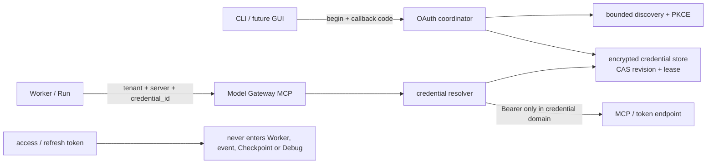

# ADR-0118：凭证域持有的 MCP OAuth 生命周期

- 状态：Accepted
- 日期：2026-08-15
- 范围：Rust Model Gateway 凭证域、Worker→Gateway MCP 契约、独立可测试存储适配器；不进入 Java、GUI、Edge 或外部数据库

## 背景

当前 MCP Server 只能携带空凭证或控制面预先密封的静态 Bearer envelope。它能保证 Worker 不见明文，但不能表达
OAuth discovery、Authorization Code + PKCE、access token 到期、refresh token 轮换、注销或重新授权。

Codex 参考提交 `ff352fab6209dc0f9d13fc0036ed3f9404682b2c` 已实现 OAuth discovery、PKCE、持久 credential store、
跨进程 refresh lock，以及“锁内重新读取、刷新、先持久化再暴露”的 transaction。OpenClaw 参考提交
`58b4b9430457e91b44f0ccce73ad1b6c6bb11e28` 使用共享 SQLite state lease，将 login/refresh/logout 串行化，并
只在被拒 token 仍是当前值时记录 authorization-required。

共享多租户 Runtime 不能把 refresh token 放入 RunExecution、Worker、Checkpoint、事件或日志；也不能因为调用方
取消而中断一个可能已经消耗旋转 refresh token 的持久化事务。

## 决策



1. `McpServerSnapshot` 新增可选稳定 `oauth_credential_id`。静态 envelope、OAuth handle、open server 三种模式互斥；
   OAuth handle 与 tenant、Server UUID、Server endpoint 一起进入 workload authorization digest，但 token 值不进入。
   携带该字段必须使用新的 RunExecution schema，旧 Worker 在网络出站前拒绝。
2. OAuth coordinator 只存在于 Model Gateway credential domain。公开 Rust 接口只返回 authorization URL、一次性
   flow ID 和不含秘密的状态；access token、refresh token、authorization code、PKCE verifier 和加密主密钥不实现
   `Debug`，不进入 gRPC/Worker API。
3. discovery 采用 OAuth Protected Resource Metadata 与 Authorization Server Metadata。所有响应有字节/字段上限，
   禁止隐式 redirect；resource 必须精确等于 MCP endpoint，issuer/authorization/token endpoint 必须一致并通过
   与 MCP endpoint 相同的出站地址策略。当前阶段支持预配置 public client ID + S256 PKCE；Dynamic Client
   Registration 单列为后续兼容项。
4. 每个 credential binding 的持久状态固定为：

   ```text
   absent → pending_authorization → exchanging → active
                 │                    │          │
                 └──── expired ───────┴──────→ authorization_required
                                                    │
   active → refreshing → active / authorization_required
     │
     └──────────────────────────────────────────→ revoked
   ```

   state、code verifier、token 和 revision 作为一个加密 record 原子提交；文件适配器使用 owner-only 路径、临时文件、
   `fsync + rename + directory fsync`，并以 credential-scoped OS lock + CAS revision 串行化多进程写入。生产外部存储
   适配器必须提供同等 CAS/lease 语义，不得只有 last-write-wins。
5. refresh 在锁内重新读取权威记录；若另一执行者已刷新，直接采用新 revision。需要刷新时，先持久化
   `refreshing(operation_id)` intent，再在独立有界任务中调用 token endpoint；成功结果必须持久化后才可返回给 MCP
   请求。调用方取消不能取消这个提交任务。
6. `refreshing` 或 `exchanging` 在进程重启时属于外部请求结果未知。为避免重放可能单次旋转的 refresh token 或
   authorization code，恢复时收敛为 `authorization_required/indeterminate_exchange`，不自动重试。该策略比参考项目
   更保守，代价是极窄崩溃窗需要用户重新授权。
7. 401/invalid token 只在“被拒 access token 摘要仍等于当前 revision”时改变状态；若并发刷新已经提交新 token，
   旧响应不能覆盖赢家。未知副作用 MCP Tool 不因认证失败自动重放；Resources/Prompts 等 Pure 操作是否重试由
   后续显式 retry policy 决定。
8. revoke 与 refresh/login 使用同一 lease。先原子提交本地 `revoked` 使新请求立即失败关闭；远端 revocation 是
   有界的 best-effort 独立结果，失败不会让本地 credential 复活。重新授权创建新 revision，不复用旧 flow/state。

## 非功能与失败语义

| 边界 | 规则 |
| --- | --- |
| 多租户 | credential ID 必须同时绑定 tenant、Server UUID 与 endpoint；跨租户/跨 Server 复制 fail-closed |
| 机密性 | 磁盘只保存 AEAD ciphertext；主密钥由 Gateway 启动域提供；状态/错误/Debug 不含 token/code/verifier |
| 并发 | 同 credential 登录、刷新、拒绝记录和 revoke 串行；锁后必须重新读取；所有写入 CAS revision |
| 取消 | 网络调用前可取消；一旦进入 token exchange/refresh owned task，调用方只停止等待，事务继续有界收敛 |
| 容量 | discovery/token body≤64 KiB；scope≤32；单字段≤4 KiB；每 tenant/Server credential 数由上层配额控制 |
| 恢复 | committed active/revoked 可恢复；in-flight intent 重启后不重放，转需重新授权 |
| 可移植 | 核心状态机/Store trait 不依赖 Java/数据库；本地文件适配器用于原生证据，生产可替换为 KMS/数据库 CAS |

## 未采用方案

- **把 access/refresh token 密封进每个 RunExecution**：刷新后所有在途 Run 都持有旧快照，且扩大 Worker 攻击面，拒绝。
- **让 Worker 直接调用 token endpoint**：会把 tenant credential 与 OAuth client 状态交给模型相邻进程，拒绝。
- **401 后透明重放任意 MCP 请求**：未知副作用 Tool 可能已经执行，拒绝。
- **refresh 先返回新 token、稍后异步持久化**：Gateway 重启会回到已被旋转作废的 refresh token，拒绝。
- **只用进程内 Mutex**：多 Gateway/替代进程可同时消费单次 refresh token，拒绝。
- **当前立即实现动态 client registration 和本地 callback listener**：会扩大协议与 UI 范围；先完成可嵌入的
  begin/complete 接口，CLI/GUI 自行承载浏览器与 callback。

## 风险与后续

- Dynamic Client Registration、Client ID Metadata Document、private client secret 与远端 revocation endpoint 尚未覆盖。
- 文件 Store 只作为原生证据；生产多副本需实现外部 CAS/lease adapter 并执行故障注入。
- 真实外部 OAuth MCP Server、授权页面和 provider-specific metadata 差异尚未验证。
- 内容 DLP、Roots/Sampling 与 GUI 登录旅程不属于本 ADR。

## 参考源码

- Codex：`codex-rs/rmcp-client/src/oauth.rs`
- Codex：`codex-rs/rmcp-client/src/oauth/refresh_lock.rs`
- Codex：`codex-rs/rmcp-client/src/oauth/refresh_transaction.rs`
- Codex：`codex-rs/rmcp-client/src/perform_oauth_login.rs`
- OpenClaw：`src/agents/mcp-oauth.ts`
- OpenClaw：`src/agents/mcp-oauth-provider.ts`
- OpenClaw：`src/agents/mcp-oauth-store.ts`
