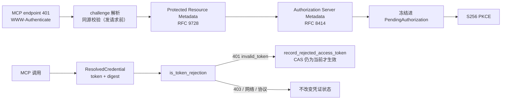

# ADR-0119：MCP OAuth discovery 与拒绝反馈

- 状态：Accepted
- 日期：2026-08-16
- 范围：Rust Model Gateway credential domain 的 OAuth discovery 与 MCP HTTP 传输的认证失败分类；不进入管理 gRPC/CLI、Java、GUI、Edge 或 Dynamic Client Registration

## 背景

ADR-0118 建成了 credential domain 的状态机、加密 Store、lease/CAS 与 refresh transaction，但留下两个开口：

1. `begin_authorization` 要求调用方**自己提供** authorization endpoint、token endpoint 和 public client ID。没有标准
   discovery，就没有办法从一个只知道 endpoint 的 MCP Server 走到它的授权服务器。
2. `record_rejected_access_token` 原语已经有测试，但**没有任何调用点**。MCP 传输层把所有非 2xx 一律折叠成
   `Unreachable("server answered HTTP 401")`——认证拒绝与网络故障不可区分，而且 token digest 在
   `resolve_credential` 返回裸 `Zeroizing<String>` 时就已经丢失，CAS 根本没有可比对的对象。

第二点是真正的缺陷：状态机能表达 `authorization_required`，但现实中没有任何东西能让它进入该状态。

## 决策

1. **Discovery 只做两跳**：Protected Resource Metadata → Authorization Server Metadata。`WWW-Authenticate` 的
   `resource_metadata` 参数只能**收窄**到 MCP endpoint 自身 origin 的地址；命名外部 origin 属于替换攻击，在
   任何请求发出之前就拒绝。测试以 `hits() == 0` 断言这一点——只断言"失败"无法区分"拒绝了"和"探测过再拒绝"。

2. **一致性是硬约束**：`resource` 必须精确等于 MCP endpoint；`issuer` 必须等于其自身文档声明；authorization 与
   token endpoint 必须与 issuer 同源。缺少后者，一个合法 issuer 仍可能把 code 兑换指向它并不控制的地址。

3. **缺省即拒绝**：metadata 未声明 `code_challenge_methods_supported` 含 `S256` 时不退化为 `plain`。body ≤64KiB、
   单字段 ≤4KiB、scope ≤32；重定向不跟随（复用 `mcp.rs` 已有的 pinned DNS + `redirect::Policy::none()`）。

4. **冻结绑定靠既有路径**：`begin_discovered_authorization` 把 discovery 结果写进 `PendingAuthorization` 记录后，
   `complete_authorization` 从记录读取 endpoint，**从不重新解析 metadata**。因此服务器在 flow 中途换文档，无法
   改变 code 的兑换地址。这是复用而非新增状态机。

5. **digest 随 token 一起穿过解析边界**：`resolve_credential` 改为返回
   `ResolvedCredential { token, rejection: Option<CredentialRejectionHandle> }`。handle 携带 binding 与 token
   digest，使得一次 401 能被归因到**当时使用的那个 token**，而不是响应回来时恰好是当前的那个。

6. **只有 401 才算 token 被拒**：403 是对已认证调用方的授权判定；传输与协议错误对 token 什么都没说明。把两者
   记成"token 已死"，会让一次无关的故障把所有租户推去重新授权。401 内部，显式 `insufficient_scope` 属于
   scope 问题而非死 token；超限 challenge 不解析。

7. **本阶段一律不重放**：任何 Tool 在认证失败后都不自动重试，只返回 typed `AuthorizationRequired`。四个入口
   （tools、resources/prompts、tool call、lifecycle tool call）改为薄包装 + `*_authenticated` 内层函数，共用同一个
   凭证解析与拒绝上报边界，避免各表面对"什么算认证失败"产生分歧。

## 非功能与失败语义

| 边界 | 规则 |
| --- | --- |
| SSRF | discovery 与 token 请求复用 MCP endpoint 同一出站策略：pinned DNS、禁用代理、禁止重定向、拒绝 userinfo |
| 同源 | challenge 指定的 metadata URL 必须与 MCP endpoint 同源，且在发出请求前校验 |
| 容量 | metadata body ≤64KiB；单字段 ≤4KiB；scope ≤32；`WWW-Authenticate` ≤4KiB |
| 机密性 | 公开错误为粗粒度 `DiscoveryRejected`，不泄露具体触发了哪条检查；token/code/verifier 仍无 Debug |
| 并发 | 拒绝上报走 coordinator 的 CAS：digest 不再是当前值时静默无效，刷新赢家不被旧 401 覆盖 |
| 重放 | 认证失败零重试；`hits == 1` 计数器在测试中作为反假绿断言 |

## 未采用方案

- **把 rejection handle 透传进约 10 个底层请求函数签名**：改动面大得多，而保证并不增加；改为在 4 个入口点薄包装。
- **在生产类型上开 `install_active_credential_for_test` 注入接缝**：为让测试更容易而在凭证类型上开口子，方向错误。
  测试改为走真实 begin → exchange 路径拿到 Active。
- **把裸 401 当作非拒绝**：没有 `error` 参数的 401 仍然是对所呈示凭据的明确拒绝，视为不拒绝会让状态机永远无法收敛。
- **认证失败后透明重试一次**：未知副作用 Tool 可能已经执行，拒绝。

## 风险与后续

- Dynamic Client Registration、Client ID Metadata Document、private client secret 仍未覆盖，且本轮明确不做。
- 管理 gRPC/CLI、callback 承载与远端 best-effort revocation 属于下一阶段。
- 尚未用真实外部 OAuth MCP Server 验证 provider-specific metadata、scope 与错误差异；在拿到该证据前，整体进度
  口径不因本 ADR 上调。
- discovery 目前只取 `authorization_servers` 的第一项；多授权服务器选择策略未定义。

## 参考源码

- Codex：`codex-rs/rmcp-client/src/oauth.rs`、`oauth/refresh_lock.rs`、`oauth/refresh_transaction.rs`
- OpenClaw：`src/agents/mcp-oauth.ts`、`mcp-oauth-provider.ts`、`mcp-oauth-store.ts`

只参考执行语义与失败边界，未移植代码，因此不涉及第三方来源与 NOTICE 变更。
