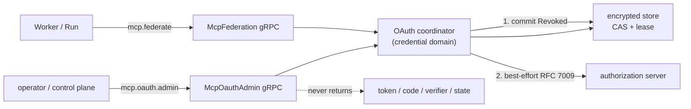

# ADR-0120：MCP OAuth 管理面与远端撤销

- 状态：Accepted
- 日期：2026-08-17
- 范围：Model Gateway 的 OAuth 管理 gRPC 与 RFC 7009 远端撤销；不进入 CLI 登录旅程、浏览器承载、本地 callback listener、Dynamic Client Registration 或 Java/GUI

## 背景

ADR-0118 建立了 credential domain 状态机，ADR-0119 补上了 discovery 与 401 拒绝反馈。但两者都只有库内接口：
begin、complete、status、revoke 全部没有传输层，运维无法驱动，因此 discovery 与拒绝闭环实际上**没有消费者**。

同时 `revoke` 只做本地作废。租户在本地注销后，授权服务器仍然认为它签发的 token 有效，直到自然过期。

## 决策

1. **管理面与执行面使用不同 capability**。`McpOauthAdmin` 要求 `mcp.oauth.admin`，不复用 `mcp.federate`。
   能调用租户工具的 token 不应自动就能销毁该租户的授权；共用一个 scope 意味着后续任何策略都无法把两者分开。

2. **管理面与 federation 共享同一个 coordinator 实例**（`Arc`）。运维撤销后，在途的 federation 调用立即看到
   新状态，而不是各自持有一份可能过期的视图。

3. **管理面响应不含任何凭证材料**。`CompleteAuthorization` 拿到 `ResolvedMcpOAuthCredential` 后立即 drop，
   只返回 revision。access token、refresh token、authorization code、PKCE verifier 与 OAuth state 都不出现在
   任何响应字段中。

4. **tenant 取自已验证 claims，不取自请求体**。请求体只允许断言 tenant、application 与 workload identity；
   run 相关字段一律来自 claims，因此请求体无法拓宽它所持 token 的权限。三个断言字段与 claims 不一致返回
   `permission_denied` 而非 `unauthenticated`——token 有效，只是调用方要求以它不持有的身份行事，让它重新
   认证只会进入无益的循环。

5. **revocation endpoint 在授权时冻结**，与 token endpoint 一同写入持久记录。若改为在 revoke 时重新 discovery，
   一台授权之后被攻破的服务器就可以指定任意 URL，而我们正要发过去的恰恰是待作废的 refresh token。该 endpoint
   与其他 endpoint 受同样约束：有界字段、且必须由 issuer 自有。

6. **先本地后远端**。`revoke` 先原子提交本地 `Revoked`，释放 lease，再做有界 best-effort 的 RFC 7009 POST。
   provider 不可达、缓慢或有敌意都不能让凭证在本地仍然可用；远端结果只作为 `remote_confirmed` 报告，失败不重试
   成状态变更。lease 在网络调用前释放，否则一个慢 provider 会阻塞该凭证上的所有其他操作。

7. **优先撤销 refresh token**。存在 refresh token 时撤销它而非 access token，因为那作废的是整个 grant 而不是
   单个 token。

8. **discovery 与 provider 拒绝合并为同一个状态码**。具体是 resource 不匹配、issuer 不一致还是字段超限，正是
   探测者想知道的信息，coordinator 内部错误也出于同样理由保持粗粒度。

## 曾经的限制：workload token 没有运维态身份（已解除，见 ADR-0121）

本 ADR 最初记录：`verify` 拒绝 `run_id`/`attempt_id`/`worker_id` 为 nil 的 claims，因此不存在租户级运维 token，
管理 token 实质是绑定 Run 的 token 额外携带一个 scope，federation 与 administration 的隔离**只建立在 scope 上**。

该限制**已解除**。workload token 新增 schema 5 运维身份形状：tenant、application、workload identity 必须存在，
而 run、attempt、worker、incarnation、model policy、session、workspace、agent version **必须全部为 nil**。
这个"必须缺席"才是关键——它让隔离变成**结构性**的：

- Run token 的 `run_id` 非 nil，永远无法满足运维绑定；
- 运维 token 的 `run_id` 为 nil，永远无法满足 federation 绑定。

`authorizes` 逐字段全等比较，因此这层不需要任何改动，nil 与非 nil 的不对称本身就完成了隔离。管理面另外显式
要求 `claims.is_operator()`：**携带 `mcp.oauth.admin` 的 Run 形态 token 现在会因其形状被拒绝**，而在旧契约下
那恰恰就是管理 token 的样子。

## 非功能与失败语义

| 边界 | 规则 |
| --- | --- |
| 授权 | `mcp.oauth.admin` 与 `mcp.federate` 互不蕴含；audience 仍为 `model-gateway` |
| 身份 | tenant 来自 claims；请求体断言不一致 fail-closed 为 `permission_denied` |
| 机密性 | 管理面响应无 token/code/verifier/state；完成授权只回 revision |
| 撤销顺序 | 本地 `Revoked` 先提交并释放 lease，远端失败不复活本地凭证 |
| SSRF | revocation endpoint 复用 MCP endpoint 同一出站策略：pinned DNS、禁代理、禁重定向 |
| 兼容 | 存储新增字段带 `serde(default)`，本次之前写入的记录仍可解码，只是没有可通知的 endpoint |

## 未采用方案

- **复用 `mcp.federate`**：会让每个能 federate 的 Worker 同时能撤销，且不可分离，拒绝。
- **revoke 时重新 discovery 取 revocation endpoint**：等于把待作废的 refresh token 交给一个此刻才被解析出来的
  地址，拒绝。
- **先远端后本地**：provider 不可达就会让本地凭证继续可用，与 fail-closed 相反，拒绝。
- **管理面返回 token 让调用方自行使用**：credential domain 的全部意义就是 token 不出这个进程，拒绝。
- **为管理面新增一套独立的认证体系**：会产生第二个信任根；先复用 workload token 并明确记录其局限。

## 风险与后续

- 运维身份形状缺失（见上）是当前最实质的限制。
- 浏览器承载与本地 callback listener 仍未实现，管理面只提供可嵌入的 begin/complete。
- 远端撤销未在真实厂商授权服务器上验证；`remote_confirmed` 目前只对受控回环 server 有证据。
- 真实外部 OAuth MCP Server 的兼容矩阵仍未开展，总体进度不因本 ADR 上调。

## 参考源码

- Codex：`codex-rs/rmcp-client/src/oauth.rs`、`perform_oauth_login.rs`
- OpenClaw：`src/agents/mcp-oauth.ts`、`mcp-oauth-store.ts`

只参考执行语义与失败边界，未移植代码，因此不涉及第三方来源与 NOTICE 变更。
