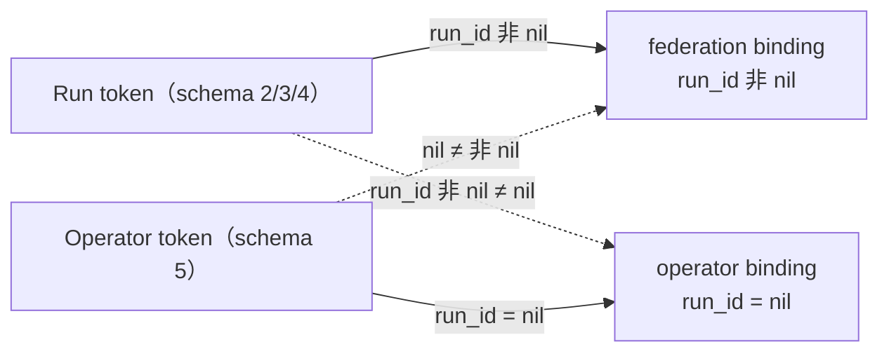

# ADR-0121：运维身份形状

- 状态：Accepted
- 日期：2026-08-17
- 范围：`agent-workload-identity` 契约与 Model Gateway 管理面；不进入控制面签发实现、Java、GUI、Edge

## 背景

ADR-0120 建成了 OAuth 管理面 `McpOauthAdmin`，并要求独立 capability `mcp.oauth.admin`。但它同时**如实记录了一条
未解决的限制**：

`WorkloadTokenVerifier::verify` 拒绝 `run_id`、`attempt_id`、`worker_id` 为 nil 的 claims，`require_incarnation`
另外要求 `worker_incarnation_id`。**契约里根本不存在"不是 Run 的身份"**。因此所谓运维 token，实质是一个绑定
了某个 Run 的 token 额外携带一个 scope。

后果是：federation 与 administration 的隔离**只建立在 scope 上**。一个能执行工具的 Worker，只要拿到带
`mcp.oauth.admin` 的 token，就是一个合法的运维调用方；而**没有任何后续策略能把这两者分开**，因为它们在身份
层面本来就是同一种东西。

## 决策

1. **新增 schema 5：运维身份**。必须存在：`tenant_id`、`application_id`、`workload_identity_id`。
   必须**全部为 nil**：`run_id`、`attempt_id`、`worker_id`、`worker_incarnation_id`、`model_policy_id`、
   `session_id`、`workspace_id`、`agent_version_id`；`model_policy_digest` 必须为空；`authorized_mcp_servers`
   必须为空。

2. **"必须缺席"是机制本身，不是清洁要求**。`authorizes` 逐字段全等比较，因此：
   - Run token 的 `run_id` 非 nil，永远无法满足 `run_id` 为 nil 的运维绑定；
   - 运维 token 的 `run_id` 为 nil，永远无法满足 federation 绑定。

   **`authorizes` 因此一行未改。** nil 与非 nil 的不对称自己完成了隔离——这比新增一层策略判断更可靠，因为它
   不依赖任何人记得去调用它。

3. **`require_incarnation` 对运维身份 vacuously 满足**。运维没有 worker 可绑定，强行要求会让该形状无法使用。
   这不是放宽：incarnation 的作用是把 token 钉到某次 worker 化身上，而运维 token 本就不该有化身。

4. **管理面显式要求 `claims.is_operator()`**。仅靠上一条的不对称还不够：管理面的绑定里 run 字段取自 claims，
   Run token 会自我一致地通过。因此管理面另外拒绝非运维形状——**携带 `mcp.oauth.admin` 的 Run 形态 token 现在
   因其形状被拒绝**，而在旧契约下那恰恰就是运维 token 的样子。

5. **两个方向都要有测试**。只成立一个方向的隔离不叫隔离：Run 形态无法管理，运维形态无法 federate。

## 非功能与失败语义

| 边界 | 规则 |
| --- | --- |
| 结构隔离 | Run 与运维互不满足对方绑定，由字段 nil/非 nil 的不对称保证，非策略 |
| 最小主体 | 运维必须命名 application 与 workload identity；只有 tenant 则该租户任意 token 都能满足 |
| 兼容 | schema 2/3/4 行为完全未变，既有 6 项契约测试未改动即通过 |
| 拒绝语义 | 形状不符返回 `InvalidClaims`（契约层）或 `permission_denied`（管理面），不返回 unauthenticated |
| 签发 | 本 ADR 只定义验证侧契约；控制面如何签发运维 token 不在范围内 |

## 未采用方案

- **继续只靠 scope 区分**：无法分离，且任何一次 scope 授予失误都直接等于运维权限，拒绝。
- **给运维 token 填入假的 run/attempt/worker**：会让运维操作在审计里看起来像某次执行，且重新引入两者可互相
  冒充的可能，拒绝。
- **在 `authorizes` 里加运维分支**：不必要。字段全等比较已经给出正确答案，加分支只会增加一处可能忘记维护的
  逻辑，拒绝。
- **为管理面另建一套认证体系**：会产生第二个信任根，拒绝。

## 风险与后续

- 控制面签发运维 token 的路径尚未实现，本 ADR 只覆盖验证侧。
- 运维身份目前只被 `McpOauthAdmin` 使用；其他未来的运维面需要同样显式要求该形状，否则会退回 scope-only。
- 真实外部调用方认证（远端 Runtime 契约、Java SDK 接入）仍未开展，总体进度不因本 ADR 上调。
