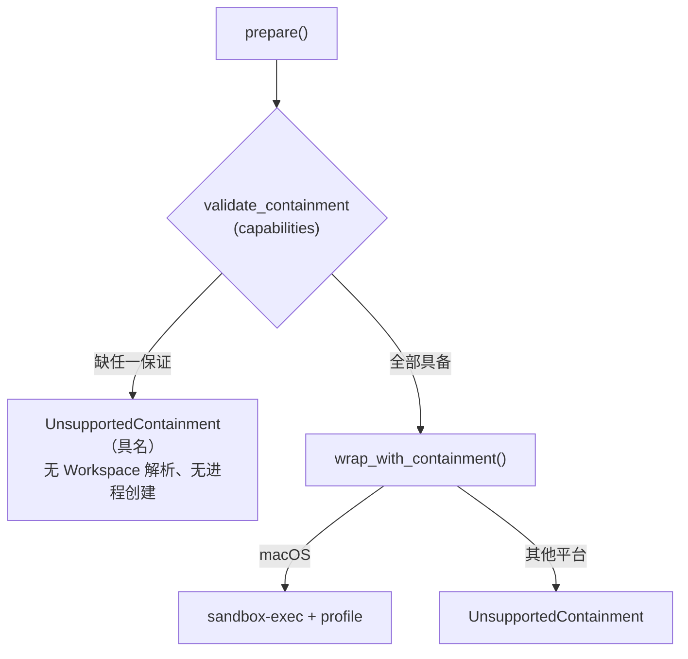

# ADR-0122：声明式 Tool 容器边界能力

- 状态：Accepted
- 日期：2026-08-17
- 范围：`agent-tool-runtime` 的 `TrustedNative` 与 `RestrictedContainer` 执行器；不进入 Linux landlock 实现、
  Windows、Kata 或控制面

## 背景

`SandboxClass::TrustedNative` 的含义是「本平台施加的容器边界已生效」。`protocol/src/lib.rs` 给
`Federated` 单开一个 variant 时就写下了这条原则：那些名字指的是本平台施加的容器边界，而联邦工具
一条都不适用，所以它不能复用容器类。

**`TrustedNative` 在非 macOS 上违反了这条原则。** `tool-runtime/src/lib.rs` 的旧形状是：

```rust
#[cfg(target_os = "macos")]
let (program, args) = { /* seatbelt::wrap_launch(...) */ };
#[cfg(not(target_os = "macos"))]
let (program, args) = (self.executable.clone(), self.definition.fixed_args.clone());
```

非 macOS 上工具**以裸进程启动**：没有 seatbelt，没有 landlock，没有任何替代边界。而
`runtime-host/src/lib.rs:2624` 与 `:2688` 注册 `workspace.write_text`、`shell.exec` 和进程会话可执行文件时
**没有任何 `#[cfg]` 门**。descriptor 仍然声明 `TrustedNative`，implementation digest 仍然绑定，审批仍然
`Ask`——**没有任何一处报告边界未生效**。

挡在这个洞前面的只有 `docs/implementation-status.md` 里的一句话：「Linux 上没有 landlock 等价物，
因此 Worker 的 Linux 路径不得注册它们」。那是文档，不是代码。

同一次复核还发现第二处：两个执行器的 implementation digest 都把 `workspace_access` 写死为
`"read_only"`，而启动路径使用真实值（seatbelt 据此决定是否加入 `WRITABLE_WORKSPACE`，容器执行器
据此决定 bind mount 是否 `readonly`）。**一个能写 Workspace 的工具与一个不能写的，摘要完全相同。**

## 决策



1. **新增 `ToolContainmentCapabilities`**，逐条陈述**操作系统**强制的保证，而非平台名：
   `workspace_write_confinement`、`credential_read_denial`、`network_egress_denial`，外加
   `backend`（`MacosSeatbelt` / `Unsupported`）。工具自己承诺不做某事不算能力。
   `current()` 是 `const` 且由 `cfg!` 推导，因此无法与启动路径实际编译成什么产生漂移。

2. **`validate_containment` 在 Workspace 解析前、任何进程创建前拒绝**，沿用 ADR-0072
   `validate_governance` 的既有模式：能力作为参数传入，缺失即 typed fail-closed。错误**具名到缺失的
   那一条保证**，不是平台名——调用方需要知道自己没拿到哪个承诺。

3. **删除静默降级分支**。`wrap_with_containment` 的非 macOS 实现返回错误，而不是返回裸可执行文件。
   即使有人日后调换 `prepare` 里的检查顺序，也无法退化为无边界启动。这是第二道防线，第一道是第 2 条。

4. **摘要修正**：`workspace_access` 改为真实值；容器能力进入 `TrustedNative` 的 implementation digest。
   摘要的职责是证明两个实现是同一个东西，而宿主无法施加的边界会让它们成为不同的东西。

## 非功能与失败语义

| 边界 | 规则 |
| --- | --- |
| 拒绝时机 | Workspace 解析前、进程创建前；不产生半启动状态 |
| 拒绝粒度 | 具名到缺失的单条保证，非平台名，非泛化失败 |
| 能力来源 | `const` + `cfg!`，不可配置、不可由调用方放宽 |
| 摘要 | `workspace_access` 真实化 + 容器能力纳入；**旧持久摘要将漂移** |
| 覆盖面 | 一次性 Tool 与持久 Process Session 共用 `prepare()`（`process_session.rs:1940`），一处收口两条路径 |
| 容器执行器 | 只修正 `workspace_access`；其边界来自容器引擎，不属于本能力向量 |

**摘要漂移是有意的。** 本次变更后 macOS 上所有 `TrustedNative` 摘要都会改变，早于本 ADR 的持久
Checkpoint 在恢复时会因摘要不一致 fail-closed。这与仓库既有处置一致（低于 schema 9 的 MCP Checkpoint
同样因无法证明远端 authority 而 fail-closed），且当前不存在生产数据。

## 未采用方案

- **实现 Linux landlock**：本机无法验证，只会产出仓库里已有八个的那种「协议正确、后端 fail-closed」层。
  本 ADR 要的不是补上 Linux 隔离，是**让隔离的缺席变得诚实**。
- **仅在注册处加 `#[cfg]` 门**：把判断留在每个调用点，漏一处就是一个洞；而且执行器本身仍然会静默降级。
- **让 `SandboxClass` 承载平台**：会把平台泄漏进协议中立的契约层，且无法表达「后端存在但缺某条保证」。
- **保持摘要不变以兼容旧 Checkpoint**：那正是缺陷本身——摘要说谎换来的兼容不是兼容。

## 风险与后续

- 本 ADR 不提供任何非 macOS 的容器后端。Linux/Windows 上 `TrustedNative` 现在**明确拒绝**，
  这是从「静默无边界」变为「明确不可用」，不是新增能力。
- **拒绝发生在 `prepare()`，不在注册处。** `implementation-status.md` 的原话是「Linux 路径不得注册
  它们」，而本 ADR 关的是执行边界：在 Linux 上工具仍会进入模型可见目录、仍可能被操作员审批，
  然后才失败。安全边界已经闭合（不存在无边界执行），但这多花一个模型回合和一次人工审批。
  在注册处提前拒绝是更好的分层，ADR-0072 的先例（`validate_governance` 在 Manager 构造时调用）
  也指向那里。**本轮没有做，因为它会让 Host 在 Linux 上直接无法启动，而这台机器无法验证该行为的
  影响范围。** 不把未验证的改动伪装成已完成。
- 真实 Linux landlock 后端仍需一台 Linux 机器，属 `docs/roadmap.md` 阶段 2。
- `RestrictedContainerExecutor` 的容器引擎边界未纳入能力向量；它在本地运行边界内不可用，
  需要时应另立能力集合而非复用本向量。
- 总体进度不因本 ADR 上调：修的是可信度，不是能力。
