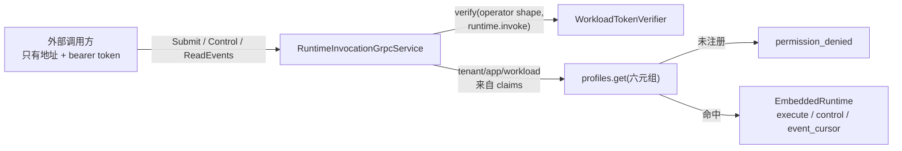

# ADR-0123：Runtime 的网络调用契约

- 状态：Accepted
- 日期：2026-08-17
- 范围：`contracts/proto/runtime.proto`、新 crate `agent-runtime-invocation-protocol`、
  `agent-runtime-host` 的 `grpc` 模块与 `serve` 接线、`control_detached` 的绑定前置检查；
  **不含** Java SDK、`resume` 成功路径

## 背景

复核代码（不是文档表格）发现：**Runtime 没有任何网络面可以提交、观测或驱动一次 Run。**

| 契约 | 复核结果 |
| --- | --- |
| `contracts/proto/runtime.proto` → `RuntimeControl` | 服务端 0 实现、客户端 0 引用，**且没有任何 crate 编译它** |
| `contracts/openapi/openapi.yaml` | Rust 侧 0 实现 |
| `runtime-host` 生产监听 | 只有 Unix domain socket；`TcpListener` 全在 `#[cfg(test)]` |
| `model-gateway` 的 TCP/mTLS | 只有 `ModelExecution`、`McpFederation`（Worker 打进来的内部依赖）与 `McpOauthAdmin` |

要跑一次 Run，只有两条路：把 `EmbeddedRuntime` 编进自己的进程，或在同一台机器上连 Unix socket。
而 `project-goal.md` 要求的每个交付形态——Java 集成、云端 Runtime 服务、GUI 客户端、独立 CLI——
都压在这条不存在的契约上。

**摆在 `contracts/` 里却无人实现的契约比没有更糟**，因为读者会把它当成能力。

## 决策

1. **`RuntimeControl` 被 `RuntimeInvocation` 取代**，三个 RPC：`Submit`、`Control`、`ReadEvents`。
   旧的 node/lease 消息（`RunLease`、`Heartbeat`、`EventAck`…）被移除：它们描述的 node→控制面方向
   属于 `edge_node.proto`，那个**有**实现。git 保留被删内容。

2. **运维身份，不是 Run 身份**。调用方必须持 schema 5 运维 token（ADR-0121）与独立 scope
   `runtime.invoke`。不复用 `mcp.federate` 或 `mcp.oauth.admin`：能驱动租户工具、或能管理其凭证，
   不等于能开 Run 并花该租户的预算。形状由契约要求，而非本服务事后检查。

3. **身份来自 claims，请求体只能同意**。tenant/application/workload identity 取自已验证 claims；
   请求体命名的这三项只被用来比对，不一致即 `permission_denied`。
   workspace/agent_version/model_policy 来自请求体，因为它们**选择 Profile 而非断言身份**——
   这是安全的，因为 Profile 以完整六元组为键：钉在租户 A 的 token 无论命名什么，都碰不到为租户 B
   注册的 Profile。

4. **生命周期边界在线路上保持 typed**（ADR-0114）。`RunLifecycleBoundary` 是 oneof，
   `Terminal` 与 `Retired` 各自携带字段。排空一页的调用方必须能分辨「暂时没有更多」和
   「永远没有更多」，而不必解析事件载荷。`history_gap` 同样显式，不静默跳过。

5. **协议中立文档走 `bytes *_json`**，与 `model_gateway.proto` 承载 policy snapshot、tool arguments
   和 `input_continuation` 的方式一致：该文档只有一份 schema 定义（Rust 侧），在 proto 里复制一份
   等于制造第二份可以各自漂移的定义。

6. **状态标记取自 serde，不取自 `Debug`**。`format!("{:?}")` 对 `RunStatus::WaitingApproval` 产出
   `waitingapproval`，而系统其余部分一律写 `waiting_approval`；对带数据的 `LocalRunState::Cancelling`
   更会把**操作员填写的 reason 文本**写进一个被文档描述为状态标记的字段。

7. **错误不透传内部消息**。`LocalRuntimeError` 与 `Configuration` 携带 state root 路径；
   网络调用方得到 typed 结果，得不到任何描述这台机器的内容。未注册 Profile 返回
   `permission_denied` 而非 `not_found`——Profile 是否存在不是可探测的信息。

8. **`openapi.yaml` 既不实现也不删除**。它是**控制面**的资源 API（Workspaces、Agents、Console 投影），
   本来就不是 Runtime 的契约。已在其 `description` 写明归属，并指向 `runtime.proto`。
   把它当成 Runtime 契约来实现，或因为 Runtime 没实现它就删掉，两者都是误判归属。

## 非功能与失败语义

| 边界 | 规则 |
| --- | --- |
| 身份 | 运维形状（schema 5）+ `runtime.invoke`；Run 形状即使带该 scope 也 `permission_denied` |
| 越权断言 | 请求体命名他租户 → `permission_denied`，非 `unauthenticated` |
| Profile | 完整六元组精确匹配；未注册 → `permission_denied`，不确认其是否存在 |
| 有界性 | `action_json` ≤64 KiB、`input` ≤1 MiB；tonic 自身上限只是兜底，不是契约 |
| 幂等 | `run_id` 与 `command_id` 由调用方提供；重试不会开出第二个 Run，改用途会被 receipt 的 command digest 拒绝 |
| 信息泄漏 | 状态消息不含 state root、路径或内部错误文本 |
| 分层 | 本层只认证与翻译；准入、owner epoch、持久收据、retention、游标全部仍在 `embedded` |

## 未采用方案

- **用 Rust 实现 `openapi.yaml`**：它是控制面的契约，见决策 8。
- **复用 `mcp.federate` scope**：那样每个能联邦工具的 Worker 自动就能开 Run，之后没有任何策略能把两者分开。
- **在 proto 里完整建模 `RuntimeControlAction`**：会产生第二份可漂移的 schema 定义；house pattern 已有答案。
- **删除 `openapi.yaml`**：见决策 8。
- **先做 REST/SSE**：gRPC 已是本仓库既有的跨语言契约形态（Model Gateway、Checkpoint Gateway、Edge），
  且 `option java_package` 已就位。REST 网关可在其上叠加，反之则要先定义第二套类型。

## 第二段：binary 接线与不可绕过的 mTLS

9. **默认关闭，且无法在没有 mTLS 的情况下打开。** `AGENT_RUNTIME_INVOCATION_BIND` 未设置即没有这个面，
   既有安装升级后不会静默多出一个网络监听器。设置了 bind 地址却缺少证书、私钥、客户端 CA 或
   workload 验签公钥，是**拒绝启动的配置错误**，绝不退化为明文服务。

   Unix socket 可以把「你能打开这个文件」当作授权；TCP 端口没有等价物，而一个能开 Run、
   花掉租户预算的面，不该是我们发现这件事的地方。

10. **该检查排在所有配置之前。** 它便宜、独立，且是这里唯一与安全相关的门。若排在 `load_config()`
    之后，「你要了网络面却没给 mTLS」会被一个无关的配置错误盖住——操作员修好那个、重启，才发现
    真正的问题。（这不是假设：第二段的测试首跑就是这样红的。）

11. **两个适配器共用同一个 `EmbeddedRuntime`**（`LocalRuntimeDaemon::runtime()`）。同一 state root 上
    起两个实例会让各自拥有独立的准入上限、owner epoch 与 retention gate，而两者都认为自己拥有该目录。

12. **mTLS 已实测，且拒绝路径与成功路径同时被证明。** 用 `rcgen` 现场生成 CA、服务端证书与
    客户端证书（不落盘、不入库），真实 Run 完整跑通一次；同时断言**不出示客户端证书**与
    **出示他方 CA 签发的证书**都被拒绝——只证明成功路径的话，这个面就是 TLS 而不是 mTLS。
    两个拒绝测试各带一个对照：同一服务端上合法证书必须连得通，否则一个根本没起来的服务端
    会让每条拒绝断言都为假绿。

13. **配置性质由真实二进制证明**，不是由库函数证明：测试 spawn 真正的 `runtime-host serve`。
    `load_invocation_surface` 住在 `main.rs`、库测试够不着——那是它应该在的地方，这是证明它的方式。

## 第四段：控制路径，以及它暴露的缺陷

14. **`control_detached` 在返回 `Accepted` 之前检查命令绑定。**

    摘要绑定检查本来就存在，但在 `control()` 里；而 `control_detached()` **先返回 `Accepted`，
    再异步执行 `control()`**。于是同一 `command_id` 换一个 action 会拿到一张成功收据，
    而账本随后才拒绝它。

    detached 的 `Accepted` 是一个承诺：调用方据此停止重试、记录命令已落地。让一个已绑定到别的
    action 的 id 穿过这个承诺，等于让调用方相信一张账本没有的收据。

    **这条我写在 `runtime.proto` 里当成既有保证**（"改用途会被 receipt 的 command digest 拒绝，
    不会被静默接受"）。它当时不成立。**本地适配器从未暴露它，因为 `ipc.rs` 自己先做了一遍检查；
    网络调用方没有那样的适配器。**

15. **修在 `embedded`，不在 gRPC 层。** 这是持久命令账本的性质，不是传输的性质。修在适配器里
    会变成本地适配器和 embedded 测试都够不着的规则——正是本 ADR 开头说不做的事。

16. **`ControlCommandRebound` 独立成 typed 变体**，映射为 `failed_precondition`。
    调用方复用幂等键是它自己能改的错，以 `internal` 返回会把可行动的错误说成内部故障。

## 第五段：审批——网络面必须自足

17. **审批的参数必须能从事件里发现，否则这个面只能看不能放行。**
    `DecideApproval` 需要 `approval_id` 和那次具体 Tool 调用的 `binding_digest`，两者调用方都不能编。
    复核确认 `approval.required` 事件的载荷同时携带二者
    （`approval.approval_id` 与 `approval.execution.binding_digest`），因此**只有网络的消费者
    足以完成人在回路**。测试据此断言：全程不读 Runtime 状态目录。

    这一段**未改任何产品代码**——审批路径本就正确，要证的是这个面是否自足。

## 第六段：跨进程恢复

18. **Run 的寿命长于启动它的 Runtime，这一点在该面上已证。** 第一个 Runtime 连同其服务、
    执行任务与 state-root 锁整体消失后，第二个 Runtime 打开同一目录；调用方**只带着崩溃前拿到的
    `run_id`** 重连，读到死掉 Runtime 写下的完整历史，并用第一个 Runtime 签发的 `owner_epoch`
    完成审批。历史中 `run.started` **只出现一次**——替代者是接着干，不是重跑。

19. **恢复刻意不重新派发 `AwaitingApproval`。** 等人的 Run 没有东西可重新派发，放行它的是决定本身。
    `recover_unfinished_detached` 返回 0 是契约，不是遗漏；测试按这个语义断言。

20. **进程内的"崩溃"必须丢掉整个 tokio runtime。** 只丢 `Arc` 不行：Run 自己的执行任务持有一个，
    正停在审批上，state-root 锁因此不释放，替代者被单写守卫正确拒绝。沿用
    `daemon_recovery.rs` 的既有形状（独立线程 + 独立 runtime）。

## 第七段：流式订阅

21. **`WatchEvents` 与分页共用同一个排他游标。** 因此流断了就用最后看到的序号重连即可续上：
    没有内存广播器可以与持久日志失同步，也没有 best-effort 队列会静默吞掉一个 gap。
    测试断言重放的序号**全部严格大于**断点，排他性不是说法而是被钉住的。

22. **边界是独立的流元素，不是每条事件上的字段。** 跟随者需要学到「你到头了，且这是哪一种头」，
    而这件事不该在每一行上重复。

23. **订阅泵进有界 channel，不由客户端拉。** 停止读取的跟随者在这里形成背压，
    而不是让 Runtime 里堆起一个无界队列；丢弃流即丢弃接收端，泵在下一次发送时结束。
    容量越界**被拒绝而非静默钳位**——要了一个拿不到的缓冲区，调用方应该知道。

24. **流式与一元调用认证完全一致。** 只在请求/响应路径检查的面，会让任何调用方 tail 别人的 Run。

25. **Provider 的确定性终局是 Run 终态，不是传输损坏。** `run.started` 之后若没有候选满足地域、
    数据等级、能力、健康与费用约束，或冻结路由已耗尽持久 same-provider 尝试预算，Host 都通过
    Kernel 状态机提交唯一 `run.failed`，再写终态 Checkpoint。事件游标因此返回
    `Terminal { failed }`，而不是因 `run.json` 与日志不一致返回 `CorruptLog`。仍有恢复预算的
    503/超时继续返回可恢复错误，替代 Host 可以重试，不能为了可观测性提前终止。

## 风险与后续——本轮**未**完成的部分

**`docs/roadmap.md` 阶段 1 的出口标准已全部达到**：提交、事件订阅（分页 + 流式）、
审批决定、取消、跨进程崩溃恢复，均由独立网络调用方在真实回环 Provider 上闭环验证。
以下仍未做，且不在该标准内：

- **取消、审批、跨进程崩溃恢复均已证明成功端到端**；**`resume` 的成功路径仍未在该面验证**
  （其前置状态 `Interrupted` 构造成本高，且不在 roadmap 阶段 1 的出口标准内）。
- 本轮只闭合了 Provider 确定性终局。源码审计显示 MCP 初始化、Tool/子代理编排以及 Host
  存储/Checkpoint 错误仍有直接返回 `Err` 的路径；尚未逐条证明 detached adapter 不会再次形成
  “终态记录但无终态事件”。因此不得把本轮结论外推成“所有 Host 错误均满足终态一致性”。
- 无 Java SDK。`option java_package` 只是让契约可被生成，不等于有 SDK。
- **总体进度不因本 ADR 提高**，仍为 70–75%：这是边界层，不是内核能力，也不属于并发/真实厂商/
  跨平台/生产持久层四类证据中的任何一类。
