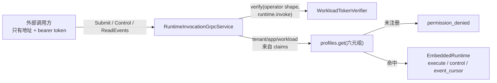

# ADR-0123：Runtime 的网络调用契约（第一段）

- 状态：Accepted
- 日期：2026-08-17
- 范围：`contracts/proto/runtime.proto`、新 crate `agent-runtime-invocation-protocol`、
  `agent-runtime-host` 的 `grpc` 模块；**不含** binary 接线、TLS 配置、流式订阅、Java SDK

## 背景

复核代码（不是文档表格）发现：**Runtime 没有任何网络面可以提交、观测或驱动一次 Run。**

| 契约 | 复核结果 |
| --- | --- |
| `contracts/proto/runtime.proto` → `RuntimeControl` | 服务端 0 实现、客户端 0 引用，**且没有任何 crate 编译它** |
| `contracts/openapi/openapi.yaml` | Rust 侧 0 实现 |
| `runtime-host` 生产监听 | 只有 Unix domain socket；`TcpListener` 全在 `#[cfg(test)]` |
| `model-gateway` 的 TCP/mTLS | 只有 `ModelExecution`、`McpFederation`（Worker 打进来的内部依赖）与 `McpOauthAdmin` |

要跑一次 Run，只有两条路：把 `EmbeddedRuntime` 编进自己的进程，或在同一台机器上连 Unix socket。
而 `project-goal.md` 要求的每个交付形态——Java 集成、云端 Runtime 服务、GUI 客户端、独立 CLI——
都压在这条不存在的契约上。

**摆在 `contracts/` 里却无人实现的契约比没有更糟**，因为读者会把它当成能力。

## 决策

1. **`RuntimeControl` 被 `RuntimeInvocation` 取代**，三个 RPC：`Submit`、`Control`、`ReadEvents`。
   旧的 node/lease 消息（`RunLease`、`Heartbeat`、`EventAck`…）被移除：它们描述的 node→控制面方向
   属于 `edge_node.proto`，那个**有**实现。git 保留被删内容。

2. **运维身份，不是 Run 身份**。调用方必须持 schema 5 运维 token（ADR-0121）与独立 scope
   `runtime.invoke`。不复用 `mcp.federate` 或 `mcp.oauth.admin`：能驱动租户工具、或能管理其凭证，
   不等于能开 Run 并花该租户的预算。形状由契约要求，而非本服务事后检查。

3. **身份来自 claims，请求体只能同意**。tenant/application/workload identity 取自已验证 claims；
   请求体命名的这三项只被用来比对，不一致即 `permission_denied`。
   workspace/agent_version/model_policy 来自请求体，因为它们**选择 Profile 而非断言身份**——
   这是安全的，因为 Profile 以完整六元组为键：钉在租户 A 的 token 无论命名什么，都碰不到为租户 B
   注册的 Profile。

4. **生命周期边界在线路上保持 typed**（ADR-0114）。`RunLifecycleBoundary` 是 oneof，
   `Terminal` 与 `Retired` 各自携带字段。排空一页的调用方必须能分辨「暂时没有更多」和
   「永远没有更多」，而不必解析事件载荷。`history_gap` 同样显式，不静默跳过。

5. **协议中立文档走 `bytes *_json`**，与 `model_gateway.proto` 承载 policy snapshot、tool arguments
   和 `input_continuation` 的方式一致：该文档只有一份 schema 定义（Rust 侧），在 proto 里复制一份
   等于制造第二份可以各自漂移的定义。

6. **状态标记取自 serde，不取自 `Debug`**。`format!("{:?}")` 对 `RunStatus::WaitingApproval` 产出
   `waitingapproval`，而系统其余部分一律写 `waiting_approval`；对带数据的 `LocalRunState::Cancelling`
   更会把**操作员填写的 reason 文本**写进一个被文档描述为状态标记的字段。

7. **错误不透传内部消息**。`LocalRuntimeError` 与 `Configuration` 携带 state root 路径；
   网络调用方得到 typed 结果，得不到任何描述这台机器的内容。未注册 Profile 返回
   `permission_denied` 而非 `not_found`——Profile 是否存在不是可探测的信息。

8. **`openapi.yaml` 既不实现也不删除**。它是**控制面**的资源 API（Workspaces、Agents、Console 投影），
   本来就不是 Runtime 的契约。已在其 `description` 写明归属，并指向 `runtime.proto`。
   把它当成 Runtime 契约来实现，或因为 Runtime 没实现它就删掉，两者都是误判归属。

## 非功能与失败语义

| 边界 | 规则 |
| --- | --- |
| 身份 | 运维形状（schema 5）+ `runtime.invoke`；Run 形状即使带该 scope 也 `permission_denied` |
| 越权断言 | 请求体命名他租户 → `permission_denied`，非 `unauthenticated` |
| Profile | 完整六元组精确匹配；未注册 → `permission_denied`，不确认其是否存在 |
| 有界性 | `action_json` ≤64 KiB、`input` ≤1 MiB；tonic 自身上限只是兜底，不是契约 |
| 幂等 | `run_id` 与 `command_id` 由调用方提供；重试不会开出第二个 Run，改用途会被 receipt 的 command digest 拒绝 |
| 信息泄漏 | 状态消息不含 state root、路径或内部错误文本 |
| 分层 | 本层只认证与翻译；准入、owner epoch、持久收据、retention、游标全部仍在 `embedded` |

## 未采用方案

- **用 Rust 实现 `openapi.yaml`**：它是控制面的契约，见决策 8。
- **复用 `mcp.federate` scope**：那样每个能联邦工具的 Worker 自动就能开 Run，之后没有任何策略能把两者分开。
- **在 proto 里完整建模 `RuntimeControlAction`**：会产生第二份可漂移的 schema 定义；house pattern 已有答案。
- **删除 `openapi.yaml`**：见决策 8。
- **先做 REST/SSE**：gRPC 已是本仓库既有的跨语言契约形态（Model Gateway、Checkpoint Gateway、Edge），
  且 `option java_package` 已就位。REST 网关可在其上叠加，反之则要先定义第二套类型。

## 风险与后续——本段**未**完成的部分

**这一段没有达到 `docs/roadmap.md` 阶段 1 的完整出口标准，不得当作阶段 1 已完成。**

- **binary 未接线。** `RuntimeInvocationGrpcService` 是库级服务，`runtime-host` 的 `main.rs`
  仍然只绑定 Unix socket。**部署出来的 Runtime 二进制目前不提供这个面。** 测试在真实 TCP 上跑，
  但服务端由测试进程自己拉起。
- **没有 TLS/mTLS 配置。** `grpc-security` 已有 `ServerMtlsMaterials`，本段未接。在接线之前，
  这个面不得在回环之外暴露。
- **控制路径只证明了拒绝。** 审批、取消、resume 的**成功**端到端，以及跨进程崩溃恢复，
  尚未在该面上验证。真实闭环测试目前覆盖 Submit + ReadEvents。
- 无流式订阅（`subscribe_events` 未暴露），调用方只能分页轮询。
- 无 Java SDK。`option java_package` 只是让契约可被生成，不等于有 SDK。
- **总体进度不因本 ADR 提高**，仍为 70–75%：这是边界层，不是内核能力，也不属于并发/真实厂商/
  跨平台/生产持久层四类证据中的任何一类。
