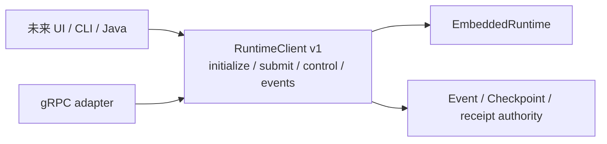

# ADR-0142：冻结无 UI 的 Runtime Client 契约

- 状态：Accepted
- 日期：2026-08-18
- 范围：进程内嵌入、gRPC invocation surface、客户端能力协商；不含 GUI、Java SDK、Edge

## 背景

`EmbeddedRuntime` 已能执行、控制、恢复和订阅事件，但它同时暴露配置、retention、持久记录和运维方法；
直接把该实现对象交给 Tauri、Electron adapter 或 Java SDK，会让每个客户端自行选择一组内部方法。既有 gRPC
虽然已有 Submit/Control/ReadEvents/WatchEvents，却没有初始化或版本/能力协商，客户端只能连上后试错。

审计还发现公开边界与内核不一致：gRPC 接受最大 1 MiB 输入，而 `RunExecutionCommand` 的真实上限是
32,000 bytes。旧顺序可能先创建 durable Run record，再由 Kernel 拒绝输入，违反“接受即已进入可执行路径”。

## 需求与非功能约束

- 同一契约必须可在进程内使用，也可由 gRPC、Unix socket 或以后其他 adapter 转译。
- 客户端在提交工作前必须确认协议版本交集和必需能力，不允许靠未知方法试错。
- 请求不得携带路径、Provider credential 或任意 Runtime 配置；只选择预注册 invocation。
- 错误不得泄漏 state root、Workspace 路径、Provider 细节或 credential。
- input ≤32,000 bytes，control JSON ≤64 KiB，event page ≤256，stream buffer ≤256。
- 所有列表确定性排序；能力名称和初始化集合均有数量/字节上限。

## 决策

1. 新增 concrete `RuntimeClient` 协商入口；只有协商成功返回的 `InitializedRuntimeClient` 才交付 submit、
   control、read/watch events 和 startup recovery。UI 无法从未初始化类型直接创建 durable Run；两者都不暴露
   配置、路径、凭证、Host handle 或可变 Profile。
2. `RuntimeClientHello` 携带 schema、min/max contract version 和 required capabilities。无版本交集或缺少必需
   capability 时在任何 Run 创建前 fail-closed。
3. capability 固定为稳定字符串，并用 `BTreeSet` 确保进程内与 wire 输出顺序一致。v1 首批为 submit、control、
   cursor、watch 与 startup recovery。
4. gRPC 新增 `Initialize`，其 service path 本身固定为 `agent.runtime.v1`；adapter 启动时也必须协商出完整 v1
   capability set，之后其余四个 RPC 只调用 `InitializedRuntimeClient`，不再直接调用 Embedded 实现。
5. `Initialize` 不要求 tenant bearer：生产网络面本身仍强制 mTLS，该响应只包含版本、能力和公开上限，
   不包含 Profile、tenant 或主机路径。所有执行/读取/控制 RPC 继续要求 operator workload token。
6. client error 使用固定 code/message，将内部 path-bearing error 收敛为 `Internal`。事件 stream 也通过 client
   wrapper 映射错误，不把 Embedded subscription 泄漏给 adapter。
7. submit 返回 Event Cursor 的**可执行生命周期投影**，不返回内部 Run record 的瞬时 tag；等待审批或 MCP
   输入只有在旧 owner 释放后才可见，延续 ADR-0141。
8. input 上限改为真实 Kernel 上限 32,000 bytes，并在持久 Run 创建前检查非空与大小；typed control 同样
   在进入命令账本前执行 64 KiB 上限。

## 对标

- **Codex app-server**：`initialize` 由客户端声明 `ClientInfo` 与 capabilities，之后以版本化 request/
  notification 交付 Thread/Turn。本项目吸收“先初始化再执行”，但保持 Runtime 协议中立，不携带 Codex
  账户、Home 路径或产品 Thread 类型。
- **OpenClaw Gateway**：connect 明确声明 min/max protocol、client identity 与 caps，`hello-ok` 返回实际
  protocol、methods、events、capabilities 和 snapshot。本项目吸收版本区间与 capability fail-closed；不复制
  Gateway presence/snapshot，因为当前只是无 UI Runtime port。

## 未采用方案

- **让 UI 直接调用 EmbeddedRuntime**：API 面过大，客户端可绕过统一上限和安全错误映射。
- **Tauri 一律内嵌、Electron 一律自建协议**：会产生两套控制和恢复语义。
- **只依赖 Protobuf 向后兼容**：消息可解码不代表服务端具备客户端必需的审批、恢复或流式能力。
- **保留 1 MiB edge 上限**：与 Kernel 32,000-byte 不变量冲突，会产生错误 durable acceptance。

## 后果

- 正面：Tauri 可直接持有 `RuntimeClient`；Electron/Java 可通过 gRPC 使用同一语义。
- 正面：版本不兼容、缺 capability、超限输入和 host-local error 都在边界处确定性收敛。
- 代价：新增能力必须先定义 capability 和稳定类型，不能随意把 Embedded 方法提升为公共 API。
- 尚未完成：Session/Thread 客户端契约、Profile 动态生命周期、可恢复的应用关闭、独立本地 credential resolver
  和可分发 artifact；因此本 ADR 只完成 Desktop-Ready 的第一道门禁。

## 证据

- `runtime/apps/runtime-host/src/client.rs`
- `contracts/proto/runtime.proto`
- `runtime/apps/runtime-host/tests/runtime_client_contract.rs`
- `runtime/apps/runtime-host/tests/grpc_invocation_identity.rs`
- `runtime/apps/runtime-host/tests/grpc_invocation_loop.rs`
- `docs/evidence/2026-08-18-headless-runtime-client-contract.md`
