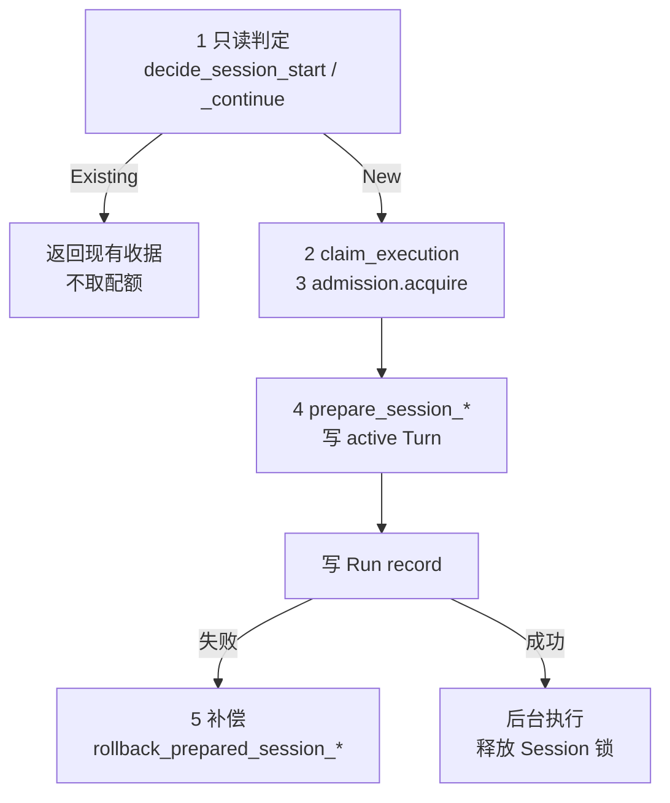

# ADR-0143：收口 Session 的接受原子性与恢复权威

- 状态：Accepted
- 日期：2026-08-18
- 范围：root Session store、接受顺序、generation 围栏、head 投影、错误映射；不含应用关闭生命周期、Credential Resolver、GUI

## 背景

ADR-0142 冻结了 `RuntimeClient` v1 的形状，Session 七个 capability 随后按同一协商机制加入。形状对了，
语义没有收口。本轮以确定性 RED 逐条验证，暴露三个真实缺陷，都不是猜测：

1. **接受顺序泄漏**。`accept_session_turn_detached` 先由 `prepare_session_*` 把 active Turn 落盘，之后才
   取 Run ownership、申请 admission、写 Run record。admission 一旦拒绝，分支上留下一个指向**从未被创建的
   Run** 的 active Turn。该分支自此不可继续：`continue` 永远返回冲突，而没有任何 Run 可以批准、取消或完成。
   RED 直接打印出残留：`turn_count: 0, active_run_id: Some(...)`。

2. **终态三级滞后**。一个 Turn 的落地分三步——Kernel 终态事件、Run record 投影、Session head 提交——调用方
   可以读在任意两步之间。观察到终态事件后立刻 `continue`，会因为一个**事实上已经结束**的 active Turn 被拒。
   崩溃窗口的恢复早已实现，但同一保证在**非崩溃路径**上不成立。

3. **错误映射把"不存在"说成"不可用"**。`read_session_record` 将 `std::fs::read` 的所有失败（含
   `NotFound`）归为 `StateRoot` → `Unavailable`。调用方被告知存储暂时不可用会持续重试，而重试永远不会成功。

## 需求与非功能约束

- `session_id`、`branch_id`、`run_id` 由调用方生成；完全一致的重试返回原结果，且**不占用运行配额**。
- ID 相同而输入或身份不同必须冲突，不得静默改写。
- 每个分支同时只允许一个活跃 Turn。进程内分片锁只负责并发串行化，**持久 generation 才是重启后的权威围栏**。
- admission、容量或持久化失败后，不得残留不可继续的 active Turn 或孤立 Run。
- 恢复不得重新请求模型、不得重放 Tool、不得产生第二个终态事件。
- 错误不得泄漏 state root、Workspace 路径、Provider 原始错误或其他租户标识。
- 列表上限 256，历史页上限 128，且在 `Initialize` 就公布——调用方不该靠被拒绝来学会上限。

## 决策

1. **判定与写入分离**。`decide_session_*` 只读，回答"新请求 / 活跃重试 / 已完成重试"；写入仍由
   `prepare_session_*` 负责。两者在同一把 Session 锁内，答案不可能在两次调用之间改变。判定与写入合成一步，
   正是残留分支的成因。

2. **已完成重试不取配额**。把重试计入运行配额，会让一个幂等调用在压力下不再幂等。

3. **所有权与准入先于任何持久声明**。在这个顺序下，拒绝发生时分支与被发现时完全一致。

4. **补偿逐字段校验后才动手**。start 只在"单分支、generation 1、无历史、active Turn 正是本次 run_id"时删除
   Session；continue 只清本次写入的 active Turn，历史一个字节都不碰。删掉别人正在用的 Session，比它要防的
   泄漏更糟。

5. **Checkpoint 是恢复权威，Run record 不是**。`project_terminal_session_turn` 在读路径上完成落后的 head
   投影，判据是 Checkpoint 的 `verify_digest()` 与终态状态，与重启恢复同源。它幂等，且**刻意安静**：没有
   Checkpoint、验不过、分支已移动，一律原样返回而不制造新的失败——读路径不该因为恢复迟早会做完的事而开始失败。
   投影是 read-modify-write，因此由独立的同步分片锁串行化：两个未同步的读会各自通过围栏、把同一个 Turn 追加两遍。

6. **错误码保持十个，不压缩成五个**。`ResourceExhausted` 与 `Unavailable` 必须分开：超配额可以重试，存储
   故障不能。"Session 不存在"归 `NotFound`，不再借道 `StateRoot`。

## 对标

- **Codex**：Thread 的 Start/Resume/Fork/Rollback/List/Read 语义在此对齐。仍明确缺少其完整客户端、
  SQLite Thread 产品链与归档能力。
- **OpenClaw**：Sessions 的 Create/Send/List/Fork/Rewind 重试与 revision 语义在此对齐。本项目的多租户
  invocation 绑定更严格——分支绑定完整 `RuntimeInvocationContext`，跨租户/应用/工作区/Agent/模型策略不得互读；
  同时缺少其 Gateway 运维与 Archive/Delete/Switch 等产品能力。

## 未采用方案

- **终态事件前先提交 head**。让终态边界直接意味着"可继续"。改动事件顺序，且与"Checkpoint 是恢复权威"存在
  张力——head 会变成事件发布的前置条件。
- **新增 Session 级等待原语**让调用方显式等 head。扩大了刚冻结的 v1 公共接口，代价与收益不成比例。
- **把读路径异步化**以复用重启恢复的 resume 机制。`read_session` 是同步的公共方法，改签名即是破坏性变更；
  且真正需要的只是一次窄的同步投影，不是整套 resume。

## 后果

- 一个被拒绝的 Turn 不再留下任何东西；分支保持可继续。
- 调用方观察到终态事件后可以直接 `continue`，不必盲目重试冲突。
- 读取不存在的 Session 得到 `NotFound`，调用方知道停下。
- 投影引入一把新的同步分片锁。它永远是最内层，且从不跨 await 持有，因此不会与异步 mutation 锁死锁。
- 总体完成度维持 70–75%：本轮收口的是既有接口的语义，不是新增能力。

## 证据

`docs/evidence/2026-08-18-session-acceptance-atomicity.md`
