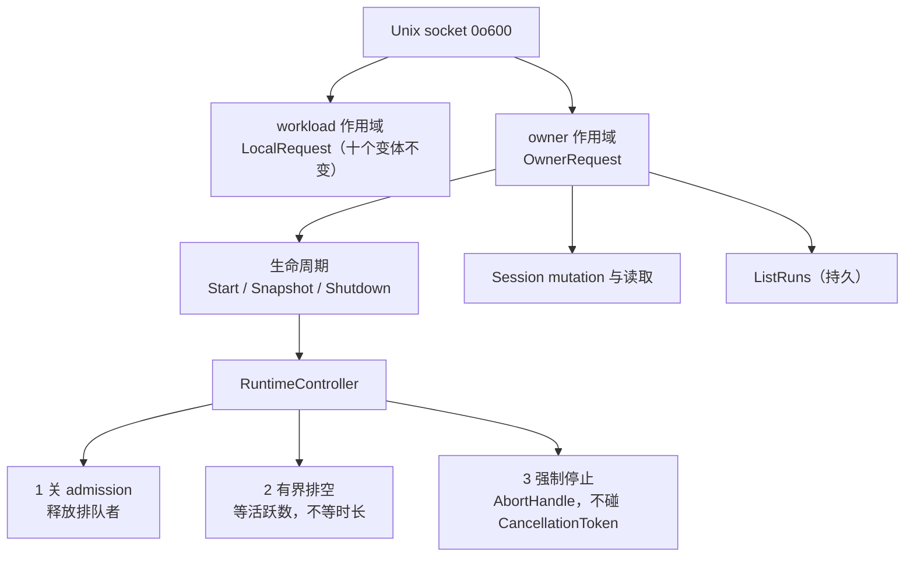

# ADR-0144：Owner 作用域与应用生命周期

- 状态：Accepted
- 日期：2026-08-18
- 范围：本地 Unix socket 的 owner 面、`RuntimeController`、关闭语义；不含 Credential Resolver、可分发 artifact、GUI
- 前序：ADR-0142（Runtime Client 契约）、ADR-0143（Session 语义与容量）

## 背景

两次把东西做完在一个桌面客户端够不着的面上。

ADR-0143 把 Session 契约加固在 `RuntimeClient`（进程内）与 gRPC 上；桌面客户端走的是 Unix socket，
而 `LocalRequest` 的十个变体里**没有任何 Session 操作**。随后的生命周期设计把 `RuntimeController`
定为 Host-owner 直接持有——这对，但推论是 Tauri（同进程 Rust）拿得到，**Electron 拿不到**。

两次都不是能力缺失，是**能力落在了错误的面上**。所以本轮先定通道，再做能力。

## 需求与非功能约束

- Host-owner 操作（生命周期、Session mutation）必须可由**独立进程**驱动。
- 关闭不得进入租户面：一个租户能关掉整个 Runtime 是不可接受的授权。
- 生命周期一次通过 `Created → Recovering → Ready → Draining → Stopped`，停止后不重启。
- `start()` / `shutdown()` 支持并发等待者，**结果一致**。
- **"退出应用"绝不能被记录成"用户取消 Run"**：不发 `run.cancelled`，不写操作者 Cancel 收据。
- 恢复完成前不得接纳新工作；但恢复期间客户端必须能连、能问、能看。
- 不新增持久 lifecycle 状态文件；Run、Checkpoint、Event 与控制收据仍是恢复权威。
- 不用 sleep 判断排空。

## 决策

1. **作用域分离不是权限机制，权限已经在了**。socket 创建时即 `0o600`，能连上就是这台机器的 owner。
   分成两个枚举是为了**两个面不会悄悄合成一个**：必须有测试断言任一命名空间都到不了另一个，
   而且**没有任何回退**——回退正是 owner 操作被一个从没打算成为 owner 的请求够到的方式。

2. **owner 面不要求送 invocation**。守护进程只有一个 state root、一个内置身份；让客户端来送，
   只会给它一个送错的机会，也会逼每个客户端镜像七个它无从选择的常量。

3. **用户 Cancel 与 Runtime Stop 是两条不共享任何机件的路径**。所有分离执行经**唯一的任务注册点**，
   因为各自私藏的 handle 是关闭时找不到的 handle；停止走 `AbortHandle`，从不触碰 `CancellationToken`。
   把"我关了应用"记成"我取消了工作"，既是对用户说假话，也会在审计链里留下一条没人做过的决定。

4. **关闭先关准入，再排空**。没拿到槽的请求什么都没留下——这正是 ADR-0143 把准入前置到首次持久写入
   之前换来的；已持有 permit 的 Run 保留它，收回槽不会让它停下，只会让计数失真。

5. **排空等活跃执行数，不等时长**。期限是构造参数而非常量：测试必须干等出来的期限迟早会飘，
   而六个生命周期测试因此在 0.2 秒内跑完。

6. **`Interrupted` 带来源**。原有两处 reason 只说没产出 Checkpoint，从不说 Runtime 出了什么事，
   于是"你关了应用"和"进程崩了"读起来一模一样。旧记录以 `Unknown` 载入，**不是一个猜测**。

7. **"没开门"是状态，不是故障**。监听器早开、准入晚开：`NotReady` 是独立应答类型并带恢复进度，
   客户端才能说"正在恢复 12/40"而不是"连不上"。真正要守的约束由 mutation 门守着，不是靠不应门。

## 对标

- **Codex**：bounded thread shutdown、多等待者、任务 abort reason 已对齐。
- **OpenClaw**：signal、ingress drain、后台 hook、子进程回收已对齐。
- **本项目额外证明**：多租户隔离、Checkpoint 恢复、"应用退出 ≠ 用户取消"，以及**恢复期间可观测**。
- 两家的产品面差距一项未变：仍缺 Codex 的完整客户端与 SQLite Thread 产品链，仍缺 OpenClaw 的
  Gateway 运维与 Archive/Delete/Switch。

## 未采用方案

- **owner 面走 gRPC**。跨机器的 owner 操作是另一个安全模型（谁有权关掉别人机器上的 Runtime），
  本轮不碰。
- **关闭复用租户 gRPC 服务**。一个租户能关掉整个 Runtime。
- **恢复完成后再开监听器**。约束确实守住了，但客户端在启动期间无法区分"正在恢复"与"没在运行"，
  有 Run 要恢复的桌面应用**每次启动都会自报故障**。
- **把排空期限做成常量**。测试要么干等真实值、要么走不到超时分支；两者都让这条边界形同虚设。

## 后果

- 桌面客户端可以启动 Runtime、看着它恢复、跑 Session、关窗口时干净退出，并在下次打开看到上次留下了什么。
- 恢复期间提交会得到 `NotReady` 而非成功——这是**契约变更**，既有测试需按生产方式等待就绪。
- 总体完成度维持 70–75%：本轮把既有能力接到可达的面上，并补齐关闭语义，不是新增能力。

## 证据

`docs/evidence/2026-08-18-owner-scope-and-lifecycle.md`
