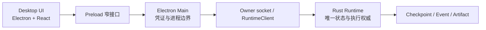

# ADR-0145：桌面优先的 Runtime 参考客户端

- 状态：Accepted
- 日期：2026-08-18
- 范围：当前产品顺序、桌面与 Runtime 边界、macOS Desktop Alpha 验收
- 前序：ADR-0142（Runtime Client）、ADR-0143（Session 语义）、ADR-0144（Owner 作用域与应用生命周期）

## 背景

继续把 GUI 推迟到全部内核、Linux、真实厂商和分布式门禁之后，会让项目长期只有协议和测试证据，
没有一个持续使用这些契约的产品入口。反过来直接追求完整 Codex/OpenClaw 界面，又会让 renderer
复制 Runtime 状态、用演示数据掩盖后端缺口，并分散到 Edge、云控制面和多平台桌面。

ADR-0142 至 0144 已经提供稳定 client、Session 语义、owner socket 和应用生命周期；现有 Electron + React
客户端也已经能触达 owner 面。因此当前缺的不是另起 GUI 技术栈，而是把 Profile/credential、真实 Session
交互和可分发验收收敛成一条可日用链路。

## 决策

1. 当前里程碑改为 **macOS Apple Silicon Desktop Alpha**；内核对标继续进行，但优先级由桌面真实工作流
   暴露的阻塞程度决定。
2. 继续使用现有 Electron + React，不在 Alpha 前切换 Tauri。Rust Runtime 作为受应用生命周期管理的
   本地进程运行；用户退出应用后 Runtime 与其子进程全部停止，只保留持久状态供下次恢复。
3. renderer 只通过 preload 窄接口调用 Electron main；Provider credential、owner socket/token 和进程控制
   不进入 renderer。GUI 不创建第二套 Run、Session、审批或恢复状态机。
4. Alpha 硬门禁为：安全 Profile/credential、真实 Session 创建与恢复、流式事件、Tool 审批/拒绝/取消、
   历史、基础 Workspace 交互、错误可见，以及干净目录可分发验收。
5. 每批仍对标 Codex 与 OpenClaw，但只有影响桌面闭环、内核正确性或长期公共契约的差距进入当前批次。
   Edge、Java 控制面、云集群、Windows/Linux 桌面和完整交互对标不阻塞 Alpha。

## 非功能约束与验收

- M1 Pro 16GB 可本地开发和运行；不依赖 Docker、Java、PostgreSQL、NATS 或 Kubernetes。
- 应用冷启动、恢复、运行、审批和关闭均显示明确状态；错误不得退化成无限等待或静默演示数据。
- 退出应用不得形成用户 Cancel 审计；已完成事件与 Checkpoint 可在下次启动恢复。
- 一个从干净目录启动的分发包必须完成真实 Provider 与 Tool 审批闭环，退出后无 Runtime/子进程残留。
- 桌面契约测试与 Runtime 契约测试共同守门；UI 成功不能替代内核持久恢复证据。

## 对标

- **Codex**：采用“桌面是本地 Agent Runtime 的产品入口”，优先 Session、流式转录、审批、Workspace
  和应用生命周期；不要求 Alpha 复制其全部编码交互。
- **OpenClaw**：采用连接状态可视、进程/节点生命周期与恢复思路；不引入单用户 Gateway，也不把 Edge
  设备管理提前塞进本地桌面。
- **本项目增强**：桌面继续遵守多租户身份、协议中立模型、不可变执行身份和控制面中立边界，未来 Java、
  CLI 或云端客户端复用同一 Runtime 契约。

## 未采用方案

- **完成全部内核路线后再做 GUI**：缺少真实产品入口，契约错误被发现得太晚。
- **立即切换 Tauri**：现有 Electron owner 主链已成立，重写不会改善 Runtime 语义或 Alpha 可用性。
- **GUI 自己管理 Agent 状态**：形成第二状态机，崩溃恢复和审计会与 Runtime 分叉。
- **同时推进云、边、端三套界面**：扩大验证面，不能更快形成一个可用产品。

## 后果

- 短期工作从“继续堆内核能力”转为“用桌面真实闭环拉动内核收口”。
- Profile/credential 和可分发 artifact 不再是 GUI 开工前的串行门槛，而是 Desktop Alpha 的并行硬门禁。
- 完整 Codex/OpenClaw 交互、Linux 隔离、真实厂商矩阵和分布式容量仍保留在长期路线图，不能用桌面 Alpha
  宣称它们已完成。
