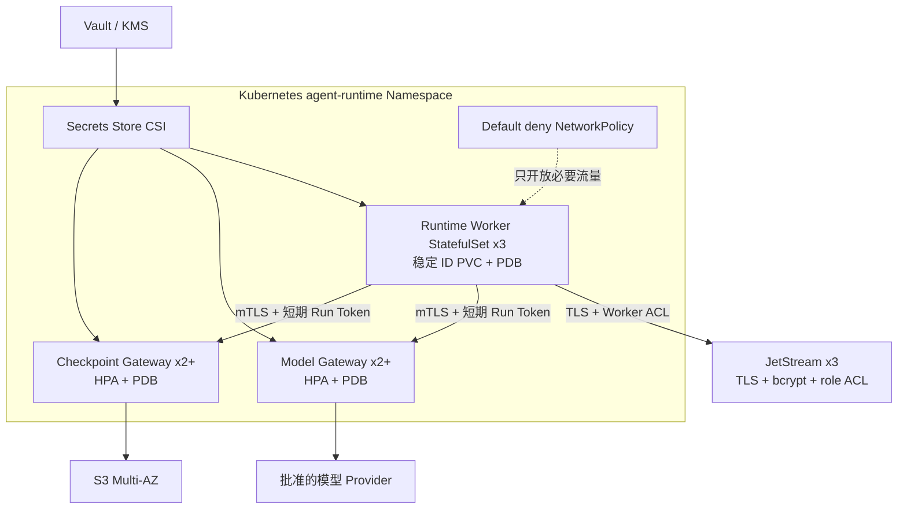

# Agent Runtime Platform 架构基线

## 责任边界

- 外部 IAM 是唯一身份源；平台不保存密码。
- PostgreSQL 是资源、Run、审批、审计和 Outbox 的权威状态源。
- JetStream 只负责至少一次分发，不能成为唯一事实来源。
- Rust Runtime Worker 运行 Agent 状态机，但无权决定租户授权。
- Model Gateway 持有模型凭证引用并执行策略约束路由；Worker 不接触 BYOK 明文。
- Checkpoint Gateway 独占 S3/MinIO 凭证并校验内容地址与工作负载身份；Worker 只持有短期令牌和不可变引用。
- Workspace 是持久资产；沙箱和 Worker 都是带租约的可回收计算资源。

## 首条纵向主链

```text
OIDC 调用方
  → 创建 Workspace / Session
  → 以 Idempotency-Key 创建 Run
  → PostgreSQL 同事务写 Run 与 Outbox
  → Scheduler 取得 Workspace 写租约并签发 attempt 绑定的短期身份
  → Rust Worker 执行 Kernel，并通过 Model Gateway 按 ModelPolicy 调用模型
  → 大 Checkpoint 先经 Checkpoint Gateway 写入对象存储，再发布内容引用
  → Tool 需要审批时持久暂停
  → 决策后恢复并提交有序事件
  → SSE 使用 Last-Event-ID 续传
```

## 不可违反的约束

1. 所有租户数据表必须包含不可变 `tenant_id`。
2. 租户内外键必须使用 `(tenant_id, id)` 复合约束。
3. 已向客户端确认的 Run 必须已经提交到 PostgreSQL。
4. 同一 Workspace 同时只能有一个有效写入 owner epoch。
5. `non_idempotent` 和 `unknown` Tool 出现模糊结果后进入 `indeterminate`，禁止自动重放。
6. 事件按 Run 维护单调递增序号，并按 `event_id` 去重。
7. Worker、Edge Node 和 Tool/Skill 沙箱不得持有模型或对象存储长期凭证。

## 云端 Runtime 部署边界



- `/live` 只回答进程事件循环是否可响应；`/ready` 决定是否接收新流量。
- Gateway 只有完成安全材料和 gRPC Socket 初始化后才 ready；Worker 还要求 NATS 处于 connected。
- Worker 不拥有 Stream 管理权限；生产 Stream 由控制面或独立 Bootstrap 身份预建。
- Worker 已实现 SIGTERM lease-aware draining，控制面也已持久化恢复事故并完成缩放租约/NATS/Checkpoint Store 故障测试；在真实集群完成 eviction、PDB 与 15 分钟恢复 SLO 演练前仍不启用自动缩容。
