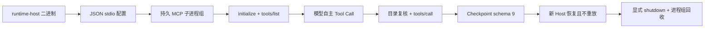

# 独立 Rust Host 的 stdio MCP、恢复与进程树回收

日期：2026-08-09
范围：`runtime-host`、Model Gateway 共享 MCP 转换；本轮未启动 Java、PostgreSQL、NATS、Docker、
Kubernetes 或独立 Gateway。

## 真实闭环

- 测试启动真实 JSONL stdio Server，模型只在发现后看到 `mcp:local/search`，自主调用 Tool；
  Server 的调用标记精确为一次，结果回灌后 Run 成功。
- 新 Host 使用同一配置和 Checkpoint 恢复；已完成 Tool 没有重放，新的 Server 会话在 Host 退出时
  同样被回收。
- 另一个测试直接启动发布的 `agent-runtime-host run` 二进制并通过 JSON 文件配置 stdio Server，
  验证配置入口不是只存在于 Rust library。

## 先红后绿

1. 首个测试先因 transport enum 不存在形成编译 RED；实现后真实发现与恢复转绿。
2. `tools/list` 超时测试先证明 TERM-ignoring 后代仍存活；改为独立进程组并在 TERM 后检查整个组，
   再升级 KILL 后转绿。
3. initialize 挂起测试先证明取消只覆盖 Tool 请求；把 initialize 纳入同一取消选择后转绿。
4. 最终二进制测试再次形成行为 RED：Run 成功，但 Tokio 主运行时退出前未等待后台 actor 清理，
   后代仍存活。加入 Host 显式 shutdown、actor shutdown token 和 JoinHandle 等待后转绿。

## 门禁与清理

- `cargo test -p agent-runtime-host`：26 项实际测试通过；其中 standalone 11 项。
- `cargo test -p agent-model-gateway`：49 项通过；4 项依赖公共外部 MCP 的测试显式忽略，不计通过。
- `cargo test -p agent-runtime-worker`：测试框架报告 127 项通过；本轮未启动 NATS，因此不得把其中
  依赖 `TEST_NATS_URL` 的早退用例表述为真实 Broker 验收。
- `cargo clippy -p agent-runtime-host -p agent-runtime-worker -p agent-model-gateway --all-targets -- -D warnings`：通过。
- `cargo fmt --all -- --check`：通过。
- 进程审计发现 5 个由此前行为 RED 留下、父进程已退出的 fixture 进程组；按精确 PGID 清理后复查
  无 `stdio_mcp_server.sh` 或测试后代。最新完整 Host 测试没有产生新残留。
- 验证后的 `runtime/target` 为 19 GiB；它是可再生的 Rust debug/增量构建缓存，本轮按用户边界未清理。

## 对标结论

- **Codex**：已对齐持久 JSONL session、清空后重建环境、进程组及升级回收；仍缺完整 MCP SDK
  方法面、cached catalog、required/optional server、failed-startup reconnect、OAuth 和 remote stdio。
- **OpenClaw**：已对齐持久 stdio transport 和显式树清理；仍缺 requester/session runtime、lease、
  idle/LRU、连接重验证、OAuth/Auth Profile、SSE 与完整 dispose 治理。
- **本项目优势**：stdio command/args/env/cwd 进入不可变 authority digest，并与目录、审批、执行策略
  一起参与跨 Host Checkpoint 恢复；参考项目没有同等的跨 Worker 多租户围栏约束。
- **下一优先缺口**：实现 required/optional server、失败启动的有界重连、健康状态和显式 drain；再推进
  OAuth/Resources，不转向 GUI 或 Java 控制面。
