# Codex CLI / OpenClaw 阶段对标

更新时间：2026-08-17

本文件是每个实施阶段必须更新的偏差检查。结论只基于本地参考源码，不把产品介绍当作实现证据。

## 固定完成门禁

每个阶段结束前必须回答：

1. Codex CLI 对应模块如何实现，哪些执行语义值得保留？
2. OpenClaw 对应模块如何实现，哪些云边节点能力值得保留？
3. 本平台在哪些方面更适合多租户 PaaS，哪些能力仍明显落后？
4. 本阶段是否引入了与 `tenant_id`、Workspace 单写、fencing、副作用安全相冲突的捷径？
5. 对标结论是否已经反映到 ADR、测试与“尚未实现”清单？

## 当前阶段：有界冷 Event 历史

| 对标面 | Codex | OpenClaw | 本平台 Rust Runtime 当前实现 | 判断 |
| --- | --- | --- | --- | --- |
| 生命周期顺序 | rollout/Thread metadata 保存 path 与 archived 状态；单 writer 有 flush ack | archive 临时写、rename/fsync、完整 readback 后才允许回收 SQLite row | 对象 fsync/readback→摘要 index→terminal tombstone→删除热 Run | 核心“先有可读副本再回收”已对齐 |
| 历史缺口 | archived Thread/rollout 可继续索引读取 | prune 前写 per-session watermark，gap 只由真实删除证明 | archive 命中则完整校验；淘汰/超限后由 tombstone watermark 返回 gap | 不再把未知状态猜成 gap |
| 容量 | rollout 压缩与 Thread store 生命周期成熟 | SQLite/WAL、zstd、bounded plaintext cache | 单 Run/Workspace/tenant count+byte cap；index 16 MiB hard limit；流式 SHA/读取 | 多租户预算更显式，存储引擎成熟度仍落后 |
| 损坏 | rollout repair/Thread migration 产品链成熟 | SQLite integrity/migration/quarantine 与 archive readback | promised object 缺失、摘要/终态不一致 typed corrupt_log；无自动 quarantine | fail-closed 成立，运维修复仍落后 |

### 本阶段结论

- 已验证：真实 Session 第一轮 Run 在热目录退休后仍能分页/订阅完整 Event；count cap、单 Run byte cap、跨
  Workspace tenant cap、策略降低、对象篡改和 Unix 权限均有可执行测试。
- 相比 Codex，本项目吸收 rollout 单 writer/可读历史优先原则，并增加 tenant/Workspace 双层预算与完整
  invocation/terminal digest；Codex 的压缩 rollout、Thread 查询、迁移和客户端生命周期仍领先。
- 相比 OpenClaw，本项目吸收 archive readback 和 prune watermark 原则；OpenClaw 的 SQLite 多记录事务、
  schema migration、quarantine、zstd 和长期 Session 运维仍明显领先。
- 架构差异：本项目保持冷层 opt-in、无外部数据库、内容寻址且与 replay tombstone 分离，以满足可嵌入和本地
  资源边界；没有证据证明文件索引能替代 SQLite。总体进度仍为 70–75%。
- **未外推**：硬件掉电、共享文件系统、跨机器 owner、Windows、介质修复、外部对象存储和真实长期归档分布。

## 上一阶段：统一终态 Run 收敛

| 对标面 | Codex | OpenClaw | 本平台 Rust Runtime 当前实现 | 判断 |
| --- | --- | --- | --- | --- |
| 终态权威 | rollout 单 writer，已提交历史由 Thread 恢复读取 | Session writer queue + SQLite transaction/WAL | terminal Checkpoint 保存原 envelope，所有入口只观察终态 | 已消除 Direct/Embedded 双生命周期 |
| 多阶段提交 | Flush/Shutdown ack 明确 writer 提交点 | `BEGIN IMMEDIATE` 内重验并提交多行状态 | Checkpoint→Event→route WAL completion→adapter projection，逐窗收敛 | 无数据库边界成立；不是通用事务 |
| 身份漂移 | Thread/rollout 生命周期绑定 | Session row/revision 与事务快照 | tenant/application/workload/Workspace/Agent/model/input/history/Tool/MCP 全绑定 | 多租户嵌入身份更显式 |
| 不确定请求 | rollout 保留已观察历史 | Gateway/Session 产品链与 SQLite 账本 | in-flight Provider WAL 不伪装完成，终态 Checkpoint 阻止重放 | 副作用边界保守；长期运维仍落后 |

### 本阶段结论

- 已验证 one-shot Run 的两个真实文件级故障窗口：terminal Event 缺失时补发 Checkpoint 内同一 envelope；Event
  已提交但 route WAL completion 滞后时只封口已结算 WAL，不追加第二组事件、不重放 Provider。
- 相比 Codex，本项目吸收“单一提交权威、终态历史只观察不重做”，并增加完整多租户 execution binding；Codex
  的 rollout/Thread 迁移、跨平台执行和客户端产品链仍领先。
- 相比 OpenClaw，本项目无需 SQLite 或 Gateway 即可独立完成 Run；OpenClaw 的多记录事务、并发 writer、schema
  migration、quarantine 与长期 Session 运维仍明显领先。
- **未外推**：in-flight Provider WAL 只保留证据而不伪装 completion；真实厂商、硬件掉电、共享文件系统、
  跨机器 owner、Windows 和任意多文件事务未验证。总体仍为 70–75%。

## 上一阶段：Checkpoint 绑定的终态事件发布

| 对标面 | Codex | OpenClaw | 本平台 Rust Runtime 当前实现 | 判断 |
| --- | --- | --- | --- | --- |
| 写入顺序 | rollout 单 writer，Flush/Shutdown 有 ack | Session writer queue + SQLite transaction/WAL | terminal Checkpoint → terminal Event → Session/parent projection | transcript 先于可见终态，核心顺序对齐 |
| 崩溃恢复 | 从已提交 rollout 重建 Thread | `BEGIN IMMEDIATE` 内重验后提交多行状态 | Checkpoint schema 27 保存原始 terminal envelope，缺失 Event 可补发 | 文件模式窄窗已闭合；通用事务仍落后 |
| 幂等身份 | rollout item/Thread owner | SQLite row identity/revision | event id、tenant、六维 invocation、attempt、sequence、status、payload digest 联合验证 | 多租户嵌入边界更显式 |
| 已完成子任务 | Thread/child history 由产品生命周期管理 | Session/Agent registry 与 owner 管理 | 终态 child 只验证并收集，绝不送入普通 restore | 消除重复 Provider/Tool 风险 |

### 本阶段结论

- 已验证 Root Session 与角色子代理两条真实故障窗口：保留 terminal Checkpoint、删除最后 terminal Event、
  恢复上游 active binding。替代 Host 补发同一 event id，Provider/MCP/Tool 均不重放，最终 Event 恰好一次。
- 相比 Codex，本项目吸收其单 writer、flush acknowledgement 和持久历史优先原则，并增加协议中立的多租户
  execution binding；Codex 的 rollout/Thread 长期迁移、客户端与跨平台产品链仍领先。
- 相比 OpenClaw，本项目无需 SQLite 即可独立完成 Run，但只关闭一个已证明的跨文件窗口；OpenClaw 的事务、
  writer queue、schema migration、quarantine 和并发写成熟度仍明显领先。
- **未外推**：任意多文件事务、共享文件系统、跨机器 owner、硬件掉电和 Windows 未验证；总体仍为
  70–75%。架构审查选择在摘要 Checkpoint 内保存原始 terminal receipt，而不是生成新终态或引入外部服务。

## 上一阶段：有界模型路由 WAL 与终态控制收据收敛

| 对标面 | Codex | OpenClaw | 本平台 Rust Runtime 当前实现 | 判断 |
| --- | --- | --- | --- | --- |
| 高频恢复状态 | rollout 单 writer、pending queue、flush ack/retry | SQLite WAL、事务组提交、commit 后 publication | 每模型请求单写全状态 WAL；普通成功固定四次提交 | 无数据库嵌入边界成立；SQLite 并发事务仍领先 |
| 出站与响应围栏 | rollout/history 支撑恢复，但不是 PaaS Provider attempt ledger | Session/Agent WAL 与 Provider retry/cooldown 产品链成熟 | Provider 前 inflight、响应 staging、观察、completion 分层提交 | 单 Run 副作用边界更明确，不代表生态更成熟 |
| 损坏与回退 | loader I/O 错误传播，部分坏 item 可跳过 | SQLite schema/transaction/integrity | revision、身份与状态单调校验；只忽略 EOF 未提交尾部 | 多租户恢复权威更保守；无 quarantine/repair |
| 终态重放 | Thread owner 串行 history/lifecycle | writer queue/transaction 避免 JSON staging | Kernel terminal event 经有界 shard + Run gate 收敛 receipt | 消除重复 Resume 窗口；仍只有单机 owner |

### 本阶段结论

- 已实现：V1/V2 snapshot 原子迁移；32 条 compaction、8 MiB 单条和读取前总大小上限；连续 revision、
  immutable identity 与状态单调验证；普通成功路径精确四条记录。Provider 出站前必须先提交 inflight，完整
  响应必须先 staging，替代 Host 可直接应用 staged response 而不重放 Provider。
- 已修复：Event Cursor 已看见终态但 Resume receipt 仍为 Accepted 时，直接调用和 gRPC 重放都从 Kernel
  event 收敛；合法 `.json.partial` 不是权威记录，不再让重放偶发 Internal。64 路固定 shard 不随历史增长。
- 相比 Codex，本项目吸收单 writer/显式 ack 思想，但 Codex 的 rollout 生命周期、跨平台客户端和历史修复仍
  领先。相比 OpenClaw，本项目保持无 SQLite/外部服务即可完成 Run；OpenClaw 在并发事务、迁移、quarantine
  和长期运维上仍明显领先。
- **未外推**：硬件断电、介质损坏、共享文件系统、跨机器 owner、跨文件事务和 Windows 未验证；总体仍为
  70–75%。架构审查选择有界 full-state WAL，是为了同时满足本地嵌入、故障恢复和 16 GB Mac 容量门禁，
  不是宣称文件 WAL 全面优于 SQLite。

## 上一阶段：本地权威文件耐久替换

| 对标面 | Codex | OpenClaw | 本平台 Rust Runtime 当前实现 | 判断 |
| --- | --- | --- | --- | --- |
| 写入模型 | rollout 单 writer + pending queue + flush ack/retry | SQLite WAL + immediate transaction + post-commit publish | 文件替换权威统一强提交；Event 独立 append commit | 静态文件边界收口，仍无跨文件事务 |
| 掉电边界 | inspected 普通 rollout flush 未逐记录 `sync_all` | WAL `synchronous=NORMAL`，由 SQLite 组提交 | file sync→rename→parent sync，错误 fail-closed | 单文件更保守，不代表整体领先 |
| 高频状态 | writer 批量写 pending items | 事务/WAL 合并多行变化 | 模型路由逐次 fsync 实测击穿容量门禁 | OpenClaw 的组提交结构明显领先 |
| 可移植性 | 跨平台产品链成熟 | SQLite 与 Gateway 运维成熟 | 当前只在 macOS/Unix 目录同步验证 | Windows rename/目录同步仍落后 |

### 本阶段结论

- 已验证：Session、Run、Checkpoint、控制收据、保留账本、子代理结果和 Tool reconciliation 使用同一强替换
  顺序；同步失败不能被报告为成功。1000 Run 保留门禁恢复到 112–119 秒，阈值未放宽。
- 相比 Codex，本项目没有复制“所有状态都进 rollout”；Event、Checkpoint 与投影仍按恢复职责分层。Codex 的
  writer 恢复、客户端生命周期和跨平台产品面仍领先。
- 相比 OpenClaw，本项目无需 SQLite 即可独立运行，但 SQLite WAL 对高频状态和多记录原子性更合适。本阶段
  提出的有界追加 journal 已由当前 ADR-0132 完成，没有继续堆整文件 fsync。
- **未外推**：模型路由掉电恢复、硬件断电、跨文件事务、Windows 和共享文件系统未完成；总体仍为 70–75%。

## 上一阶段：权威目录扫描失败关闭

| 对标面 | Codex | OpenClaw | 本平台 Rust Runtime 当前实现 | 判断 |
| --- | --- | --- | --- | --- |
| 存储读取失败 | rollout 打开/逐行 I/O 错误向上返回 | SQLite 查询、解码与事务错误向上返回 | Run/Session 目录除 `NotFound` 外全部 typed fail-closed | 已消除“存储坏了等于没有数据”的偏离 |
| 坏记录处理 | 已读取的 rollout JSON parse error 可计数后跳过 | SQLite schema/事务与 snapshot revalidation | Event/Run 权威不跳过已提交损坏；非 UUID 外部项不纳入管理 | 本项目因多租户恢复/副作用证据更保守 |
| 故障隔离 | Thread 级历史加载 | Session/Gateway 生命周期成熟 | 聚合恢复按 Profile 隔离失败，健康租户继续 | 窄面满足共享 Runtime；运维产品面落后 |
| 终态安全 | Thread/rollout 生命周期 | Session transcript/lifecycle | Session 归属不可读时禁止发布 Run 终态 | 消除伪终态；仍仅证明本地文件系统 |

### 本阶段结论

- 已验证：损坏 `runs` 命名空间会进入 Profile failure report；损坏 `sessions` 命名空间会阻止终态发布，
  相关六组 Runtime Host 集成测试共 52 项通过。
- 相比 Codex，本项目与其 I/O 错误传播原则对齐，但不采用“已提交坏 JSON 继续跳过”，因为本地 Event/Run
  直接决定多租户恢复和副作用安全。
- 相比 OpenClaw，SQLite 的事务、并发写与迁移体系仍更成熟；本项目只证明无外部数据库时的嵌入式
  fail-closed 边界，没有证明共享存储或主机掉电。
- **未外推**：自动 quarantine/修复、跨机器 owner、共享文件系统与介质损坏未完成；总体仍为 70–75%。

## 上一阶段：JSONL 崩溃尾部修复

| 对标面 | Codex | OpenClaw | 本平台 Rust Runtime 当前实现 | 判断 |
| --- | --- | --- | --- | --- |
| 权威存储 | rollout JSONL + SQLite metadata | Session transcript 已以 SQLite 事务/WAL 为主 | 本地 Event JSONL + 原子 Checkpoint/Run record | OpenClaw 存储引擎成熟度领先 |
| 未换行尾部 | append 前补换行；合法尾行保留，非法行可被解析层跳过 | SQLite row transaction 不暴露 JSONL 半行 | 最终换行是 commit marker；未换行尾部截断 | 本项目更保守，适合事件直接决定副作用恢复 |
| 已提交损坏 | rollout loader 收集/跳过部分 parse error | SQLite 完整性与 schema 约束 | 已换行坏 JSON、空行、超限、身份/序号/digest 错误全部 fail-closed | 不以可用性掩盖多租户审计损坏 |
| 实时追随 | rollout writer/reader 产品链成熟 | Gateway/Session 订阅产品链成熟 | durable byte cursor 跨尾部修复继续，typed boundary 停止 | 内核闭环成立；产品订阅面仍落后 |

### 本阶段结论

- 已验证：审批中的 Run 和模型请求阻塞中的流式订阅，都能在事件半行后保留完整前缀、截断未提交尾部并
  继续到唯一终态；已提交坏行仍失败。
- 相比 Codex，本项目沿用 append 前修复尾部的方向，但没有采用“补换行保留合法尾行”：缺少 commit marker
  就不能证明同步成功，因此必须丢弃。这是多租户副作用账本要求导致的有意偏离。
- 相比 OpenClaw，本阶段维持无外部数据库的独立 Host；SQLite 事务/WAL 的长期成熟度仍领先，本项目不声称
  JSONL 在共享存储或多进程写入上等价。
- **未外推**：掉电、共享文件系统、介质损坏和跨机器日志未验证；总体仍为 70–75%。

## 上一阶段：多 Profile 孤儿 Run 自动恢复

| 对标面 | Codex | OpenClaw | 本平台 Rust Runtime 当前实现 | 判断 |
| --- | --- | --- | --- | --- |
| 启动扫描 | ThreadManager/SDK 按 Thread 恢复持久历史 | Gateway 自动扫描 aborted main Session | 一个聚合入口扫描全部注册 Profile | 已消除 Java/CLI/GUI 复制恢复状态机的需要 |
| 多租户公平 | inspected 主链不是共享 tenant Runtime 调度器 | owner claim/reservation 防重复，产品面成熟 | Run 计划按 Profile round-robin 进入全局/tenant/Workspace 准入 | 本项目窄面更贴合共享多租户 Runtime |
| 重复与竞态 | resumed child 避免重复 ThreadStarted | cycle/revision、charged attempt、owner 检查 | 共享恢复门、active-owner 跳过、owner epoch、持久 command receipt | 并发双扫描总计只接纳一次 |
| 部分故障 | Thread/rollout 生命周期成熟 | transcript 分类、退避、通知成熟 | 一个坏 Profile 返回 typed failure，健康租户继续 | 故障隔离已验证；修复和告警产品面落后 |
| 终态一致性 | Thread event/history 是恢复基础 | Session lifecycle 管终态 | Kernel terminal event 收敛 record 与 Accepted receipt | 修掉“事件终态、重放非终态”窗口 |

### 本阶段结论

- 已验证：两个租户的第一 Runtime 在真实 HTTP/SSE 请求出网后消失；替代 Runtime 的并发双扫描总计只接纳
  两个 Run，各自仅使用冻结预算允许的第二次 Provider 尝试；坏 Profile 不阻塞健康租户。
- 相比 Codex，本项目新增的是共享多租户 Profile 的公平孤儿扫描与持久命令围栏；Codex 的 SDK、Thread
  生命周期、历史分支和客户端产品链仍明显成熟。
- 相比 OpenClaw，本项目在 tenant/Workspace 精确身份、轮转公平、冻结 Provider 预算和 durable receipt 的
  组合上更严格；OpenClaw 的宿主自动触发、退避、通知、长期运行与运维体验仍领先。
- **未外推**：跨机器 owner 选举、分布式 command ledger、主机掉电、真实厂商和生产告警未完成；总体仍为
  70–75%。

## 上一阶段：公开显式 Resume 与冻结 Provider 重试预算

| 对标面 | Codex | OpenClaw | 本平台 Rust Runtime 当前实现 | 判断 |
| --- | --- | --- | --- | --- |
| 恢复主语 | `InitialHistory::Resumed` 从 rollout 重建 Thread，SDK 以 thread id 继续 | Gateway 扫描 aborted main Session，以 cycle/revision 和 owner claim 自动接管 | 外部调用方以 Run、旧 owner epoch 和幂等 command id 显式接管 | 三者都不依赖旧进程内句柄；本项目绑定维度更适合多租户服务 |
| 重复启动防护 | resumed v2 child 不重复写 `ThreadStarted` | reservation、charged attempt 与 resumed-session dedupe | owner epoch 递增、command digest 收据；`run.started` 始终一次 | 本轮已用真实 replacement 证明 |
| 恢复预算 | inspected Thread resume 未见同口径 Provider attempt ledger | 自动恢复最多 3 次；模糊 Tool 强制 restart-safe 集合 | 每个 Run 冻结同 Provider 尝试预算；Resume 不能扩充 | 默认一次时正确 failed，显式两次才重试成功 |
| 产品广度 | TypeScript/Python SDK、Thread read/fork/rollback 产品链成熟 | 自动扫描、退避、通知和 transcript tail 分类成熟 | 只有协议中立 gRPC 显式 Resume；无 Java SDK、自动 orphan 管理面 | 核心账本窄面较强，产品恢复面仍落后 |

### 本阶段结论

- 已验证：第一 Runtime 在真实模型请求已出网、响应未持久化时整体消失；替代 Runtime 只在冻结策略允许
  第二次尝试时提升 owner epoch、继续同一 Run，并由同一命令收据保证重放幂等。
- 相比 Codex，本项目补的是同一在途 Run 的 Provider 尝试账本与 owner fencing；Codex 的公开 SDK、持久
  Thread 恢复和分支产品面仍明显成熟得多。
- 相比 OpenClaw，本项目没有照搬固定三次自动恢复，而是服从每个 Run 的冻结模型策略；OpenClaw 的自动
  发现、恢复 reservation、transcript 分类和用户通知仍更完整。
- **未外推**：真实厂商、跨机器、主机掉电、自动 orphan 扫描与分布式 command ledger 未完成；总体仍为
  70–75%。

## 上一阶段：公开 MCP 输入回答与版本绑定

| 对标面 | Codex | OpenClaw | 本平台 Rust Runtime 当前实现 | 判断 |
| --- | --- | --- | --- | --- |
| 请求公开 | form/url elicitation 转为客户端事件，带公共 request id | inspected MCP Apps 暴露 UI resource/bridge，不是同口径 input-required | `mcp.input.required` 暴露 input id、version、binding 和 request set | 调用方不再依赖 Rust 内部常量 |
| 回答路由 | `(server_name, request_id)` pending oneshot | 未发现同口径回答路由 | tenant/Run/Checkpoint/owner epoch + durable control receipt | 窄面跨进程恢复强于 inspected 进程内 router |
| 版本错误 | typed protocol/request error | Gateway/MCP Apps 错误面成熟 | 未支持 input version → gRPC `InvalidArgument`，Tool 零继续执行 | 对外错误不再误报 Runtime Internal |
| Runtime replacement | inspected pending map 随进程生命周期 | Session MCP runtime 有 manager，未见 MRTR durable receipt | 第一 Runtime 消失；替代 Runtime 从事件回答同一 suspended Tool | 本轮核心多租户增强已实跑 |
| 产品广度 | 客户端交互、form/url、策略和 MCP 兼容明显更成熟 | MCP Apps sandbox/bridge 与 Gateway 产品面更成熟 | 只完成 form Accept 网络专项；内部另有 URL/decline/cancel 语义 | 不能宣称 MCP 产品总体领先 |

### 本阶段结论

- 已验证：外部调用方只持 token、`run_id` 与事件字节；错误版本在 continuation 前拒绝，正确回答跨
  Runtime replacement 完成同一 Tool 和 Run，`run.started` 只有一次。
- 相比 Codex，本项目保留其“请求必须精确路由”的语义，并增加持久 Checkpoint/receipt/owner epoch；Codex
  的客户端、策略、form/url 和生态兼容仍明显领先。
- 相比 OpenClaw，本项目补的是它 inspected MCP Apps 之外的 durable MRTR 控制面；OpenClaw 的 UI bridge、
  sandbox 和 Gateway 运维仍更成熟。
- **未外推**：真实外部 MCP、跨机器、URL elicitation 网络专项与 Java SDK 未完成；总体仍为 70–75%。

## 上一阶段：控制命令接纳与 Kernel 终态权威

| 对标面 | Codex | OpenClaw | 本平台 Rust Runtime 当前实现 | 判断 |
| --- | --- | --- | --- | --- |
| 错误审批输入 | pending map 按 approval id 精确取出；不存在时 warn，不终结 Turn | resolver 在连接 Gateway 前校验 owner kind、id、decision；not-found/permission 向调用方返回 | Run 投影 + digest-valid Checkpoint 双校验；子代理还验证 root lineage | 与两者对齐“拒绝命令，不误杀工作”；多租户恢复绑定更强 |
| 接纳提交点 | 进程内 oneshot，产品持久化由 rollout 承担 | Gateway approval service 是当前连接权威 | receipt、owner epoch 与 `*Decided` 仅在 Checkpoint binding 验证后提交 | 更适合无状态 Java/CLI/GUI 重试 |
| 接纳后 Host 故障 | Turn/rollout 负责恢复，未知 approval 不合成失败 | Gateway 错误不改写 Session 为 terminal | 保留 Accepted receipt 和可恢复决定；适配器不得写 `Finished/failed` | 消除双状态机；故障如实保持未完成 |
| waiting Run 取消 | interrupt 进入 Turn 状态机 | cancel 进入 active run/session 生命周期 | 恢复冻结 Checkpoint，在模型/Tool 出站前由 Kernel 提交唯一 `run.cancelled` | 已对齐；Event Cursor 不再看到 record/event 分裂 |
| 终态权威 | Turn error/event | Session/Gateway lifecycle event | Kernel terminal event 是唯一 commit point，`run.json` 只投影 | 多租户审计边界更明确 |

### 本阶段结论

- 已验证：错绑子代理审批在 receipt 前拒绝；接纳后事件存储故障保持可恢复；parked cancellation 产生唯一
  `run.cancelled`，Event Cursor 返回 typed cancelled；正常并发审批与跨 daemon 子代理恢复未回归。
- 相比 Codex/OpenClaw，本轮没有扩展审批 UI 或决定种类，只消除了“控制适配器可以制造 Run 终态”的偏离。
- **领先点仅限窄面**：Checkpoint digest、root→child lineage、owner epoch 和 durable receipt 的组合更适合
  多租户无状态调用方；Codex 的客户端产品链和 OpenClaw 的 Gateway 运维仍明显更成熟。
- **未外推**：一般 Host 损坏的自动修复、跨节点 command ledger 仍未完成。真实 Embedded MCP 输入网络闭环
  已由 ADR-0126 完成；总体进度仍为 70–75%。

## 上一阶段：必需 MCP 启动失败终态

| 对标面 | Codex | OpenClaw | 本平台 Rust Runtime 当前实现 | 判断 |
| --- | --- | --- | --- | --- |
| 显式依赖不可用 | required MCP/Plugin 无法形成 Turn context 时返回错误并发出 error event | MCP CLI/Node Host 启动失败显式报错 | 冻结 discovery 预算耗尽后由 Kernel 提交 `run.failed` | 已对齐 fail-closed，不会缺 Tool 仍调用模型 |
| 启动前状态 | Turn 未进入采样 | Host/manager 启动失败 | `Queued → Failed`，不伪造 `run.started` | 语义更精确 |
| 持久权威 | rollout/event | Gateway/进程生命周期 | tenant/Run/attempt 绑定 event + terminal Checkpoint + typed Event Cursor | 更适合多租户嵌入 |
| 诊断暴露 | 用户可见错误事件 | CLI 日志 | terminal event 只含绑定 Server 名称；远端正文留在有界 status | 更严格地限制跨租户诊断泄漏 |

### 本阶段结论

- 已验证：真实 required stdio MCP 两次启动失败后模型零出站、子进程全回收；Embedded HTTP MCP
  故障通过 Event Cursor 得到 typed failed，而不是 `DataLoss`。
- 相比 Codex/OpenClaw，本项目功能没有更多，但失败同时进入 Kernel、事件与 Checkpoint，适合无状态
  Java/CLI/GUI 调用方重连观察。
- **未外推**：optional MCP、coordinator 内部错误、Tool/子代理及存储错误保持原语义，后者仍需逐类审计。
- 总体进度仍为 70–75%；本轮修的是失败契约，不是真实外部 MCP 兼容证据。

## 上一阶段：Runtime 网络调用契约与终态一致性

| 对标面 | Codex | OpenClaw | 本平台 Rust Runtime 当前实现 | 判断 |
| --- | --- | --- | --- | --- |
| 外部调用入口 | CLI 进程内，无远程调用契约 | Gateway/Node 协议成熟，远程调用是其核心 | `RuntimeInvocation` gRPC：Submit/Control/ReadEvents/WatchEvents；binary 已接线但默认关闭 | 相比 Codex 是本项目多出来的面；相比 OpenClaw 仍缺成熟 SDK 与长期部署证据 |
| 调用方身份 | 单用户本地，不适用 | Gateway 会话 | 运维形状（schema 5）+ 独立 scope `runtime.invoke`；Run 形状带该 scope 也被拒 | 更严：能执行不等于能开 Run |
| 越权断言 | 不适用 | 依赖会话 | tenant/app/workload 取自 claims，请求体只能同意；Profile 以完整六元组为键 | 更严：请求体无法拓宽自己的 token |
| 生命周期边界 | 错误以 `EventMsg::Error` 显式送达调用方 | `run_failed` 等终态进入 Session 状态事件 | `RunLifecycleBoundary` typed；不可选路由及持久重试预算耗尽都经 Kernel 提交唯一 `run.failed`，不再留下 failed record + 非终态日志 | 已对齐两者的“失败必须可观察”，并增加持久一致性校验 |
| 传输安全 | 本地进程，不适用 | TLS 成熟 | binary 默认无监听；启用必须提供 mTLS 与验签公钥，无客户端证书/错误 CA 均拒绝 | 契约边界已对齐，生产证书轮换与部署运维仍落后 |

### 本阶段结论

- 已验证：身份边界、真实 Run 提交与流式/分页订阅、mTLS、审批、取消、跨进程恢复，以及不可选路由
  的 failed 终态。调用方只持地址、token 与 `run_id`，不读状态目录。
- 相比 Codex：Codex 没有远程调用契约，这是本项目多出来的面，不构成落后。
- 相比 OpenClaw：协议形状、流式重连和节点式远程调用已不再是空白；但 SDK、客户端生态、节点发现、
  长连运维与长期生产证据仍明显落后。
- **领先点**：运维身份与执行身份结构隔离、Profile 六元组精确匹配、终态事件与权威记录交叉校验，
  更适合多租户嵌入。不可选路由、预算耗尽与仍可恢复的 503 已分型，不用牺牲恢复语义换可观测性。
- **总体进度不因本阶段提高**，仍为 70–75%：边界层，不属于并发/真实厂商/跨平台/生产持久层四类证据。
- 下一目标：本机先继续审计 Tool/子代理编排与 Host 存储错误的终态一致性；随后按
  `docs/roadmap.md` 进入需要外部环境的阶段 2/3，不用模拟容器或虚构真实厂商证据。

## 上一阶段：声明式 Tool 容器边界能力

本阶段不新增能力，修的是两处**契约与实际行为不符**。两处都由复核代码（而非文档表格）发现。

| 对标面 | Codex | OpenClaw | 本平台 Rust Runtime 当前实现 | 判断 |
| --- | --- | --- | --- | --- |
| 沙箱后端 | macOS Seatbelt + Linux Landlock 双后端 | 依赖宿主/容器编排 | 仅 macOS Seatbelt；Linux/Windows **明确拒绝**而非静默裸跑 | **落后**：仍是单后端；但不再说谎 |
| 边界缺失时的行为 | 按平台选择后端 | 由部署形态决定 | 逐条保证 typed fail-closed，发生在 Workspace 解析与进程创建之前 | 更严：缺边界不可执行，非降级执行 |
| 能力声明粒度 | 按平台分支 | 不公开 | 逐条保证（workspace 写限制 / 凭证读拒绝 / 出网拒绝），非平台名 | 更严：可表达「后端存在但缺某条保证」 |
| 失败语义 | 上层错误 | 上层错误 | 确定性未执行 → 脱敏 Tool Result；不进 `indeterminate` | 更严：不把"没跑"说成"可能跑了" |
| 实现摘要 | 不适用 | 不适用 | `workspace_access` 真实化 + 容器能力纳入摘要 | 修复：此前读写与只读工具摘要相同 |

### 本阶段结论

- 已验证：缺任一保证均被具名拒绝；本机 Seatbelt 声明与实际 `sandbox-exec` 包装一致；读写/只读工具摘要
  不再相同；确定性未执行不再收敛为 `indeterminate`。证据见
  `docs/evidence/2026-08-17-declared-tool-containment-capability.md`。
- 相比 Codex，**沙箱后端数量仍然落后**（它有 Landlock，本平台没有）。本阶段没有缩小这个差距，
  只是让差距变成显式拒绝而不是隐式无边界。
- 相比 OpenClaw，其容器边界主要来自部署形态，本项目在内核里表达边界，更适合多租户；但这不是本阶段新增的。
- **偏离点**：能力按保证而非平台声明，且不可由调用方放宽。这是边界更严，不是功能更全。
- **总体进度不因本阶段提高**，仍为 70–75%：修的是可信度，不是能力。真实 Linux landlock 后端仍需一台
  Linux 机器（`docs/roadmap.md` 阶段 2）。
- 下一目标：见 `docs/roadmap.md` 阶段 1（对外调用契约第一段）。

## 上一阶段：MCP OAuth 管理面与远端撤销

| 对标面 | Codex | OpenClaw | 本平台 Rust Runtime 当前实现 | 判断 |
| --- | --- | --- | --- | --- |
| 管理入口 | CLI `mcp login`，浏览器与本地 callback listener 完整 | Gateway 命令面与用户侧登录体验成熟 | `McpOauthAdmin` gRPC：begin/complete/status/revoke，可嵌入但不承载浏览器 | 契约已具备，用户旅程明显落后两者 |
| 授权分离 | 登录属 CLI 用户操作，不区分 scope | Gateway 命令面统一鉴权 | 管理面要求 `mcp.oauth.admin`，与 `mcp.federate` 互不蕴含 | 更严：能用工具不等于能销毁授权 |
| 身份绑定 | 单用户本地，无多租户断言问题 | 以 Gateway 会话为界 | tenant 取自已验证 claims；请求体只能断言 tenant/application/workload identity，run 字段来自 claims | 更严：请求体无法拓宽自己的 token |
| 远端撤销 | 已实现 revocation | logout 走 provider | RFC 7009：endpoint 授权时冻结；本地先提交再有界 best-effort；优先撤 refresh token | 更严：注销时无法被重定向到攻击者地址 |
| 机密外泄面 | token 在本地 store，CLI 可见 | store 内可见 | 管理面响应结构上不含任何凭证材料；完成授权只回 revision | 更严：管理面不是取 token 的通道 |
| 运维身份 | 单用户，不适用 | 不适用 | **workload token 无运维态形状**，管理 token 是绑定 Run 的 token 多带一个 scope | **落后**：隔离靠 scope，非独立身份 |
| provider 偏差容忍 | 真实用户流量长期打磨 | SDK 承担大部分容错 | 10 条已知偏差脚本化验证：8 条本就正确，2 条（`expires_in` 字符串、`scope` 数组）过严已放宽 | 容忍度开始靠拢；**但无真实厂商流量背书**，脚本化不等于兼容证据 |

### 本阶段结论

- 已验证：管理面四个 RPC 的身份与授权边界；远端撤销在 provider 返回 500 时仍本地 fail-closed、返回 200 时如实
  回报。证据见 `docs/evidence/2026-08-17-mcp-oauth-admin-surface-and-remote-revocation.md`。
- 相比 Codex，本项目补上了它已有的管理入口语义与远端撤销；Codex 的浏览器承载、callback listener 与真实生态
  兼容仍明显领先。
- 相比 OpenClaw，本项目把撤销顺序与租户绑定写成了硬约束；OpenClaw 的运维体验仍领先。
- **偏离点**：管理与执行分属不同 capability、revocation endpoint 授权时冻结、本地先提交再远端。这些是边界更严，
  不是功能更全。运维身份形状缺失是本阶段最实质的落后项，已在 ADR-0120 明确记录，不做粉饰。
- **总体进度不因本阶段提高**，仍为 70–75%：全部证据来自受控回环 server。
- 下一目标：真实外部 OAuth MCP Server 兼容矩阵。

## 上一阶段：MCP OAuth 第二阶段（discovery 与拒绝反馈）

本轮继续以 Codex `ff352fab6209dc0f9d13fc0036ed3f9404682b2c` 和 OpenClaw
`58b4b9430457e91b44f0ccce73ad1b6c6bb11e28` 的本地源码复核，只参考执行语义与失败边界，未移植代码，
因此不涉及第三方来源与 NOTICE 变更。只改 Rust Runtime。

| 对标面 | Codex | OpenClaw | 本平台 Rust Runtime 当前实现 | 判断 |
| --- | --- | --- | --- | --- |
| metadata discovery | `oauth.rs` 完整 discovery，含 PRM/AS metadata 与 DCR | MCP SDK auth 提供 discovery 与注册 | RFC 9728 PRM → RFC 8414 AS metadata 两跳，真实回环 HTTP；不做 DCR | 标准路径已补齐；DCR 与 client metadata document 仍缺 |
| challenge 处理 | 从 `WWW-Authenticate` 取 metadata 地址 | SDK 内部处理 challenge | 同源限制：challenge 只能收窄到 MCP endpoint 自身 origin，跨源在**发请求前**拒绝（断言 `hits()==0`） | 比两者更严格；跨源 challenge 连探测都不产生 |
| metadata 一致性 | issuer/endpoint 校验成熟 | 依赖 SDK 校验 | `resource` 必须精确等于 endpoint；issuer 必须自有 authorization/token endpoint；缺 `S256` 不退化为 plain | 已对齐并额外要求 issuer 自有端点 |
| 冻结绑定 | 登录态持久化 | store 持有 flow 状态 | discovery 结果写入 PendingAuthorization，callback 只从记录读 endpoint，从不重新解析 | 替换攻击在 callback 处失败，有可执行证据 |
| 401 联动 | auth manager 处理 authorization-required | 仅当 rejected token 仍是当前值才更新 | digest 随 token 穿过解析边界；401 + `invalid_token` 经 CAS 精确标记；403 与 `insufficient_scope` 不改状态 | 消费链已闭合；401 内部分类比两者更细 |
| 重放策略 | 失败回到上层错误 | replay guard 判定副作用 | 认证失败一律不重放，只返回 typed `AuthorizationRequired`；测试以请求计数断言 | 对未知副作用更保守 |
| 登录入口 | CLI 登录、浏览器与 callback listener 完整 | Gateway 命令面与用户侧体验成熟 | 无 callback listener、无管理 gRPC/CLI | 明显落后，且本轮明确不做 |

### 本阶段结论

- 已验证：challenge → PRM → AS metadata → S256 PKCE 的真实回环闭环；冻结绑定使替换攻击失败；真实 MCP 401
  精确触发 `AuthorizationRequired` 且不重放。证据见
  `docs/evidence/2026-08-16-mcp-oauth-discovery-and-rejection-feedback.md`。
- 相比 Codex，本项目补上了它已有的 discovery 与 401 反馈语义；Codex 的用户登录入口、DCR、keyring 与真实生态
  兼容仍领先。
- 相比 OpenClaw，本项目沿用其“被拒 token 仍是当前值才更新”的赢家保护，并把它接到真实传输上；OpenClaw 的
  Gateway 运维与用户侧登录体验仍领先。
- 偏离点：跨源 challenge 在发出请求前拒绝、缺 `code_challenge_methods_supported` 不退化为 plain、401 内部区分
  `invalid_token` 与 `insufficient_scope`。这些是边界更严，不是功能更全。
- **总体进度不因本阶段提高**，仍为 70–75%：没有任何真实外部 OAuth MCP Server 的兼容证据，全工作区门禁也尚未
  在本机跑出一次全绿（macOS 更新暂存期间会清除 `runtime/target`）。
- 下一目标：管理 gRPC/CLI 与 callback 承载 → remote best-effort revoke → 真实外部 OAuth Server 兼容矩阵；
  该结论记录于 ADR-0119。

## 上一阶段：MCP OAuth 凭证域第一阶段

本轮继续以 Codex `ff352fab6209dc0f9d13fc0036ed3f9404682b2c` 和 OpenClaw
`58b4b9430457e91b44f0ccce73ad1b6c6bb11e28` 的本地源码复核，只改 Rust Runtime，不进入 Edge、Java、
GUI 或控制面。

| 对标面 | Codex | OpenClaw | 本平台 Rust Runtime 当前实现 | 判断 |
| --- | --- | --- | --- | --- |
| 凭证所有权 | rmcp client/store 持有 OAuth token，Agent Loop 不直接持有 | Gateway OAuth store/provider 持有 token | Worker/Run/Checkpoint 只见 `oauth_credential_id`；Token 只在 Model Gateway coordinator/MCP request 内 | 已对齐参考边界，并额外绑定 tenant + Server UUID + endpoint |
| 登录事务 | discovery、PKCE、credential store、登录入口完整 | MCP SDK auth + provider/store，Gateway 命令面成熟 | 配置 endpoint 的 PKCE begin/complete + owned exchange；无 callback listener/管理 RPC | 状态机核心已完成；发现与产品入口明显落后两者 |
| 刷新并发 | 跨进程 refresh lock，锁内重读，先持久化再安装 | SQLite shared-state lease，锁内 refresh/update | credential-scoped OS lock + revision CAS；两并发真实请求只打一笔 refresh，提交后才返回 | 核心事务语义对齐；生产多副本外部 lease 尚缺 |
| 崩溃语义 | owned task 防 caller cancellation；provider timeout 后可序列重试 | lease/AbortSignal 与持久 store 协调 | exchange/refresh intent 先落盘；进程重启一律 authorization-required，不重放旋转 token/code | 比参考更保守，适合未知副作用，但增加重新授权概率 |
| 401/revoke | auth manager 处理 authorization-required | 仅当 rejected token 仍是当前值才更新；lease-bound logout | stale digest CAS 与本地 revoke 已实现；MCP HTTP 401 尚未自动调用，远端 revoke 未实现 | 正确原语已有，消费链仍未闭合 |
| 存储/可移植 | keyring/file store 与客户端生态成熟 | 共享 SQLite store、Gateway 运维成熟 | AES-GCM、0600/0700、fsync+rename、Unix flock 的原生 reference adapter | 多租户 AAD/CAS 更明确；Windows/外部数据库 adapter 落后 |

### 本阶段结论

- 已验证：RunExecution v21 降级保护、Worker wire 只传 UUID、授权摘要绑定 OAuth handle；PKCE exchange、过期
  refresh、跨进程同锁单飞、stale 401、revoke、崩溃恢复与加密落盘均有可执行证据。
- 相比 Codex，本项目吸收其锁内权威重读和“持久化后才暴露”事务；Codex 的 metadata discovery、keyring、
  登录入口、真实生态兼容仍领先。
- 相比 OpenClaw，本项目吸收其 lease 串行 login/refresh/logout 与 rejected-token winner check；OpenClaw 的
  SQLite 运维、SDK discovery 和产品命令面仍领先。
- 本项目没有把 Token 放进 Run、Worker 或独立 Host；偏离点是崩溃后禁止自动重试旋转 credential，这对共享
  多租户 Runtime 更安全，但不是功能领先的笼统声明。
- 下一目标是 metadata discovery → 管理 API/CLI callback → MCP 401 联动 → remote revoke → 外部兼容矩阵；
  该结论记录于 ADR-0118 与 `docs/evidence/2026-08-15-credential-domain-mcp-oauth-stage-one.md`。

## 上一阶段：Runtime-owned MCP 只读 Tool 与 Resource Templates

本轮继续以 Codex `ff352fab6209dc0f9d13fc0036ed3f9404682b2c` 和 OpenClaw
`58b4b9430457e91b44f0ccce73ad1b6c6bb11e28` 的本地源码复核，只改 Rust Runtime，不进入 Edge、Java、
GUI 或控制面。

| 对标面 | Codex | OpenClaw | 本平台 Rust Runtime 当前实现 | 判断 |
| --- | --- | --- | --- | --- |
| 模型读取入口 | Runtime-owned `list_mcp_resources`、`read_mcp_resource`、`list_mcp_resource_templates` | Session facade 提供 Resources/Templates/Prompts | 五个固定 Runtime-owned Tool 同时覆盖 Resources、Templates、Prompts | Codex 三个入口命名与语义已对齐；Prompts 补齐 OpenClaw 表面 |
| 权限 | MCP Server 配置与 Runtime Tool policy | requester/session credential 与 Gateway policy | 独立 `mcp:read:<server>`；remote Tool scope 不授内容读取权；每次规划重验 capability | 多租户数据出站授权更显式，不据此宣称整体领先 |
| 结果与 Prompt 权威 | typed Resource contents 进入 Tool result | facade 返回 typed content/prompt | 单页≤64，模型结果≤128 KiB；Prompt 永不提升为 system/developer | 共享 Runtime 的硬上限与指令注入边界更强；生态兼容仍落后 |
| Transport | rmcp client 与 App Server 产品链成熟 | stdio/SSE/HTTP、持久 session 与 Apps 成熟 | HTTP 2025/2026、stdio、Gateway gRPC、Worker、独立 Host 同一协议中立契约 | 核心路径可移植；SSE/OAuth/长期 session 运维落后 |
| 恢复与审计 | Turn/rollout 和 Tool lifecycle 成熟 | Gateway session/transcript 成熟 | 普通 Tool requested/started/result、Checkpoint、取消/恢复；definition digest 绑定 frozen directory | 多租户冻结与副作用路径没有旁路；客户端/Thread 产品链落后 |

### 本阶段结论

- 已验证：无 remote Tool authority 的 Resources/Prompts Server，仅凭精确 read scope 即可在真实 Agent Loop
  完成五次只读调用并到达终态；HTTP、stdio、认证 Gateway→Worker 与 model transcript 均有执行证据。
- 相比 Codex，本项目已补齐其三个 Runtime MCP Resource Tool 和 Resource Templates；Codex 仍领先 OAuth、
  App Server/客户端集成、真实 Server 兼容矩阵和更广工具面。
- 相比 OpenClaw，本项目已补齐 Resources/Templates/Prompts 模型可用面；未采用其自动遍历所有分页，因为共享
  多租户 Runtime 需要单页硬上限。OpenClaw 的 OAuth、session lease/reconnect、Apps 和跨平台运维仍领先。
- 下一 Runtime 目标固定为 credential-domain-owned OAuth 生命周期：onboarding/PKCE、refresh 单飞、持久提交、
  revoke 与租户/Server 绑定；Roots/Sampling 继续默认关闭。
- 该结论记录于 ADR-0117 与
  `docs/evidence/2026-08-15-runtime-owned-mcp-read-tools-and-resource-templates.md`。

## 上一阶段：MCP 服务端能力目录与反向权限防火墙

本轮继续以 Codex `ff352fab6209dc0f9d13fc0036ed3f9404682b2c` 和 OpenClaw
`58b4b9430457e91b44f0ccce73ad1b6c6bb11e28` 的本地源码复核，只改 Rust Runtime，不进入 Edge、Java、
GUI 或控制面。

| 对标面 | Codex | OpenClaw | 本平台 Rust Runtime 当前实现 | 判断 |
| --- | --- | --- | --- | --- |
| Server capabilities | Resources list/templates/read 已实现 | Tools/Resources/Prompts 摘要与 list/read/get 已实现 | HTTP/stdio 识别 Tools/Resources/Prompts；无 Tools 时形成合法空目录 | 协商边界对齐；实际 Resources/Prompts 操作仍落后 |
| 反向权限 | 定制 Client Service 聚焦 elicitation | 默认 client capabilities 为空，MCP Apps 才加 extension | Roots/Sampling 不声明、`-32601` 后退役；2026 只开放持久 MRTR Elicitation | 默认拒绝原则对齐且已跨传输验证 |
| 目录冻结 | MCP client/session 生命周期成熟 | catalog + session lifecycle 成熟 | directory v2 摘要绑定受支持表面与 Tool schema；新调用会话重新验证 Tools，完整 workload identity 约束 gRPC | 多租户窄面更明确；通知/动态刷新仍落后 |
| 兼容升级 | MCP/OAuth 版本兼容面成熟 | SDK 与 Gateway 产品兼容面成熟 | wire schema 1 仅推断 Tools；schema 2 精确能力；未知/矛盾目录拒绝 | 有 fail-closed 契约；缺少双版本二进制验收 |
| OAuth | discovery、login、refresh、persist 完整 | OAuth provider/store 与 lease-bound state 成熟 | 只有 Gateway 静态 sealed envelope；Worker 无明文 | 凭证隔离基础正确，但 OAuth 能力明显落后 |

### 本阶段结论

- 已验证：HTTP、stdio 和认证 Gateway→Worker 均接受 Resources/Prompts-only Server，不误发 `tools/list`；
  schema 1/2、未知/矛盾目录和 capability 摘要有可执行门禁；新调用会话撤销 Tools 时在副作用前拒绝。
- 相比 Codex，本项目保留其“客户端显式能力才开放反向请求”原则，并增加完整多租户身份与 Run 目录冻结；
  Codex 的 Resources API、OAuth 和客户端生态明显领先。
- 相比 OpenClaw，本项目对齐默认空 Client capability、分页表面与 Tool 分离原则；OpenClaw 已完成实际
  Resources/Prompts 调用和 Session 运维，本项目只完成安全目录基础。
- 下一 Runtime 目标是 bounded Resources list/read、Prompts list/get，再做 credential-domain-owned OAuth；
  Roots/Sampling 继续关闭。
- 该结论记录于 ADR-0115 与 `docs/evidence/2026-08-15-mcp-capability-directory-and-reverse-authority.md`。

## 上一阶段：版本化 Event Cursor、显式 Boundary 与真实 history gap

本轮继续以 Codex `ff352fab6209dc0f9d13fc0036ed3f9404682b2c` 和 OpenClaw
`58b4b9430457e91b44f0ccce73ad1b6c6bb11e28` 的本地源码复核，只改 Rust Runtime，不进入 Edge、Java、
GUI 或控制面。

| 对标面 | Codex | OpenClaw | 本平台 Rust Runtime 当前实现 | 判断 |
| --- | --- | --- | --- | --- |
| 有界读取 | 模型流 mpsc=1600；App Server listener 生命周期成熟 | Session state list limit=1..200 | EventCursor page=1..256；subscription 受进程总槽限制 | 有界原则对齐；外部协议面不再返回无界 Vec |
| 流终态 | Thread/Turn notification 由完整 App Server 协议表达 | Session/Gateway 产品事件成熟 | Event/Boundary 显式区分 waiting、suspended、interrupted、terminal、retired | Java/CLI/GUI 不再猜 channel close；产品生态仍落后 |
| 历史缺口 | Thread store/archive/cold rollout 完整 | prune 前写 per-session watermark，`historyGap` 只看真实删除 | tombstone-before-delete，cursor 与 terminal watermark 比较 | 直接吸收 OpenClaw 正确原则，并绑定完整多租户终态摘要 |
| 完整性 | rollout/thread identity 与 store 校验成熟 | SQLite transaction 与 session identity | tenant/application/workload/Workspace/AgentVersion/model policy/Run、sequence、digest 全校验 | 多租户窄面更严格；存储查询性能仍不及 SQLite |
| 兼容/性能 | App Server 协议版本治理成熟 | Gateway/SQLite 运营成熟 | 新 typed EventCursor；Legacy Attach 改 persistent tail 且保持旧响应 | 实时链不再重复全读；随机分页仍 O(日志长度) |

### 本阶段结论

- 已验证：bounded page、exclusive reconnect、terminal/waiting/retired Boundary、retired gap/caught-up、cursor
  ahead、foreign identity、sequence gap、digest tamper 和 capacity=1 慢消费者。
- 相比 Codex，本项目吸收 bounded channel 与 connection/Run 解耦，并补出协议中立 durable cursor；Codex 的
  App Server/Thread store、客户端和冷层仍明显领先。
- 相比 OpenClaw，本项目直接采用 watermark-before-delete，history gap 只由真实删除证明；本项目的 terminal
  tombstone 额外绑定完整 invocation 和 event digest，但 SQLite 查询与运营能力落后。
- 下一 Runtime 内核目标转为 MCP Resources/Prompts/Roots/Sampling/OAuth 能力与反向授权，不进入上层产品。
- 该结论记录于 ADR-0114 与 `docs/evidence/2026-08-15-versioned-runtime-event-cursor.md`。

## 上一阶段：1000 在途 / 32 admitted 与持久事件背压

该阶段已完成 1000 claimed in-flight / 32 admitted、公平取消与 bounded subscriber；详见 ADR-0113 与
`docs/evidence/2026-08-15-bounded-1000-inflight-runtime-capacity.md`。

## 上一阶段：图感知回收、分段终态账本与多租户长周期 churn

该阶段已完成 Session/子代理恢复图、schema 2 分段账本、1000 顺序 Run 与 384 多租户长周期门禁；详见
ADR-0112 与 `docs/evidence/2026-08-15-graph-aware-retention-and-segmented-ledger.md`。

## 上一阶段：Crash-safe 终态账本与 1000 Run churn

ADR-0111 已建立 tombstone-before-delete、Workspace/tenant hard cap 和首个 1000 顺序 Run 门禁；其单 JSON
与 Session/子代理 unmanaged 缺口已由当前阶段收敛。详见 ADR-0111 与
`docs/evidence/2026-08-15-terminal-ledger-retention-and-1000-run-churn.md`。

## 上一阶段：100 Profile 多租户混合风暴与有界准入

该阶段已完成 10 tenant / 100 Profile 的 8 active / 92 queued 混合门禁、tenant round-robin 和 durable
acceptance 前置准入；详见 ADR-0110 与 `docs/evidence/2026-08-15-multi-tenant-runtime-storm.md`。

## 上一阶段：Unix daemon/CLI 统一 Runtime 控制适配器

本轮继续以 Codex `ff352fab6209dc0f9d13fc0036ed3f9404682b2c` 和 OpenClaw
`58b4b9430457e91b44f0ccce73ad1b6c6bb11e28` 的本地源码复核，只改 Rust Runtime，不进入 Edge、Java、
GUI 或控制面。

| 对标面 | Codex | OpenClaw | 本平台 Rust Runtime 当前实现 | 判断 |
| --- | --- | --- | --- | --- |
| Transport 与内核 | app-server 统一 `thread/resume`、`turn/interrupt` 与客户端审批 | Gateway/Node 统一 invoke input、cancel、progress 与 timeout | Unix daemon/CLI 只做适配，execute/control/recovery 共用 `EmbeddedRuntime` | 消除了本项目双状态机；Codex/OpenClaw 的外部协议和产品面仍领先 |
| 命令重试 | Thread/Turn 生命周期成熟，审批与 interrupt 绑定当前 Turn | pending/active invoke 绑定当前连接与 invoke ID | legacy 和完整 control 均落同一可重放 receipt；命令绑定完整 invocation、epoch 和 digest | 多租户本地 durable 窄面更明确，不等于远端交付能力 |
| Attach/恢复 | Thread history/rollout 与 app-server resume 成熟 | Gateway/Node 在线 relay、断线清理与重连成熟 | Attach 读取 durable event log + Run record；replacement daemon 不依赖旧 handle | 本地替换恢复成立；实时 fanout、跨平台和远端运维落后 |
| 审批/MCP/取消 | command approval 与 Turn interrupt 交互完整 | input sequence、AbortController 与 progress 完整 | 精确 approval/MCP binding、cancel/resume 统一经 control receipt；后台与客户端连接解耦 | 内核一致性提升；UI、策略表达和在线反馈仍落后 |
| 兼容与身份 | Thread/Turn ownership 产品化 | device/session/invoke 身份与连接代际成熟 | 仅完整 nil legacy record 可迁移；部分/外部身份 fail-closed | 防止兼容路径提权；尚无外部认证和撤销 |

### 本阶段结论

- 已实现：Unix daemon 不再拥有第二套 Run handle、取消、审批/MCP 或恢复权威；完整 control command 与旧
  CLI 命令均进入同一协议中立 Runtime control ledger。
- 相比 Codex，本平台现在同样只有一个控制语义来源，并在多租户 invocation、owner epoch、摘要收据和
  replacement Attach 上给出持久契约；Codex 的 app-server 协议、审批 UX、Desktop/CLI 和跨平台执行领先。
- 相比 OpenClaw，本地 accepted receipt 与 Attach 不依赖当前 pending/active invoke map；OpenClaw 的
  Gateway/Node relay、progress、timeout、动态能力、连接运维和跨平台节点领先。
- 下一 Runtime 内核目标固定为本机 100+ Profile 的混合 execute/control/cancel/resume 风暴，验证公平、
  Workspace 单写、收据收敛和 RSS/FD/任务/队列上限；不以 Edge、Java 或 GUI 替代这项容量证据。
- 该结论记录于 ADR-0109 与 `docs/evidence/2026-08-15-unified-local-runtime-control-adapter.md`。

## 上一阶段：协议中立的持久 Runtime 控制命令

本轮以 Codex `ff352fab6209dc0f9d13fc0036ed3f9404682b2c` 和 OpenClaw
`58b4b9430457e91b44f0ccce73ad1b6c6bb11e28` 的本地源码复核，只改 Rust Runtime，不进入 Edge、Java、
GUI 或控制面。

| 对标面 | Codex | OpenClaw | 本平台 Rust Runtime 当前实现 | 判断 |
| --- | --- | --- | --- | --- |
| 统一控制面 | app-server 提供 `thread/resume`、`turn/interrupt` 和客户端审批请求，Thread/Turn 产品协议成熟 | Gateway/Node 以 invoke ID、pending invoke、input seq、cancel 管理在线调用 | schema v1 统一 resume、精确审批决定和 cancel；所有 transport adapter 复用同一 `EmbeddedRuntime::control` | 内核控制语义收口；外部协议、SDK 和 UI 仍明显落后 Codex/OpenClaw |
| 幂等与崩溃 | rollout/thread history 可恢复，但 inspected approval/interrupt 不是本项目同口径 command receipt | Node pending invoke 和 active invoke 主要依赖当前 Gateway/Node 生命周期 | command digest 收据 `accepted → completed`；同 ID 改写拒绝；Accepted resume 的第二任 owner 再崩溃后可继续 | 多租户持久命令窄面更强；没有生产远端 ledger 或 delivery 运维 |
| 身份与围栏 | Thread/Turn/approval ID 绑定成熟，没有 tenant/application/workload 资源链 | Gateway role、node/device/session/invoke identity 与连接代际成熟 | 命令固定 tenant/application/workload/Workspace/AgentVersion/model policy、Run 和 expected owner epoch | 共享多租户 Runtime 边界更明确；外部认证和撤销尚未实现 |
| 并发与取消 | Turn interrupt 可结束等待中的 command approval，交互生命周期完整 | AbortController、pending invoke timeout/cancel、Node relay 与进度完整 | 状态写入前取得单 Run owner；并发审批只执行一次 Tool；并发取消共用 token 并收敛全部收据 | durable 并发审计成立；实时 relay、跨平台和产品体验落后 |
| 持久提交 | rollout/history 产品链成熟 | Session/transcript/queue 有多种持久层，但 Node invoke 本身仍围绕在线 registry | Run record 与 control receipt 使用 fsync + rename + directory fsync；非 NotFound 读取错误 fail-closed | 本地提交点更明确；还不是分布式或远端存储语义 |

### 本阶段结论

- 已验证：8 项真实 HTTP/SSE 行为测试覆盖审批、取消、原 owner 崩溃、Accepted command 再崩溃、错误
  binding/epoch/ID、并发 owner 和存储错误；Tool 与重复命令均没有二次执行。
- 相比 Codex，本平台把其统一 Thread/Turn 控制思想下沉为协议中立 Rust 接口，并增加完整多租户身份、
  owner epoch 与持久 command receipt；Codex 的 app-server、Desktop/CLI 交互、审批表达和跨平台仍领先。
- 相比 OpenClaw，本平台的 control receipt 不依赖当前 Gateway/Node 内存 pending map；OpenClaw 的
  Gateway/Node relay、progress、动态能力、连接生命周期和跨平台产品仍领先。
- 下一 Runtime 内核目标是让现有 Unix daemon/CLI adapter 调用同一 control contract，移除审批/取消/
  恢复的双实现，再做混合 execute/control/取消风暴的本地容量与公平门禁；继续不进入 Edge 或 GUI。
- 该结论记录于 ADR-0108 与 `docs/evidence/2026-08-14-durable-embedded-runtime-control.md`。

## 上一阶段：Runtime 会话权威探活与事件驱动 Process Wait

本轮以 Codex `ff352fab6209dc0f9d13fc0036ed3f9404682b2c` 和 OpenClaw
`58b4b9430457e91b44f0ccce73ad1b6c6bb11e28` 的本地源码复核，不进入 Edge、Java 或控制面。

| 对标面 | Codex | OpenClaw | 本平台 Rust Runtime 当前实现 | 判断 |
| --- | --- | --- | --- | --- |
| MCP 会话复用 | `rmcp-client` 检查 service/transport closed；连接与 OAuth 恢复产品链更完整 | Node Host 用 `onclose + connected`，进程期建立一次目录 | 缓存复用前真实 MCP `ping`；活 PID 但协议卡死同样退役，Tool Call 不重放 | authority 边界更保守；OAuth、远端重连和完整 MCP 方法面仍落后 |
| 交互进程等待 | `unified_exec` 用 output/closed `Notify`、pause `watch` 驱动等待 | PTY `onData` push，emit 期间 pause；Node relay/heartbeat 完整 | 每 Session 一个 observer；本地 write 在副作用后通知，文件观察保留跨 Host fallback | durable 多租户恢复窄面更强；在线 viewer/relay 与跨平台 backend 落后 |
| 容量证据 | 进程表软上限 64，成熟单用户交互链 | 单 invocation/Node 生命周期与连接流控成熟 | 8 tenant、64 Workspace、64 进程、1024 wait；3 轮 p50/p95/p100 均低于 1 秒 | 只证明本机内核门禁，不宣称 1000 Run 或整机性能领先 |
| PTY 所有权 | 进程内 manager、成熟 backend | Gateway/Node owner/viewer 与 attach 产品链成熟 | wire v3 在 spawn 前绑定 expected generation；不兼容旧 owner fail-closed | 代际竞态已回归；Windows、viewer、远程 attach 仍缺 |

### 本阶段结论

- 已验证：stdio MCP 的缓存健康检查已经从 PID/actor 存活升级为协议级 `ping`；64 Session / 1024 wait
  增加副作用后通知后连续 3 轮通过，且没有放弃跨 Host 文件真相。
- 相比 Codex，本平台保留其事件驱动原则并增加 tenant/Workspace 持久边界；Codex 的交互体验、跨平台
  backend、OAuth 与 MCP 产品完整度仍领先。
- 相比 OpenClaw，本平台的 durable cursor、Host replacement 和多租户 owner binding 更严格；OpenClaw
  的 live relay、viewer、heartbeat、Node 运维与跨平台能力仍领先。
- 下一 Runtime 内核目标是把 approval/cancel/resume 做成统一、协议中立、可嵌入且有持久收据的命令接口；
  签名或进程内信任由调用适配器负责。继续由独立
  Host/CLI 真实闭环验证；不借本轮重新进入 Edge 或 GUI。

## 上一阶段：Edge 认证出站会话与原生多租户 Daemon

本轮以 Codex `ff352fab6209dc0f9d13fc0036ed3f9404682b2c` 和 OpenClaw
`58b4b9430457e91b44f0ccce73ad1b6c6bb11e28` 的本地源码复核，不用产品名称推断能力。

| 对标面 | Codex | OpenClaw | 本平台 Rust Edge 当前实现 | 判断 |
| --- | --- | --- | --- | --- |
| 执行入口 | 成熟的 Thread/Turn/Tool Loop、取消和审批；公共执行身份没有面向离线节点的签名任务信封 | Node invoke 有在线 invoke ID 和 idempotency key，但通用 Node Host 不持久缓存结果 | `edge-task` schema 2 绑定完整多租户 invocation、active enrollment、manifest、required capability、Run、owner epoch、输入和 expiry | 窄面任务授权更适合多租户 Edge；交互命令广度明显落后两者 |
| 节点身份 | Remote-control 客户端 pairing/revoke 和 Agent Identity 已有产品路径，但不是通用 Edge 执行账本的设备授权 | Ed25519 设备身份、SQLite/WAL pairing、role token、撤销与 capability surface 审批成熟 | mTLS 接入叠加 Ed25519 challenge proof；短期签名 grant、持久在线撤销、state-root device/node/generation 绑定 | 密码学会话闭环成立；证书/Grant 自动轮换与 operator 运维仍落后 OpenClaw |
| 断线/重启 | Remote-control 与 exec-server 有进程内序号/短断线补传；任一端重启后缓冲和 session 丢失 | Outbound WS、重连退避、connId/pairingGeneration 旧连接隔离成熟；在途调用断线即失败 | Outbound gRPC 自动退避重连；ACK 前断线保留并重传批次，重复任务不重跑 | 跨进程 receipt/outbox 窄面更强；heartbeat、presence、抖动和连接运维落后 OpenClaw |
| 崩溃与副作用 | Rollout/Checkpoint 产品语义成熟，但审批等待器和 Tool future 不跨进程恢复 | 在线 replacement cleanup 成熟，通用 idempotency/result ledger 不持久 | Runtime 已终态但 Edge receipt 未写的窄窗可恢复；过期重复任务只能收敛已有证据；无终态证明即 `indeterminate` | fail-closed 且不盲重放；等待审批/暂停后的续传命令尚未实现 |
| 事件补传 | 普通 app-server 事件无 durable ACK cursor；remote-control 未 ACK buffer 进程重启丢失 | progress sequence 连接期去重，普通 Node 事件无跨重启日志 replay | 连续 Outbox 经 mTLS 上传；签名 ACK 精确绑定 session/enrollment/node generation/批次摘要，单批 ≤3 MiB | 多租户持久补传窄面更强；尚无生产端接收服务与安全 GC |
| 能力发现 | Tool/环境能力面成熟，但不是 Edge capability admission | `approved ∩ declared`、manifest 改变重连与动态 capability 更新成熟 | request 声明 manifest，grant 固定 approved 子集，task 要求 `required ⊆ approved`；RuntimeProfile 仍是 Tool/模型权限根 | 静态授权闭环已对齐；动态上报、operator UI 与重连协商仍落后 OpenClaw |
| Workspace fencing | 本地 Thread/Path 调度成熟，不提供离线节点 Workspace epoch | Node pairing generation 保护连接，Node 本身没有持久单调 Workspace owner epoch | 持久 tenant/application/Workspace epoch 高水位；同 Workspace 执行串行，低 epoch 在模型前拒绝 | 本地多租户窄面更强；跨节点 lease 与 generation 换代仍未实现 |

### 本阶段结论

- 已验证：真实 mTLS 双向流、设备 challenge proof、签名任务、HTTP/SSE Runtime、持久 Outbox 和签名 ACK；
  ACK 前断线重连仍只请求 Provider 一次。原生 daemon 同进程可预注册多个 tenant/application/Workspace Profile，
  Provider Secret 不进入配置或 Debug 输出；Enrollment 过期/撤销后不能获得新执行权。
- 相比 Codex，本平台新增了其 inspected 执行链没有提供的通用多租户 device grant + Edge task receipt/outbox；Codex 的
  Thread/Turn、审批、取消、Tool 产品广度和跨平台执行仍明显领先。
- 相比 OpenClaw，本平台已对齐稳定设备 key、出站连接、批准能力面、generation 和在线撤销，并在“多租户
  任务结果跨进程去重 + 精确批次签名 ACK”这一窄面更强；OpenClaw 的 heartbeat/presence、动态 inventory、
  配对运维、连接分类暂停和跨平台 Node 产品仍明显领先。
- 下一优先缺口固定为生产控制面会话服务与证书/Grant 轮换；随后增加 heartbeat、动态能力和
  approval/cancel/resume 命令，新恢复授权必须提升 owner epoch。
- 该结论记录于 ADR-0104/0105/0106；测试控制面只是 wire 夹具，不冒充生产服务。

## 上一阶段：显式多租户调用身份与公平准入

| 对标面 | Codex CLI | OpenClaw | 本平台 Rust Kernel / Host | 判断 |
|---|---|---|---|---|
| 调用身份 | App Server 以 Thread/Path/Connection/Process key 串行化；inspected `RequestSerializationQueueKey` 没有 tenant/application/workload 资源链 | 默认明确是单可信操作者；多用户建议每租户独立 Fleet Gateway cell | `RuntimeInvocationContext` 固定 tenant/application/workload/Workspace/AgentVersion/model policy | 面向共享多租户内核的身份边界更明确，不代表产品整体领先 |
| 准入与背压 | `RequestSerializationQueues` 按资源 FIFO/共享读排队；inspected 结构是 `HashMap<Key, VecDeque>`，未见租户公平或显式队列上限 | Session lifecycle 有 admission/abort 与 lane owner；Fleet 通过 tenant cell 的 CPU/内存/PID/磁盘限制隔离 | 全局、tenant、Workspace active limit；全局/tenant queue limit；tenant round-robin；取消立即退队 | 本平台解决共享 Runtime 的 noisy-neighbor；OpenClaw 选择更重但更强的 cell 隔离 |
| Workspace 所有权 | Thread/Path exclusive queue 与成熟 sandbox/permission profile | Session key/lane admission、Gateway Workspace 与 Fleet 独立 data dir | 同 Workspace 单 active writer；多个 AgentVersion 可共享同一稳定根；另一 Workspace 身份禁止目录别名 | 单机内核围栏成立；跨节点 owner epoch 尚未接入本准入层 |
| 恢复身份 | Rollout/Thread 恢复成熟，但不是 hostile multi-tenant resource chain | Cell tenant label/owner/attempt 与 session admission 生命周期成熟 | RunExecution v20、Event 与 Checkpoint 26 绑定 application/workload；换 application 恢复在出网前拒绝 | 窄面多租户恢复更严格；远端 token/gRPC 尚未贯通 |
| 部署代价 | 面向单用户 CLI/Desktop，不提供本项目同口径的共享租户 Runtime | 官方多租户建议一租户一容器 Cell，需要 Docker/Podman 与独立 Gateway | 同一 Rust 进程预注册隔离 Profile，本机无需容器/Java/数据库 | 更轻且适合 Java 嵌入；强隔离仍不等于 OpenClaw Fleet cell |

### 本阶段结论

- 已确认：真实 A1/A2/B1 回环 Provider 顺序为 A1→B1→A2；未注册 Workspace 在 Host/网络前拒绝，
  同 Workspace 单写、取消退队和队列上限均有行为测试；同一 Workspace 的多 AgentVersion 共享稳定根，
  不同 Workspace 身份不能目录别名。
- 相比 Codex，本平台补了其 inspected App Server 资源串行队列没有面向的 tenant/application/workload
  身份与租户公平背压；Codex 的 Thread 产品链、sandbox、权限配置和跨平台执行仍明显领先。
- 相比 OpenClaw，本平台不需要每租户 Docker/Podman Gateway cell 即可在同一 Rust 进程公平共享容量；
  OpenClaw Fleet 的容器资源/网络/数据目录隔离、Session admission、Node/Gateway 生命周期仍更成熟。
- 下一优先缺口是把 application/workload/Workspace 身份继续绑定到 Rust workload-token verifier、Tool
  context 与远端 Model/MCP gRPC；随后补 daemon 持久记录授权与 1000 Run 调用面压力门禁。Java/GUI 继续暂停。

## 上一阶段：跨 Host 持久 Process Close 收敛

| 对标面 | Codex CLI | OpenClaw | 本平台 Rust Kernel / Host | 判断 |
|---|---|---|---|---|
| Start 丢结果 | 进程内 session store；未据 inspected 源码宣称跨 CLI 进程恢复原 result | Gateway/Node session registry 管生命周期 | 唯一 Manifest 绑定 tenant/Workspace/run/原 attempt/call/binding，恢复同一 Session | 多租户跨 Host 窄面更明确 |
| Write 丢结果 | `write_stdin` 交互成熟，依赖现存 session handle | `process write` 即时返回，后续 poll | 写成功后原子收据绑定输入摘要和 cursor；替代 Host 只观察、不重写 | 已证明一次 stdin；无收据仍 indeterminate |
| Close 丢结果 | inspected handler 主链通过当前 `unified_exec_manager` 操作会话，未证明 CLI/Host 替换后的 close intent | `process kill/remove` 优先 supervisor cancel，回退 PID tree kill，并更新或删除 Gateway session | TERM/KILL 前写精确 close intent；替代 Host 继续身份围栏关闭，只接受 `Terminated/Closed` | 跨 Host 关闭收敛更适合多租户；仅是窄面优势 |
| 安全退化 | 完整进程与 sandbox 产品链成熟 | owner/Gateway/Node 生命周期成熟 | 默认恢复钩子返回 None；普通非幂等 Tool、损坏/缺失收据仍 indeterminate | 没有把 Process 特例扩散到通用 Tool |
| 未完成面 | Windows backend、成熟事件/截断与应用集成领先 | Node relay、viewer/owner、流控、Windows 领先 | interrupt 没有同等级结果证明；当前仅 macOS Unix 实跑，独立 Host 仍固定本地 tenant | 下一项转向内核多租户调用身份与公平准入 |

### 本阶段结论

- 已确认：真实 close 在 Manifest 已为 `Terminating` 时中断 Host，替代 Host 完成同一 Session 并返回
  `Terminated/Closed`；进程只启动一次，Provider 只收到一次 start 和一次 close。一般 NonIdempotent Tool
  仍稳定进入 `indeterminate`。
- 相比 Codex，本平台新增了 inspected 主链没有证明的 tenant/Workspace/原 attempt 绑定 close intent 与
  跨 Runtime Host 终态交付；Codex 的跨平台 backend、sandbox、事件/截断和完整执行产品链仍明显领先。
- 相比 OpenClaw，本平台不依赖单一 Gateway 内存 session 或 supervisor handle 即可继续关闭；OpenClaw 的
  Node relay、设备生命周期、viewer/owner、连接流控和 Windows 仍明显领先。
- 下一优先缺口是把独立 Host 的固定本地 tenant 改成不可变 Runtime Invocation Context，并用全局背压、
  租户配额和公平队列做真实多租户门禁；`interrupt` 不在没有证据时自动判定成功。

## 上一阶段：统一 Start / Write / Wait 有界 Yield

| 对标面 | Codex CLI | OpenClaw | 本平台 Rust Kernel / Host | 判断 |
|---|---|---|---|---|
| Start yield | `exec_command.yield_time_ms` 原生等待首批输出或结束 | `exec.yieldMs` 可前台等待后转后台 | `process.start.yield_time_ms` 从 cursor 0 等待输出/终态 | 已对齐单调用启动交互 |
| Write yield | `write_stdin.yield_time_ms` 写入并等待新输出 | `process write` 立即返回，随后需 `process poll` | `process.write.yield_time_ms` 从提交 cursor 等待新输出/终态 | 比 OpenClaw 少一个模型轮询回合 |
| 边界 | 进程内 store、成熟截断/事件与跨平台 backend | Gateway/Node 的 owner/viewer、relay 和 Windows 产品链 | tenant/Workspace、durable cursor、共享 observer、Host replacement、冻结 Tool timeout | 持久多租户边界更强，产品广度仍落后 |
| 恢复风险 | inspected 主链未证明跨 CLI 进程重取原 Session | native handle 受 Gateway/Node 生命周期约束 | start/write 已接受但 yield 结果未返回时仍可能进入 indeterminate | 下一项必须补持久交互收据，禁止重放 |

### 本阶段结论

- 已确认：真实 Agent Loop 在同一 Tool Call 内得到 start 首批输出和 write 回显，没有生成 poll/wait 模型回合；
  原有 wait、Host replacement、取消、超时和 64 Session / 1024 wait 门禁保持通过。
- 相比 Codex，统一 start/write yield 已对齐，并保留其没有同口径证明的 durable cursor 与多租户 Workspace
  绑定；Windows backend、完整事件/截断产品语义和 sandbox 深度仍落后。
- 相比 OpenClaw，本平台 write 后无需额外 poll，且恢复真相不依赖单一 Gateway 内存 handle；Node relay、
  viewer/owner、连接流控和 Windows 仍明显落后。
- 下一优先缺口是副作用已接受但 Tool 结果丢失时的持久交互收据；不自动重放 start/write。

## 上一阶段：64 Session / 1024 Wait 容量与身份围栏

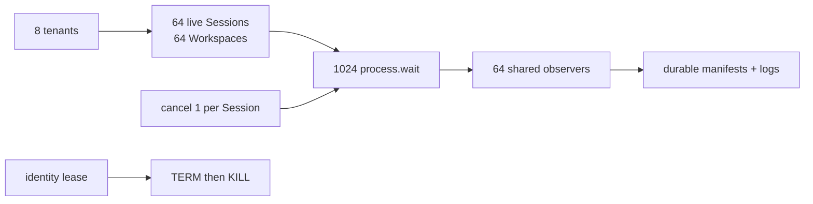

| 对标面 | Codex CLI | OpenClaw | 本平台 Rust Kernel / Host | 判断 |
|---|---|---|---|---|
| Live process 容量 | `MAX_UNIFIED_EXEC_PROCESSES=64`；容量表可按状态和交互锁清理候选项 | Node invoke/PTY 受单 invocation 生命周期、队列和 timeout 管理 | 全局/tenant/Workspace 配额；64 live 满时拒绝新工作，不淘汰仍有所有者的进程 | 64 容量对齐 Codex，多租户 ownership 更保守 |
| 等待放大 | `Notify/watch/broadcast` 合并 output/state 消费 | progress queue + sequence + heartbeat，PTY emit 时 pause | 1024 wait 收敛为 64 observer；最终 250ms 取证为 295 次文件观察 | 观察放大已封顶；仍不是直接事件 push |
| 取消隔离 | turn/interaction lifecycle 成熟 | AbortSignal 和 invocation owner 统一收口 | 每 Session 取消 1 个 wait，64 个取消不影响其余 960 个 | Kernel 窄面已验证；产品生命周期仍落后 |
| 唤醒门禁 | 上游产品路径，无本项目同口径多租户数据 | 上游 Node relay 路径，无 durable Workspace 同口径数据 | 最终取证 p50 905.30ms、p95 982.02ms、p100 995.13ms；连续 10 轮通过 | 只证明当前 Mac 本地门禁，不横向宣称性能领先 |
| 进程组终止 | Unix process-group 与跨平台执行成熟 | Unix group-leader、Windows tree kill、typed timeout 成熟 | TERM/KILL 前验证 identity lease；租约释放的旧 PGID no-op，残留返回 indeterminate | 身份围栏更适合 durable recovery；跨平台仍落后 |

### 本阶段结论

- 已确认：8 tenant / 64 Workspace / 64 个真实进程 / 1024 wait 的观察次数、取消隔离、全量唤醒和回收；
  压测暴露的 PGID 复用竞态已有确定性 RED/GREEN，修复后连续 10 轮通过。
- 相比 Codex，64 live process 与共享唤醒原则已对齐；本平台不 LRU 淘汰 live 多租户进程，并以持久身份租约
  围栏终止。Codex 的统一 `exec_command` / `write_stdin` yield、事件流和跨平台 backend 仍领先。
- 相比 OpenClaw，本平台验证的是 durable Kernel cursor 和 tenant/Workspace ownership；OpenClaw 的 Node
  progress、viewer/owner、relay、Windows 和连接级流控仍明显领先。
- 下一优先缺口固定为统一 start/write+yield；本阶段数据不等价于整机 CPU benchmark，也不宣称已有生产
  加权公平调度。

## 上一阶段：共享持久 Process Wait 观察

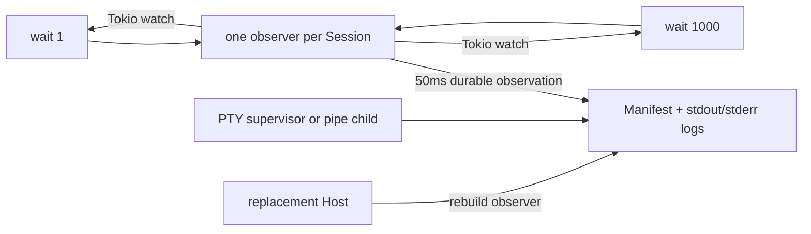

| 对标面 | Codex CLI | OpenClaw | 本平台 Rust Kernel / Host | 判断 |
|---|---|---|---|---|
| Yield API | `exec_command` 与 `write_stdin` 原生携带 yield，长命令不消耗模型 busy-poll 回合 | Terminal 以事件 push 为主，attach/text 用于重连与 LLM 读取 | Pure `process.wait` 等待 cursor 前进、终态或期限，同一 Tool Call 返回有界 output | 核心 wait 已补；仍比 Codex 多一次 start→wait Tool Call |
| 共享唤醒 | `Notify/watch/broadcast` 推送 output/state，读取器不独立轮询 | PTY 单输出队列，emit 完成前 pause；Gateway 对 viewer 做水位控制 | 同 Session 只有一个 durable observer，Tokio watch 唤醒 1000 wait | 共享原则对齐；持久重建是本平台额外边界 |
| 超时与恢复 | turn/exec 取消、yield session 和进程 store 产品链成熟 | Node invoke/session 生命周期成熟，Gateway restart 受 native handle 边界约束 | yield 不得超过冻结 Tool timeout；最后一个 wait 结束后 observer 退休；Host replacement 从文件重建 | 多租户恢复边界更显式；产品广度仍窄 |
| PTY→日志背压 | reader 经 bounded mpsc；channel 满时阻塞生产链 | WebSocket bufferedAmount 到 4MiB pause、回落 512KiB resume | 单 8KiB buffer，同步 append+flush；磁盘慢会停止 PTY read，由内核 buffer 反压 | 当前零用户队列更简单，不需要复制连接层水位 |
| Live viewer | app/exec output 流与 yield 交互成熟 | owner/viewer、ring、coalescing、sequence、高低水位完整 | 没有 viewer transport；durable poll/attach/wait 是内核接口 | OpenClaw 明显领先，但不是本轮 Kernel 必需能力 |
| 容量 | bounded channel 与 event replay 已有成熟实现 | Gateway session limits 与 detached eviction 完整 | 1000 wait/单 Session：1 observer、250ms ≤10 次观察、全部唤醒 <2s | 单 Session 门禁已完成；64 Session 混合负载仍未证明 |

### 本阶段结论

- 已确认：1000 个 wait 共享一个 observer；pipe 和外部 PTY 的真实输出均能唤醒，最后一个等待取消后 observer
  收敛为 0；Host replacement 不重启 child 或重放模型 Tool Call。
- 相比 Codex，共享通知原则已对齐，本平台另有 durable cursor/Checkpoint/Host replacement 绑定；仍缺统一
  start/write+yield、成熟 event replay、Windows backend、sandbox 和完整 exec 产品语义。
- 相比 OpenClaw，没有复制只对 WebSocket 慢消费者成立的 pause/resume；OpenClaw 的 viewer push、owner
  takeover、Node relay 和跨平台能力仍明显领先。
- 下一优先缺口固定为 64 个 live Session、跨 tenant/Workspace 的 1024 wait 混合容量与公平性；不进入 GUI、
  Java、Docker 或控制面。

## 上一阶段：单一 PTY Owner、显式握手与有界 Attach

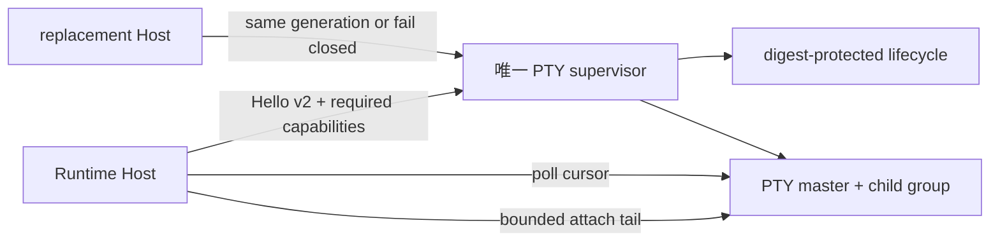

| 对标面 | Codex CLI | OpenClaw | 本平台 Rust Kernel / Host | 判断 |
|---|---|---|---|---|
| Owner | PTY driver/store 管理进程内 handle；未据 inspected 源码宣称跨 CLI 重取原 master | Gateway session manager 管 owner/viewer 与 attach takeover | 删除 Host-owned PTY 新建路径；每个 state root 只有外部 supervisor 持有 master | 恢复边界更单一，但产品 ownership 仍落后 OpenClaw |
| 协议与生命周期 | Rust 类型边界、driver hook 和跨平台 backend 成熟 | Gateway protocol 有 terminal open/attach/list/text/close 与关闭原因 | v2 Hello 精确校验五项能力；持久 ready/stopping/stopped、活跃数、退出原因和 clean/unclean 前任 | 跨 Host 兼容性 fail-closed 更显式；协议广度仍窄 |
| 输出读取 | 有界 mpsc/broadcast，`unified_exec` 支持 yield 与增量 write/poll | bounded ring、attach buffer、plain text、sequence 和 coalescing | poll 增量游标 + Pure `process.attach` 有界尾部、起止游标、截断标志 | 有界恢复回看已补；统一 yield、ANSI/text 产品语义仍落后 |
| 背压 | bounded channel 可使生产者等待，完整 exec 管线已有容量门禁 | PTY pause/resume + WebSocket 高低水位，慢 viewer 有明确流控 | 读取块和总输出预算有界，但尚无连接/消费者高低水位 pause/resume | 这是下一 P0，OpenClaw 明显领先 |
| 跨平台 | Unix PTY、Windows ConPTY/PseudoCon 和进程组覆盖成熟 | node-pty 与 Node relay 覆盖 Unix/Windows | 当前只实跑 macOS Unix PTY | 两个参考项目明显领先 |

### 本阶段结论

- 已确认：无 supervisor 的 PTY 在 spawn 前拒绝；旧 Pong/缺能力 socket 不被接管；clean idle 与 SIGKILL
  前任可观察；真实 Agent Loop 和 replacement Host 都完成有界 attach 后继续关闭。
- 相比 Codex，本平台只在跨 Runtime Host generation、持久 lifecycle 和失联 fail-closed 上更显式；统一
  exec/yield、sandbox、Windows 和完整 Tool 产品链仍明显落后。
- 相比 OpenClaw，本平台已对齐有界 attach 的内核语义，并让输出落盘可跨 Host；owner/viewer、sequence
  broadcast、pause/resume 高低水位、Node relay 和 Windows 仍明显落后。
- 下一优先缺口固定为 supervisor 输出高低水位与可观察 pause/resume，用 noisy PTY、慢消费者和 Host
  replacement 验证；不进入 GUI、Java、Docker 或控制面。

## 上一阶段：Host 外独立 PTY Supervisor 与真实跨 Host 续接

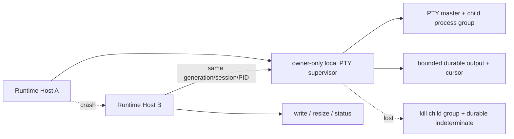

| 对标面 | Codex CLI | OpenClaw | 本平台 Rust Kernel / Host | 判断 |
|---|---|---|---|---|
| PTY 启动 | `codex-utils-pty` 使用 driver/`portable-pty`，统一 handle、resize 与进程组 | `node-pty` 覆盖 Unix/Windows，Node Host 与 Gateway Terminal 均接入 | Unix `openpty + setsid/TIOCSCTTY`；master 由 state-root 唯一 supervisor 持有 | Unix 基础对齐；跨平台仍落后两者 |
| 交互与输出 | bounded mpsc、broadcast、yield/poll 与截断成熟 | write/resize、pause/resume、ring/coalescing 和 WebSocket 高低水位成熟 | `process.write/resize` 经 256 KiB 有界控制协议；固定 8 KiB 读取块，达到冻结 byte budget 精确截断 | 内核内存有界；viewer 级流控和统一 yield API 落后 |
| 断连/替换 | inspected PTY 方向以 driver/store 管理；未据源码宣称可跨 Codex CLI 进程重开原 master | Gateway detach/attach、scrollback 和 owner takeover 成熟；Gateway 重启仍受 native handle 生命周期约束 | Host A 退出后 Host B 以 generation/session/PID/status 续接同一 supervisor 和 child | 这条已验证的跨 Host 所有权恢复更持久，但产品面更窄 |
| 失联安全 | 进程组 terminate/kill 与 sandbox 集成成熟 | tree kill、force-kill 和 session cleanup 成熟 | supervisor 丢失时新 generation 不冒充旧 owner，回收原组并持久 `indeterminate` | fail-closed 已闭环；还缺丰富诊断和跨平台清理矩阵 |
| 多租户本地边界 | 面向当前本地用户与 workspace policy | 面向 owner Gateway/Node 设备域 | token/socket/session 状态为当前 UID 私有；Host 继续校验 tenant/Workspace/实现摘要 | 本地多用户泄漏面更窄，但不是 Kata 级租户隔离 |
| Agent Loop | `exec_command/write_stdin` 与模型循环成熟 | Agent terminal、Node PTY、Gateway terminal 产品链成熟 | 回环模型实际完成 start→poll→write→poll→resize→write→poll→close；替代 Host 也继续同一 PTY | 恢复内核闭环完成；终端产品仍非完整 |

### 本阶段结论

- 已验证：Host 进程 `exit(74)` 后同 PID reattach、真实 write/read/resize/close、supervisor SIGKILL 后回收、
  4096-byte 精确输出上限、长 socket 路径和 `0700/0600` 权限；不是仅靠 mock state 的恢复。
- 相比 Codex，已对齐 Unix PTY、resize、进程组和有界通道方向，并新增其 inspected 主链未证明的跨 Runtime
  Host owner generation；仍缺统一 exec/yield API、sandbox 深度、Windows backend 和完整产品集成。
- 相比 OpenClaw，已对齐 write/resize/tree kill，并在持久 generation/fail-closed 上更严格；仍缺
  pause/resume 高低水位、scrollback attach、Windows ConPTY、Node relay 与终端产品生命周期。
- 下一优先缺口：删除旧 Host-owned PTY 兼容路径，增加 supervisor capability/version handshake、可观测
  shutdown 与有界 attach/scrollback。仍不引入容器、GUI 或控制面依赖。

## 上一阶段：MCP 2026 跨 transport 与外部实现兼容

ADR-0090—0092 已完成 HTTP/stdio MCP 2026 MRTR、URL elicitation、跨 Host continuation 与 Codex 严格外部
fixture 兼容；其详细证据保留在对应 ADR 和 `docs/evidence/2026-08-11-mcp-2026-stdio-url-compatibility.md`。

## 上一阶段：MCP capability negotiation 与反向请求默认拒绝（Linux cgroup 仍未激活）

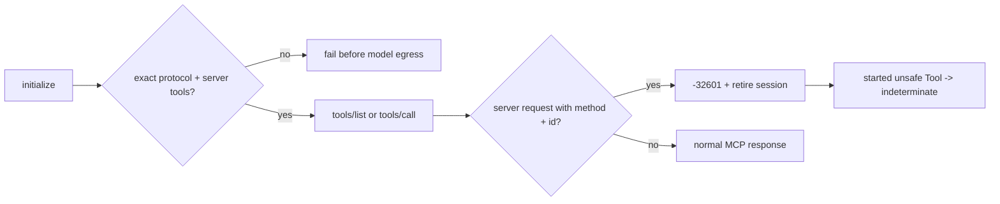

| 对标面 | Codex CLI | OpenClaw | 本平台 Rust Kernel / Host | 判断 |
|---|---|---|---|---|
| 能力协商 | 显式构造 `ClientCapabilities`，当前 inspected 路径启用 elicitation；协议由 rmcp 管理 | loopback Gateway 作为服务端协商 `tools`；未发现对应反向客户端能力路径 | 客户端能力为空；精确验证 `2025-06-18` 和服务端 `tools` | 本平台窄门禁明确，Codex 能力面更完整 |
| 反向请求 | `elicitation/create` 进入 request manager 和交互响应；未见 sampling/roots 被当前 builder 广告 | inspected Gateway 处理客户端 `initialize/tools/*`，未见 sampling/elicitation/roots 客户端处理 | HTTP JSON/SSE 与 stdio 对任何未协商 `method + id` 回精确 ID 的 `-32601` 并退役会话 | 默认拒绝闭环已验证；不能据此推断参考项目全局缺失 |
| 模型与副作用边界 | elicitation 有成熟 UI/应用层路由 | Tool 调用与 replay guard 成熟 | 发现违规零模型调用；已开始 Unknown Tool 保持 durable indeterminate，拒绝随后 success | 本平台把窄协议违规接入持久副作用语义 |
| Resources/Prompts | 已有分页 Resources list/read、Resource Templates 与模型侧只读内核 Tool | 已有 Resources list/read、Prompts list/get 与成熟 session facade | HTTP 2025/2026、stdio、Gateway gRPC、Worker 已贯通有界单页 list/read/get | 操作链已对齐；Codex 的 Templates/模型入口和 OpenClaw 的成熟会话广度仍领先，本平台的完整多租户 identity/digest 与硬上限更严格 |
| 下一缺口 | 已有 elicitation 产品回路 | 跨平台 Gateway/Apps 广度领先 | 尚无获批 elicitation、sampling 或 roots | 下一步只启用 Run-frozen elicitation，不开放 sampling/roots |

### 本阶段结论

- Codex `ff352fab6209` 显式声明 elicitation capability，并将 `elicitation/create` 路由到可交互的 request
  manager；这是下一阶段主要语义参考。其 MCP 广度明显领先。
- OpenClaw `58b4b9430457` 的 inspected loopback Gateway 是 MCP 服务端：它协商 `tools` 并接收
  `tools/list`/`tools/call`，未发现等价的反向客户端请求路径。不能把角色不同误判为安全能力落后。
- 真实 HTTP/SSE、sibling POST 与 stdio 进程证明 discovery 和 active Tool 两个边界都会返回精确 ID 的
  `-32601`。四条闭环分别验证零/一次模型调用、session 退役、`run.indeterminate`、事件与 Checkpoint。
- 旧文档把 Resources/Prompts 列为 server-initiated request 是分类错误，现已纠正；ADR-0116 又完成了
  四个客户端操作的 HTTP/stdio/Gateway/Worker 主链。它们仍不进入反向授权结论，模型入口、Resource Templates、
  OAuth 与真实外部长稳分页仍是可验证差距。
- 外部 P0 仍是真实 Linux cgroup 门禁；本机下一项是 Run-frozen、可审批和可恢复的 MCP elicitation。
  sampling/roots、GUI、Java、Docker、NATS 和平台化继续暂停。

## 上一阶段：MCP 请求级 cancellation/progress（Linux cgroup 仍未激活）

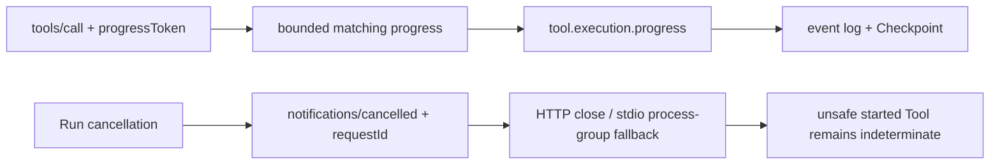

| 对标面 | Codex CLI | OpenClaw | 本平台 Rust Kernel / Host | 判断 |
|---|---|---|---|---|
| MCP 取消 | rmcp/connection manager 有完整请求与通知基础；inspected Tool abort 路径未定位到显式 cancel 通知 | HTTP disconnect 进入 AbortController；loopback handler 将 `notifications/cancelled` 作为 no-op | HTTP/stdio 均发送匹配原 request ID 的通知，再硬清理资源 | 本平台在这条可验证链上更完整；不推断 Codex 全局缺失 |
| MCP 进度 | request meta 和 notification handler 已有，inspected handler 记录 progress；未定位到持久 Run bridge | inspected gateway 未发现 `progressToken`/`notifications/progress` 主链 | 匹配且单调的进度写入 Run 事件并逐次 Checkpoint | 本平台窄持久化契约领先 |
| 背压与输入限制 | rmcp 生态实现更成熟 | Node session/Apps 生命周期成熟 | 32 槽两级非阻塞队列、2048 字节消息、有限/单调数值 | 防止远端 progress 控制 Runtime 内存或执行 |
| 副作用表达 | aborted Tool response；未检查到 durable per-Run effect ledger | abort 同时保留 replay-invalid/潜在副作用 | cancel 通知不改变 Unknown Tool 的 `run.indeterminate` | 延续 ADR-0087，不把通知当回滚证明 |
| 广度 | OAuth、elicitation、Apps、现代 transport 完整 | MCP Apps、Resources/Prompts、跨平台更成熟 | credential-free HTTP/stdio；云 gRPC 生命周期流缺失 | 两个参考项目总体明显领先 |

### 本阶段结论

- Codex `ff352fab6209` 的 rmcp transport、request metadata 和 notification handler 更成熟；当前检查只证明
  Tool call 已能带 meta、progress handler 会记录日志，不能据此声称 Codex 没有其他取消路径。本平台新增的
  是进度到持久 Run/Checkpoint 的明确桥。
- OpenClaw `58b4b9430457` 已将 HTTP 断开映射到 Tool `AbortSignal`，但 loopback MCP handler 明确 no-op
  `notifications/cancelled`，且 inspected gateway 未发现 progress token 主链。本平台在这条协议细节领先，
  其 Node、MCP Apps、渠道与跨平台能力仍明显领先。
- 真实 HTTP/SSE 和 stdio 进程闭环证明 request ID、取消通知、进度事件、Checkpoint、最终
  indeterminate 与进程回收；无 Docker、Java、NATS 或外部 API Key。
- 外部 P0 仍是真实 Linux cgroup 门禁；本机下一项是 MCP server-initiated request 的 capability、权限、
  审批和预算边界。GUI、Java、Docker、NATS 和平台化继续暂停。

## 上一阶段：取消/超时保留已开始 Tool 的副作用不确定性（Linux cgroup 仍未激活）

该阶段由 ADR-0087 完成：unsafe started Tool 在取消/时限后保持 `run.indeterminate`，而未开始或
Pure/Idempotent 工作保持调用方请求终态；真实 Shell/MCP 资源清理和终态 Checkpoint 已验证。

## 上一阶段：操作员权威、Run 内冻结的 MCP Tool effect（Linux cgroup 仍未激活）

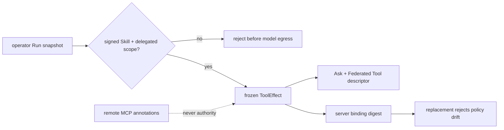

| 对标面 | Codex CLI | OpenClaw | 本平台 Rust Kernel / Host | 判断 |
|---|---|---|---|---|
| 操作员策略 | server default + per-Tool approval mode；server-level parallel flag | owner/plugin replay metadata；MCP restart-safe 默认拒绝 | v18 per-server Tool effect map，缺省 Unknown | 三者都有 owner policy；本平台字段直接绑定失败/恢复语义 |
| 远端 annotation | Auto/Writes 审批模式会读取 `read_only_hint` | inspected MCP replay path不把 MCP 标为 restart-safe | `readOnlyHint/idempotentHint` 无权改变 effect 或审批 | 本平台更保守；Codex UX 更灵活但信任面更大 |
| 审批与 effect | 审批模式成熟，未检查到 durable per-Run effect ledger | replay guard 成熟，未检查到 per-Tool durable effect snapshot | effect 可变但 MCP 始终 Ask + Federated | 避免把“幂等”误等同于“无需审批” |
| 恢复身份 | Thread/MCP 生命周期成熟，错误回到上层 | attempt/session replay state 完整 | effect map 进入 server binding digest，漂移拒绝恢复 | 本平台在这一窄契约上更显式 |
| MCP 广度 | OAuth、elicitation、Apps、现代 transport 完整 | MCP Apps、resources/prompts、跨平台和 session manager 完整 | credential-free HTTP/stdio + 可选云 gRPC | 两个参考项目仍明显领先 |

### 本阶段结论

- Codex `ff352fab6209` 已有 `default_tools_approval_mode`、per-Tool override 和
  `supports_parallel_tool_calls`；其 Auto/Writes 路径会读取 MCP `read_only_hint`。本平台没有复制该信任
  决策：远端 annotation 只能用于展示，不能授权 replay 或降低审批。
- OpenClaw `58b4b9430457` 的 Tool replay guard 更广，且 inspected preparation path 对 MCP Tool 明确返回
  not restart-safe；本平台新增的是按 Tool 冻结的 operator effect、Checkpoint identity 和
  `run.indeterminate` 对账，不代表 MCP 产品面更成熟。
- 真实 Streamable HTTP 闭环证明：服务端同时声称只读/幂等，无 operator override 时仍是 Unknown；显式
  Idempotent 时才允许失败作为 Tool Result 回到模型。两条路径 MCP 调用次数都为一，审批保持 Ask。
- 外部 P0 仍是真实 Linux cgroup 门禁；本机下一项是取消/超时发生在已开始 Unknown/NonIdempotent Tool
  期间的双重终态证据。GUI、Java、Docker、NATS 和平台化继续暂停。

## 上一阶段：MCP 接受调用后的响应丢失（Linux cgroup 仍未激活）

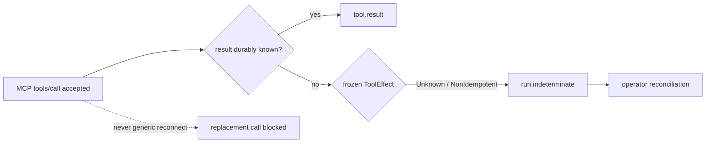

| 对标面 | Codex CLI | OpenClaw | 本平台 Rust Kernel / Host | 判断 |
|---|---|---|---|---|
| MCP Tool 自动重试 | transient operation retry 只允许 `tools/list`；HTTP retry status allowlist 排除 `tools/call` | `callTool` 是单次 guarded request，未检查到同一调用的通用自动重发 | stdio 仅在请求未入队时重连；actor 接受后响应丢失禁止 replacement 重发 | 与两个参考项目的 no-retry 方向一致 |
| 副作用证据 | MCP 生命周期/OAuth/elicitation 完整，调用失败回到上层错误 | terminal observer 记录 `executionStarted`/`replaySafe`，潜在副作用使 replay invalid | frozen effect + durable started + call/binding 形成 `run.indeterminate` | OpenClaw 已有成熟 replay guard；本平台的跨 Host 对账更显式 |
| 真实响应丢失 | inspected tests/paths 未作为本平台门禁复跑 | inspected MCP suite 很广，当前未复跑其截断响应场景 | 真实 HTTP MCP 执行副作用后截断 body，调用一次、无 Tool Result、Checkpoint indeterminate | 当前窄门禁证据更直接，不代表总体更成熟 |
| transport breadth | stdio/Streamable HTTP、OAuth、elicitation、现代协议模式成熟 | stdio/HTTP、session manager、MCP Apps、资源/Prompt 面成熟 | credential-free HTTP/stdio；云 gRPC 可选；无 OAuth/elicitation/MCP Apps | 两个参考项目明显领先 |

### 本阶段结论

- Codex `ff352fab6209` 明确把 transient retries 限定到 `tools/list`，并让 HTTP retry status allowlist 排除
  `tools/call`；它的协议与生命周期广度显著领先，但 inspected 路径没有本平台的 durable Run reconciliation。
- OpenClaw `58b4b9430457` 已记录 `executionStarted`、`replaySafe` 和 replay-invalid 状态，不能再简单归类为
  “所有错误只是普通 Tool Result”；它的 session/MCP Apps/跨平台能力领先。本平台只在 per-call binding、
  `run.indeterminate` 和 operator reconciliation 的跨 Host 契约上更明确。
- 真实 Streamable HTTP MCP 已证明：远端调用一次后截断响应，Host 持久 indeterminate Checkpoint，不产生
  Tool Result；stdio RED 真实发生 replacement 重发，GREEN 后禁止。默认并发全工作区 545 项中 540 项
  执行通过、5 项外部 live 忽略；格式、check 与 Clippy 通过。
- 本节提出的 operator-authoritative、Run-frozen MCP effect override 已由 ADR-0086 和上方阶段完成。
  GUI、Java、Docker、NATS 和平台化继续暂停。

## 上一阶段：在线 Tool 失败的副作用确定性（Linux cgroup 仍未激活）

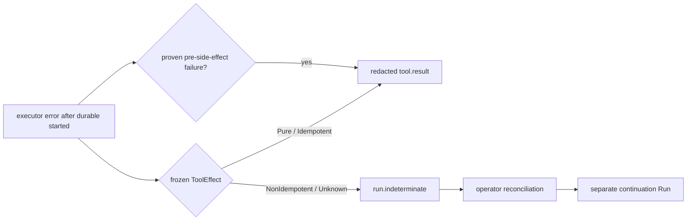

| 对标面 | Codex CLI | OpenClaw | 本平台 Rust Kernel / Host | 判断 |
|---|---|---|---|---|
| live Tool exception | mature lifecycle/event handling; generic failures become model-visible output | preflight and `executionStarted` are distinct; thrown errors become error Tool Results | validates durable started identity and frozen effect before choosing result or terminal | narrower product surface, stronger uncertainty rule |
| timeout side effects | strong process/sandbox output and cancellation paths | explicitly warns that timeout side effects may already exist | NonIdempotent/Unknown timeout cannot continue the same Run | explicit terminal fencing is stronger in this narrow case |
| recovery parity | local Thread/product persistence, no inspected per-call effect ledger | process supervisor registry and transcripts are broad but mainly process-local | live failure and replacement recovery converge on the same bound `run.indeterminate` | better fit for multi-tenant replacement semantics |
| redaction | rich diagnostics and tracing | core Agent Loop commonly uses exception message; surrounding adapters add safer formatting | private executor reason never enters event/model; stable evidence keeps call/binding/effect | stricter model-facing boundary |
| breadth | PTY, sandbox, interactive exec and product UX mature | Unix/Windows/PTY/adapters/timeouts mature | no PTY/Windows; Linux cgroup still disabled | both references remain substantially ahead |

### 本阶段结论

- Codex `ff352fab6209` 的 Tool lifecycle、parallel cancellation、sandbox output、PTY 与产品交互仍明显领先；
  inspected error path会把失败转换为模型输出，没有本平台这类持久 effect/started uncertainty ledger。
- OpenClaw `58b4b9430457` 已在 exec timeout 文案明确警告外部副作用可能完成，且 `executionStarted` 边界、
  Unix/Windows supervisor 与 PTY 更成熟；其核心 Agent Loop 仍把 thrown error 作为 Tool Result 返回。
- 真实本地 HTTP/SSE 模型与真实文件副作用已证明：在线错误后 Run 为 indeterminate，Checkpoint/事件可供
  `Applied` 裁决，continuation 成功且原 Tool 总计一次。默认并发全工作区 543 项中 538 执行通过、5 项
  外部 live 忽略；格式、check 与 Clippy 通过。
- 下一优先仍是真实 Linux cgroup 门禁；本机下一项是远端 MCP 已接收调用但响应断开的真实闭环。
  GUI、Java、Docker 与平台化继续暂停。

## 上一阶段：确定性启动失败的类型传播

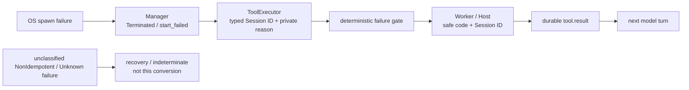

| 对标面 | Codex CLI | OpenClaw | 本平台 Rust Kernel / Host | 判断 |
|---|---|---|---|---|
| synchronous spawn error | propagates spawn I/O failure; shell lifecycle is mature | supervisor finalizes `spawn-error` and rethrows | schema 6 persists terminal truth before cleanup, then ToolExecutor retains Session identity | stronger only at durable recovery identity |
| model-visible Tool error | upstream Tool handling has mature product integration; inspected spawn helper itself returns an error | Agent Loop converts Tool exceptions to error Tool Results | only deterministic pre-side-effect failure becomes a redacted structured Tool Result | narrower and safer certainty rule; ecosystem breadth remains behind |
| private diagnostic boundary | rich tracing/error surfaces | `createErrorToolResult` commonly uses the exception message | private OS reason stays in typed operator error; model/event get fixed message and Session ID | explicit redaction is stronger for this failure class |
| replacement Host decision | inspected process helpers are not a tenant/session recovery ledger | inspected supervisor registry is process-local | durable terminal/resource phase remains available to another Host | narrow cross-Host contract is more explicit |
| portability / terminal | PTY, interactive command and Linux sandbox paths mature | Unix/Windows child/PTY adapters and timeout policy mature | macOS Unix path proven; Linux cgroup disabled; no PTY/Windows | both references remain substantially ahead |

### 本阶段结论

- Codex `ff352fab6209` 的 process-group、parent-death signal、PTY、sandbox 和产品交互路径仍明显更成熟；
  本平台只在 digest-bound 多租户资源阶段、replacement 决策和本类错误的模型侧脱敏上更显式。
- OpenClaw `58b4b9430457` 的 overall/no-output timeout、Unix group-leader 校验、Windows tree kill、PTY 与
  adapter 广度仍领先；其 Agent Loop 会返回 Tool 异常，但 inspected 路径使用原始异常消息且 supervisor
  registry 是进程内状态。
- `agent-tool-runtime` 84 项全绿；默认并发全工作区共 538 项：533 执行通过、0 失败、5 个外部 live
  忽略；check、Clippy 与格式通过。真实同步 spawn 错误、Worker 分类和独立 Host 的模型/事件闭环均已验证。
- 下一优先缺口仍是执行真实 Linux memory/PID/aggregate CPU/`cgroup.kill`/cleanup/Host replacement 门禁；
  本机次级缺口改为对其余 `ToolExecutionError` 做 effect-aware certainty 审计，防止 Worker 把模糊的
  NonIdempotent/Unknown 失败误记为已完成。GUI、Java、Docker 与平台化继续暂停。

## 上一阶段：Schema 6 持久启动失败

`Starting/prepared` 的同步 spawn 失败终态、cleanup journal 和 active schema-5 迁移由 ADR-0082 完成；详见
`docs/evidence/2026-08-10-schema-six-durable-process-start-failure.md`。

## 上一阶段：Schema 5 启动边界与旧 Starting 安全迁移

跨 backend `prepared` 边界、schema 2/3/4 `legacy_unknown` 和 active schema-2 replacement 由 ADR-0081
完成；详见 `docs/evidence/2026-08-10-schema-five-launch-boundary-and-legacy-starting-safety.md`。

## 上一阶段：持久资源阶段与 Starting reconciliation

schema 4 的资源阶段、cleanup journal 与第一版 `Starting` reconciliation 由 ADR-0080 完成；详见
`docs/evidence/2026-08-10-durable-process-resource-phase-and-starting-reconciliation.md`。其中旧 schema 与跨
backend 启动歧义已由当前 ADR-0081 收紧。

## 上一阶段：Linux cgroup 启动与终态生命周期

pre-exec 组准备、失败回滚、终态清理由 ADR-0079 完成；详见
`docs/evidence/2026-08-10-linux-cgroup-start-and-terminal-lifecycle.md`。

## 上一阶段：Manager 生命周期 cgroup root identity

公开 config/private resolved backend 分离、Manager 单次 root open 与 `Arc` 传播由 ADR-0078 完成；详见
`docs/evidence/2026-08-10-manager-lifetime-cgroup-root-identity.md`。

## 上一阶段：fd-relative cgroup 生命周期

root/group descriptor、`mkdirat/openat/unlinkat`、路径 replacement 防重定向与进程组回收竞态修复由
ADR-0077 完成；详见 `docs/evidence/2026-08-10-fd-relative-cgroup-lifecycle.md`。

## 上一阶段：cgroup 身份驱动监管与整组终止

schema 3 identity 驱动的 `cpu.stat`、`cgroup.events`、`cgroup.kill`、durable `cpu_limit` 和 replacement
supervision 由 ADR-0076 完成；详见
`docs/evidence/2026-08-10-identity-driven-cgroup-observation-and-termination.md`。

## 上一阶段：持久资源身份与 pre-exec cgroup membership

schema 3 的 digest-bound backend identity、schema 2 Unix migration、父进程预开 membership fd、真实 child
pre-exec 写 `0`、新组失败回滚与既有组拒绝接管由 ADR-0075 完成；详见
`docs/evidence/2026-08-10-durable-resource-identity-and-pre-exec-membership.md`。

## 上一阶段：Host-owned cancellation 与子代理崩溃恢复

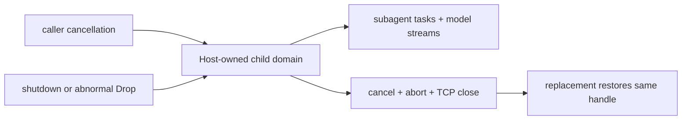

| 对标面 | Codex CLI | OpenClaw | 本平台 Rust Kernel / Host | 判断 |
|---|---|---|---|---|
| consumer disappears | `ResponseStream::Drop` cancels upstream mapper | supervisor owns adapter cancel/dispose | Host Drop cancels its private subtree and aborts registered tasks | aligned ownership principle |
| graceful shutdown | session handler stops prewarm and processes | TERM→KILL plus adapter dispose | cancel, await subagents, then stdio MCP shutdown | both references remain broader |
| parent/child boundary | mature turn token propagation | process/run registry cancellation | caller token → Host child domain → child Host tokens | avoids upward cancellation of siblings |
| crash recovery proof | broad product path; no equivalent local handle test inspected | process lifecycle tests; no equivalent durable handle test inspected | live Runtime, real parent/child TCP EOF, replacement same handle, zero spawn replay | narrow recovery evidence is stronger |

### 本阶段结论

- Codex `ff352fab6209` 的 stream consumer Drop 和 session cleanup 证明“所有者消失即主动取消”是成熟路径；
  本平台补齐了此前缺失的 Host Drop 层，但 Codex 的 turn、PTY 和 interactive process 广度仍领先。
- OpenClaw `58b4b9430457` 的 supervisor 继续领先进程 adapter、超时、TERM→KILL 和跨平台处理；本平台
  当前优势只在 Checkpoint 后替代 Host 恢复同一子代理 handle 且不重放 spawn 的窄证据。
- TDD RED 稳定保留连接 5 秒；同一测试 GREEN 0.18 秒。四套关键 Host 测试 62/62，全工作区 507 项中
  502 项执行通过、5 项外部 live 忽略。
- 下一优先缺口返回 cgroup Manifest identity、fd-relative delegated-root、pre-exec membership、CPU tree、
  `cgroup.kill`/cleanup 与真实 Linux 门禁。GUI、Java、Docker 和外部服务继续暂停。

## 上一阶段：Linux cgroup v2 协议边界（第二阶段，仍未激活）


| 对标面 | Codex CLI | OpenClaw | 本平台 Rust Kernel / Host | 判断 |
|---|---|---|---|---|
| lifecycle breadth | process/session and PTY integration mature | overall/no-output timeout, TERM→KILL, PTY and Node adapters mature | persistent process session and recovery exist; cgroup path is disabled | both references remain ahead in product breadth |
| tenant boundary | inspected `ProcessStore` is process-local and may prune an old live entry | inspected supervisor registry is process-local | governance/capability are tenant/Workspace-bound and persisted | narrow PaaS ownership model is stricter, not broader |
| cgroup protocol | sandbox path can use Linux isolation, but inspected store is not a tenant cgroup ledger | cgroup readings elsewhere are diagnostic | exact controller writes, symlink rejection, `0` membership and strict CPU parser | protocol exists, kernel behavior is unproved |
| unsafe partial activation | no equivalent tenant backend selector in inspected path | no per-Tool persisted cgroup admission in inspected path | non-Linux rejects before state; Linux rejects as `backend_not_wired` | fail-closed activation boundary is stronger |
| recovery/kill | mature process termination; no cgroup identity in inspected store | mature supervisor termination; no persisted per-Tool cgroup identity here | Manifest identity, recovery, CPU supervision and `cgroup.kill` missing | material blocker; backend cannot be enabled |

### 本阶段结论

- Codex `ff352fab6209` 仍领先 interactive command、PTY、process-store 和跨平台执行；本平台当前更严格的
  只是多租户 backend 激活与持久治理边界。
- OpenClaw `58b4b9430457` 仍领先 process supervisor、Node Host、PTY 和 adapter 广度；诊断型 cgroup
  读取不能替代 per-Tool admission/recovery，因此没有直接复制。
- 第二次全工作区门禁 507 项中 502 项执行通过，5 项外部 live 用例忽略；真实 Host process-session 3/3
  通过。该阶段首次暴露的子代理旧 socket 关闭超时已由当前 ADR-0074 阶段确定性复现并修复。
- 下一优先缺口是 cgroup Manifest identity、fd-relative delegated-root、无竞态 membership、CPU tree
  supervision、`cgroup.kill`/cleanup 和真实 Linux 故障门禁。不进入 PTY、GUI、Java 控制面、云边节点或
  Docker。

## 上一阶段：可移植资源 capability 与 Linux 硬边界（第一阶段）

显式 capability vector、缺失保证的 typed fail-closed 以及 governance/Tool digest 绑定由 ADR-0072 完成；
详见 `docs/evidence/2026-08-10-explicit-process-resource-capabilities.md`。

## 上一阶段：持久 Process Session 资源治理与可恢复监管

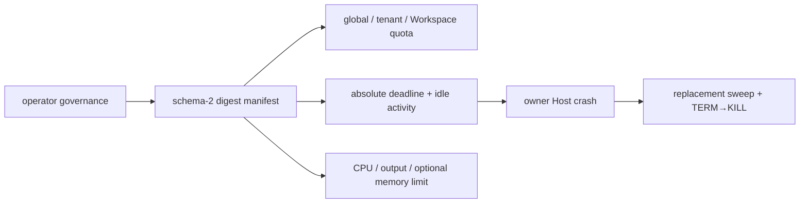

| 对标面 | Codex CLI | OpenClaw | 本平台 Rust Kernel / Host | 判断 |
|---|---|---|---|---|
| deadline / idle | inspected store tracks `last_used`; session UX has bounded yield but no durable cross-Host deadline in this path | overall timeout、no-output timeout、typed cancellation reason | absolute deadline and idle TTL persisted before spawn; poll is not activity | durable replacement semantics are more explicit; OpenClaw timeout breadth is mature |
| capacity policy | process-local cap 64 and LRU pruning can evict a live entry outside protected recent set | process-local registry/capture limits and scope replacement | cross-process global, tenant and canonical Workspace quotas; full means reject new work | safer for multi-tenant ownership; no claim about overall Codex maturity |
| output / CPU / memory | 1 MiB returned-output boundary and mature process management; no tenant resource ledger here | capped stdout/stderr capture plus supervisor termination | per-stream file ceiling, CPU seconds and optional non-macOS address-space ceiling persisted | broader durable policy, but `RLIMIT_FSIZE` is coarse and Linux memory is unverified |
| Host replacement | inspected `ProcessStore` is process-local | inspected supervisor registry is process-local; Node paths add ownership handling | inherited identity + PGID + sweep lock enforce original deadline on same PID | narrow cross-Host governance evidence is stronger; no distributed lease proof |
| platform / terminal | Unix process-group and interactive command path mature | PTY resize/pause/resume and cross-platform terminal adapters | macOS CPU/file limits verified; no macOS memory limit, no PTY, Windows unsupported | both references remain substantially ahead in portability and terminal UX |
| real closure | upstream Codex product path | upstream OpenClaw product path | real child, owner `exit(73)`, replacement sweep and real HTTP/SSE Agent Loop | proves local kernel semantics only; not vendor, Linux, Node or NATS behavior |

### 本阶段结论

- Codex 的 interactive command UX、yield、长期会话产品路径仍更成熟。本平台没有复制其容量满时淘汰
  live process 的策略，而是以跨进程 tenant/Workspace 配额拒绝新工作，避免多租户所有权被 LRU 破坏。
- OpenClaw 的 overall/no-output timeout、TERM→KILL 和 typed cancellation 已吸收；其 PTY、resize、
  pause/resume、Node Host 与跨平台 adapter 仍明显领先。本平台的差异是 deadline/limit 随 Manifest 跨 Host
  保持不变，而不是声称 process supervisor 整体领先。
- 真实 owner process `exit(73)`、replacement sweep、真实受限 child 及 HTTP/SSE Agent Loop 均通过；
  全工作区 499 项中 494 项执行通过，5 项外部 live 用例显式忽略。
- macOS 不支持本实现可证明的内存硬限额；Linux `RLIMIT_AS` 已有源码，但未做 Linux 构建或 live gate。
  `RLIMIT_FSIZE` 也比独立 stdout accounting 粗，因此当前只是可信原生进程治理，不是强沙箱。
- 下一优先缺口是 Linux cgroup v2/rlimit 的真实进程树资源证据与可移植 supervisor capability；在此之前
  不进入 PTY、GUI、Java 控制面、云边节点或 Docker。

## 上一阶段：协议中立的持久 Tool Process Session

稳定 handle、tenant/Workspace/实现摘要、identity lock、进程组、FIFO/cursor、跨 Host reattach 和
TERM→KILL 生命周期由 ADR-0070 完成；详见
`docs/evidence/2026-08-10-persistent-tool-process-session.md`。

## 上一阶段：模糊副作用终态与人工 reconciliation

该阶段的不可变 `run.indeterminate`、版本化人工裁决和新 Run 继续语义已由 ADR-0069 完成；详见
`docs/evidence/2026-08-10-indeterminate-tool-reconciliation.md`。

## 上一阶段：有界并行 Tool 执行与确定性提交

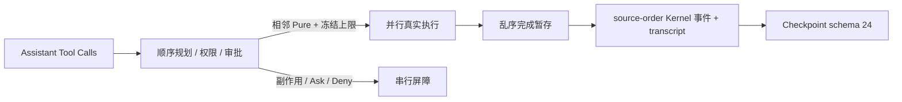

| 对标面 | Codex CLI | OpenClaw | 本平台 Rust Kernel / Host | 判断 |
|---|---|---|---|---|
| 并行准入 | Tool 实现声明 `supports_parallel_tool_calls`；共享读锁并行，写锁串行 | 顺序 preflight；任一 call 为 sequential 则整批串行，否则并发 | 仅相邻 `Pure` Tool 并发；scope、审批、deny、副作用和内置 agent Tool 均为屏障 | 比两者保守，适合当前多租户证据边界；表达能力落后 Codex |
| 并发上限 | 由任务/运行时调度承担，检查路径未发现同类签入 Run 的数值快照 | `Promise.all` 执行批次，检查路径未见显式 per-Run 上限 | schema 17 签入 1–16、默认 4，旧 schema 永久串行 | 冻结与迁移更明确；不代表吞吐领先 |
| 结果顺序 | 任务可并行，Router/Turn 语义保持 call binding | 生命周期 end 可按完成时序，但 Tool Result message 后续按 source order 写入 | 完成可乱序；Kernel 事件和 transcript 只释放连续 source-order prefix | 核心对齐，并增加持久 staged state |
| 持久恢复 | rollout 和取消成熟；并行 gate 主要是进程内执行语义 | Session/transcript replay 成熟，Tool repair 广 | Checkpoint 24 保存队列、未完成请求和 staged results；替代 Host 只重试 Pure 未完成项 | 窄面恢复更显式；长期兼容与产品恢复仍落后 |
| 副作用安全 | 工具自行声明是否支持并行，审批/沙箱路径成熟 | executionMode 和 replay guard 覆盖更广 Tool 生态 | side-effecting、Unknown、MCP 暂不并发；started 先于进程启动落盘 | 当前更保守；缺 conflict key 和人工 reconciliation |
| 真实闭环 | 上游 Codex 产品路径 | 上游 OpenClaw 产品路径 | 真实 loopback HTTP/SSE + 两个真实子进程 + 中途 Host replacement | 证明内核语义，不证明真实厂商或分布式 NATS |

### 本阶段结论

- Codex `parallel.rs` 的“并行 Tool 显式 opt-in、其余串行”原则已对齐；本平台仍缺按 Tool 实现审核的
  parallel capability、统一交互式进程 Tool 和更成熟取消遥测。
- OpenClaw `agent-loop.ts` 的顺序 preflight、并发执行、source-order 结果消息核心已对齐；其 Tool 生态、
  生命周期钩子和 transcript repair 仍更广，本平台则额外冻结并发上限和 staged Checkpoint。
- Graphify 先追踪 `drain_tool_calls` → `run_approved_tool` → Checkpoint/recovery 全链，避免只在执行器加
  `join_all` 而绕过审批与 durable-start。真实测试证明执行重叠、结果顺序和半批恢复。
- 下一优先缺口是模糊副作用的显式 `indeterminate` 终态与人工 reconciliation。GUI、Java 控制面和
  云边节点继续暂停。

## 上一阶段：协议中立 Rich Model Item 与推理状态连续性

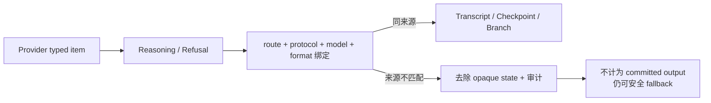

| 对标面 | Codex CLI | OpenClaw | 本平台 Rust Kernel / Host | 判断 |
|---|---|---|---|---|
| Reasoning 表达 | Responses `Reasoning` 保留 id、summary、raw content 和 encrypted content | thinking block、signature、redacted thinking 与显示分离 | 协议中立 Reasoning 分开 summary 与 bounded private state | 核心连续性接近；Codex item 广度仍领先 |
| 来源与跨 Provider | 主要围绕一个有效 Provider/Responses 历史回灌 | 大量 Provider 特例和兼容修复，签名随消息保存 | route/protocol/model/format 四项完全匹配才回放，否则审计丢弃 private state | 多 Provider 边界更显式；特例广度落后 OpenClaw |
| Refusal | Responses 有 typed refusal/content item | Provider stream 与 transcript 兼容层处理多种结束内容 | typed refusal 进入事件与 transcript，Host 输出不再为空 | 基础对齐；更多安全/内容块仍缺 |
| 持久恢复 | rollout/history/compaction 对 typed item 的保留成熟 | session transcript/replay 与 thinkingSignature 保留成熟 | Protobuf、Worker Checkpoint、新 attempt、compaction tail、Continue/Fork/Rollback 均保留 | 已有闭环证据；长期版本迁移仍落后 Codex |
| 安全降级 | encrypted reasoning 按 Responses 语义回灌 | 兼容层会按 Provider 清洗/转换思考块 | opaque state 不进入公共事件、可见文本或其他 Provider 请求；omission 不阻断 fallback | 更适合多租户候选链，但本地 Checkpoint 尚无字段级加密 |
| 验证边界 | 上游真实产品覆盖广 | 上游多 Provider 生态覆盖广 | 真实 loopback HTTP/SSE + gRPC；未用外部 Key | 证明执行语义，不证明真实厂商兼容 |

### 本阶段结论

- Codex `ff352fab6209` 的 typed Responses reasoning、summary 与 encrypted continuation 核心已对齐，并增加
  明确的跨 Provider provenance fence；Codex 仍领先 Responses item 广度、WebSocket 和 rollout 长期兼容。
- OpenClaw `58b4b9430457` 的 thinking/signature/redacted thinking 保留与显示分离核心已对齐；其 cache、
  Auth Profile/OAuth、Provider 特例和 transcript 清洗范围仍明显领先。
- 真实 HTTP/SSE、gRPC、Checkpoint replacement、compaction 与 Session Continue/Fork/Rollback 已通过。
  当前 Rust 测试清单 468 项，其中 5 项外部 live 忽略；没有外部厂商凭据。
- 下一优先缺口改为有界并行 Tool 执行与确定性结果提交。GUI、Java 控制面和云边节点继续暂停。

## 上一阶段：持久 Provider 健康、重试、冷却与 half-open

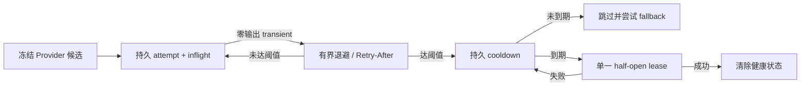

| 对标面 | Codex CLI | OpenClaw | 本平台 Rust Kernel / Host | 判断 |
|---|---|---|---|---|
| 同 Provider 重试 | `responses_retry.rs` 有界重试、错误延迟/指数退避、重连通知和 WebSocket→HTTP 降级 | fallback attempt 结合错误分类与 Auth Profile 可用性决定继续 | route journal v2 持久总尝试次数、退避截止与 inflight；仅零事件策略内错误可重试 | 核心有界语义对齐 Codex；仍缺 transport fallback |
| 冷却生命周期 | 主要围绕当前 Provider/transport 重连，不是租户候选健康表 | Provider/Auth Profile cooldown、transient probe、session suspension 成熟 | rate-limit/timeout/unavailable 连续失败或 `Retry-After` 打开原子 cooldown | Provider 级持久冷却对齐；凭据粒度落后 OpenClaw |
| half-open 并发 | 未发现等价的多候选单探针租约 | cooldown probe 防止持续封禁，和 Auth Profile 轮换协同 | 过期后持久 invocation lease；并发 Run 只放行一个，其他 Run 使用 fallback | 支持的单写 state-root 内已证明；不宣称跨进程 active-active |
| 崩溃恢复 | Turn/rollout 重试成熟，重试状态不按本项目 route journal 表达 | session/auth lifecycle 恢复治理更广 | egress 前写 inflight；替代 Host 将模糊请求计为已消费，次数耗尽后明确终止 | 防无限替代重放更明确；尚非分布式状态 |
| 错误隔离 | 认证、限流、网络错误分类与遥测更完整 | Auth Profile 级 cooldown/rotation 可隔离坏凭据 | 认证/账单不 fallback、不进入共享健康；transient 才影响 circuit | 不误伤其他请求，但尚无 profile rotation |
| 审计与秘密 | 用户可见 reconnect 与丰富 tracing | lifecycle 日志、Auth Profile 状态和 SecretRef 成熟 | retry event + failure/selection event；健康文件只存分类、状态、期限 | 不落密钥/原文成立；缺 circuit 专用公共事件 |

### 本阶段结论

- Codex `ff352fab6209` 的同 Provider 有界退避语义已对齐到独立 Host，并额外跨 Host 持久 attempts/inflight；
  Codex 仍领先 WebSocket→HTTP transport fallback、Responses rich item 和错误遥测。
- OpenClaw `58b4b9430457` 的 Provider cooldown/探针核心已对齐；其 Auth Profile 轮换、per-profile cooldown、
  SecretRef/OAuth、session suspension 和 Provider 特例仍明显领先。
- 真实 HTTP 已证明同 Provider 503→成功、持久 503 cooldown、429 `Retry-After`、两个并发 Run 单探针、
  认证错误隔离，以及进程中断后不会超过尝试预算。当前 Rust 测试清单 458 项，其中 5 项外部 live 忽略。
- 下一优先缺口改为协议中立 Rich Model Item：reasoning summary、加密推理状态、refusal、Anthropic
  thinking/signature 的来源绑定、Checkpoint/compaction/Fork/Rollback 连续性。GUI、Java 控制面和云边节点继续暂停。

## 上一阶段：独立 Host 的协议中立多 Provider 安全故障转移

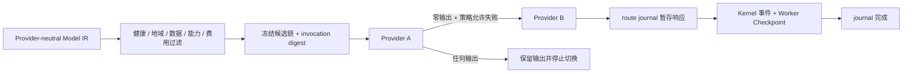

| 对标面 | Codex CLI | OpenClaw | 本平台 Rust Kernel / Host | 判断 |
|---|---|---|---|---|
| Provider 表达 | Provider registry 与有效 Thread config 成熟，核心 Turn 通常使用一个 Provider | Provider/Auth Profile/模型候选生态广，兼容层深入多家协议 | 同一 IR 原生驱动 Responses、Anthropic Messages、OpenAI-compatible 三协议 | 协议中立主链成立；Provider 特性广度落后 OpenClaw |
| 候选与过滤 | 请求/流重试及 WebSocket→HTTP transport fallback；不是租户跨 Provider 链 | ordered fallback、模型候选和 Auth Profile 选择成熟 | 1–8 候选按健康、地域、数据等级、能力、费用过滤后冻结 | 多租户策略维度更显式；无动态健康生命周期 |
| 安全切换 | 有界重试，Responses item/流语义完整 | 分类 failover，并以 committed-work guard 禁止提交后切换 | 仅零事件、retryable 且 Run 策略允许时切换；部分文本/Tool/Usage 后禁止重放 | 核心副作用边界对齐；错误兼容矩阵仍少 |
| 崩溃恢复 | rollout/history 与重试状态成熟，但非本平台式候选 cursor | cooldown/session/auth 生命周期成熟；恢复治理更广 | 原子 journal 保存候选、cursor、失败摘要和 staged events；Checkpoint 后才完成，可跨 Host 续跑或免重放应用 | 本地确定性恢复更明确；尚非分布式 Checkpoint 对象 |
| 辅助模型调用 | compaction/Responses 路径与 Codex provider config 深度集成 | summarizer 走 Provider 兼容与 fallback 体系 | Agent Turn 和 context compaction 共用同一冻结路由；摘要不暴露 Tool | 已封闭“摘要直连第一个 Provider”的旁路 |
| 凭据与 CLI | 原生配置/凭据读取成熟 | SecretRef/Auth Profile/OAuth 与交互配置成熟 | 二进制 JSON 只保存 API Key 环境变量名；Debug 和 journal 均不含密钥 | 基础安全入口成立；轮换/OAuth 明显落后 |

### 本阶段结论

- Codex `ff352fab6209` 仍领先 Responses rich item、请求/流重试、WebSocket transport fallback、错误遥测和
  provider 配置生命周期；本平台补齐的是 Codex 不以多租户候选链为中心的跨 Provider 冻结与恢复语义。
- OpenClaw `58b4b9430457` 仍领先 Auth Profile 轮换、cooldown/probe、错误兼容、SecretRef/OAuth 和大量
  Provider 特例；本平台只在 route cursor、staged response 与 Worker Checkpoint 顺序这一窄面更确定。
- 真实回环 HTTP/SSE 已证明三协议连续切换、五类策略过滤、半途断流不切换、失败后 cursor 恢复、已收响应
  免重放恢复，以及 MCP transcript compaction 也使用同一路由。447 项 workspace 测试通过，5 项外部 live
  测试显式忽略；没有外部厂商凭据，因此不声称第三方质量或稳定性已验收。
- 下一优先缺口是持久 Provider 健康与重试治理：零输出同 Provider 重试、`Retry-After`/退避、cooldown、
  half-open 单探针和跨 Host 恢复。GUI、Java 控制面与云边节点继续暂停。

## 上一阶段：root Session 不可变分支与 generation-fenced Rollback

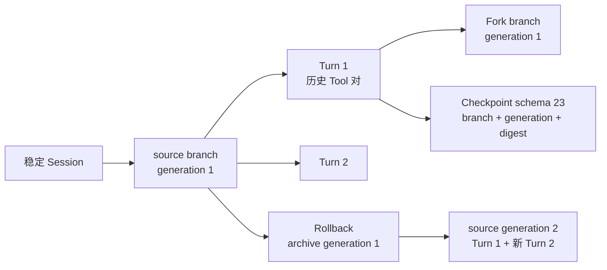

| 对标面 | Codex CLI | OpenClaw | 本平台 Rust Kernel / Host | 判断 |
|---|---|---|---|---|
| 根身份与分支 | 稳定 Thread；Fork/rollback 由 rollout/history 重建 | 稳定 Session key 下轮换具体 sessionId，偏 reset 而非 sibling Fork | 稳定 `session_id` + 独立 `branch_id` + 每分支 generation；Run 仍是一次执行 | 根 Session/Run 分离已成立；产品命令面仍落后 |
| Rollback 存储 | 追加 `ThreadRolledBack` marker，重放得到有效历史并重算 usage/reference context | 归档旧 transcript 后创建替代 Session entry | 归档旧 generation 完整 typed Turns，当前 head 指向完成前缀 | 语义清楚但目前比 marker/ordinal graph 更占空间 |
| 活动与迟到结果 | active Turn 时拒绝；flush rollout 后写 marker | abort active Runs、清 queue、close runtime，再以生命周期 generation 拒旧工作 | active Turn 直接拒绝 Fork/Rollback；caller、Checkpoint、终态 commit 同时绑定 generation/history digest | 窄面 fencing 明确；没有 reset 级联清理 |
| Tool 历史与恢复 | rich rollout item 重建，不执行历史 Tool | transcript repair/context engine 重建并清理 runtime | 完整 Assistant Call/Tool Result 只作为模型上下文；schema 23 不让历史 Call 进入执行队列 | 核心无重放成立；rich item 广度仍落后 |
| 崩溃窗口 | rollout flush/marker 持久化与 Session 重建成熟 | archive/reset/owner 生命周期覆盖 Gateway restart | active Turn 先落盘；终态 Checkpoint 先于终态事件；head 未提交时替代 Host 直接提交 transcript | 本地确定性强；尚无分布式 CAS/retention |
| 真实闭环 | 本地 Thread 产品链 | Gateway/embedded Session 产品链 | 真实 HTTP/SSE + MCP：source/Fork/Rollback/两类恢复，历史 Tool 总计一次 | 证明执行语义，不等于两者完整产品能力 |

### 本阶段结论

- Codex `ff352fab6209` 仍领先 marker-based rollout reconstruction、reference context/token usage 重算、
  rich `ResponseItem` 和完整 Thread 命令面；本平台已对齐稳定根身份、active-Turn 拒绝、非破坏性历史
  head 移动及 Checkpoint 恢复，并额外显式绑定 branch generation/history digest。
- OpenClaw `58b4b9430457` 仍领先 Session reset 的 active/queue/runtime cleanup、archive hooks、渠道集成和
  lifecycle owner；本平台提供 OpenClaw 当前 reset 模型不等价的 sibling Fork，但不宣称产品层领先。
- 三条真实 Host 测试证明：source/Fork/Rollback 看到完整历史 Tool 对但 MCP `tools/call` 只有一次；503
  后替代 Host 恢复；终态事件与 head 提交之间崩溃也不会再次请求模型。
- 下一优先缺口转为独立 Host 的协议中立多 Provider 调度与安全故障转移：能力过滤、冻结候选、仅在零
  可见输出时切换，以及半途断流的不可自动重放证据。GUI、Java 控制面和云边节点继续暂停。

## 上一阶段：跨 handle 的树级预算保留账本

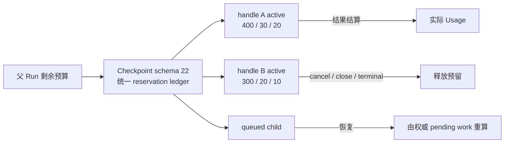

| 对标面 | Codex CLI | OpenClaw | 本平台 Rust Kernel / Host | 判断 |
|---|---|---|---|---|
| 树级额度 | `RolloutBudget` 在 root Thread 与 subagents 间累计实际加权 Token | 有全局/子代理并发上限及 Usage/Cost 归一化，未发现树级未来额度预留 | 一个父 Run 的所有 pending/active/queued 子执行共享 Token、费用、时长预留 | 子执行超卖缺口已封闭；不等于租户级配额 |
| 准入时机 | Usage 到达后累计，越界返回 `SessionBudgetExceeded` | 并发 slot 与 registry 生命周期先准入，费用主要用于统计呈现 | spawn/send/fork 前扣未完成预留；父模型也扣子 Token 预留 | 本地多租户安全更保守；可能暂时闲置未用 child cap |
| 持久恢复 | 进程内共享对象；Thread rollout/history 负责产品恢复 | SQLite registry、owner/kill/orphan reconciliation 更成熟 | schema 22 独立保存，并从 pending、active、queued 状态重算；账本篡改 fail-closed | 窄面 crash fence 明确；长期 registry 仍落后 OpenClaw |
| 结算释放 | 实际 Token 使用一次累加；按 Thread 递送阈值提醒 | 终态 Usage、delivery 和 kill cleanup 路径丰富 | 绑定结果以实际用量替换预留；duplicate 不重复结算；close/cancel/timeout/终态释放 | 三维 reservation 成立；无 Codex weighted policy/reminder |
| 真实闭环 | 本地 Thread tree | Gateway/embedded agent 产品链 | 真实 HTTP parent→两个稳定 handle→并发 send/wait；provider ceiling 400+300，终态账本为零 | 主链成立；确定性模型不证明第三方质量 |

### 本阶段结论

- Codex `ff352fab6209` 已有 root Thread tree 的共享实际 Token 预算和 reminder delivery；本平台不能再把
  “共享预算”描述为 Codex 缺失。差异是本平台在执行前预留 child cap，并覆盖费用、时长及 Checkpoint
  防篡改，但仍缺 weighted policy、提醒和 root Thread 产品集成。
- OpenClaw `58b4b9430457` 仍领先持久 registry、分层并发限制、owner/orphan cleanup 与 Usage 展示；在
  已检查的 subagent 路径中未发现等价的父树未来额度 reservation ledger。
- Worker RED/GREEN、schema-22 恢复/篡改/close/cancel 及真实 Host 双 handle 闭环已通过；不同 handle
  不再各自看到同一个父余额。
- 下一优先缺口是把 handle generation/Fork/Rollback 提升为通用 root Thread/Session 生命周期；GUI、
  Java 控制面和云边节点继续暂停。

## 上一阶段：generation fenced 的持久子代理 Rollback

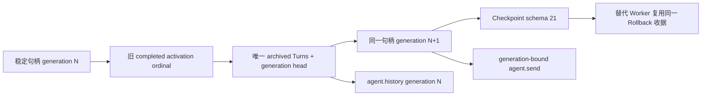

| 对标面 | Codex CLI | OpenClaw | 本平台 Rust Kernel / Host | 判断 |
|---|---|---|---|---|
| 回滚表达 | 持久追加 `ThreadRolledBack { num_turns }`，重放计算有效历史；活动 Turn 时拒绝 | `sessions.reset` 在同一 key 下轮换 sessionId、归档旧 transcript 并清理运行态 | 同一稳定 handle 指向 completed prefix；generation 精确 +1，旧 generation 可显式读取 | 核心不可变回滚成立；仍非通用 root Thread/Session API |
| 身份与并发 | Thread ID 不变；先 flush rollout，再追加 marker；重建上下文和 token usage | 生命周期 owner、retired generation、active-run/queue cleanup 防止 reset 前写入 | handle ID 不变；caller generation、continuation digest 和 late result 三层 fencing | 窄面多租户执行 fence 更显式，产品生命周期广度落后 OpenClaw |
| 历史存储 | 原始 rollout + 累积 marker，支持 reference context/compaction replay | reset archive file + replacement Session entry；usage family 保留历史 transcript ID | superseded Turn 只存一次；每代保存 ordinal path + digest，当前 head 不复制归档 payload | 比完整 snapshot 更节省；缺 redo、空历史与长期 retention/export |
| 活动态与权限 | active turn 直接拒绝；回滚后重算 settings/reference context | abort active Runs、清 queues、close child runtime，再提交 reset | active/queued/closed handle 拒绝；role/scope/budget 不变；后续 ordinal 不复用 | 避免隐藏取消语义；不替代 OpenClaw 的全产品 cleanup |
| Tool 与恢复 | rollout replay 保留有效 rich items；marker 持久失败会警告并继续重试 | transcript repair、runtime cleanup 与 hooks 共同治理 | retained Assistant Call/Tool Result 只进上下文；Checkpoint v21 恢复同 receipt/event | 真实原生 Tool 证明总计只执行一次 |

### 本阶段结论

- Codex `ff352fab6209` 明显领先 root Thread rollback、累积 marker replay、reference-context/compaction 重建和
  `num_turns` 广度；本平台只完成稳定子代理 handle 的 inclusive completed-prefix Rollback。
- OpenClaw `58b4b9430457` 领先 Gateway Session reset、active/queued cleanup、archive file、lifecycle owner、
  hooks 和渠道集成；本平台保持独立 Rust Host 可运行，不伪装为同一产品层能力。
- 已实跑真实 HTTP 模型与可信原生 `workspace.read_text`：generation 1 `[0,1]` 回滚为 generation 2 `[0]`，
  新 Turn 使用 ordinal 2，旧代仍可读取；历史 Tool 对进入上下文但总计只执行一次。
- 已验证 Rollback 收据落盘而 Tool 结果未写入的崩溃窗口、归档篡改拒绝、旧代命令与迟到结果 fencing。
  后续树级预算账本已由 ADR-0063 完成，下一优先缺口是 root Thread/Session branch。

## 上一阶段：generation 绑定的持久子代理 Fork

Fork 已完成：新 deterministic handle 从 source generation 的 completed inclusive prefix 创建，角色不变、
预算只能缩小，Checkpoint schema 20 幂等恢复同一 branch；完整 Tool 对作为历史继承且不重放。Codex 仍
领先通用 Thread Fork 和 latest/through/before 边界，OpenClaw 仍领先 Gateway Session/context-engine 集成。

## 上一阶段：显式、可审计的历史修复

```mermaid
flowchart LR
    I["external / truncated 原始历史"] --> V["低权限边界校验"]
    V -->|"System / 重复 Call ID"| X["拒绝"]
    V --> R["Tool 配对修复"]
    R --> A["插缺失 / 丢孤立重复 / 移错位"]
    A --> D["源摘要 + 修复摘要 + 计数"]
    D --> C["Checkpoint schema 19"]
    C --> M["模型上下文；不执行历史 Tool"]
```

| 对标面 | Codex CLI | OpenClaw | 本平台 Rust Kernel / Host | 判断 |
|---|---|---|---|---|
| 修复触发 | `normalize_history` 在模型上下文构造时统一补缺失 output、删 orphan | Session replay/compaction 广泛调用 transcript repair | 只允许显式 `external`/`truncated` import；Checkpoint restore 不隐式修复 | 多租户权威边界更清楚，但通用覆盖面更窄 |
| Tool 归属 | 按 Call/Output 类型和 ID 修复，支持更多 Responses item | occurrence/frame 算法可处理错位、重复结果和部分重复 opaque ID | 唯一 Call ID 下移动错位结果、补缺失、丢孤立/重复；重复 Call ID 拒绝 | 核心安全修复成立；复杂 provider replay 落后 OpenClaw |
| 权限与副作用 | 合成 `aborted` output，不执行旧调用 | 合成 error result，修复 replay shape，不重跑 Tool | 禁止 imported System；合成明确错误；历史 Call 不进入 pending queue | 协议中立权限边界对齐 |
| 审计与恢复 | rollout/history version 提供丰富上下文，但非多租户执行摘要 | repair report 有 added/drop/move 计数，Session tree 持久 | source/repaired SHA-256、四类计数进入 Checkpoint v19；原始导入漂移拒绝恢复 | 窄面审计和 fenced restore 更明确 |

### 本阶段结论

- Codex `ff352fab6209` 仍领先完整 `ResponseItem` 类型和贯穿所有 history reconstruction 的 normalize；
  本平台刻意不把自动修复扩到权威 Checkpoint。
- OpenClaw `58b4b9430457` 仍领先 occurrence/frame 配对、重复 provider ID 处理、provider-specific 清洗及
  Session tree/branch/reset 生命周期。
- 已实跑真实回环 HTTP：损坏历史经显式 API 修复后进入模型；缺失 Result 是合成错误，孤立 Result 消失，
  历史 Tool 不执行。替代 Host 使用相同导入恢复并产生相同消息序列；修改原始导入会在模型前拒绝。
- 本节提出的 handle Fork/Rollback 与树级预算账本已由上方阶段完成；下一优先缺口是 root
  Thread/Session branch。GUI、Java 控制面和云边节点继续暂停。

## 更早阶段：子代理完整 Transcript 胶囊与终态恢复

```mermaid
flowchart LR
    C["子 Run typed transcript"] --> D["结果 digest v3"]
    C --> P["终态 Checkpoint schema 18"]
    P --> E["终态事件"]
    E --> X["父结果收据"]
    X -. "写入前崩溃" .-> R["替代 Host 从子 Checkpoint 恢复"]
    R --> N["下一轮完整上下文\n不重放 Tool"]
```

| 对标面 | Codex CLI | OpenClaw | 本平台 Rust Kernel / Host | 判断 |
|---|---|---|---|---|
| Rich Tool 历史 | `ResponseItem` 保留 assistant、call/output 及更多 provider item | `AgentMessage`/Session entry 保留 Tool use/result 与供应商细节 | provider-neutral `Message` 保留 narrative、Tool Call、Tool Result 和终态 Assistant | 核心 Tool 历史已对齐；reasoning/private、多模态类型仍少 |
| 缺失/孤立修复 | normalize 补缺失 output、删除 orphan output，裁剪时联动 Tool 对 | transcript repair 规范化 Tool call，并补缺失 result、修复配对 | 权威收据和 Checkpoint 对缺失、孤立、重复 Tool 对 fail-closed | 持久态更保守；显式导入/截断修复仍落后两者 |
| 终态耐久与恢复 | rollout/history 可重建会话，生命周期与 fork/rollback 更完整 | Session tree 通过 compaction/reset/branch 边界重放 | 子终态 Checkpoint 先于终态事件；父结果写入前崩溃可确定恢复且不重放 Tool | 本地文件 Host 的窄面恢复语义更明确；云传输尚未证明同一顺序 |
| 版本与完整性 | rollout/history version 管理丰富 item | Session entry 与迁移/repair 共同治理 | RunExecution v14 + result digest v3 + Checkpoint v18，旧 schema 不能携带 rich transcript 冒充升级 | 协议中立、抗降级边界成立；会话树治理仍少 |

### 本阶段结论

- Codex `ff352fab6209` 仍领先完整 `ResponseItem`、通用 normalize、full/last-N fork、rollback 和 history
  version 生命周期；本阶段只对齐稳定子代理后续轮次所需的完整 Tool transcript。
- OpenClaw `58b4b9430457` 仍领先 provider-specific transcript repair、Session tree、reset/branch/compaction
  边界和富消息兼容层。
- 已实跑真实回环 HTTP 模型与可信原生 `workspace.read_text`：子代理先输出 narrative，再发 Tool Call，
  接收绑定 Tool Result 并终结；`agent.send` 后续轮次看到完全相同的 typed history。
- 已实跑确定性崩溃窗口：子终态已发布、父结果收据尚未写入时替换 Host，从子终态 Checkpoint 恢复，
  下一轮仍看到完整 Tool 对且旧 Tool 不重放。该结论只覆盖独立本地 Host，不外推为云端 exactly-once。
- 本节约定的显式导入/截断修复、handle Fork/Rollback 与树级预算账本已由上方阶段完成；下一优先缺口是
  root Thread/Session branch。GUI、Java 控制面和云边节点继续暂停。

## 上一阶段：协议中立上下文压缩

```mermaid
flowchart LR
    T["typed transcript\nText + ToolCall + ToolResult"] --> B["完整 Tool 对边界"]
    B --> P["schema 17 pending\n来源 + 尾部 + 策略摘要"]
    P --> S["无 Tool 摘要请求"]
    S --> U["普通 User summary"]
    U --> R["精确保留 recent tail"]
    P --> C["Host replacement\n重发同一摘要请求"]
```

| 对标面 | Codex CLI | OpenClaw | 本平台 Rust Kernel / Host | 判断 |
|---|---|---|---|---|
| transcript 表达 | versioned rich `ResponseItem`，含 Tool/reasoning/compaction item | 丰富 `AgentMessage` 与 Session entry | `ModelMessage` 保留 assistant 文本、Tool Call 和绑定 Tool Result | 核心 Tool 转录对齐，类型广度仍少 |
| 边界与修复 | normalize 可补缺失输出、删除孤立输出；删项时联动对应 call/output | `firstKeptEntryId` + token tail；丢块后修复 Tool 配对 | 只在移除前缀和保留尾部两侧都完整配对时切分，否则不压缩 | 安全边界成立，但尚无历史修复器 |
| 摘要权限 | 模型生成摘要，以 user-like compaction context 重建历史 | 专用 summarizer System prompt，持久 compaction summary | 摘要请求无 Tool；结果作为普通 User 消息，原 System 消息逐字保留 | 权限语义基本对齐 |
| 恢复 | history version、rollout 重建和远端 compaction 生命周期更完整 | Session tree 以 compaction/reset/branch 边界重放 | schema 17 绑定完整来源、前缀、尾部和策略；503 后新 Host 重发同一请求且不重放 Tool | 窄面确定性更强，生命周期仍少 |
| 规划与预算 | 自动/手动阈值、远端路径和告警；多次压缩有精度提示 | tokenizer 估算、多段摘要、旧摘要更新、超大消息占位 | IR 编码字节阈值、单次有界摘要、用量计入 Run 预算 | 可控但明显更粗糙 |
| 协议耦合 | 与 Responses/Codex rollout 语义紧密 | Provider message 兼容层丰富 | policy、Checkpoint 和摘要均为 Provider 中立 IR，Adapter 最后转换 | 更适合通用内核，表达力仍窄 |

### 本阶段结论

- Codex `ff352fab6209` 仍领先 rich rollout reconstruction、缺失/孤立 Tool 项修复、自动/手动/远端
  compaction、full/last-N fork 和 rollback。本阶段只对齐“模型摘要 + 安全尾部”的核心路径。
- OpenClaw `58b4b9430457` 仍领先 tokenizer 规划、多段/增量摘要、超大消息降级、runtime detail 清洗、
  reset/branch summary 和 Session tree 治理。
- 已实跑真实 HTTP/SSE 与 Streamable HTTP MCP：两个大 Tool 结果触发无 Tool 摘要请求，最近 Tool 对精确
  保留；首个摘要 HTTP 503 后替代 Host 使用相同边界恢复，Tool 仍只执行两次。
- 本实现的差异是 Run/Session/模型策略、来源、前缀、尾部和阈值全部摘要绑定，且 Provider 协议中立；
  只在该窄面更适合 fenced 多租户 Runtime，不宣称整体领先或 provider exactly-once。
- 本节约定的完整 transcript 胶囊、显式导入/截断修复、handle Fork/Rollback 与树级预算账本已由上方
  阶段完成；下一优先缺口是 root Thread/Session branch。GUI、Java 控制面与云边节点继续暂停。

## 上一阶段：持久子代理对话历史

ADR-0057 完成 role-preserving 历史、激活顺序、只读分页和 Host replacement；当前 schema 22 继续携带
schema 16 的稳定句柄对话。证据见 `docs/evidence/2026-08-09-durable-subagent-conversation-history.md`。

## 上一阶段：持久子代理邮箱与 interrupt

ADR-0056 完成调用方幂等收据、schema 15 有界 FIFO、持久 interrupt、旧 child 收敛和 Host replacement；
当前 schema 22 继续携带这些状态。证据见
`docs/evidence/2026-08-09-persistent-subagent-mailbox-and-interrupt.md`。

## 上一阶段：持久异步子代理句柄（第一阶段）

ADR-0054 完成稳定 `agent_id`、非取消 wait、终态后续 send、不可逆 close 和 Host 恢复；当前 schema 22
继续携带 schema 13 的 handle/sequence/closed 状态。证据见
`docs/evidence/2026-08-09-persistent-async-subagent-handles.md`。

## 上一阶段：可恢复的父子树执行时限

该阶段由 ADR-0053 完成：Checkpoint schema 12 持久化审批暂停的 active-time 时钟，父时限覆盖模型、
Tool、MCP 与子代理树；当前 schema 22 继续携带同一时钟。详细证据见
`docs/evidence/2026-08-09-recoverable-tree-duration.md`。

## 上一阶段：独立 Rust Host 的有界并发子代理监督

```mermaid
flowchart LR
    P["父模型"] --> B["相邻 agent.spawn 批次\n最多 8 个"]
    B --> CP["Checkpoint schema 11\n完整有序请求 + 预算预留"]
    CP --> C1["子 Run A"]
    CP --> C2["子 Run B…H"]
    C1 --> R["原子结果收据\n用量摘要绑定"]
    C2 --> R
    R --> O["按 Tool Call 原序回送"]
    O --> P
```

| 对标面 | Codex CLI | OpenClaw | 本平台独立 Host | 判断 |
|---|---|---|---|---|
| 身份与角色 | 独立 Thread、role config、parent edge、可选上下文 fork | 持久 capability envelope，main/orchestrator/leaf 与 target allowlist | 独立 Run/Worker/Checkpoint；角色指令替换父指令，谱系深度和 deterministic delegation 固定 | 核心身份闭环成立；无 context fork 和持久能力信封 |
| 权限与预算 | 继承 sandbox/config，进程内 spawn/residency slot；无租户级预算预留 | sandbox 只可收窄，depth/active/swarm caps；Usage 与 timeout 生命周期成熟 | 角色 scope、MCP 和后续角色取交集；父实际用量 + 未完成子预留累计准入；子实际 Token/费用经摘要结算且重复结果不重复计费 | Token/费用批次账本成立；树级时限由后续 ADR-0053 补齐 |
| 结果回送 | status watcher、wait/send/close 与 V2 持久 Agent | registry completion/delivery/requester wake 与 kill reconciliation | 子终态、Run/delegation/binding、失败元数据与用量联合绑定；反向完成仍按原 Tool Call 顺序回送 | 阻塞批次可靠；交互和独立投递状态明显落后 |
| 嵌套审批 | 子审批从普通输出中过滤，exec/patch/user-input/permission/兼容 MCP 均经 parent Session 决策 | 当前未向祖先 Session 投影；重构设计有 SQLite 生命周期、鉴权 audience 与 first-answer CAS，但不恢复 Gateway 重启时被阻塞的 Tool | 子 Tool 审批携带目标 Run/ID/摘要经根 IPC 决策；决策和消费回执均持久化，连续两次进程崩溃后 Tool 只执行一次 | Tool 恢复窄面强于当前 OpenClaw 实现；审批种类、远程鉴权和多界面仲裁明显少于两者 |
| 取消与恢复 | child token 贯穿 exec/MCP，close/interrupt 与 Thread/history 恢复成熟；本地 turn 取消不是持久 daemon intent | ownership 校验；abort/queue clear 后持久 `abortedLastRun`，再核对最新终态并级联后代 | 根 token 同时关闭批次全部模型流；完整批次先落盘；部分完成崩溃后只恢复无收据子任务，完成结果不重放 | 批次取消与恢复成立；ownership、独立 kill/close 和复杂树级联仍落后 |
| 并发 | 可配置全局 slot、深度与 resident session 管理，spawn 立即返回 ID | 持久 registry、FIFO group reservation、每父/Agent/swarm 多层上限 | 同一 Tool turn 相邻派生并发，父固定最多 8、深度最多 3；普通 Tool 是顺序屏障 | 达到当前 8 路目标；缺动态容量、公平排队和长驻 Agent 生命周期 |

### 本阶段结论

- 已确认 Codex `ff352fab6209` 的立即 spawn、registry slot、wait/send/close，以及 OpenClaw
  `58b4b9430457` 的持久 registry、FIFO group reservation、collector 和 orphan recovery 路径。
- 已实跑两个子模型在任一响应释放前同时到达端点、反向完成后正确绑定、父取消关闭两条流、一个失败
  不丢兄弟结果，以及完成一个/阻塞一个时崩溃后只恢复未完成者。两个子任务各 150 Token，父
  Checkpoint 精确累计 300，重复结果不重复计费。
- 相比 Codex，当前缺 context fork、立即返回 Agent ID、wait/send/close、通用 Thread 历史恢复和动态
  容量管理；本阶段对齐了有界 slot 和 child token，但保留阻塞 Tool 批次语义。
- 相比 OpenClaw，当前仍缺持久能力信封、跨父公平队列、所有权控制、kill reconciliation 和完整 orphan
  registry；本阶段对齐了有界并发、settled collection、部分批次恢复和结果收据。
- 子 Tool 审批现已通过父 IPC 路由；决定在确认前落盘，子 Checkpoint 保存精确消费回执，第二次崩溃恢复
  不会重放 Tool。相比 Codex 仍缺 patch/user-input/permission/MCP elicitation；相比 OpenClaw 重构设计仍缺
  鉴权 reviewer、持久 audience 投影和 first-answer CAS。
- 该阶段之后的树级单调时限已由 ADR-0053 完成；仍缺可配置的全局/每父容量治理，以及
  wait/send/close 交互生命周期。GUI 与平台控制面继续暂停。

## 更早阶段：stdio MCP 健康目录缓存与有界会话生命周期

```mermaid
flowchart LR
    D["安全 tools/list"] --> C["进程内目录缓存\n默认 30 分钟"]
    C --> H{"session 仍存活？"}
    H -->|"否"| R["退休失败 session\n发现层有限重试"]
    H -->|"是"| U["复用目录"]
    T["tools/call"] --> L["active lease"]
    L --> V["实时重验目录摘要\n调用不缓存、不重试"]
    I["idle TTL / LRU"] -->|"只回收 zero lease"| P["完整进程组退出"]
```

| 对标面 | Codex CLI | OpenClaw | 本平台当前实现 | 判断 |
|---|---|---|---|---|
| 目录缓存 | stdio-only、进程级、默认 30 分钟；精确连接身份与 generation 防陈旧发布 | 连接 fingerprint、重验证窗口和失效处理 | stdio-only、进程级、默认 30 分钟；authority 已由 command/args/env/cwd 和 Checkpoint 摘要冻结 | 核心安全边界对齐；尚缺 Codex 的 server opt-out 与并发 generation ticket |
| 关闭会话 | client closed 或身份变化时重建；可在新连接复用安全缓存 | closed/expired manager 退休后按 requester 重建 | cache hit 前检查进程；失败 session 先回收，外层只重试 discovery，新初始化 session 可复用缓存 | 不会用缓存伪造健康，也不会重试 Tool；无后台主动 reconnect |
| 活跃租约 | Tool 连接生命周期成熟，但目录缓存不提供 OpenClaw 式 requester LRU | active lease 阻止 idle/LRU disposal | 每个 list/health/call 从入队到结果已知均持 lease；失败退休除外 | 已对齐最关键的模糊副作用保护 |
| idle / LRU | 目录缓存容量 32；连接生命周期由 connection manager 管理 | 默认 idle 10 分钟、sweep 60 秒、requester cap 64，跳过 active lease | 默认 idle 10 分钟、sweep 60 秒、session cap 32；LRU 只选 zero lease | 生命周期语义基本对齐 OpenClaw；未做 requester 分域与配置重验证 |
| 可观测与关闭 | 连接状态与目录缓存有内部状态 | lifecycle manager 显式 dispose，timer 不维持进程 | 命中/未命中、失败退休、live/active/cache、idle/LRU eviction 快照；显式 shutdown 等待，最后句柄 drop 也触发回收 | 嵌入式 Host 关闭路径已实跑；仍非持续健康/熔断系统 |

### 本阶段结论

- 已确认：Codex `ff352fab6209` 的 `tool_catalog_cache.rs`、`connection_manager.rs` 和
  `rmcp_client.rs`；OpenClaw `58b4b9430457` 的 MCP manager lifecycle 与 install/revalidation 路径。
- 已实现并验证：关闭进程不能借缓存通过健康检查；新 session 可复用新鲜目录；1 秒真实慢 Tool 在
  50ms idle TTL 下不会被回收；双 server、cap=1 时只淘汰 zero-lease LRU；所有 descendant 均退出。
- 相比 Codex，目录缓存 TTL、live-session gate 和 call 前摘要重验已经对齐；server cache opt-out、
  generation ticket、optional startup grace 和后台 reconnect 仍落后。
- 相比 OpenClaw，active lease、10 分钟 idle 和有界 LRU 已对齐；requester-scoped manager、配置指纹
  定期重验证、撤销窗口和 per-runtime 串行治理仍落后。
- 本实现更适合当前内核目标的部分是：缓存不进入 Run authority、不绕过 Checkpoint 摘要，并明确不缓存
  HTTP/gRPC 的远端授权结果。下一优先缺口是 MCP 配置重验证/撤销与更完整协议面，而不是 GUI。

## 上一阶段：MCP 必需性、有限发现重试与可观测状态

```mermaid
flowchart LR
    V11["RunExecution v11\nrequired + retry policy"] --> D["有界并发发现"]
    D -->|"可安全错误"| R["释放共享槽\n退避后重新准入"]
    D --> S["逐 Server discovery status"]
    S -->|"required unavailable"| F["模型请求前失败"]
    S -->|"optional unavailable"| K["挂载健康目录\n继续 Agent Loop"]
    K --> CP["Checkpoint schema 10\n策略 + required 绑定"]
```

| 对标面 | Codex CLI | OpenClaw | 本平台当前实现 | 判断 |
|---|---|---|---|---|
| 必需/可选 | 等待全部 required server；optional 有启动 grace，pending 可暂不进入目录 | 诊断服务器可重试，健康目录继续可用 | v11 每 Server 固定 required；required 失败在模型前拒绝，optional 失败以状态返回后继续 | 核心失败语义已对齐；Codex 的 grace 与缓存更成熟 |
| 重试边界 | HTTP initialize 仅重试选定 transport 错误；failed startup 可重连，Tool 不作通用重放 | closed/expired session 触发目录重试并退休旧 session | 只重试 discovery/list 的 transport/unavailable/deadline；协议/认证/Tool Call 不重试 | 副作用边界正确，暂无后台重连 |
| 公平与时限 | 单 Session 启动治理成熟 | Session/Requester 生命周期成熟 | 次数、初始退避、逐 Server/整批 deadline 均冻结；退避时释放全局槽并重新参加 tenant round-robin | 多租户公平与可恢复策略是本项目优势 |
| 状态与恢复 | cached tools、连接状态与 rollout 恢复 | 连接重验证、诊断、active lease、idle/LRU | 按命令顺序输出 ready/unavailable、required、已完成尝试和错误；Checkpoint schema 10 拒绝 policy/required 漂移 | 启动可观测性成立；非持续健康探针 |
| 进程治理 | 独立组和有界 shutdown | detached group、close/force-close | stdio 失败 session 重建；spawn 时冻结 PGID，leader 先退出仍回收 descendants；Host 显式 drain | macOS 故障回收已实测；Windows/Linux 尚缺同等实跑 |

### 本阶段结论

- 已确认：Codex `ff352fab6209` 的 `required.rs`、`tool_catalog.rs`、`streamable_http_retry.rs`；
  OpenClaw `58b4b9430457` 的 MCP runtime/lifecycle 路径。
- 已实现并验证：真实 stdio 首次初始化失败后在冻结预算内恢复；required 连续失败时模型请求数为零；
  optional 连续失败时 Run 成功且返回 unavailable；required 漂移在恢复时 fail-closed。
- Worker 127/127、Host 30/30、Protocol 59/59、Gateway 49/49 通过（另有 4 个外部 live 用例忽略）；
  Clippy、格式和残留进程门禁通过。
- 相比 Codex，本平台已有同等的 required/optional 核心语义，且重试预算和必需性可跨 Host Checkpoint
  恢复；Codex 的健康目录缓存、optional grace 和后台 reconnect 仍领先。
- 相比 OpenClaw，本平台的 discovery-only 重试和多租户公平边界更明确；OpenClaw 的 requester lease、
  连接重验证与长期 Session 治理仍领先；缓存、关闭会话重连、active lease、idle/LRU 已由 ADR-0048 补齐。

## 更早阶段：独立 stdio MCP、恢复与进程树生命周期

```mermaid
flowchart LR
    CFG["有界 JSON MCP 配置"] --> B["协议中立 Backend"]
    B --> HTTP["进程内 Hardened HTTP Client"]
    B --> STDIO["持久 stdio Session\n独立进程组"]
    B --> GRPC["云端 gRPC Gateway"]
    HTTP --> C["共享 Coordinator"]
    STDIO --> C
    GRPC --> C
    C --> K["Kernel Tool/审批/模型循环"]
    K --> CP["Checkpoint schema 9\n策略 + 目录 + Server Authority"]
    CP --> R["新 Host 精确恢复"]
```

| 对标面 | Codex CLI | OpenClaw | 本平台当前实现 | 判断 |
|---|---|---|---|---|
| Transport | local/remote stdio、Streamable HTTP、OAuth 与 in-process transport | stdio、SSE、Streamable HTTP、OAuth/Auth Profile | Backend 隔离 Kernel；云端 gRPC，独立 Host 支持 credential-free HTTP 与本地 stdio | 本地核心 Transport 已覆盖两类；remote stdio、SSE 与认证广度仍落后 |
| 连接生命周期 | persistent JSONL、cached catalog、failed-startup reconnect、required/optional server、startup grace | 持久 SDK stdio、连接重验证、idle TTL、LRU cap、lease 与 dispose | 当时每 Server 一个持久 actor；取消覆盖 initialize/list/call；Host 显式 drain 并等待进程组回收 | 当时基本生命周期成立；required/retry 已由上一节补齐，闲置治理仍落后 |
| 进程与环境 | `env_clear` 后加入默认白名单；独立 process group，TERM→KILL | detached group，close/forceClose 回收树 | 清空环境后白名单与显式覆盖；Unix 独立组，TERM 后按组存活判断再 KILL；Windows taskkill fallback | macOS 关键语义已对齐；跨平台实测与强沙箱仍缺 |
| 执行闭环 | 主程序直接把 binding/client 集合提供给 Turn | Agent bundle 把动态 Tool 注入会话并管理生命周期 | 发布二进制读取 JSON 配置，真实完成发现→模型 Tool Call→tools/call→结果回灌→成功→无残留退出 | 独立运行目标已真实成立，不依赖 Gateway 或控制面 |
| 恢复安全 | rollout/session 恢复成熟，catalog binding 防调用期漂移 | Session catalog/fingerprint 稳定，连接摘要用于轮换检测 | schema 9 冻结 policy/catalog/discovery；stdio command/args/env/cwd 的 canonical digest 绑定 authority | 跨 Worker/Host 的不可变 authority 绑定仍是本项目优势 |
| 当时缺口 | Resources、Apps、elicitation、sampling 等协议覆盖成熟 | requester-scoped credential、OAuth lease、UI resource 与运行态治理成熟 | Tool 子集，当时无 required/optional、failed-startup reconnect、idle/LRU、OAuth 或完整方法面 | required/retry/status 已由上一节完成；其余仍是当前缺口 |

### 本阶段结论

- 已确认：Codex `ff352fab6209` 的 `local_stdio_transport.rs`、`stdio_server_launcher.rs`、`utils.rs`；
  OpenClaw `58b4b9430457` 的 `mcp-stdio-transport.ts`。两者都采用持久 stdio session 和进程树治理。
- 已实现并验证：真实 JSONL stdio Server 完成 initialize、发现、模型 Tool Call、调用、结果回灌、
  Checkpoint 和新 Host 恢复；调用只发生一次，发现/初始化超时及正常二进制退出均无新进程残留。
- 行为 RED 暴露了两层真实缺陷：只杀直接 child 会遗留 TERM-ignoring 后代；只依赖 actor Drop 会在
  Tokio runtime 退出时丢失异步清理。现由进程组升级回收与显式 Host shutdown 分别封住。
- 相比 Codex/OpenClaw，本实现已对齐本地 stdio 的核心会话、环境和回收语义，并在跨 Host
  authority/catalog/policy 不可变恢复上更强；完整协议、OAuth、重连与长期生命周期治理仍落后。
- 当时的下一步 required/optional、failed-startup 有界重连、状态和 drain 已由上方当前阶段完成；
  下一项是健康目录缓存与关闭会话重连，继续暂停 GUI、Java 控制面和平台化工作。

## 上一阶段：MCP 异步发现与 checkpoint-aware 单写协调

```mermaid
flowchart LR
    A["已验收 attempt"] --> S["Supervisor\n并发网络发现"]
    S --> R["不可变 Ready / Cancelled"]
    R --> C["Coordinator\n单写 Kernel"]
    C -->|"新 Run"| N["挂载 Tool → run.started"]
    C -->|"恢复 Run"| V["挂载 Tool → 校验 Checkpoint"]
    N --> H["Host 发布事件 / Checkpoint / ack"]
    V --> H
```

| 对标面 | Codex CLI | OpenClaw | 本平台当前实现 | 判断 |
|---|---|---|---|---|
| 目录发现 | `McpConnectionSet` 在单 session 内以 `join_all` 并发，支持缓存、失败启动重连及 required/optional server | Session/Requester MCP Runtime 并发解析服务器并缓存目录，连接重验证与 idle/LRU 回收已实现 | Run 内并发、全局 32 槽和逐 tenant 公平；Supervisor 让多个 Run 的网络发现独立推进 | 连接管理落后两者；多租户跨 Run 公平边界更明确 |
| 执行所有权 | catalog capture 直接形成 session binding/client 集合 | lane task 自己拥有整段命令执行，队列只管理 slot/generation | 网络任务不持有可变 Kernel；Coordinator 是唯一结果应用者 | checkpoint-aware 单写边界比参考项目更适合多 Run Runtime |
| 新建与恢复 | rollout/session 恢复成熟，但不是跨 Worker 的 MCP 目录围栏 | generation/restart reconciliation 成熟，未绑定不可变 MCP catalog | Coordinator 从 accepted attempt 取得权威命令；新 Run 先挂载后 Start，恢复 Run 必须匹配目录与发现策略 | 恢复防漂移领先；完整历史恢复仍落后 Codex |
| 生命周期 | startup/reconnect/cache/OAuth/stdio/资源协议完整 | stdio/SSE/HTTP、OAuth、连接重验证、active lease、idle sweep、LRU cap 与 dispose 完整 | 重复 attempt 拒绝、取消优先、双层 deadline；尚无连接缓存或 Coordinator active snapshot/drain | 两个参考项目的生命周期治理明显领先 |
| 实际接线 | Codex 主程序直接使用该连接集 | OpenClaw Gateway 广泛使用 command lane | 协调器库和真实 socket 闭环已通过；当前 NATS adapter 仍同步发现 | 内核边界成立，传输 ack 与生产吞吐尚未证明 |

### 本阶段结论

- 已确认：Codex `tool_catalog.rs` 以 `join_all` 并发目录，并结合 cached tools、startup 状态、重连和
  required/optional server；OpenClaw 已有 Session/Requester MCP Runtime、三类 transport、OAuth、
  connection revalidation、active lease、idle/LRU 回收和 dispose。
- 已实现并验证：真实慢/快 MCP Server、Gateway gRPC、工作负载身份、签名 Skill、Coordinator、Kernel
  Start、Checkpoint 恢复和 ModelInvocation 形成无 NATS 的本地闭环。MCP 集成 13/13；Worker 框架
  报告 128 通过，其中 19 个外部 NATS 用例提前返回，实际执行断言 109 项；格式与 Clippy 全绿。
- 相比 Codex，本平台在“跨 Run 网络并发、逐租户公平、目录/策略随 Checkpoint 冻结、结果单写应用”上
  更适合多租户 Runtime；stdio、OAuth、缓存、重连、资源与 Apps 协议仍明显落后。
- 相比 OpenClaw，本平台把外部 I/O 与 Kernel mutation 分开，恢复前执行精确目录校验；OpenClaw 的
  Transport、OAuth、连接轮换、active lease、idle/LRU 和 dispose 治理仍明显领先。
- 本节当时的下一项“独立 Host 驱动 Coordinator”已由上方当前阶段完成；可选 NATS adapter 仍未接线。

## 上一阶段：持久 Run steering 终结回执与原生单命令闭环

```mermaid
flowchart LR
    UI["Client / Console"] --> DB["PostgreSQL\n幂等命令账本 + Outbox"]
    DB --> W["当前 attempt / incarnation"]
    W --> CANCEL["取消旧模型流\n丢弃迟到输出"]
    CANCEL --> CP["Checkpoint\n新输入 + 回执"]
    CP --> NEXT["同一 Run / 预算\n继续模型回合"]
    W -. "过期/永久拒绝" .-> NEG["绑定负回执\nPostgreSQL 收敛"]
    DB -. "Worker 故障" .-> R["Recovery v3\n重绑新围栏"]
    R --> CP
```

| 对标面 | Codex CLI | OpenClaw | 本平台当前实现 | 判断 |
|---|---|---|---|---|
| 输入与中断 | `send_input(interrupt=true)` 中断进程内 Turn，将富输入放入 Thread 队列 | steer 中止旧 generation，清理 follow-up 后持久化任务并重新 dispatch | REST/Console 将文本命令先写 PostgreSQL，再定向当前 attempt/incarnation；Worker 中止旧流且丢弃迟到输出 | Codex 交互类型更丰富；本平台的多副本、租户和崩溃边界更强 |
| 幂等与恢复 | rollout 可恢复 Thread，但消息投递依赖当前进程控制通道 | registry 保存 task/generation，具备 restart reconciliation 与丰富 delivery 状态 | Idempotency-Key、输入摘要和 current attempt 围栏；输入及回执先入 Checkpoint，Recovery v3 重绑未完成命令；过期/永久拒绝先发绑定 outcome，精确回执才关闭账本 | 同一公开 Run 内跨 Worker 不重复输入及负路径收敛已成立；OpenClaw 的 generation/restart 运维仍成熟 |
| Run 与预算语义 | 本地 Thread/Turn 语义自然连续 | replacement generation 成熟，但执行代际更复杂 | steer 保持同一 Run、Workspace、事件序列和累计预算，不隐藏创建 replacement Run | 更符合多租户 PaaS 审计和计费；缺少 generation 管理的成熟运维能力 |
| 副作用安全 | interrupt 与审批/sandbox 深度结合 | steer/kill 有限速、抑制投递和代际竞态处理 | approval、Tool、副代理交接未决时拒绝 steer；恢复中的已决定审批会重绑并重发给 replacement attempt | fail-closed 边界更强；OpenClaw 的限速、队列治理和 kill reconciliation 更成熟 |
| 身份续期 | 本地认证管理器主动刷新，失败恢复成熟 | Node 连接和 pending 调用以代际隔离 | 命令与签名 Token 共享显式 `issued_at`，真实恢复门禁要求观察续期且拒绝毫秒绑定漂移 | 修复了分布式协议竞态；生产轮换、主动撤销仍未完成 |

### 本阶段结论

- 已确认：参考源码锁定 Codex `ff352fa` 的 `send_input.rs`、`wait.rs`、`close_agent.rs` 和
  `agent/control.rs`；OpenClaw `58b4b943` 的 `subagent-control.ts`、`agent-steering-queue.ts` 与
  `subagent-registry.types.ts`。
- 已实现并验证：Java 控制面、PostgreSQL V24/V25、Rust Worker/Checkpoint/Recovery v3、负回执和 Console
  已形成同 Run steer 主链；Java 137 个测试通过（1 个可选 live 跳过），Console 24 个 Vitest、类型、
  Lint、构建和三视口 E2E 通过，Rust 全工作区测试、格式和 Clippy 通过；新增负回执用例另以真实临时 NATS 执行。
- 已确认：完整原生恢复主链经历 Provider 故障转移、Worker replacement、工作负载身份续期、浏览器审批、
  Tool 单次执行和 13 个连续 SSE 事件，RSS 为 **677040 KiB（661.2 MiB）**；身份时间绑定错误现在是
  强制失败条件，不再依赖偶然同毫秒。
- 已确认：真实 Chrome 中途 steer 产生两次 Provider 请求，首流确实取消，第二次上下文只有一次新输入；
  事件以 `run.steer.applied` 为边界并以 `run.succeeded` 终止，RSS 为 **399504 KiB（390.1 MiB）**。
  `AGENT_RUNTIME_RUN_INPUT='…' make dev-run` 也已从空状态完成独立真实主链并完整清理。
- 相比 Codex，本平台的 Tenant/Application 幂等账本、attempt/incarnation 围栏、Checkpoint-first 回执和
  同 Run 预算连续性更适合分布式 PaaS；Codex 的富输入、交互式 wait/send/close、成熟 rollout 与压缩仍领先。
- 相比 OpenClaw，本平台避免用 replacement Run 分裂审计和预算谱系，并以数据库绑定负回执关闭拒绝路径；
  OpenClaw 的 steer 限速、队列合并、generation 生命周期、restart reconciliation、附件与投递退避仍领先。
  当时文档曾按现已作废的清单口径写 **96%**；该数字不再表示当前进度。该阶段留下的
  wait/message/close 与单调时钟缺口已由 ADR-0053/0054 部分补齐。

## 上一阶段：Checkpoint 优先的子代理结果回送与取消传播

```mermaid
flowchart LR
    M["模型调用 agent.spawn"] --> W["Worker 校验角色和剩余预算"]
    W --> S["父 Run 挂起"]
    S --> CP["Checkpoint v3\n请求 + 角色目录"]
    CP --> TX["PostgreSQL 原子交接"]
    TX --> C["子 Run + Outbox"]
    TX --> R["父 dispatch 挂起\n释放容量和 Workspace 租约"]
    C --> T["子 Run 终态\nresult_ready"]
    T --> F["父 Run 新 owner epoch / fencing"]
    F --> B["原 Tool Call 结果回灌\n父 Run 继续"]
```

| 对标面 | Codex CLI | OpenClaw | 本平台当前实现 | 判断 |
|---|---|---|---|---|
| 准入与完成权威 | 进程内预留 spawn/residency slot，创建持久 Thread/边；协作 Tool 可直接查询和等待子 Agent 状态 | spawn pipeline 执行 initialize→dispatch→register；registry 另存 execution/completion/delivery/requester-wake/kill reconciliation | 父检查点落地后事务创建子 Run；子终态事务形成受限结果；V23 保存 result_ready→delivery attempt→delivered 全链 | 多副本原子性、租户隔离和崩溃顺序更强；Codex 的交互 Tool 与 OpenClaw 的投递状态细度仍领先 |
| 深度、并发与权限 | depth guard、角色配置和继承环境已进入真实执行 | 全局、每父、collector/swarm 容量和目标授权较完整 | 深度最多 3、每父最多 8 个活动子任务；角色 scope 必须是父权限子集，数据库事务避免并发超卖 | 多租户权限边界更强；可配置容量、模型覆盖与上下文策略落后两者 |
| 预算 | 线程 Usage 可记录和展示，但 spawn slot 不做租户级持久 Token/费用预留 | registry/collector 记录 Usage，超时与完成投递成熟；未形成租户级数据库预算事务 | 准入保守预留 Token/费用/时长；Worker 累计实际 Token/费用，下一回合只获得剩余额度 | 分布式预算边界领先；父自身实际用量尚未回写准入余额，时长执行门禁仍缺 |
| 故障与重投顺序 | 创建并持久化 Thread 后发送输入；V2 可恢复身份、边和 resident session | dispatch-before-register 依赖补偿；完成投递有重试、暂停、丢弃、请求者唤醒及 restart reconciliation | 正向先 Checkpoint 后子 Run；反向先持久子终态，再创建父新围栏 attempt；Worker 先发布 restored/checkpoint，再回灌结果并 checkpoint；delivery attempt 防重复调度 | 比两者更适合跨 Worker 单写 Workspace；OpenClaw 的退避、过期和压力丢弃治理仍明显更成熟 |
| 取消 | 父/子 Thread 有 close、interrupt 与协作状态管理，适合进程内图 | kill reconciliation、suppress delivery 和 superseded generation 能处理复杂竞态 | 父取消递归锁定未终态子树；已派发 Run 定向当前 attempt/incarnation，挂起父允许该 attempt 精确确认终态；未派发 Run 原子终止，调用账本封为 cancelled | 多租户树级持久传播和挂起终态竞态已成立；超时仲裁仍落后 OpenClaw |
| Workspace | 子 Agent 继承本地 sandbox/approval 上下文，适合单用户 Workspace | 每 Agent Workspace 和 Session 生命周期成熟 | 父挂起后释放 fenced 写租约，子 Run 才能取得同一 Workspace；尚无只读快照，不能安全并行父子写入 | 串行交接守住单写者；并行只读/分支执行仍落后 |

### 本阶段结论

- 已确认：参考源码锁定 Codex `ff352fa` 的 multi-agent spawn handler、`agent/control/spawn.rs` 与
  V2 持久 Agent 恢复；OpenClaw `58b4b943` 的 `spawn-pipeline.ts`、`subagent-spawn-request.ts`、
  registry 状态与完成投递路径。
- 已实现并验证：除正向挂起交接外，V23 已持久化子终态、受限结果、摘要、投递 attempt 与回执；恢复
  命令 v2 在新 owner epoch/fencing 下把结果回灌原 Tool Call；父取消递归覆盖活动子树，精确重投不会
  二次恢复。Java 123 个测试通过（1 个可选 live 跳过）；Rust 全工作区测试、格式与 Clippy 通过。
- 相比 Codex，本平台新增其本地 Thread 不需要的租户级事务准入、预算预留、跨 Worker Checkpoint、
  结果摘要和 Workspace 正反向 owner epoch 交接；Codex 的 context fork、角色模型覆盖、
  wait/send/resume/close 已可用，交互协作能力仍领先。
- 相比 OpenClaw，本平台避免 dispatch-before-register 的补偿窗口，并把正反向 Workspace 租约、结果
  投递和树取消放入数据库权威状态；OpenClaw 的投递退避/过期/压力治理、restart reconciliation、
  timeout race、announce、kill generation 仍明显领先。
- 当时文档按现已作废的清单口径写 **94%** 和 Mac 原生里程碑 **100%**；这些数字不再表示当前进度。
  wait/message/close 与超时仲裁已有 ADR-0053/0054 的后续实现，只读 Workspace 和父 Run 全局精确余额
  仍未完成，因此仍不宣称与两者等量的完整子代理生命周期。

## 上一阶段：签名 SkillVersion 与可信 Tool 动态激活

```mermaid
flowchart LR
    API["Application 级 Skill API"] --> SIGN["Ed25519 签名\n不可变 SkillVersion"]
    SIGN --> AV["AgentVersion\n有序绑定"]
    AV --> V5["RunExecution v5\n签名快照"]
    V5 --> VERIFY{"Worker 验签\n平台/版本匹配?"}
    VERIFY -->|否| DENY["接单前拒绝"]
    VERIFY -->|是| INTERSECT["Skill Tool ∩ 预装可信目录 ∩ Scope"]
    INTERSECT --> MODEL["有效系统指令与 Tool 目录"]
```

| 对标面 | Codex CLI | OpenClaw | 本平台当前实现 | 判断 |
|---|---|---|---|---|
| 来源权限 | `SkillSourceKind`/`SkillAuthority` 区分 Host、Executor、Orchestrator 与 Custom；资源 ID 做根目录约束和有界读取 | 本地 Skill 根目录加载，按 workspace/managed/bundled 来源合并 | SkillVersion 是 Tenant/Application 下的 PostgreSQL 权威资源，AgentVersion 只能绑定同 Application 的不可变版本 | 多租户引用边界更强；Codex 的多来源环境抽象仍更通用 |
| 完整性 | 运行时依赖可信 Skill Provider 与目录边界，擅长按来源注入 | 对 Skill 树做 digest，拒绝 symlink/hardlink，并有静态安全扫描 | canonical artifact 做 SHA-256 后由独立 Ed25519 密钥签名；Scheduler 首次与恢复均下发同一快照，Worker 重算摘要并验签 | 已覆盖分布式防篡改；树制品扫描仍落后 OpenClaw |
| 激活与授权 | Skill 可显式/隐式注入，但 Tool 最终仍走 Codex 审批和 sandbox policy | Session snapshot/fingerprint 控制刷新，Skill 命令仍走 Tool policy pipeline | Skill 只贡献指令与 Tool 名称；最终能力是声明、预装可信目录和 delegated scope 的交集，未知 Tool fail-closed | 多租户“Skill 不扩权”边界明确；动态 Tool 种类远少于两者 |
| 恢复 | rollout 保存会话历史和配置，恢复/分叉成熟 | Session Skill snapshot 有版本、指纹和刷新机制 | Checkpoint 绑定合并后的有效指令摘要与有效 Tool Catalog 摘要；新 Worker 必须重新验签并得到相同结果 | 跨 Worker 防漂移更强；历史压缩/分叉仍落后 Codex |
| 节点/制品 | Executor/Orchestrator Provider 可从受控环境发现和读取 | `node://` Skill 读取有数量、字节、名称和描述上限 | 本地只激活预装可信二进制；生产 OCI、SBOM、扫描与节点分发尚未实现 | 当前安全边界正确，但云边制品生态明显落后 OpenClaw |

### 本阶段结论

- 已确认：参考源码为 Codex `ff352fa` 的 `codex-rs/skills`、`codex-rs/ext/skills`，以及 OpenClaw
  `58b4b943` 的 `skills/loading`、`runtime/session-snapshot`、`security/scanner` 与 Node Skill 读取路径。
- 已确认：Java 110 个测试通过（1 个可选 live 跳过）；Rust 全工作区测试、Clippy 和格式门禁通过；
  Console 20 个 Vitest、三视口 Chrome E2E、构建与生产依赖审计通过。
- 已确认：真实原生主链通过 API 发布签名 SkillVersion，模型精确收到合并指令且只见声明 Tool；两次
  429 安全切换、Worker 强杀恢复、浏览器审批、Tool 单次执行和 13 个 SSE 事件均通过，RSS 为
  **312032 KiB（304.7 MiB）**，结束后临时进程、端口和目录清零。
- 相比 Codex，本平台新增 Application/RLS、不可变 AgentVersion 绑定、跨 Worker 签名快照和恢复围栏；
  Codex 的 Skill 来源生态、隐式/显式调用、完整 Tool 集与 rollout/compaction 仍明显领先。
- 相比 OpenClaw，本平台不依赖可变单机目录，签名版本和权限求交更适合多租户 PaaS；OpenClaw 的
  树摘要、静态扫描、真实 Node Skill 分发与跨平台运维仍明显领先。
- 当前私有 Beta 总体约 **90%**，Mac 原生开发里程碑仍为 **100%**。下一阶段是子代理身份、预算继承
  与并发/深度上限；生产 OCI/SBOM/扫描保留在 Skill 制品治理阶段。

## 上一阶段：Provider Registry、租户 BYOK 与安全故障转移

```mermaid
flowchart LR
    API["Provider API\nwrite-only API Key"] --> DB[("RLS 密文注册表")]
    DB --> SNAP["RunExecution v4\n有序候选快照"]
    SNAP --> ID["工作负载身份 v3\n摘要绑定"]
    ID --> GW["Gateway 解封\nWorker 无明文"]
    GW --> SAFE{"尚无输出且\n错误可安全切换?"}
    SAFE -->|是| NEXT["下一 Provider"]
    SAFE -->|否| STOP["停止，不重放"]
```

| 对标面 | Codex CLI | OpenClaw | 本平台当前实现 | 判断 |
|---|---|---|---|---|
| Provider 注册 | 支持自定义 Provider、环境变量密钥与命令型 bearer token；一个 Turn 解析一个有效 Provider | Provider/model/Auth Profile 注册与按 Agent 绑定成熟 | Provider 是 Tenant/Application 下的 PostgreSQL 权威资源，三类协议统一注册，跨 Application 引用失败 | 多租户权威边界领先；认证类型和生态覆盖仍落后两者 |
| 凭证边界 | 本机进程直接取得用户凭证，适合单用户 CLI | 个人 Gateway 解析并向 Provider 出口凭证 | Java 仅用 Gateway 公钥封装，数据库只存密文；Worker 只转发；Gateway RSA-3072/AES-GCM 按 tenant/provider AAD 解封 | 更适合 PaaS；生产 Vault/KMS、轮换与吊销尚缺 |
| 候选与切换 | 请求/流重试和 WebSocket→HTTPS 回退成熟，但不是租户跨 Provider 候选链 | 有序 fallback、错误分类、Auth Profile cooldown/probe、提交后停止切换较完整 | 最多 8 个有序候选；只有尚无事件且 429/超时/不可用可切换，认证/账单/协议/上下文/能力错误和部分输出后禁止重放 | 核心副作用安全已对齐；健康冷却与探针落后 OpenClaw |
| 防篡改 | 有效配置由本机 Thread 持有，不面对不可信远端 Worker | Gateway 直接拥有 Agent/Provider 配置 | Scheduler 对 canonical 快照做 SHA-256，签入工作负载身份；Gateway 重算，Worker 替换端点、模型或密文都会被拒绝 | 分布式多租户信任边界领先参考项目 |
| 本地开发 | 原生单进程，直接读取凭证 | Node Gateway 原生读取配置和 Secret | 一键生成仅本地 RSA-3072 密钥；外网走系统 10808、回环直连；无 Docker；clean 删除密钥和构建状态 | 资源仍多于 Codex，但满足零容器和可清理目标 |

### 本阶段结论

- 已确认：Java 106 个测试通过（1 个可选 live 跳过）；Provider API 不返回密钥或密文，数据库不含
  明文，RLS/复合外键阻止跨 Application 绑定；Scheduler 发布摘要绑定的 v4 快照。
- 已确认：Rust Gateway 真实 HTTP 测试证明租户密钥解封并作为 Bearer 使用，跨租户密文重放失败；429
  在任何输出前切换，认证错误或部分输出后超时均不切换。Worker 精确转发快照，篡改摘要被拒绝。
- 已确认：Console 可编辑最多 8 个有序候选并在创建后清除 API Key；真实原生 Run 动态创建
  两个 Provider，首选两次 429 均安全切换，同一主链完成 Worker 强杀恢复、真实浏览器审批和 Tool 单次执行。
- 相比 Codex，本平台增加多租户 Provider 权威资源、Worker 零明文和签名快照；Codex 的命令型 Token、
  OAuth、Responses 重试与传输恢复仍成熟得多。
- 相比 OpenClaw，本平台的数据库/RLS、不可变执行快照和工作负载身份更适合 PaaS；OpenClaw 的 Auth
  Profile 轮转、cooldown/probe、Provider 兼容矩阵与真实运维经验仍领先。
- 当时私有 Beta 总体约 **87%**，原生开发里程碑为 **100%**。Provider 纵向闭环已完成，最新真实主链
  RSS 为 **349408 KiB（341.2 MiB）**；未使用 Docker、虚拟机或 Kubernetes。下一阶段进入 Skill 注册、签名制品与动态装载。

## 上一阶段：完整资源配置与不可变执行快照

```mermaid
flowchart LR
    JWT["JWT\nTenant + Application"] --> CTX["授权 Project 上下文"]
    CTX --> W["Workspace"]
    W --> A["Agent"]
    A --> V["不可变 AgentVersion\nInstructions + Scopes"]
    W --> P["ModelPolicy"]
    W --> S["Session"]
    V --> D["RunExecution v3"]
    P --> D
    S --> D
    D --> R["Rust system message\nCheckpoint 指令摘要"]
```

| 对标面 | Codex CLI | OpenClaw | 本平台当前实现 | 判断 |
|---|---|---|---|---|
| 配置入口 | Thread start 一次提交 model/provider/cwd/approval/sandbox/instructions/tools 等完整有效配置 | `agents add` 可交互创建 Agent、Workspace、模型、认证和路由绑定 | Console 从 JWT 授权上下文依次创建 Workspace、Agent/Version、1–8 个 Provider、ModelPolicy 和 Session，服务端生成 ID，完成后立即成为 Run target | 已消除预置 ID；交互深度和配置覆盖仍落后两者 |
| 配置权威性 | 分层配置合并后形成 ThreadConfig，适合本机单用户 | 配置文件是主要权威源，按 Agent 解析 workspace/model/tools/skills/subagents | PostgreSQL 是权威源；每张表含 tenant，父链校验 Application，RLS 与复合外键二次隔离 | 多租户边界更强；资源查询、变更和生命周期仍不完整 |
| 版本与快照 | Thread 启动返回有效配置，rollout 保存会话历史；并非面向租户的 Agent 版本资源 | Agent 配置可变，运行时按当前配置解析 | AgentVersion 不可变；instructions/scopes 进入 dispatch v3，Worker 生成 system message并把摘要写入 Checkpoint | 可审计重放更适合 PaaS；完整 effective config 仍不如 Codex |
| Workspace | cwd/workspace roots 与 sandbox policy 一起进入线程 | 创建/解析每 Agent Workspace，跨平台本地运行成熟 | 新 Workspace 在首次执行时按 tenant/workspace UUID 懒创建，拒绝符号链接边界并设 0700 | 租户路径围栏更严；Git 初始化、模板和用户引导落后 OpenClaw |
| 模型策略 | Provider/model 选择与能力直接进入 ThreadConfig | Provider Registry、fallback candidates 和模型认证配置成熟 | ModelPolicy 是独立资源，支持 `single_provider` 与最多 8 个候选的 `ordered_failover`，并进入摘要绑定快照 | 动态 BYOK 与安全切换已闭环；能力协商、健康冷却与探针仍落后 OpenClaw |
| 失败处理 | 配置错误在启动前尽量校验并提供具体诊断 | guided/non-interactive 命令有较完整校验和已有配置处理 | UI 显示 `5 + Provider 数量` 的动态进度；失败时明确保留已创建资源，不做危险回滚 | 不会误删权威资源，但尚缺幂等续建和清理入口 |

### 本阶段结论

- 已确认：真实 API 动态创建 Workspace、Agent、AgentVersion、ModelPolicy、Session；Scheduler 发布 v3
  执行快照；回环 Provider 精确验证 Agent 指令以单一 system message 到达。强杀 Worker 后从绑定相同
  指令摘要的 Checkpoint 恢复，真实浏览器审批后 Run 成功。
- 相比 Codex，本平台增加了其本地 Thread 不需要的 Tenant/Application、RLS、不可变 AgentVersion、
  owner epoch 和跨 Worker 快照；Codex 的 effective config、配置分层、动态工具和线程生命周期仍明显领先。
- 相比 OpenClaw，本平台把 Agent 配置提升为应用级权威资源与不可变版本，避免运行中读取可变配置；
  OpenClaw 的 `agents add` 引导、Provider/Auth/Binding、模型 fallback、Skill 和 Subagent 配置仍明显领先。
- 当前私有 Beta 总体约 **83%**，原生开发里程碑仍为 **100%**。最新真实主链 RSS 为
  **289024 KiB（282.3 MiB）**；整个阶段未使用 Docker、虚拟机或 Kubernetes。
- 该阶段约定的 Provider Registry、租户 BYOK、安全故障转移和动态 Console 已由上方当前阶段闭环；
  健康冷却与探针作为 Provider 运维增强保留，下一阶段接 Skill 注册与子代理身份/预算继承。

## 上一阶段：审批策略快照与会话级授权

```mermaid
flowchart LR
    CALL["Tool Call + arguments"] --> SNAP["Policy snapshot\neffect / sandbox / impl / scopes"]
    SNAP --> SCOPE["Session scope digest"]
    SCOPE --> DB["RLS session grant\ntenant / app / session / workspace / agent"]
    DB --> MATCH{"Exact match?"}
    MATCH -->|"yes"| ONCE["Current call allow_once\nexact binding + incarnation"]
    MATCH -->|"no"| HUMAN["Ask reviewer again"]
```

| 对标面 | Codex CLI | OpenClaw | 本平台当前实现 | 判断 |
|---|---|---|---|---|
| 会话授权 | `ApprovedForSession` 将工具专用可序列化 key 保存在 Session 内存，全部 key 命中时免审 | `allow-always` 形成持久命令规则，不是纯 Session cache | `allow_session` 持久化到 PostgreSQL，但只在原 Session active 时匹配 | 跨 Worker 恢复和审计更适合 PaaS；Codex 的工具专用 key 更成熟 |
| 授权绑定 | 不同 Tool 自行定义审批 key；ExecPolicy/网络规则可独立修订 | 精确绑定 argv、cwd、Agent、Session、env hash、可变文件摘要 | 绑定 Tenant/Application、Session、Workspace、AgentVersion、完整参数、Tool 实现/Scope/沙箱策略 | 通用多租户边界更严；命令实体/环境绑定仍落后 OpenClaw |
| 策略漂移 | Session key 由当前 Tool Runtime 生成；策略修订有专门 decision | 延迟审批携带规范化 policy snapshot，执行前确认当前策略未收紧 | Kernel 生成不可变策略快照；Java 校验请求/快照/摘要并以 V17 权威保存 | 已吸收 OpenClaw fail-closed 原则；还没有持久策略资源与撤销 API |
| 副作用 | 工具按自身语义决定是否提供 Session approval | 对 shell carrier、解释器、wrapper 和可变脚本有大量 allowlist 防绕过 | 仅 `pure/idempotent` 可会话授权，`non_idempotent/unknown` 强制再次审批 | PaaS 副作用边界明确；复杂命令分析能力远少于 OpenClaw |
| 决定下发 | Session 内存直接返回 ApprovedForSession | Gateway/Node 执行路径消费审批与 allowlist | Grant 只在控制面匹配；Worker 永远收到当前调用的 `allow_once`、版本、摘要、attempt 与 incarnation | 避免 Worker 持有可扩张白名单，分布式 fencing 更强 |
| 产品入口 | TUI/SDK 提供本次、Session、策略修订等决定 | 多渠道 `/approve` 支持 once/always/deny | REST/OpenAPI/Console 只对服务端声明 eligible 的项目显示“本会话相同请求” | 基础旅程对齐；授权查询、撤销、说明细度仍落后 |

### 本阶段结论

- 已确认：Rust Kernel 为审批产生策略摘要与不含 call ID 的 Session scope；Java V17 在 RLS 下保存精确
  Grant，重复参数/策略自动转成当前调用的 `allow_once`，参数变化重新审批，未知副作用拒绝 Session grant；
  98 个 Java 测试、14 个 Vue 测试、Rust 全工作区及 17 个原生门禁通过。
- 相比 Codex，本平台已补齐其成熟的 Session approval 基本体验，并增加跨 Worker、Tenant/Application、
  Workspace、AgentVersion 和审计边界；工具专用语义 key、自动 Reviewer、ExecPolicy/网络修订仍落后。
- 相比 OpenClaw，本平台吸收了 policy snapshot 和延迟授权 fail-closed 思想，但没有复制宽生命周期的
  `allow-always`；OpenClaw 对 argv/cwd/env、解释器和 wrapper 绕过的防护矩阵仍明显领先。
- 该阶段结束时私有 Beta 总体约 **81%**，原生开发里程碑为 **100%**；未使用 Docker 或常驻容器。
- 该阶段约定的“完整资源配置与启动旅程”已由上方当前阶段完成。

## 上一阶段：多协议模型适配

```mermaid
flowchart LR
    IR["统一 Model IR"] --> REG["显式协议选择"]
    REG --> CHAT["OpenAI-compatible\nChat Completions"]
    REG --> RESP["OpenAI Responses\ntyped Items / Events"]
    REG --> ANT["Anthropic Messages\ntool_use / tool_result"]
    CHAT --> EVT["统一文本 / Tool / Usage / 终态"]
    RESP --> EVT
    ANT --> EVT
```

| 对标面 | Codex CLI | OpenClaw | 本平台当前实现 | 判断 |
|---|---|---|---|---|
| 协议边界 | 当前核心直接围绕 Responses typed Items/Event，完整保留 reasoning、function call 和终止语义 | Provider Registry 覆盖多家协议，原生 Anthropic 兼容层很深 | 三种协议显式选择并转换到统一 IR；不按 URL 猜测、不用 Chat chunk 模拟 Responses | 通用内核方向优于直接绑定单一协议；Provider 动态注册仍落后 OpenClaw |
| 流完成 | `response.completed/failed/incomplete` 与 EOF 严格区分 | Anthropic 流要求 `message_stop`，并处理多类 block/delta | Responses 缺 `response.completed`、Anthropic 缺 `message_stop` 均失败；Chat 缺 finish reason 失败 | 已对齐两个项目最关键的“不把半截流当成功”原则 |
| Tool 历史 | typed `function_call/function_call_output` 与原始 call ID | `tool_use/tool_result` 配对、修复和 Provider 特定 ID 规范成熟 | 三类 Adapter 都保留 call ID、请求历史和分片 JSON；统一输出 ToolCall | 主链已对齐；孤儿修复、跨 Provider ID 正规化仍落后 OpenClaw |
| 能力差异 | Responses reasoning、结构化输出、图片及丰富事件覆盖成熟 | Anthropic thinking/cache/refusal、OAuth/Foundry、图片预算和模型差异覆盖成熟 | Responses 已映射 reasoning 与 `text.format`；Anthropic 不可忠实表达的结构化输出/图片 fail-closed | 没有伪造兼容；能力档案与模型特定兼容仍是明显缺口 |
| 多租户出口 | 本地用户认证和 OpenAI 凭证生命周期成熟，但非租户 Provider 路由 | 凭证解析与 Provider 调用边界成熟，主要面向个人 Gateway | Worker 不持 Provider 密钥；mTLS + 短期工作负载身份到 Gateway；错误正文脱敏 | 信任边界更适合 PaaS；BYOK、Vault 按请求解封和出站策略尚未完成 |

### 本阶段结论

- 已确认：OpenAI Responses 与 Anthropic Messages 使用各自原生请求/流契约，5 个新增回环 HTTP/SSE
  契约测试及 Model Gateway 全部 16 个测试通过；原生 Supervisor 能持久化协议选择并兼容旧配置。
- 相比 Codex，本平台已吸收 typed Responses、严格终止和原始 Tool Call ID 语义，同时保留其不具备的
  多租户 Gateway/Worker 凭证隔离；Codex 的 reasoning items、错误细分、重试和 Responses 全事件覆盖仍领先。
- 相比 OpenClaw，本平台已有真正的 Anthropic Messages 核心协议，不再只依赖 OpenAI-compatible；
  OpenClaw 的 Provider Registry、thinking/cache/refusal、认证变体、图片预算和兼容测试矩阵仍明显领先。
- 当前私有 Beta 总体约 **80%**，原生开发里程碑仍为 **100%**。本轮未使用 Docker，也未启动常驻服务。
- 下一阶段固定为：审批策略快照与会话级授权 → 完整资源配置与启动旅程；Provider Registry、BYOK 与
  故障转移在策略资源可配置后接入，避免再次写成进程级硬编码。

## 更早阶段：零容器 macOS 原生开发基线

```mermaid
flowchart LR
    DEV["make dev 目标入口"] --> JAVA["Java 21 原生进程"]
    DEV --> RUST["Rust Gateway / Worker 原生进程"]
    DEV --> VUE["Vue / Node 原生进程"]
    DEV --> PG["项目级 PostgreSQL"]
    DEV --> NATS["项目级 NATS JetStream"]
    RUST --> TOOL["摘要绑定的可信只读 Tool"]
    RUST --> FS["内容寻址文件 Checkpoint"]
    CLEAN["stop / clean"] --> STATE["仅删除带标记的 .local 与构建产物"]
```

| 对标面 | Codex CLI | OpenClaw | 本平台当前实现 | 判断 |
|---|---|---|---|---|
| 本地启动 | 原生 Rust 单程序，本地 Thread/rollout 低摩擦 | Node Gateway/Node Host 原生运行，CLI 生命周期与跨平台服务安装成熟 | `make dev-run` 自动引导 NATS、构建并监督 Java、三个常驻 Rust 进程、Vue、PostgreSQL 与 TLS NATS；本地 API 独立使用 18080 | 一条命令、端口覆盖和失败回滚成立；仍没有 Codex 的单程序简洁度，也未完成外部真实模型验收 |
| 本地持久化 | rollout 文件恢复、分叉和兼容成熟 | transcript/SQLite replay 与修复成熟 | PostgreSQL 保留 PaaS 语义；小 Checkpoint 内联，大对象进入 tenant/run/digest 文件后端；强杀 Worker 已从 SAFE Checkpoint 恢复 | 多租户隔离与围栏更强；完整历史分叉、修复和用户可见恢复体验仍落后两者 |
| 进程清理 | Thread manager 并发有界 shutdown，未完成 Thread 保留供重试或检查 | restart/health 能区分服务、端口占用、陈旧 PID、版本及插件错误 | 每个应用与 NATS 使用独立 PID/PGID、stdout/stderr；反向有界停止，Worker 先 drain；未标记目录拒绝清理；真实 `dev-clean` 后逐 PID、端口和目录复核无残留 | 项目内清理目标已经证明；OpenClaw 的端口归属、陈旧 PID 与 blocker 诊断仍领先 |
| Tool | macOS sandbox、审批与 Shell Tool 成熟；调用绑定策略但面向本地单用户 | `system.run` 对解析后 argv、cwd、脚本操作数和审批快照执行前重验 | `workspace.read_text` 固定二进制摘要，无 Shell、清空环境、只读相对路径、64 KiB 上限、默认 ask；实现摘要进入模型目录、审批绑定和 Worker 执行器一致性校验 | 吸收两者的审批与漂移防护，并增加 delegated scope/租户 Ledger；能力和强隔离仍明显落后 Codex，本地边界也窄于 OpenClaw |
| 审批语义 | 命令、文件、MCP、附加权限与网络策略分别呈现；支持本次、会话、ExecPolicy/网络规则修订，并可路由给自动 Reviewer | `system.run` 精确绑定 argv、cwd、agent、session、env hash 与规范化策略快照，执行前 fail-closed 重验 | PostgreSQL 持久审批跨 Worker 重绑；tenant/application/Scope 隔离；版本冲突 409；Console 展示参数、副作用、沙箱与绑定摘要，只提供 allow-once/deny | 多租户持久恢复领先两者的本地边界；策略表达、命令可读性、自动审批和长期规则明显落后 |
| 资源 | 单 CLI 进程开销低 | Node Gateway 常驻并提供 event-loop health 与启动基准 | Tool/审批/强杀恢复完整运行时全部相关进程 RSS 实测 497.5 MiB；JetStream 上限 256 MiB 内存/1 GiB 磁盘 | 低于 4GB 约 8.2 倍；多进程结构仍比 Codex 复杂，但资源不是当前阻塞 |
| 本地集成测试 | 核心 Rust 测试直接复用原生运行语义 | Gateway/Node 测试复用 Node 进程与本地状态 | 106 个 Java 测试（1 个可选 live 项显式跳过）、Rust fmt/clippy、文件 Checkpoint、19 个原生门禁、真实 Chrome 强杀恢复 live 门禁和 Vue 三视口 E2E | 已消除容器测试与本地运行语义分叉；浏览器已直连真实后端完成恢复审批，尚缺外部真实模型 |

### 本阶段结论

- 已确认：默认本地命令图不包含 Docker/Compose/Kubernetes；Maven、Cargo、pnpm、Go、curl 以及外部
  Model Gateway 请求读取系统 10808，`localhost/127.0.0.1/::1/.local` 强制直连。NATS 和五个应用由
  独立原生进程组跨命令托管，不注册系统服务。
- 项目 CA、NATS 服务证书、Gateway/Worker mTLS 证书、Ed25519 工作负载身份和 bcrypt 角色凭证均可重复
  生成、验证并清理。Rust/Java live 测试证明 TLS 登录、错误密码拒绝、Worker 主题越权和管理越权均生效。
- 本地 Java 门禁最近一次为 106 个测试（1 个可选 live 项显式跳过），7 个原容器集成类使用独立原生数据库和真实安全 NATS，成功或失败均清理
  测试运行态；生产 NATS ACL 同步补上控制面消费所需的 JetStream ACK 最小权限。
- 五个应用和 NATS 已通过双 fork 进入独立进程组；本地 RSA JWT 每次启动刷新，Vue 只在开发服务器侧向
  回环 API 注入。独立 live 门禁在 `waiting_approval` 强杀 Worker，新 incarnation 从 sequence 5
  Checkpoint 恢复，owner epoch 1→2，产生 `run.restored`、`approval.rebound` 后只执行一次 Tool；13 个
  SSE 事件完整重放，Run 成功。真实 Chrome 已在恢复后展示不可变绑定、提交精确审批并看到 Run 完成；
  该证据仍不等于外部真实模型或完整资源配置产品旅程。
- 相比 Codex，本平台保留 PostgreSQL RLS、JetStream、delegated scope、实现摘要和跨 Worker fencing，
  并补齐浏览器审批收件箱；Codex 的会话放行、策略/网络修订、自动 Reviewer、丰富 Tool 与 macOS sandbox
  体验仍明显领先。
- 相比 OpenClaw，本平台吸收了执行前审批绑定 fail-closed 原则，并把事实放入多租户 Ledger；OpenClaw
  对 argv/cwd/agent/session/env/policy snapshot 的绑定更细，通用 `system.run`、Node 连接和跨平台诊断仍更成熟。
- 当时私有 Beta 总体约 **79%**，原生开发里程碑为 **100%**。真实 Tool/审批/恢复运行时 RSS 497.5 MiB；
  浏览器→真实控制面→恢复后 Worker 的审批闭环已完成，外部真实模型尚未验收。
- 当时下一阶段固定为：OpenAI Responses/Anthropic Adapter 兼容验收 → 审批策略快照与会话级授权设计 →
  完整资源配置与启动旅程。完成前不恢复 Kubernetes 扩展工作。

## 上一阶段：恢复指标、陈旧检测与告警规则

本节保留当时的阶段结论；其中关于继续扩展 Kubernetes 的旧顺序已被 ADR-0024 和上方当前阶段取代。

```mermaid
flowchart LR
    RI["V13 租户恢复事故\nRLS"] -->|"同事务触发器"| RB["V14 无租户汇总桶"]
    RB --> COL["RecoveryMetricsCollector\n保留最后成功快照"]
    COL --> PM["独立管理端口\nPrometheus + 专用凭证"]
    PM --> AL["SLO 超时 / 等待容量 / 指标陈旧告警"]
```

| 对标面 | Codex CLI | OpenClaw | 本平台当前实现 | 判断 |
|---|---|---|---|---|
| 指标体系 | `codex-otel` 支持 logs/traces/metrics，进程结果使用有界属性 | restart trace、event-loop health 和诊断事件覆盖 Gateway 生命周期 | Micrometer/Prometheus 发布恢复当前值、最老事故、刷新时间与错误数 | 集群 SLO 判定领先参考项目的本地边界；全链路 OTel 仍落后 Codex |
| 多租户边界 | 本地会话不需要 RLS 或跨租户聚合 | 单 Gateway/owner 模型不处理租户时序隔离 | V14 事务汇总不含 tenant/run/workspace，详细快照继续走 RLS | 更适合 PaaS；后续所有指标仍须执行标签基数门禁 |
| 采集故障 | OTel exporter/metric client 有明确错误与 shutdown | 最近健康与 restart trace 保留失效原因 | 刷新失败保留最后快照，独立暴露 last-success 和 error counter | 避免“采集失败=零事故”，语义对齐两者并增加可告警陈旧性 |
| 运维入口 | CLI/本地进程以 OTLP exporter 为主 | Gateway 诊断和健康面更成熟 | 9090 独立端口；健康匿名，Prometheus 使用专用 Basic Auth，不复用用户 JWT | 认证域清晰；管理端口 TLS、NetworkPolicy 与真实 Prometheus 联调尚缺 |
| 告警 | 不提供多 Worker 恢复 SLO 告警 | 有 trace/health 诊断，不是 Prometheus 多租户 SLO | 可选 PrometheusRule 覆盖 overdue、waiting capacity、metrics stale | 规则契约已落地；尚未证明告警路由、静默与值班闭环 |

### 本阶段结论

- 已确认：真实 Spring Boot 完整进程完成 V1–V14 迁移并在独立端口输出 Prometheus；匿名抓取被拒绝、专用凭证成功、健康探针匿名成功。V14 跨两个租户聚合且不输出租户标签，事故完成后计数同步下降。
- 相比 Codex，本平台已吸收其低基数指标和 exporter 故障可见性，并补上 RLS 下的集群恢复 SLO；Codex 的统一 OTel trace、模型/Tool 时延与进程资源指标覆盖仍明显领先。
- 相比 OpenClaw，本平台把 restart/heartbeat 的健康语义提升为 Prometheus 告警事实；OpenClaw 的 restart trace、event-loop diagnosis、真实 Node 长连接和跨平台运维仍更成熟。
- 本阶段没有授予 Scheduler `BYPASSRLS`，没有使用 `tenant_id` 时序标签，没有在采集失败时清零，也没有把离线 PrometheusRule 渲染说成生产告警闭环。当前 **67%** 包含真实 PostgreSQL、完整控制面启动、Prometheus 文本与规则契约；不包含真实 Prometheus/Alertmanager、管理端口集群隔离和 Kubernetes 节点级 15 分钟 SLO。
- 下一阶段固定为：部署控制面观测入口并执行真实 Kubernetes Pod/节点、PDB、NATS 集群和 Checkpoint Gateway 组合故障；通过后才评估 Worker HPA。

## 上一阶段：恢复事故台账与可重复故障证据

```mermaid
stateDiagram-v2
    [*] --> waiting_capacity: accepted lease 过期 + SAFE checkpoint
    waiting_capacity --> recovery_requested: 获得替代 Worker + 新 attempt/fencing
    recovery_requested --> recovered: run.restored 已持久化
    recovery_requested --> terminated: restored 前收到显式终态
    waiting_capacity --> indeterminate: 不再满足安全重放
    recovery_requested --> indeterminate: 出现模糊副作用
    recovered --> [*]
    terminated --> [*]
    indeterminate --> [*]
```

| 对标面 | Codex CLI | OpenClaw | 本平台当前实现 | 判断 |
|---|---|---|---|---|
| 恢复生命周期 | rollout 保存恢复边界；shutdown report 区分 completed、submit failed、timed out | restart context、drain blocker 和恢复 trace 可定位中断阶段 | PostgreSQL 事故状态绑定 tenant/run/failed attempt/recovery attempt，只有 `run.restored` 入库才完成 | 吸收两个项目的显式结果语义，并增加 PaaS 级多租户权威状态 |
| 无容量等待 | 本地线程没有跨 Worker 容量调度 | Node/Gateway 可报告连接与活动 blocker，但不是公平调度队列 | SAFE Checkpoint 无替代容量时进入 `waiting_capacity`，保留原始故障时钟 | 可审计性领先；自动扩容和容量预测尚未实现 |
| 健康时钟 | 主要使用本机进程时钟，不处理不可信远端节点 | Node 长连接有 stale transport/last seen 语义 | 调度和 SLO 使用控制面实际心跳接收时间，不信任 Worker 自报时间 | 更符合多租户云边威胁模型；设备时间校准仍可借鉴 OpenClaw |
| Broker 故障 | Provider/stream 重试成熟，但没有 JetStream Outbox | Gateway/Node 连接重连与消息生命周期成熟 | 真实 NATS pause 使发布 fail-closed；恢复后同消息 ID 安全重试 | 已证明消息不重复；三节点 JetStream 故障和积压压测仍缺 |
| Checkpoint 依赖故障 | rollout 本地持久化与重建成熟 | replay 修复/拒绝不完整历史成熟 | Store 首次 `Unavailable` 时 NAK，真实 JetStream 延迟重投后恢复并产生 `run.restored` | 临时故障语义已闭环；真实 Gateway/S3 实例丢失仍未验收 |
| 恢复 SLO | 不提供集群恢复 SLO | 有运维 trace，但不是多租户数据库 SLO | 按租户快照输出 open/overdue/waiting/recovery requested/oldest age；750ms 缩放租约在 2 秒预算内创建恢复 attempt | 具备机器判定基础，但不能把缩放测试当作生产 15 分钟证明 |

### 本阶段结论

- 已确认：此前静默的“有 Checkpoint、无替代容量”已成为持久 `waiting_capacity` 事故；恢复链不会因换 attempt 重置故障时钟，只有 `run.restored` 才算恢复成功，提前出现的显式终态会以未恢复结果关闭事故。
- 相比 Codex，本平台把其 shutdown/rollout 的明确边界扩展成跨 Worker、RLS、复合外键和 Workspace fencing 的恢复账本；Codex 的完整历史重建、压缩、分叉和任意 turn 恢复仍明显领先。
- 相比 OpenClaw，本平台把 restart blocker 和恢复上下文提升为可查询 SLO 事实，并增加 Broker/Checkpoint 依赖的重投证据；OpenClaw 的真实 Node 重连、设备能力、跨平台长期运行和运维 trace 仍更成熟。
- 本阶段没有信任 Worker 时钟、没有把发出恢复命令当成恢复成功、没有在 Gateway 暂时不可用时终止可安全重试的恢复，也没有开启尚未验收的 Worker HPA。当前 **65%** 包含数据库事故台账、缩放租约计时、真实 NATS pause/resume 和真实 JetStream 重投；不包含 Kubernetes 节点级 15 分钟 SLO。
- 下一阶段固定为：把事故快照接入运维指标与告警，再在真实 Kubernetes 执行 Pod/节点、PDB、NATS 集群和 Checkpoint Gateway 组合故障；通过后才评估 Worker HPA。

## 上一阶段：Worker 单向 Draining 与有界安全下线

```mermaid
sequenceDiagram
    participant K as Kubernetes / Supervisor
    participant W as Rust Worker incarnation
    participant J as JetStream
    participant C as Java Control Plane
    participant P as PostgreSQL
    K->>W: SIGTERM
    W->>W: readiness=false + admission fence closed
    W->>J: heartbeat accepting_work=false + deadline
    J->>C: durable heartbeat
    C->>P: sticky draining state
    C--xW: 不再调度新 Run/Recovery
    loop deadline 前
      W->>J: 当前 Run 事件、Tool 结果、心跳续租
    end
    alt 活动 Run 全部完成
      W->>J: final heartbeat active_runs=0
    else deadline 到期
      W->>J: latest SAFE checkpoint + heartbeat
    end
    W-->>K: exit 0
```

| 对标面 | Codex CLI | OpenClaw | 本平台当前实现 | 判断 |
|---|---|---|---|---|
| 关闭入口 | 本地线程关闭，不存在集群 Scheduler 准入 | restart signal 同步提升为单向 drain fence，立即拒绝新 enqueue | 信号处理器原子撤销 readiness 并关闭共享 admission fence；Scheduler/Recovery 查询同时过滤 | 对齐 OpenClaw 的关键顺序，并增加数据库级多租户调度证据 |
| 活动任务排空 | `shutdown_all_threads_bounded` 并发等待，每条线程有完成/提交失败/超时结果 | 等待 active task、embedded run 和 root transaction，周期报告 blocker | 继续当前 attempt 的身份、取消、审批、模型和 Tool 状态推进；心跳保持 lease | Codex/OpenClaw 的 blocker 可观测性更成熟；本平台的 Workspace fencing 更严格 |
| 超时边界 | `shutdown_and_wait` 有界；中断写入持久历史 marker | drain 超时标记 restart recovery context，再 abort active runs | 90 秒到期为所有非终态 attempt 发布最新 Checkpoint；控制面按 SAFE/indeterminate 判定恢复 | 没有盲目 abort 非幂等副作用；任意进程内快照能力仍落后 Codex |
| 消息取消安全 | 单进程 channel/Task 生命周期成熟 | 同步 fence 避免新任务跨 restart 窗口进入 | 不取消可能已推进 Processor 的 JetStream Future；用原子 fence 让竞态新命令 NAK | 这是本阶段主动修正的关键点，优于粗暴 Future cancellation |
| 单向状态 | Thread shutdown 后从 manager 移除，未完成者保留 | restart draining 是进程级单向状态 | incarnation 内存与 PostgreSQL 都禁止 false→true；只有新 incarnation 可重新准入 | 更适合至少一次心跳与不可信 Worker 的控制面防御 |
| Kubernetes 终止 | 不提供集群部署模型 | 具备 supervisor/restart handoff，但主要是 Gateway 产品边界 | drain 90 秒、Pod grace 120 秒且清单门禁强制至少 10 秒 teardown 余量 | 代码与离线部署约束已闭环；真实 eviction/PDB/HPA 演练仍未完成 |

### 本阶段结论

- 已确认：真实 SIGTERM 测试证明 readiness 与 admission fence 在主循环 teardown 前关闭；真实 JetStream 测试证明 draining heartbeat 可持久化且竞态新任务被 NAK；PostgreSQL 测试证明相同 incarnation 不能用更新心跳重新开门。
- 相比 Codex，本平台吸收其有界 shutdown 与持久边界思想，并补上其本地 Runtime 不需要的 Scheduler 过滤、Workspace lease、incarnation 和跨 Worker Checkpoint；Codex 对线程 blocker、任意 turn 中断历史和资源清理的成熟度仍领先。
- 相比 OpenClaw，本平台已对齐“先关准入、再排空、超时恢复”的核心顺序，并把 drain 状态做成权威数据库事实；OpenClaw 的 restart trace、活动 blocker 诊断、session recovery context 和真实跨平台长期运维仍更成熟。
- 本阶段没有用 `capacity=0` 伪装生命周期、没有取消非 cancellation-safe 的消息 Future、没有提前释放 Workspace lease，也没有把非幂等 started Tool 当作 SAFE。当前 **63%** 只计代码、真实 SIGTERM/JetStream/PostgreSQL 与离线 Kubernetes 门禁，不把未执行的云集群 eviction 说成完成。
- 下一阶段固定为：NATS/Gateway/Kubernetes Pod 组合故障注入与 15 分钟恢复计时；通过后再评估 Worker HPA，然后进入动态 Skill/OCI 装载。

## 上一阶段：身份续期、有限认证恢复与 gRPC mTLS

```mermaid
sequenceDiagram
    participant CP as Java Control Plane
    participant PG as PostgreSQL + Outbox
    participant JS as JetStream
    participant W as Rust Worker incarnation
    participant G as Model / Checkpoint Gateway
    CP->>PG: 心跳续租，进入半租期阈值
    PG->>PG: generation + 1，签发 V2 Token
    PG->>JS: identity.v1（同事务 Outbox）
    JS->>W: 定向 worker + incarnation
    W->>W: 验签、scope、epoch/fencing、代际
    W->>G: mTLS + 新 Bearer Token
    G-->>W: 允许请求
    Note over W,G: 若旧 Token 恰好 401，等待更高 generation，每代仅恢复一次
```

| 对标面 | Codex CLI | OpenClaw | 本平台当前实现 | 判断 |
|---|---|---|---|---|
| 主动刷新 | `AuthManager` 在过期窗口前主动刷新；managed/external token 分路径处理 | 节点长连接主要依赖重新配对/连接与凭证状态 | 心跳半租期阈值触发，PostgreSQL 原子递增 generation 并写 Outbox | 已对齐 Codex 的主动刷新原则；独立定时器、抖动和吊销仍缺 |
| 401 恢复 | `UnauthorizedRecovery` 有限状态机，reload/refresh 各有明确上限 | 连接身份变化会拒绝旧连接，不让旧状态继续运行 | `Unauthenticated` 不终止 Run，等待更高 generation；精确重复不触发第二次恢复 | 有界恢复已对齐；Codex 的多认证源 reload 分支仍更成熟 |
| 进程代际 | 本地客户端不需要跨 Broker 的 Worker 进程寻址 | `pairingGeneration` 围栏 pending work/action，配对变化使旧连接失效 | renewal 同时绑定 worker incarnation、attempt、owner epoch 与 fencing，旧代际永久拒绝 | 将 OpenClaw 的连接代际提升为数据库与消息层持久证据，更适合 PaaS |
| 传输身份 | 本地进程和 HTTPS Provider 链路为主 | Gateway/Node 有设备身份、签名与连接认证 | Model/Checkpoint gRPC 强制双向 TLS；Token 另做每 Run 授权 | 服务身份与工作负载授权分层明确；节点证明和证书自动轮换落后 OpenClaw |
| 长 Run | 本地会话认证恢复成熟，rollout 可长期运行 | Node/Gateway 重连和生命周期成熟 | 五分钟 Token 可连续轮换，24 小时 Run 不再被静态 Token 卡死 | 身份层已可支撑；运行 SLO、Gateway HA 和压测尚未证明 |
| 机密载荷 | 不存在多租户 Outbox Token 分发 | 设备连接协议减少通用 Broker 暴露 | 该阶段短期 Token 存在裸 JetStream；后续 ADR-0020 已补 TLS、bcrypt 与角色 ACL | 该阶段缺口已关闭，证书热轮换仍未完成 |

### 本阶段结论

- 已确认：generation 续期从 PostgreSQL/Outbox 到真实 JetStream、Worker 原子换证和 401 后恢复已闭环；旧实例、旧 epoch/fencing、错误签名、缺少能力和旧代际均 fail-closed。
- 相比 Codex，本平台已保留主动刷新与有限 401 恢复，并增加其本地模型不需要的租户、Worker incarnation、Workspace fencing 和持久 Outbox 证据；多认证源 reload 与成熟会话历史仍落后。
- 相比 OpenClaw，本平台吸收 pairing generation 的核心隔离思想，并落实到数据库、Broker 与短期授权；OpenClaw 的节点注册/吊销、设备证明、长连接背压和跨平台运行仍明显领先。
- 本阶段没有通过延长 Token、Worker 持签名私钥、401 无限重试或只做 TLS 取代细粒度授权来规避问题。该阶段按当时证据计为 **57%**。
- 该阶段约定的 Kubernetes Deployment、HPA、PDB、SecretProviderClass、健康探针和 NATS 安全已由 ADR-0020 完成；真实集群故障注入仍是后续门禁。

## 上一阶段：Checkpoint Gateway 与工作负载身份 V2

```mermaid
flowchart LR
    CP["Java 控制面\nEd25519 私钥"] -->|"v2 token\ntenant/run/attempt/worker/incarnation\naudience + scope"| W["Rust Worker"]
    W -->|"model.execute"| MG["Model Gateway"]
    W -->|"checkpoint.write/read\n绑定请求"| CG["Checkpoint Gateway"]
    CG -->|"仅此进程持有 S3 Key"| S3[("MinIO / S3\ntenant/run/digest")]
    W -->|"对象先 PUT，再发布引用"| JS["JetStream\nRun Event + Checkpoint Ref"]
    JS --> PG[("PostgreSQL\nRLS 权威索引")]
    PG -->|"新 attempt + incarnation token"| RW["恢复 Worker"]
    RW -->|"NotFound/Unavailable: NAK\nDataLoss: TERM"| CG
```

| 对标面 | Codex CLI | OpenClaw | 本平台当前实现 | 判断 |
|---|---|---|---|---|
| 工作负载身份 | 本地 Thread/进程与 sandbox policy 为主，不需要跨 Worker 服务令牌 | Gateway 与 Node 有设备连接、配对和命令身份，适合个人设备域 | 控制面签发 Ed25519 V2；共享 Rust verifier 校验 audience、scope、五元执行身份和 incarnation | 多租户无状态数据面身份更完整；设备注册、吊销与版本协商仍落后 OpenClaw |
| 凭证出口 | Provider/本地工具凭证管理成熟，但不处理租户对象代理 | Provider secret egress 与 Node 命令复核成熟，未提供 PaaS 对象凭证域 | Worker 不见 Provider Key 或 S3 Key；Model/Checkpoint Gateway 分别独占长期凭证 | 凭证隔离边界领先两个参考项目的 PaaS 适配；Vault/BYOK、mTLS 和密钥轮换尚未交付 |
| Checkpoint 交接 | rollout 本地恢复、分叉、回滚和兼容成熟 | transcript/SQLite replay、overflow compaction 和重启协调成熟 | Zstd/双摘要/内容引用经独立 Gateway 实际写入 MinIO，消息与 DB 不展开大对象 | 跨 Worker、多租户对象交接领先；历史压缩、分叉、回滚仍明显落后 Codex |
| 串租户与旧实例 | 不存在 Broker 抢占和租户对象路径问题 | Node invoke replacement 防止旧调用清理新调用 | token 与 gRPC 请求同时绑定 tenant/run/attempt/worker/incarnation；错租户和旧实例均在对象访问前拒绝 | 分布式纵深防护更强；真实节点证明和撤销仍待实现 |
| 故障语义 | rollout/compaction 错误路径和恢复操作成熟 | unsafe transcript/replay 会阻断，terminal delivery 协调更成熟 | 真实 MinIO PUT/GET；对象缺失延迟 NAK、内容损坏 TERM，双摘要失败不进入 Kernel | fail-closed 已有消息链路证据；存储中断、Gateway 丢失和 15 分钟 SLO 尚无生产演练 |
| 长任务能力 | 本地会话可持续执行并管理压缩/取消 | Gateway/Node 长连接、重连和生命周期更成熟 | 该阶段令牌最长五分钟且尚无刷新；一个 dispatch 同时获得 model 与 checkpoint scopes | 这是该阶段最大缺口，后续已由 ADR-0019 补齐身份续期 |

### 本阶段结论

- 已确认：Checkpoint Gateway、Worker gRPC client、共享 Workload Identity V2 和真实 MinIO 适配均已落地；Worker 不持有 S3/MinIO 长期密钥。
- 相比 Codex，本平台已解决其本地 rollout 不需要面对的跨租户对象代理、旧 Worker 实例隔离和 Broker 恢复分流；Codex 的 compaction、分叉、回滚及长期历史兼容仍显著领先。
- 相比 OpenClaw，本平台在多租户短期身份、对象凭证隔离、owner epoch/fencing 与可审计恢复上更强；OpenClaw 的 Node 注册/吊销、长连接重连、跨平台能力发现和 transcript repair 仍更成熟。
- 本阶段没有用 Worker 直持 S3 Key、预签名 URL 或放大 NATS 消息上限规避问题。该阶段 53% 只计入已经过真实 MinIO、JetStream、PostgreSQL 和全仓门禁验证的能力。
- 该阶段约定的下一子阶段“工作负载令牌刷新与 gRPC mTLS”现已由 ADR-0019 完成；后续进入 Gateway Kubernetes 部署与故障注入。

## 上一阶段：Checkpoint 压缩与内容寻址对象引用

该阶段完成 Base64 兼容、Zstd、双 SHA-256、512 KiB 内联阈值、16 MiB 解压上限、V10 权威索引和外部引用恢复；
实现结论已由 ADR-0017 固化，后续 Gateway 与身份边界由 ADR-0018 补齐。

## 上一阶段：稳定 Worker 与进程启动实例隔离

```mermaid
flowchart LR
    S["稳定 Worker ID\n节点/设备身份"] --> I1["Incarnation A\n旧进程"]
    S --> I2["Incarnation B\n重启进程"]
    I1 --> D1["旧 Dispatch\nattempt A"]
    D1 -->|"租约过期 + SAFE Checkpoint"| R["Reconciler\n新 attempt + 新 fencing"]
    R --> I2
    CP["控制面 Outbox"] -->|"worker + incarnation + command.v2"| I2
    CP -.->|"不同 Subject，无法消费"| I1
    I1 -.->|"迟到 accepted/heartbeat 拒绝续租"| PG[("PostgreSQL\n实例历史 + current 指针")]
    I2 --> PG
```

| 对标面 | Codex CLI | OpenClaw | 本平台当前实现 | 判断 |
|---|---|---|---|---|
| 稳定身份与进程身份 | `ThreadManager` 以 ThreadId 管理内存 Thread，并可从 rollout 恢复；没有分布式 Worker 启动实例 | Node Host 以 invoke ID 管理 `activeInvokes`，重复 ID 会 abort 旧进程 | Worker ID 表示稳定节点，UUIDv7 incarnation 表示本次启动；V9 同时保存 current 与历史 | 面向多租户云边调度的身份分层领先；真实设备注册与证明仍落后 OpenClaw 节点体系 |
| 命令寻址 | Tool/turn 在本地 Thread 内调度，无 Broker 抢占问题 | 命令经已连接 Node 下发，进程内按 invoke ID 处理 | 执行、恢复、取消、审批均使用 worker + incarnation 的唯一 JetStream Subject 与 durable | 分布式防串消费更强；连接级 backpressure 与节点协议成熟度仍落后 OpenClaw |
| 重复与迟到消息 | Thread/turn 生命周期和中断成熟，但不提供跨进程 accepted fencing | replacement abort 且 cleanup 只删除自己，避免旧 invoke 注销新 invoke | accepted、心跳续租、终态容量都精确匹配 incarnation；旧实例只能写历史，不能覆盖 current | 对至少一次消息投递的持久证据领先，进程内主动 kill 清理仍可借鉴 OpenClaw |
| 同设备重启恢复 | rollout resume/fork 能恢复本地历史，但不是 Scheduler 接管 | Node Host 进程重启后 `activeInvokes` 不保留，不自动从 Checkpoint 接管 | SAFE Checkpoint 可由同一稳定 Worker 的新 incarnation 接管，仍生成新 attempt/epoch/fencing | 云边断点恢复语义领先两个参考项目；大快照与跨版本迁移仍落后 Codex |
| Workspace 单写 | 以本地 cwd/sandbox 为边界 | 以 Node/Agent/Session 和命令复核为边界 | 稳定 Worker 作为 lease owner，epoch/fencing 管写所有权，incarnation 仅做进程寻址 | 三种生命周期未混用，适合多租户 PaaS |
| 升级与安全 | rollout 兼容代码成熟 | Node/Gateway 版本与能力协商更成熟 | v2 生产发布、v1 只读兼容；契约、DB 和 Rust/Java 双端测试覆盖 | 该阶段尚缺的令牌 incarnation 绑定已由 ADR-0018 补齐；节点吊销/证明和版本协商仍缺 |

### 本阶段结论

- 已确认：同一稳定 Worker 的旧、新进程使用不同 Subject；旧实例命令、accepted 和续租会被拒绝，新实例可从旧实例 SAFE Checkpoint 恢复。
- 相比 Codex，本平台增加了其本地 Thread/rollout 模型没有处理的分布式进程寻址和数据库 fencing；Codex 的历史压缩、分叉、回滚和版本兼容仍更成熟。
- 相比 OpenClaw，本平台把其进程内 replacement abort 提升为跨重启、可审计的数据库实例历史与 Broker 隔离；OpenClaw 的节点注册、能力发现、主动进程清理和跨平台覆盖仍领先。
- 本阶段没有用 incarnation 替代 attempt 或 Workspace owner epoch；三者分别承担进程、执行尝试和写所有权生命周期。
- 该阶段之后的大 Checkpoint 对象引用和工作负载令牌 incarnation 绑定已经完成；Kubernetes 故障注入与 15 分钟恢复 SLO 仍是当前后续门禁。

## 上一阶段：Checkpoint PubAck 与跨 Worker 自动接管

```mermaid
flowchart TB
    W1["旧 Worker\nRun Event"] -->|"PubAck"| JS["JetStream\n事件 + Checkpoint v1"]
    W1 --> C["512 KiB 内联 Checkpoint\ntranscript + Tool/审批状态"]
    C -->|"PubAck"| JS
    JS --> CP["控制面消费\n乱序合法消息 NAK 重试"]
    CP --> PG["PostgreSQL\nsequence + lease + Tool Ledger"]
    PG --> Q{"SAFE?"}
    Q -->|"否：缺失/滞后/模糊副作用"| IND["indeterminate 或等待新证据"]
    Q -->|"是"| F["新 attempt\nowner epoch + 1\n新 fencing + 身份"]
    F --> RC["定向 RunRecoveryCommand"]
    RC --> W2["另一健康 Worker\n恢复并校验 Tool Catalog"]
    W2 --> R["run.restored"]
    R --> A{"恢复点类型"}
    A -->|"pure / idempotent Tool"| T["重新 requested → started PubAck → 执行"]
    A -->|"等待审批"| AP["approval.rebound\n决定改投新 Worker"]
    A -->|"模型回合"| M["继续模型调用"]
```

| 对标面 | Codex CLI | OpenClaw | 本平台当前实现 | 判断 |
|---|---|---|---|---|
| 会话重建 | `InitialHistory::Resumed`、rollout reconstruction、分叉与回滚链成熟 | Session replay 严格校验/修复 Tool Call 与 Result 配对 | Checkpoint 重建 Protobuf transcript、Kernel sequence、Tool 队列和审批状态 | 自动恢复主语义已接近；压缩、分叉、迁移仍落后 Codex，历史修复仍落后 OpenClaw |
| 持久化屏障 | rollout JSONL 围绕本地线程持久化，不提供跨 Worker PubAck 协议 | Gateway/Session 持久化成熟，Node invoke 主要依赖进程协议 | Event 与 Checkpoint 分别获得 JetStream PubAck；跨 Subject 乱序用延迟 NAK 收敛 | 面向分布式 PaaS 的确认边界领先，但长期重放成熟度不足 |
| 副作用恢复 | 本地恢复保留 FunctionCall/Output，不做租户级重放资格调度 | `replaySafe=false` 后阻止 replay，并标记 blocked | pure/idempotent 在新 attempt 重新产生 requested/started；non-idempotent/unknown 模糊结果进入 indeterminate | fail-closed 对齐 OpenClaw，且增加 PostgreSQL Tool Ledger 证据 |
| 审批恢复 | Shell/MCP 审批语义成熟，主要绑定本地会话 | system.run 对 argv/cwd/policy snapshot 复核成熟 | pending approval 原子改绑新 attempt/Worker，`approval.rebound` 后才允许决定 | 跨 Worker 可审计性领先；实体路径与策略快照细度仍落后 OpenClaw |
| 新所有者接管 | 恢复本地线程，不处理多租户 Workspace fencing | 重复 invoke ID 会取消旧进程，但不是 Workspace 租约 | 新 attempt + owner epoch 递增 + fencing/身份轮换；旧事件被数据库拒绝 | 多租户所有权边界领先两个参考项目 |
| 能力漂移 | 会话恢复依赖当前工具配置 | Node 能力发现与配置合并成熟 | AgentVersion、ModelPolicy、预算、Scope 和 Tool Catalog 摘要必须一致 | fail-closed 更强；动态 Skill/Node 能力调度仍明显落后 OpenClaw |
| 大历史与生命周期 | rollout 压缩、回滚、分叉和长期兼容成熟 | overflow compaction 与 replay repair 覆盖丰富 | v1 仅支持 512 KiB 内联快照；DB 有内容索引和摘要 | 这是当前最大落后项：对象存储引用、压缩、保留和迁移均未完成 |

### 本阶段结论

- 已确认：Worker→JetStream→PostgreSQL→Reconciler→新 Worker 已形成自动接管链，不再从原输入重跑；`run.restored`、replay-safe Tool 重规划和审批重绑定都有真实 NATS/数据库测试。
- 相比 Codex，本平台在跨 Worker fencing、多租户权威状态、短期身份轮换上领先；在 rollout 压缩、分叉、回滚和历史兼容上仍明显落后。
- 相比 OpenClaw，本平台已对齐副作用后的 fail-closed，并用 owner epoch 和 Tool Ledger 强化审计；在 replay repair、Worker/Node 进程实例清理和跨平台节点能力上仍明显落后。
- 本阶段没有以旧 attempt 复用、ACK 未落库消息或盲目重跑规避问题；512 KiB 上限暴露了对象存储卸载的下一硬缺口。
- 下一子阶段固定为：Worker incarnation ID → 大 Checkpoint 对象存储引用/压缩 → Kubernetes 故障注入与 15 分钟恢复 SLO；随后再进入动态 Skill 装载。

## 上一阶段：Tool Execution Ledger 与崩溃安全边界

```mermaid
flowchart LR
    AV["AgentVersion\ndelegated_scopes"] --> S["Scheduler dispatch 权限快照"]
    S --> W["Worker Tool Catalog"]
    W -->|"仅公开权限子集"| M["ModelInvocation.tools"]
    M --> P["Provider"]
    P --> C["完整 Tool Call\nID + name + arguments"]
    C --> K["Kernel Tool Policy"]
    K -->|"allow"| E["Bound Execution Request"]
    K -->|"ask"| A["Bound Approval Request"]
    K -->|"deny"| D["Tool Denied"]
    A --> CP["PostgreSQL Approval\n版本 + RLS + Outbox"]
    CP -->|"定向审批命令"| W2["当前 Worker / attempt"]
    W2 -->|"allow_once"| E
    W2 -->|"deny"| DR["绑定 Tool Result 错误"]
    E --> L1["Ledger: planned\nPostgreSQL + RLS"]
    L1 --> S1["tool.execution.started\nJetStream PubAck"]
    S1 --> L2["Ledger: started"]
    S1 --> X["Restricted OCI Executor\n只读 Workspace + 无网络"]
    X --> R["Bound Tool Result\nPubAck 持久化屏障"]
    R --> L3["Ledger: completed"]
    R --> H["assistant Tool Call + tool result 历史"]
    H --> M2["下一轮 ModelInvocation"]
    M2 --> P
```

| 对标面 | Codex CLI | OpenClaw | 本平台当前实现 | 判断 |
|---|---|---|---|---|
| Tool Call 身份 | Router 保留 call ID，并把失败转换为 FunctionCallOutput | 对不同 Provider 的 Tool Call ID 做严格规范化，修复/清理孤儿结果 | IR、gRPC、Worker transcript 和 OpenAI-compatible 消息全程保留原始 ID | 基础身份语义已对齐；跨 Provider 规范化仍落后 OpenClaw |
| Tool 调度 | Registry + Router + ToolCallRuntime；按工具能力串行/并行，取消路径成熟 | Embedded attempt 已有完整 Tool 生命周期与结果刷新 | Registry 产生 allow/deny/ask；Worker 自动完成模型—Tool—模型串行循环，事件逐段经 PubAck | 串行核心闭环已对齐；并行 Tool、动态 Tool 装载和上下文压缩仍落后 Codex |
| 权限委派 | 会话配置和 SandboxPolicy 决定本地能力，不解决租户间委派快照 | Gateway/Node/Agent 配置合并，适合个人/设备域 | AgentVersion scopes 进入不可变 dispatch 快照，Worker 仅公开权限子集 | 多租户最小权限边界领先两个参考项目 |
| 审批绑定 | Shell/MCP 审批成熟，拒绝作为 Tool 输出返回模型 | system.run 严格匹配 argv、cwd、Agent、Session、policy snapshot，并复核路径漂移 | approval ID + SHA-256 摘要绑定调用、effect、sandbox 和 scope；拒绝保持 Tool Call ID 回灌 | 拒绝语义对齐 Codex；实体路径快照仍落后 OpenClaw |
| Tool 结果回灌 | FunctionCallOutput/CustomToolOutput 类型丰富，可继续多轮 turn | ToolResult 规范化、缺失结果修复、终止时刷新成熟 | call ID + binding digest 双检；失败分类且不泄漏 stderr；PubAck 后自动发起下一轮 | 基础多轮语义已对齐；缺失结果修复、上下文压缩和跨重启回执仍落后 |
| 沙箱执行 | 统一 Tool Runtime，具备 Shell、取消、输出截断和平台沙箱适配 | Node `system.run` 重验 cwd/脚本、严格 argv、超时和输出截断 | 新增只读断网 OCI Provider：digest 固定、无 Shell argv、清空环境、cap drop、超时/取消、有界输出 | 隔离默认值更适合多租户；具体 Shell/HTTP/MCP、Kubernetes/Kata 和跨平台覆盖明显落后 |
| 持久化与恢复 | Rollout JSONL 可重建完整会话历史、设置和 usage，但不是多租户事务状态 | 持久 Session replay 会修复/拒绝 dangling call 与 orphan result | PostgreSQL Ledger 保存 planned/started/completed、effect、sandbox、request 与三个事件外键 | 执行事实与租户权威边界领先；完整 transcript 重建仍落后 Codex/OpenClaw |
| 副作用重放 | 本地会话恢复保留 FunctionCallOutput，但不提供 PaaS 级跨 Worker 调度判定 | 结构化记录潜在副作用，`replaySafe=false` 时保持 replayInvalid | started 必须先 PubAck；非幂等未完成调用进入带 call ID/摘要的 `indeterminate`，禁止盲重放 | 已对齐 OpenClaw 的 fail-closed 原则，并增加数据库审计；尚未恢复 replay-safe 调用 |
| 重投与并发决定 | 会话内审批生命周期完整，主要依赖单进程会话状态 | 重投 Node invoke ID 时取消旧进程，防止 orphan replacement | 数据库版本锁防重复决定；错误 binding 的 started/result 不入库；事件 ID 去重 | 至少一次投递边界更清晰；跨 Worker checkpoint handoff 仍未实现 |

### 上一阶段结论

- 本轮补齐了 Tool 执行权威账本、外部执行前 started PubAck、结果状态推进和带绑定证据的故障分类。
- 相比 Codex，我们已有更适合多租户调度的执行事实层，但尚不能像 rollout reconstruction 一样恢复完整 transcript、设置和上下文窗口。
- 相比 OpenClaw，我们已经对齐“潜在副作用后禁止不安全 replay”，并将证据放进 RLS/复合外键保护的数据库；其 replay 修复、Node 进程替换清理和跨平台恢复仍更成熟。
- 本平台继续领先的部分是 RLS、复合租户外键、Outbox、Workspace fencing、短期工作负载身份和显式 delegated scope；这些是两个源项目没有面向 PaaS 解决的边界。
- 下一子阶段固定为：持久 transcript/checkpoint → 恢复命令与新 owner epoch → replay-safe Tool 重试 → OCI 签名/Skill 装载。完成前不得称为跨 Worker 可恢复 Runtime。

## 2026-08-13：完整工作负载身份复核

本轮以本地参考源码快照 Codex `ff352fa`、OpenClaw `58b4b943` 复核，不按项目名称推断能力。

| 对标面 | Codex | OpenClaw | 本平台当前实现 | 判断 |
| --- | --- | --- | --- | --- |
| 会话/调用身份 | App Server 以 `ConnectionId ↔ ThreadId` 订阅和 listener generation 管理客户端连接；不是 Tenant/Application/Workspace 签名授权链 | device token 保存 role/scopes；node surface pairing 绑定 device/node、命令集合、审批 scope 与 pairing generation | claims v4 贯穿 Tenant/Application/Workload/Run/Session/Workspace/AgentVersion/attempt/Worker/ModelPolicy | 多租户 workload authority 明显领先；Codex 的连接/Turn 产品生命周期更成熟 |
| 远端 Tool authority | MCP/Tool 能力成熟，但本地会话权限模型不签名冻结一个租户 MCP endpoint 快照 | Node pairing 对命令面做 operator scope 审批和 generation fencing | MCP schema 2 对 endpoint、sealed credential、revision、capabilities 做 exact digest；Worker admission 预检 `mcp.federate` | 单次多租户 MCP 授权更严格；OpenClaw 的真实设备配对、重连和节点运维领先 |
| 本地持久控制 | Thread listener、订阅、interrupt/rollback 与 rollout 恢复成熟 | Gateway/Node 生命周期、device token 和 reconnect cleanup 成熟 | daemon 以 immutable invocation Profile 隔离 recover/attach/approval/cancel，legacy 仅限 local profile | 资源隔离更适合嵌入式多租户；桌面连接协议和设备生命周期仍落后两者 |

结论：本轮没有复制 Codex 的单机连接模型，也没有复制 OpenClaw 的单用户 Gateway。我们在“完整签名
调用身份”上形成了更适合 PaaS 的独立能力；下一阶段应吸收 OpenClaw 的 node pairing generation、
outbound reconnect 和 capability discovery，建设 Rust Edge Node 最小闭环，同时保持当前 claims v4 为任务
授权根。Codex 仍是执行内核、Tool/审批/恢复语义的主要成熟度基准。

## 参考源码

- Codex：`agent-source-research/codex/codex-rs/app-server-protocol/src/protocol/v2/thread.rs`
- Codex：`agent-source-research/codex/codex-rs/config/src/thread_config.rs`
- Codex：`agent-source-research/codex/codex-rs/core/src/tasks/mod.rs`
- Codex：`agent-source-research/codex/codex-rs/core/src/thread_manager.rs`
- Codex：`agent-source-research/codex/codex-rs/core/src/session/mod.rs`
- Codex：`agent-source-research/codex/codex-rs/core/src/responses_retry.rs`
- Codex：`agent-source-research/codex/codex-rs/core/src/session/turn.rs`
- Codex：`agent-source-research/codex/codex-rs/core/src/session/session.rs`
- Codex：`agent-source-research/codex/codex-rs/core/src/session/handlers.rs`
- Codex：`agent-source-research/codex/codex-rs/core/src/session/rollout_reconstruction_tests.rs`
- Codex：`agent-source-research/codex/codex-rs/core/src/tools/router.rs`
- Codex：`agent-source-research/codex/codex-rs/core/src/tools/parallel.rs`
- Codex：`agent-source-research/codex/codex-rs/core/src/tools/context.rs`
- Codex：`agent-source-research/codex/codex-rs/core/src/tools/approvals.rs`
- Codex：`agent-source-research/codex/codex-rs/core/src/tools/runtimes/mod.rs`
- Codex：`agent-source-research/codex/codex-rs/core/src/tools/runtimes/shell.rs`
- Codex：`agent-source-research/codex/codex-rs/core/src/tools/sandboxing.rs`
- Codex：`agent-source-research/codex/codex-rs/codex-client/src/sse.rs`
- Codex：`agent-source-research/codex/codex-rs/codex-api/src/sse/responses.rs`
- OpenClaw：`agent-source-research/openclaw/src/node-host/runtime.ts`
- OpenClaw：`agent-source-research/openclaw/src/commands/agents.commands.add.ts`
- OpenClaw：`agent-source-research/openclaw/src/agents/agent-scope-config.ts`
- OpenClaw：`agent-source-research/openclaw/src/agents/model-fallback-candidates.ts`
- OpenClaw：`agent-source-research/openclaw/src/cli/gateway-cli/run-loop.ts`
- OpenClaw：`agent-source-research/openclaw/src/gateway/server-close.ts`
- OpenClaw：`agent-source-research/openclaw/src/node-host/runtime.test.ts`
- OpenClaw：`agent-source-research/openclaw/src/node-host/runner.ts`
- OpenClaw：`agent-source-research/openclaw/src/node-host/invoke.ts`
- OpenClaw：`agent-source-research/openclaw/src/node-host/invoke-system-run-plan.ts`
- OpenClaw：`agent-source-research/openclaw/src/node-host/invoke-system-run-allowlist.ts`
- OpenClaw：`agent-source-research/openclaw/src/node-host/invoke-system-run.ts`
- OpenClaw：`agent-source-research/openclaw/src/agents/embedded-agent-runner/run/attempt.ts`
- OpenClaw：`agent-source-research/openclaw/src/agents/embedded-agent-runner/run/attempt.tool-call-normalization.ts`
- OpenClaw：`agent-source-research/openclaw/src/agents/embedded-agent-runner/run/attempt.subscription-cleanup.ts`
- OpenClaw：`agent-source-research/openclaw/src/agents/embedded-agent-runner/replay-history.ts`
- OpenClaw：`agent-source-research/openclaw/src/agents/embedded-agent-runner/run.overflow-compaction.test.ts`
- OpenClaw：`agent-source-research/openclaw/src/node-host/invoke-system-run.ts`
- OpenClaw：`agent-source-research/openclaw/src/node-host/invoke-system-run-plan.ts`
- OpenClaw：`agent-source-research/openclaw/src/node-host/pty-command.ts`
- OpenClaw：`agent-source-research/openclaw/src/agents/provider-stream.ts`
- OpenClaw：`agent-source-research/openclaw/src/agents/provider-secret-egress.ts`
- Codex：`agent-source-research/codex/codex-rs/app-server/src/thread_state.rs`
- OpenClaw：`agent-source-research/openclaw/src/infra/device-auth-store.ts`
- OpenClaw：`agent-source-research/openclaw/src/infra/node-pairing.ts`
- OpenClaw：`agent-source-research/openclaw/src/infra/node-pairing-authz.ts`
