# Codex CLI / OpenClaw 阶段对标

更新时间：2026-08-02

本文件是每个实施阶段必须更新的偏差检查。结论只基于本地参考源码，不把产品介绍当作实现证据。

## 固定完成门禁

每个阶段结束前必须回答：

1. Codex CLI 对应模块如何实现，哪些执行语义值得保留？
2. OpenClaw 对应模块如何实现，哪些云边节点能力值得保留？
3. 本平台在哪些方面更适合多租户 PaaS，哪些能力仍明显落后？
4. 本阶段是否引入了与 `tenant_id`、Workspace 单写、fencing、副作用安全相冲突的捷径？
5. 对标结论是否已经反映到 ADR、测试与“尚未实现”清单？

## 当前阶段：持久 Run steering 终结回执与原生单命令闭环

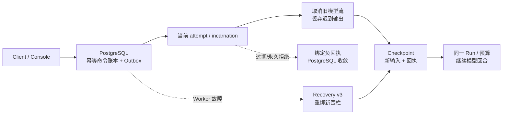

| 对标面 | Codex CLI | OpenClaw | 本平台当前实现 | 判断 |
|---|---|---|---|---|
| 输入与中断 | `send_input(interrupt=true)` 中断进程内 Turn，将富输入放入 Thread 队列 | steer 中止旧 generation，清理 follow-up 后持久化任务并重新 dispatch | REST/Console 将文本命令先写 PostgreSQL，再定向当前 attempt/incarnation；Worker 中止旧流且丢弃迟到输出 | Codex 交互类型更丰富；本平台的多副本、租户和崩溃边界更强 |
| 幂等与恢复 | rollout 可恢复 Thread，但消息投递依赖当前进程控制通道 | registry 保存 task/generation，具备 restart reconciliation 与丰富 delivery 状态 | Idempotency-Key、输入摘要和 current attempt 围栏；输入及回执先入 Checkpoint，Recovery v3 重绑未完成命令；过期/永久拒绝先发绑定 outcome，精确回执才关闭账本 | 同一公开 Run 内跨 Worker 不重复输入及负路径收敛已成立；OpenClaw 的 generation/restart 运维仍成熟 |
| Run 与预算语义 | 本地 Thread/Turn 语义自然连续 | replacement generation 成熟，但执行代际更复杂 | steer 保持同一 Run、Workspace、事件序列和累计预算，不隐藏创建 replacement Run | 更符合多租户 PaaS 审计和计费；缺少 generation 管理的成熟运维能力 |
| 副作用安全 | interrupt 与审批/sandbox 深度结合 | steer/kill 有限速、抑制投递和代际竞态处理 | approval、Tool、副代理交接未决时拒绝 steer；恢复中的已决定审批会重绑并重发给 replacement attempt | fail-closed 边界更强；OpenClaw 的限速、队列治理和 kill reconciliation 更成熟 |
| 身份续期 | 本地认证管理器主动刷新，失败恢复成熟 | Node 连接和 pending 调用以代际隔离 | 命令与签名 Token 共享显式 `issued_at`，真实恢复门禁要求观察续期且拒绝毫秒绑定漂移 | 修复了分布式协议竞态；生产轮换、主动撤销仍未完成 |

### 本阶段结论

- 已确认：参考源码锁定 Codex `ff352fa` 的 `send_input.rs`、`wait.rs`、`close_agent.rs` 和
  `agent/control.rs`；OpenClaw `58b4b943` 的 `subagent-control.ts`、`agent-steering-queue.ts` 与
  `subagent-registry.types.ts`。
- 已实现并验证：Java 控制面、PostgreSQL V24/V25、Rust Worker/Checkpoint/Recovery v3、负回执和 Console
  已形成同 Run steer 主链；Java 137 个测试通过（1 个可选 live 跳过），Console 24 个 Vitest、类型、
  Lint、构建和三视口 E2E 通过，Rust 全工作区测试、格式和 Clippy 通过；新增负回执用例另以真实临时 NATS 执行。
- 已确认：完整原生恢复主链经历 Provider 故障转移、Worker replacement、工作负载身份续期、浏览器审批、
  Tool 单次执行和 13 个连续 SSE 事件，RSS 为 **677040 KiB（661.2 MiB）**；身份时间绑定错误现在是
  强制失败条件，不再依赖偶然同毫秒。
- 已确认：真实 Chrome 中途 steer 产生两次 Provider 请求，首流确实取消，第二次上下文只有一次新输入；
  事件以 `run.steer.applied` 为边界并以 `run.succeeded` 终止，RSS 为 **399504 KiB（390.1 MiB）**。
  `AGENT_RUNTIME_RUN_INPUT='…' make dev-run` 也已从空状态完成独立真实主链并完整清理。
- 相比 Codex，本平台的 Tenant/Application 幂等账本、attempt/incarnation 围栏、Checkpoint-first 回执和
  同 Run 预算连续性更适合分布式 PaaS；Codex 的富输入、交互式 wait/send/close、成熟 rollout 与压缩仍领先。
- 相比 OpenClaw，本平台避免用 replacement Run 分裂审计和预算谱系，并以数据库绑定负回执关闭拒绝路径；
  OpenClaw 的 steer 限速、队列合并、generation 生命周期、restart reconciliation、附件与投递退避仍领先。
  当前私有 Beta 总体约 **96%**，下一步优先补 wait/message/close、steer 队列治理与单调时钟预算仲裁。

## 上一阶段：Checkpoint 优先的子代理结果回送与取消传播

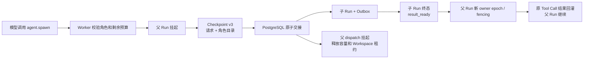

| 对标面 | Codex CLI | OpenClaw | 本平台当前实现 | 判断 |
|---|---|---|---|---|
| 准入与完成权威 | 进程内预留 spawn/residency slot，创建持久 Thread/边；协作 Tool 可直接查询和等待子 Agent 状态 | spawn pipeline 执行 initialize→dispatch→register；registry 另存 execution/completion/delivery/requester-wake/kill reconciliation | 父检查点落地后事务创建子 Run；子终态事务形成受限结果；V23 保存 result_ready→delivery attempt→delivered 全链 | 多副本原子性、租户隔离和崩溃顺序更强；Codex 的交互 Tool 与 OpenClaw 的投递状态细度仍领先 |
| 深度、并发与权限 | depth guard、角色配置和继承环境已进入真实执行 | 全局、每父、collector/swarm 容量和目标授权较完整 | 深度最多 3、每父最多 8 个活动子任务；角色 scope 必须是父权限子集，数据库事务避免并发超卖 | 多租户权限边界更强；可配置容量、模型覆盖与上下文策略落后两者 |
| 预算 | 线程 Usage 可记录和展示，但 spawn slot 不做租户级持久 Token/费用预留 | registry/collector 记录 Usage，超时与完成投递成熟；未形成租户级数据库预算事务 | 准入保守预留 Token/费用/时长；Worker 累计实际 Token/费用，下一回合只获得剩余额度 | 分布式预算边界领先；父自身实际用量尚未回写准入余额，时长执行门禁仍缺 |
| 故障与重投顺序 | 创建并持久化 Thread 后发送输入；V2 可恢复身份、边和 resident session | dispatch-before-register 依赖补偿；完成投递有重试、暂停、丢弃、请求者唤醒及 restart reconciliation | 正向先 Checkpoint 后子 Run；反向先持久子终态，再创建父新围栏 attempt；Worker 先发布 restored/checkpoint，再回灌结果并 checkpoint；delivery attempt 防重复调度 | 比两者更适合跨 Worker 单写 Workspace；OpenClaw 的退避、过期和压力丢弃治理仍明显更成熟 |
| 取消 | 父/子 Thread 有 close、interrupt 与协作状态管理，适合进程内图 | kill reconciliation、suppress delivery 和 superseded generation 能处理复杂竞态 | 父取消递归锁定未终态子树；已派发 Run 定向当前 attempt/incarnation，挂起父允许该 attempt 精确确认终态；未派发 Run 原子终止，调用账本封为 cancelled | 多租户树级持久传播和挂起终态竞态已成立；超时仲裁仍落后 OpenClaw |
| Workspace | 子 Agent 继承本地 sandbox/approval 上下文，适合单用户 Workspace | 每 Agent Workspace 和 Session 生命周期成熟 | 父挂起后释放 fenced 写租约，子 Run 才能取得同一 Workspace；尚无只读快照，不能安全并行父子写入 | 串行交接守住单写者；并行只读/分支执行仍落后 |

### 本阶段结论

- 已确认：参考源码锁定 Codex `ff352fa` 的 multi-agent spawn handler、`agent/control/spawn.rs` 与
  V2 持久 Agent 恢复；OpenClaw `58b4b943` 的 `spawn-pipeline.ts`、`subagent-spawn-request.ts`、
  registry 状态与完成投递路径。
- 已实现并验证：除正向挂起交接外，V23 已持久化子终态、受限结果、摘要、投递 attempt 与回执；恢复
  命令 v2 在新 owner epoch/fencing 下把结果回灌原 Tool Call；父取消递归覆盖活动子树，精确重投不会
  二次恢复。Java 123 个测试通过（1 个可选 live 跳过）；Rust 全工作区测试、格式与 Clippy 通过。
- 相比 Codex，本平台新增其本地 Thread 不需要的租户级事务准入、预算预留、跨 Worker Checkpoint、
  结果摘要和 Workspace 正反向 owner epoch 交接；Codex 的 context fork、角色模型覆盖、
  wait/send/resume/close 已可用，交互协作能力仍领先。
- 相比 OpenClaw，本平台避免 dispatch-before-register 的补偿窗口，并把正反向 Workspace 租约、结果
  投递和树取消放入数据库权威状态；OpenClaw 的投递退避/过期/压力治理、restart reconciliation、
  timeout race、announce、kill generation 仍明显领先。
- 当时私有 Beta 总体约 **94%**，Mac 原生开发里程碑为 **100%**。下一步是 wait/message/steer/close、
  超时仲裁、只读 Workspace 视图，以及把父 Run 自身实际用量计入可委派余额；在此之前不宣称与两者
  等量的完整子代理生命周期。

## 上一阶段：签名 SkillVersion 与可信 Tool 动态激活

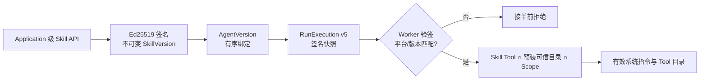

| 对标面 | Codex CLI | OpenClaw | 本平台当前实现 | 判断 |
|---|---|---|---|---|
| 来源权限 | `SkillSourceKind`/`SkillAuthority` 区分 Host、Executor、Orchestrator 与 Custom；资源 ID 做根目录约束和有界读取 | 本地 Skill 根目录加载，按 workspace/managed/bundled 来源合并 | SkillVersion 是 Tenant/Application 下的 PostgreSQL 权威资源，AgentVersion 只能绑定同 Application 的不可变版本 | 多租户引用边界更强；Codex 的多来源环境抽象仍更通用 |
| 完整性 | 运行时依赖可信 Skill Provider 与目录边界，擅长按来源注入 | 对 Skill 树做 digest，拒绝 symlink/hardlink，并有静态安全扫描 | canonical artifact 做 SHA-256 后由独立 Ed25519 密钥签名；Scheduler 首次与恢复均下发同一快照，Worker 重算摘要并验签 | 已覆盖分布式防篡改；树制品扫描仍落后 OpenClaw |
| 激活与授权 | Skill 可显式/隐式注入，但 Tool 最终仍走 Codex 审批和 sandbox policy | Session snapshot/fingerprint 控制刷新，Skill 命令仍走 Tool policy pipeline | Skill 只贡献指令与 Tool 名称；最终能力是声明、预装可信目录和 delegated scope 的交集，未知 Tool fail-closed | 多租户“Skill 不扩权”边界明确；动态 Tool 种类远少于两者 |
| 恢复 | rollout 保存会话历史和配置，恢复/分叉成熟 | Session Skill snapshot 有版本、指纹和刷新机制 | Checkpoint 绑定合并后的有效指令摘要与有效 Tool Catalog 摘要；新 Worker 必须重新验签并得到相同结果 | 跨 Worker 防漂移更强；历史压缩/分叉仍落后 Codex |
| 节点/制品 | Executor/Orchestrator Provider 可从受控环境发现和读取 | `node://` Skill 读取有数量、字节、名称和描述上限 | 本地只激活预装可信二进制；生产 OCI、SBOM、扫描与节点分发尚未实现 | 当前安全边界正确，但云边制品生态明显落后 OpenClaw |

### 本阶段结论

- 已确认：参考源码为 Codex `ff352fa` 的 `codex-rs/skills`、`codex-rs/ext/skills`，以及 OpenClaw
  `58b4b943` 的 `skills/loading`、`runtime/session-snapshot`、`security/scanner` 与 Node Skill 读取路径。
- 已确认：Java 110 个测试通过（1 个可选 live 跳过）；Rust 全工作区测试、Clippy 和格式门禁通过；
  Console 20 个 Vitest、三视口 Chrome E2E、构建与生产依赖审计通过。
- 已确认：真实原生主链通过 API 发布签名 SkillVersion，模型精确收到合并指令且只见声明 Tool；两次
  429 安全切换、Worker 强杀恢复、浏览器审批、Tool 单次执行和 13 个 SSE 事件均通过，RSS 为
  **312032 KiB（304.7 MiB）**，结束后临时进程、端口和目录清零。
- 相比 Codex，本平台新增 Application/RLS、不可变 AgentVersion 绑定、跨 Worker 签名快照和恢复围栏；
  Codex 的 Skill 来源生态、隐式/显式调用、完整 Tool 集与 rollout/compaction 仍明显领先。
- 相比 OpenClaw，本平台不依赖可变单机目录，签名版本和权限求交更适合多租户 PaaS；OpenClaw 的
  树摘要、静态扫描、真实 Node Skill 分发与跨平台运维仍明显领先。
- 当前私有 Beta 总体约 **90%**，Mac 原生开发里程碑仍为 **100%**。下一阶段是子代理身份、预算继承
  与并发/深度上限；生产 OCI/SBOM/扫描保留在 Skill 制品治理阶段。

## 上一阶段：Provider Registry、租户 BYOK 与安全故障转移

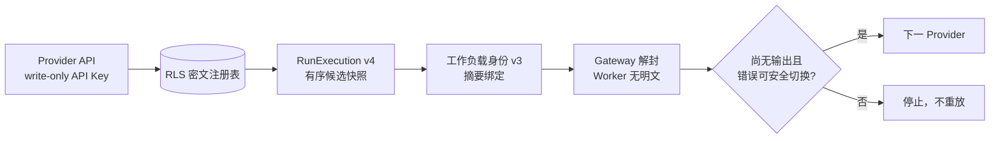

| 对标面 | Codex CLI | OpenClaw | 本平台当前实现 | 判断 |
|---|---|---|---|---|
| Provider 注册 | 支持自定义 Provider、环境变量密钥与命令型 bearer token；一个 Turn 解析一个有效 Provider | Provider/model/Auth Profile 注册与按 Agent 绑定成熟 | Provider 是 Tenant/Application 下的 PostgreSQL 权威资源，三类协议统一注册，跨 Application 引用失败 | 多租户权威边界领先；认证类型和生态覆盖仍落后两者 |
| 凭证边界 | 本机进程直接取得用户凭证，适合单用户 CLI | 个人 Gateway 解析并向 Provider 出口凭证 | Java 仅用 Gateway 公钥封装，数据库只存密文；Worker 只转发；Gateway RSA-3072/AES-GCM 按 tenant/provider AAD 解封 | 更适合 PaaS；生产 Vault/KMS、轮换与吊销尚缺 |
| 候选与切换 | 请求/流重试和 WebSocket→HTTPS 回退成熟，但不是租户跨 Provider 候选链 | 有序 fallback、错误分类、Auth Profile cooldown/probe、提交后停止切换较完整 | 最多 8 个有序候选；只有尚无事件且 429/超时/不可用可切换，认证/账单/协议/上下文/能力错误和部分输出后禁止重放 | 核心副作用安全已对齐；健康冷却与探针落后 OpenClaw |
| 防篡改 | 有效配置由本机 Thread 持有，不面对不可信远端 Worker | Gateway 直接拥有 Agent/Provider 配置 | Scheduler 对 canonical 快照做 SHA-256，签入工作负载身份；Gateway 重算，Worker 替换端点、模型或密文都会被拒绝 | 分布式多租户信任边界领先参考项目 |
| 本地开发 | 原生单进程，直接读取凭证 | Node Gateway 原生读取配置和 Secret | 一键生成仅本地 RSA-3072 密钥；外网走系统 10808、回环直连；无 Docker；clean 删除密钥和构建状态 | 资源仍多于 Codex，但满足零容器和可清理目标 |

### 本阶段结论

- 已确认：Java 106 个测试通过（1 个可选 live 跳过）；Provider API 不返回密钥或密文，数据库不含
  明文，RLS/复合外键阻止跨 Application 绑定；Scheduler 发布摘要绑定的 v4 快照。
- 已确认：Rust Gateway 真实 HTTP 测试证明租户密钥解封并作为 Bearer 使用，跨租户密文重放失败；429
  在任何输出前切换，认证错误或部分输出后超时均不切换。Worker 精确转发快照，篡改摘要被拒绝。
- 已确认：Console 可编辑最多 8 个有序候选并在创建后清除 API Key；真实原生 Run 动态创建
  两个 Provider，首选两次 429 均安全切换，同一主链完成 Worker 强杀恢复、真实浏览器审批和 Tool 单次执行。
- 相比 Codex，本平台增加多租户 Provider 权威资源、Worker 零明文和签名快照；Codex 的命令型 Token、
  OAuth、Responses 重试与传输恢复仍成熟得多。
- 相比 OpenClaw，本平台的数据库/RLS、不可变执行快照和工作负载身份更适合 PaaS；OpenClaw 的 Auth
  Profile 轮转、cooldown/probe、Provider 兼容矩阵与真实运维经验仍领先。
- 当时私有 Beta 总体约 **87%**，原生开发里程碑为 **100%**。Provider 纵向闭环已完成，最新真实主链
  RSS 为 **349408 KiB（341.2 MiB）**；未使用 Docker、虚拟机或 Kubernetes。下一阶段进入 Skill 注册、签名制品与动态装载。

## 上一阶段：完整资源配置与不可变执行快照

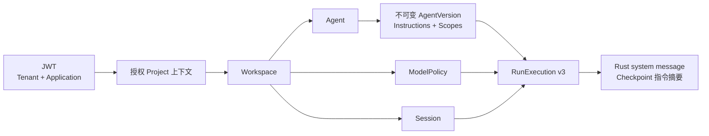

| 对标面 | Codex CLI | OpenClaw | 本平台当前实现 | 判断 |
|---|---|---|---|---|
| 配置入口 | Thread start 一次提交 model/provider/cwd/approval/sandbox/instructions/tools 等完整有效配置 | `agents add` 可交互创建 Agent、Workspace、模型、认证和路由绑定 | Console 从 JWT 授权上下文依次创建 Workspace、Agent/Version、1–8 个 Provider、ModelPolicy 和 Session，服务端生成 ID，完成后立即成为 Run target | 已消除预置 ID；交互深度和配置覆盖仍落后两者 |
| 配置权威性 | 分层配置合并后形成 ThreadConfig，适合本机单用户 | 配置文件是主要权威源，按 Agent 解析 workspace/model/tools/skills/subagents | PostgreSQL 是权威源；每张表含 tenant，父链校验 Application，RLS 与复合外键二次隔离 | 多租户边界更强；资源查询、变更和生命周期仍不完整 |
| 版本与快照 | Thread 启动返回有效配置，rollout 保存会话历史；并非面向租户的 Agent 版本资源 | Agent 配置可变，运行时按当前配置解析 | AgentVersion 不可变；instructions/scopes 进入 dispatch v3，Worker 生成 system message并把摘要写入 Checkpoint | 可审计重放更适合 PaaS；完整 effective config 仍不如 Codex |
| Workspace | cwd/workspace roots 与 sandbox policy 一起进入线程 | 创建/解析每 Agent Workspace，跨平台本地运行成熟 | 新 Workspace 在首次执行时按 tenant/workspace UUID 懒创建，拒绝符号链接边界并设 0700 | 租户路径围栏更严；Git 初始化、模板和用户引导落后 OpenClaw |
| 模型策略 | Provider/model 选择与能力直接进入 ThreadConfig | Provider Registry、fallback candidates 和模型认证配置成熟 | ModelPolicy 是独立资源，支持 `single_provider` 与最多 8 个候选的 `ordered_failover`，并进入摘要绑定快照 | 动态 BYOK 与安全切换已闭环；能力协商、健康冷却与探针仍落后 OpenClaw |
| 失败处理 | 配置错误在启动前尽量校验并提供具体诊断 | guided/non-interactive 命令有较完整校验和已有配置处理 | UI 显示 `5 + Provider 数量` 的动态进度；失败时明确保留已创建资源，不做危险回滚 | 不会误删权威资源，但尚缺幂等续建和清理入口 |

### 本阶段结论

- 已确认：真实 API 动态创建 Workspace、Agent、AgentVersion、ModelPolicy、Session；Scheduler 发布 v3
  执行快照；回环 Provider 精确验证 Agent 指令以单一 system message 到达。强杀 Worker 后从绑定相同
  指令摘要的 Checkpoint 恢复，真实浏览器审批后 Run 成功。
- 相比 Codex，本平台增加了其本地 Thread 不需要的 Tenant/Application、RLS、不可变 AgentVersion、
  owner epoch 和跨 Worker 快照；Codex 的 effective config、配置分层、动态工具和线程生命周期仍明显领先。
- 相比 OpenClaw，本平台把 Agent 配置提升为应用级权威资源与不可变版本，避免运行中读取可变配置；
  OpenClaw 的 `agents add` 引导、Provider/Auth/Binding、模型 fallback、Skill 和 Subagent 配置仍明显领先。
- 当前私有 Beta 总体约 **83%**，原生开发里程碑仍为 **100%**。最新真实主链 RSS 为
  **289024 KiB（282.3 MiB）**；整个阶段未使用 Docker、虚拟机或 Kubernetes。
- 该阶段约定的 Provider Registry、租户 BYOK、安全故障转移和动态 Console 已由上方当前阶段闭环；
  健康冷却与探针作为 Provider 运维增强保留，下一阶段接 Skill 注册与子代理身份/预算继承。

## 上一阶段：审批策略快照与会话级授权

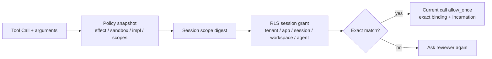

| 对标面 | Codex CLI | OpenClaw | 本平台当前实现 | 判断 |
|---|---|---|---|---|
| 会话授权 | `ApprovedForSession` 将工具专用可序列化 key 保存在 Session 内存，全部 key 命中时免审 | `allow-always` 形成持久命令规则，不是纯 Session cache | `allow_session` 持久化到 PostgreSQL，但只在原 Session active 时匹配 | 跨 Worker 恢复和审计更适合 PaaS；Codex 的工具专用 key 更成熟 |
| 授权绑定 | 不同 Tool 自行定义审批 key；ExecPolicy/网络规则可独立修订 | 精确绑定 argv、cwd、Agent、Session、env hash、可变文件摘要 | 绑定 Tenant/Application、Session、Workspace、AgentVersion、完整参数、Tool 实现/Scope/沙箱策略 | 通用多租户边界更严；命令实体/环境绑定仍落后 OpenClaw |
| 策略漂移 | Session key 由当前 Tool Runtime 生成；策略修订有专门 decision | 延迟审批携带规范化 policy snapshot，执行前确认当前策略未收紧 | Kernel 生成不可变策略快照；Java 校验请求/快照/摘要并以 V17 权威保存 | 已吸收 OpenClaw fail-closed 原则；还没有持久策略资源与撤销 API |
| 副作用 | 工具按自身语义决定是否提供 Session approval | 对 shell carrier、解释器、wrapper 和可变脚本有大量 allowlist 防绕过 | 仅 `pure/idempotent` 可会话授权，`non_idempotent/unknown` 强制再次审批 | PaaS 副作用边界明确；复杂命令分析能力远少于 OpenClaw |
| 决定下发 | Session 内存直接返回 ApprovedForSession | Gateway/Node 执行路径消费审批与 allowlist | Grant 只在控制面匹配；Worker 永远收到当前调用的 `allow_once`、版本、摘要、attempt 与 incarnation | 避免 Worker 持有可扩张白名单，分布式 fencing 更强 |
| 产品入口 | TUI/SDK 提供本次、Session、策略修订等决定 | 多渠道 `/approve` 支持 once/always/deny | REST/OpenAPI/Console 只对服务端声明 eligible 的项目显示“本会话相同请求” | 基础旅程对齐；授权查询、撤销、说明细度仍落后 |

### 本阶段结论

- 已确认：Rust Kernel 为审批产生策略摘要与不含 call ID 的 Session scope；Java V17 在 RLS 下保存精确
  Grant，重复参数/策略自动转成当前调用的 `allow_once`，参数变化重新审批，未知副作用拒绝 Session grant；
  98 个 Java 测试、14 个 Vue 测试、Rust 全工作区及 17 个原生门禁通过。
- 相比 Codex，本平台已补齐其成熟的 Session approval 基本体验，并增加跨 Worker、Tenant/Application、
  Workspace、AgentVersion 和审计边界；工具专用语义 key、自动 Reviewer、ExecPolicy/网络修订仍落后。
- 相比 OpenClaw，本平台吸收了 policy snapshot 和延迟授权 fail-closed 思想，但没有复制宽生命周期的
  `allow-always`；OpenClaw 对 argv/cwd/env、解释器和 wrapper 绕过的防护矩阵仍明显领先。
- 该阶段结束时私有 Beta 总体约 **81%**，原生开发里程碑为 **100%**；未使用 Docker 或常驻容器。
- 该阶段约定的“完整资源配置与启动旅程”已由上方当前阶段完成。

## 上一阶段：多协议模型适配

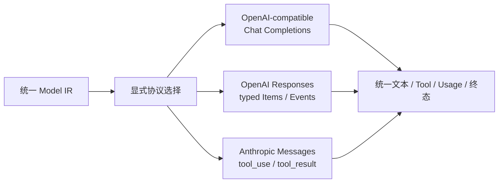

| 对标面 | Codex CLI | OpenClaw | 本平台当前实现 | 判断 |
|---|---|---|---|---|
| 协议边界 | 当前核心直接围绕 Responses typed Items/Event，完整保留 reasoning、function call 和终止语义 | Provider Registry 覆盖多家协议，原生 Anthropic 兼容层很深 | 三种协议显式选择并转换到统一 IR；不按 URL 猜测、不用 Chat chunk 模拟 Responses | 通用内核方向优于直接绑定单一协议；Provider 动态注册仍落后 OpenClaw |
| 流完成 | `response.completed/failed/incomplete` 与 EOF 严格区分 | Anthropic 流要求 `message_stop`，并处理多类 block/delta | Responses 缺 `response.completed`、Anthropic 缺 `message_stop` 均失败；Chat 缺 finish reason 失败 | 已对齐两个项目最关键的“不把半截流当成功”原则 |
| Tool 历史 | typed `function_call/function_call_output` 与原始 call ID | `tool_use/tool_result` 配对、修复和 Provider 特定 ID 规范成熟 | 三类 Adapter 都保留 call ID、请求历史和分片 JSON；统一输出 ToolCall | 主链已对齐；孤儿修复、跨 Provider ID 正规化仍落后 OpenClaw |
| 能力差异 | Responses reasoning、结构化输出、图片及丰富事件覆盖成熟 | Anthropic thinking/cache/refusal、OAuth/Foundry、图片预算和模型差异覆盖成熟 | Responses 已映射 reasoning 与 `text.format`；Anthropic 不可忠实表达的结构化输出/图片 fail-closed | 没有伪造兼容；能力档案与模型特定兼容仍是明显缺口 |
| 多租户出口 | 本地用户认证和 OpenAI 凭证生命周期成熟，但非租户 Provider 路由 | 凭证解析与 Provider 调用边界成熟，主要面向个人 Gateway | Worker 不持 Provider 密钥；mTLS + 短期工作负载身份到 Gateway；错误正文脱敏 | 信任边界更适合 PaaS；BYOK、Vault 按请求解封和出站策略尚未完成 |

### 本阶段结论

- 已确认：OpenAI Responses 与 Anthropic Messages 使用各自原生请求/流契约，5 个新增回环 HTTP/SSE
  契约测试及 Model Gateway 全部 16 个测试通过；原生 Supervisor 能持久化协议选择并兼容旧配置。
- 相比 Codex，本平台已吸收 typed Responses、严格终止和原始 Tool Call ID 语义，同时保留其不具备的
  多租户 Gateway/Worker 凭证隔离；Codex 的 reasoning items、错误细分、重试和 Responses 全事件覆盖仍领先。
- 相比 OpenClaw，本平台已有真正的 Anthropic Messages 核心协议，不再只依赖 OpenAI-compatible；
  OpenClaw 的 Provider Registry、thinking/cache/refusal、认证变体、图片预算和兼容测试矩阵仍明显领先。
- 当前私有 Beta 总体约 **80%**，原生开发里程碑仍为 **100%**。本轮未使用 Docker，也未启动常驻服务。
- 下一阶段固定为：审批策略快照与会话级授权 → 完整资源配置与启动旅程；Provider Registry、BYOK 与
  故障转移在策略资源可配置后接入，避免再次写成进程级硬编码。

## 更早阶段：零容器 macOS 原生开发基线

```mermaid
flowchart LR
    DEV["make dev 目标入口"] --> JAVA["Java 21 原生进程"]
    DEV --> RUST["Rust Gateway / Worker 原生进程"]
    DEV --> VUE["Vue / Node 原生进程"]
    DEV --> PG["项目级 PostgreSQL"]
    DEV --> NATS["项目级 NATS JetStream"]
    RUST --> TOOL["摘要绑定的可信只读 Tool"]
    RUST --> FS["内容寻址文件 Checkpoint"]
    CLEAN["stop / clean"] --> STATE["仅删除带标记的 .local 与构建产物"]
```

| 对标面 | Codex CLI | OpenClaw | 本平台当前实现 | 判断 |
|---|---|---|---|---|
| 本地启动 | 原生 Rust 单程序，本地 Thread/rollout 低摩擦 | Node Gateway/Node Host 原生运行，CLI 生命周期与跨平台服务安装成熟 | `make dev-run` 自动引导 NATS、构建并监督 Java、三个常驻 Rust 进程、Vue、PostgreSQL 与 TLS NATS；本地 API 独立使用 18080 | 一条命令、端口覆盖和失败回滚成立；仍没有 Codex 的单程序简洁度，也未完成外部真实模型验收 |
| 本地持久化 | rollout 文件恢复、分叉和兼容成熟 | transcript/SQLite replay 与修复成熟 | PostgreSQL 保留 PaaS 语义；小 Checkpoint 内联，大对象进入 tenant/run/digest 文件后端；强杀 Worker 已从 SAFE Checkpoint 恢复 | 多租户隔离与围栏更强；完整历史分叉、修复和用户可见恢复体验仍落后两者 |
| 进程清理 | Thread manager 并发有界 shutdown，未完成 Thread 保留供重试或检查 | restart/health 能区分服务、端口占用、陈旧 PID、版本及插件错误 | 每个应用与 NATS 使用独立 PID/PGID、stdout/stderr；反向有界停止，Worker 先 drain；未标记目录拒绝清理；真实 `dev-clean` 后逐 PID、端口和目录复核无残留 | 项目内清理目标已经证明；OpenClaw 的端口归属、陈旧 PID 与 blocker 诊断仍领先 |
| Tool | macOS sandbox、审批与 Shell Tool 成熟；调用绑定策略但面向本地单用户 | `system.run` 对解析后 argv、cwd、脚本操作数和审批快照执行前重验 | `workspace.read_text` 固定二进制摘要，无 Shell、清空环境、只读相对路径、64 KiB 上限、默认 ask；实现摘要进入模型目录、审批绑定和 Worker 执行器一致性校验 | 吸收两者的审批与漂移防护，并增加 delegated scope/租户 Ledger；能力和强隔离仍明显落后 Codex，本地边界也窄于 OpenClaw |
| 审批语义 | 命令、文件、MCP、附加权限与网络策略分别呈现；支持本次、会话、ExecPolicy/网络规则修订，并可路由给自动 Reviewer | `system.run` 精确绑定 argv、cwd、agent、session、env hash 与规范化策略快照，执行前 fail-closed 重验 | PostgreSQL 持久审批跨 Worker 重绑；tenant/application/Scope 隔离；版本冲突 409；Console 展示参数、副作用、沙箱与绑定摘要，只提供 allow-once/deny | 多租户持久恢复领先两者的本地边界；策略表达、命令可读性、自动审批和长期规则明显落后 |
| 资源 | 单 CLI 进程开销低 | Node Gateway 常驻并提供 event-loop health 与启动基准 | Tool/审批/强杀恢复完整运行时全部相关进程 RSS 实测 497.5 MiB；JetStream 上限 256 MiB 内存/1 GiB 磁盘 | 低于 4GB 约 8.2 倍；多进程结构仍比 Codex 复杂，但资源不是当前阻塞 |
| 本地集成测试 | 核心 Rust 测试直接复用原生运行语义 | Gateway/Node 测试复用 Node 进程与本地状态 | 106 个 Java 测试（1 个可选 live 项显式跳过）、Rust fmt/clippy、文件 Checkpoint、19 个原生门禁、真实 Chrome 强杀恢复 live 门禁和 Vue 三视口 E2E | 已消除容器测试与本地运行语义分叉；浏览器已直连真实后端完成恢复审批，尚缺外部真实模型 |

### 本阶段结论

- 已确认：默认本地命令图不包含 Docker/Compose/Kubernetes；Maven、Cargo、pnpm、Go、curl 以及外部
  Model Gateway 请求读取系统 10808，`localhost/127.0.0.1/::1/.local` 强制直连。NATS 和五个应用由
  独立原生进程组跨命令托管，不注册系统服务。
- 项目 CA、NATS 服务证书、Gateway/Worker mTLS 证书、Ed25519 工作负载身份和 bcrypt 角色凭证均可重复
  生成、验证并清理。Rust/Java live 测试证明 TLS 登录、错误密码拒绝、Worker 主题越权和管理越权均生效。
- 本地 Java 门禁最近一次为 106 个测试（1 个可选 live 项显式跳过），7 个原容器集成类使用独立原生数据库和真实安全 NATS，成功或失败均清理
  测试运行态；生产 NATS ACL 同步补上控制面消费所需的 JetStream ACK 最小权限。
- 五个应用和 NATS 已通过双 fork 进入独立进程组；本地 RSA JWT 每次启动刷新，Vue 只在开发服务器侧向
  回环 API 注入。独立 live 门禁在 `waiting_approval` 强杀 Worker，新 incarnation 从 sequence 5
  Checkpoint 恢复，owner epoch 1→2，产生 `run.restored`、`approval.rebound` 后只执行一次 Tool；13 个
  SSE 事件完整重放，Run 成功。真实 Chrome 已在恢复后展示不可变绑定、提交精确审批并看到 Run 完成；
  该证据仍不等于外部真实模型或完整资源配置产品旅程。
- 相比 Codex，本平台保留 PostgreSQL RLS、JetStream、delegated scope、实现摘要和跨 Worker fencing，
  并补齐浏览器审批收件箱；Codex 的会话放行、策略/网络修订、自动 Reviewer、丰富 Tool 与 macOS sandbox
  体验仍明显领先。
- 相比 OpenClaw，本平台吸收了执行前审批绑定 fail-closed 原则，并把事实放入多租户 Ledger；OpenClaw
  对 argv/cwd/agent/session/env/policy snapshot 的绑定更细，通用 `system.run`、Node 连接和跨平台诊断仍更成熟。
- 当时私有 Beta 总体约 **79%**，原生开发里程碑为 **100%**。真实 Tool/审批/恢复运行时 RSS 497.5 MiB；
  浏览器→真实控制面→恢复后 Worker 的审批闭环已完成，外部真实模型尚未验收。
- 当时下一阶段固定为：OpenAI Responses/Anthropic Adapter 兼容验收 → 审批策略快照与会话级授权设计 →
  完整资源配置与启动旅程。完成前不恢复 Kubernetes 扩展工作。

## 上一阶段：恢复指标、陈旧检测与告警规则

本节保留当时的阶段结论；其中关于继续扩展 Kubernetes 的旧顺序已被 ADR-0024 和上方当前阶段取代。

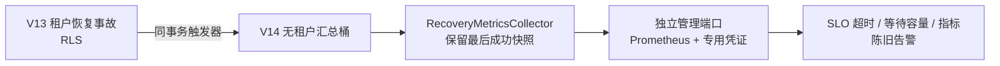

| 对标面 | Codex CLI | OpenClaw | 本平台当前实现 | 判断 |
|---|---|---|---|---|
| 指标体系 | `codex-otel` 支持 logs/traces/metrics，进程结果使用有界属性 | restart trace、event-loop health 和诊断事件覆盖 Gateway 生命周期 | Micrometer/Prometheus 发布恢复当前值、最老事故、刷新时间与错误数 | 集群 SLO 判定领先参考项目的本地边界；全链路 OTel 仍落后 Codex |
| 多租户边界 | 本地会话不需要 RLS 或跨租户聚合 | 单 Gateway/owner 模型不处理租户时序隔离 | V14 事务汇总不含 tenant/run/workspace，详细快照继续走 RLS | 更适合 PaaS；后续所有指标仍须执行标签基数门禁 |
| 采集故障 | OTel exporter/metric client 有明确错误与 shutdown | 最近健康与 restart trace 保留失效原因 | 刷新失败保留最后快照，独立暴露 last-success 和 error counter | 避免“采集失败=零事故”，语义对齐两者并增加可告警陈旧性 |
| 运维入口 | CLI/本地进程以 OTLP exporter 为主 | Gateway 诊断和健康面更成熟 | 9090 独立端口；健康匿名，Prometheus 使用专用 Basic Auth，不复用用户 JWT | 认证域清晰；管理端口 TLS、NetworkPolicy 与真实 Prometheus 联调尚缺 |
| 告警 | 不提供多 Worker 恢复 SLO 告警 | 有 trace/health 诊断，不是 Prometheus 多租户 SLO | 可选 PrometheusRule 覆盖 overdue、waiting capacity、metrics stale | 规则契约已落地；尚未证明告警路由、静默与值班闭环 |

### 本阶段结论

- 已确认：真实 Spring Boot 完整进程完成 V1–V14 迁移并在独立端口输出 Prometheus；匿名抓取被拒绝、专用凭证成功、健康探针匿名成功。V14 跨两个租户聚合且不输出租户标签，事故完成后计数同步下降。
- 相比 Codex，本平台已吸收其低基数指标和 exporter 故障可见性，并补上 RLS 下的集群恢复 SLO；Codex 的统一 OTel trace、模型/Tool 时延与进程资源指标覆盖仍明显领先。
- 相比 OpenClaw，本平台把 restart/heartbeat 的健康语义提升为 Prometheus 告警事实；OpenClaw 的 restart trace、event-loop diagnosis、真实 Node 长连接和跨平台运维仍更成熟。
- 本阶段没有授予 Scheduler `BYPASSRLS`，没有使用 `tenant_id` 时序标签，没有在采集失败时清零，也没有把离线 PrometheusRule 渲染说成生产告警闭环。当前 **67%** 包含真实 PostgreSQL、完整控制面启动、Prometheus 文本与规则契约；不包含真实 Prometheus/Alertmanager、管理端口集群隔离和 Kubernetes 节点级 15 分钟 SLO。
- 下一阶段固定为：部署控制面观测入口并执行真实 Kubernetes Pod/节点、PDB、NATS 集群和 Checkpoint Gateway 组合故障；通过后才评估 Worker HPA。

## 上一阶段：恢复事故台账与可重复故障证据

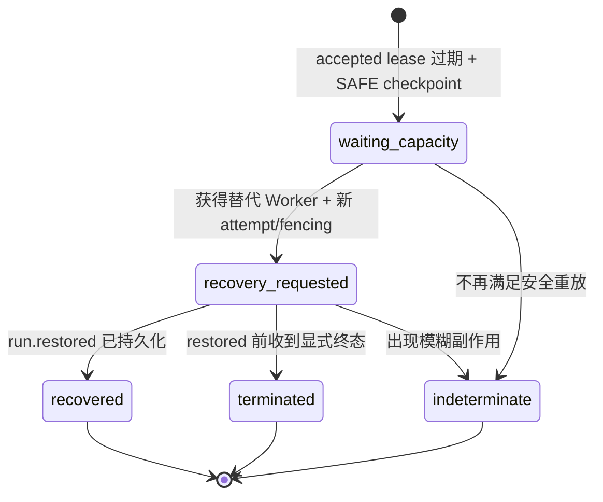

| 对标面 | Codex CLI | OpenClaw | 本平台当前实现 | 判断 |
|---|---|---|---|---|
| 恢复生命周期 | rollout 保存恢复边界；shutdown report 区分 completed、submit failed、timed out | restart context、drain blocker 和恢复 trace 可定位中断阶段 | PostgreSQL 事故状态绑定 tenant/run/failed attempt/recovery attempt，只有 `run.restored` 入库才完成 | 吸收两个项目的显式结果语义，并增加 PaaS 级多租户权威状态 |
| 无容量等待 | 本地线程没有跨 Worker 容量调度 | Node/Gateway 可报告连接与活动 blocker，但不是公平调度队列 | SAFE Checkpoint 无替代容量时进入 `waiting_capacity`，保留原始故障时钟 | 可审计性领先；自动扩容和容量预测尚未实现 |
| 健康时钟 | 主要使用本机进程时钟，不处理不可信远端节点 | Node 长连接有 stale transport/last seen 语义 | 调度和 SLO 使用控制面实际心跳接收时间，不信任 Worker 自报时间 | 更符合多租户云边威胁模型；设备时间校准仍可借鉴 OpenClaw |
| Broker 故障 | Provider/stream 重试成熟，但没有 JetStream Outbox | Gateway/Node 连接重连与消息生命周期成熟 | 真实 NATS pause 使发布 fail-closed；恢复后同消息 ID 安全重试 | 已证明消息不重复；三节点 JetStream 故障和积压压测仍缺 |
| Checkpoint 依赖故障 | rollout 本地持久化与重建成熟 | replay 修复/拒绝不完整历史成熟 | Store 首次 `Unavailable` 时 NAK，真实 JetStream 延迟重投后恢复并产生 `run.restored` | 临时故障语义已闭环；真实 Gateway/S3 实例丢失仍未验收 |
| 恢复 SLO | 不提供集群恢复 SLO | 有运维 trace，但不是多租户数据库 SLO | 按租户快照输出 open/overdue/waiting/recovery requested/oldest age；750ms 缩放租约在 2 秒预算内创建恢复 attempt | 具备机器判定基础，但不能把缩放测试当作生产 15 分钟证明 |

### 本阶段结论

- 已确认：此前静默的“有 Checkpoint、无替代容量”已成为持久 `waiting_capacity` 事故；恢复链不会因换 attempt 重置故障时钟，只有 `run.restored` 才算恢复成功，提前出现的显式终态会以未恢复结果关闭事故。
- 相比 Codex，本平台把其 shutdown/rollout 的明确边界扩展成跨 Worker、RLS、复合外键和 Workspace fencing 的恢复账本；Codex 的完整历史重建、压缩、分叉和任意 turn 恢复仍明显领先。
- 相比 OpenClaw，本平台把 restart blocker 和恢复上下文提升为可查询 SLO 事实，并增加 Broker/Checkpoint 依赖的重投证据；OpenClaw 的真实 Node 重连、设备能力、跨平台长期运行和运维 trace 仍更成熟。
- 本阶段没有信任 Worker 时钟、没有把发出恢复命令当成恢复成功、没有在 Gateway 暂时不可用时终止可安全重试的恢复，也没有开启尚未验收的 Worker HPA。当前 **65%** 包含数据库事故台账、缩放租约计时、真实 NATS pause/resume 和真实 JetStream 重投；不包含 Kubernetes 节点级 15 分钟 SLO。
- 下一阶段固定为：把事故快照接入运维指标与告警，再在真实 Kubernetes 执行 Pod/节点、PDB、NATS 集群和 Checkpoint Gateway 组合故障；通过后才评估 Worker HPA。

## 上一阶段：Worker 单向 Draining 与有界安全下线

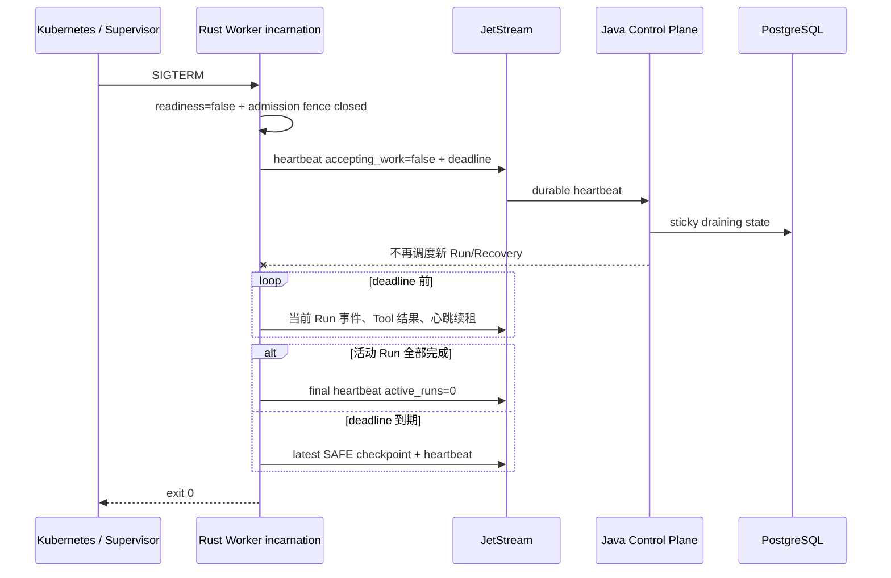

| 对标面 | Codex CLI | OpenClaw | 本平台当前实现 | 判断 |
|---|---|---|---|---|
| 关闭入口 | 本地线程关闭，不存在集群 Scheduler 准入 | restart signal 同步提升为单向 drain fence，立即拒绝新 enqueue | 信号处理器原子撤销 readiness 并关闭共享 admission fence；Scheduler/Recovery 查询同时过滤 | 对齐 OpenClaw 的关键顺序，并增加数据库级多租户调度证据 |
| 活动任务排空 | `shutdown_all_threads_bounded` 并发等待，每条线程有完成/提交失败/超时结果 | 等待 active task、embedded run 和 root transaction，周期报告 blocker | 继续当前 attempt 的身份、取消、审批、模型和 Tool 状态推进；心跳保持 lease | Codex/OpenClaw 的 blocker 可观测性更成熟；本平台的 Workspace fencing 更严格 |
| 超时边界 | `shutdown_and_wait` 有界；中断写入持久历史 marker | drain 超时标记 restart recovery context，再 abort active runs | 90 秒到期为所有非终态 attempt 发布最新 Checkpoint；控制面按 SAFE/indeterminate 判定恢复 | 没有盲目 abort 非幂等副作用；任意进程内快照能力仍落后 Codex |
| 消息取消安全 | 单进程 channel/Task 生命周期成熟 | 同步 fence 避免新任务跨 restart 窗口进入 | 不取消可能已推进 Processor 的 JetStream Future；用原子 fence 让竞态新命令 NAK | 这是本阶段主动修正的关键点，优于粗暴 Future cancellation |
| 单向状态 | Thread shutdown 后从 manager 移除，未完成者保留 | restart draining 是进程级单向状态 | incarnation 内存与 PostgreSQL 都禁止 false→true；只有新 incarnation 可重新准入 | 更适合至少一次心跳与不可信 Worker 的控制面防御 |
| Kubernetes 终止 | 不提供集群部署模型 | 具备 supervisor/restart handoff，但主要是 Gateway 产品边界 | drain 90 秒、Pod grace 120 秒且清单门禁强制至少 10 秒 teardown 余量 | 代码与离线部署约束已闭环；真实 eviction/PDB/HPA 演练仍未完成 |

### 本阶段结论

- 已确认：真实 SIGTERM 测试证明 readiness 与 admission fence 在主循环 teardown 前关闭；真实 JetStream 测试证明 draining heartbeat 可持久化且竞态新任务被 NAK；PostgreSQL 测试证明相同 incarnation 不能用更新心跳重新开门。
- 相比 Codex，本平台吸收其有界 shutdown 与持久边界思想，并补上其本地 Runtime 不需要的 Scheduler 过滤、Workspace lease、incarnation 和跨 Worker Checkpoint；Codex 对线程 blocker、任意 turn 中断历史和资源清理的成熟度仍领先。
- 相比 OpenClaw，本平台已对齐“先关准入、再排空、超时恢复”的核心顺序，并把 drain 状态做成权威数据库事实；OpenClaw 的 restart trace、活动 blocker 诊断、session recovery context 和真实跨平台长期运维仍更成熟。
- 本阶段没有用 `capacity=0` 伪装生命周期、没有取消非 cancellation-safe 的消息 Future、没有提前释放 Workspace lease，也没有把非幂等 started Tool 当作 SAFE。当前 **63%** 只计代码、真实 SIGTERM/JetStream/PostgreSQL 与离线 Kubernetes 门禁，不把未执行的云集群 eviction 说成完成。
- 下一阶段固定为：NATS/Gateway/Kubernetes Pod 组合故障注入与 15 分钟恢复计时；通过后再评估 Worker HPA，然后进入动态 Skill/OCI 装载。

## 上一阶段：身份续期、有限认证恢复与 gRPC mTLS

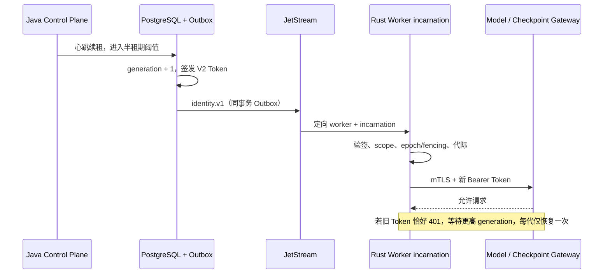

| 对标面 | Codex CLI | OpenClaw | 本平台当前实现 | 判断 |
|---|---|---|---|---|
| 主动刷新 | `AuthManager` 在过期窗口前主动刷新；managed/external token 分路径处理 | 节点长连接主要依赖重新配对/连接与凭证状态 | 心跳半租期阈值触发，PostgreSQL 原子递增 generation 并写 Outbox | 已对齐 Codex 的主动刷新原则；独立定时器、抖动和吊销仍缺 |
| 401 恢复 | `UnauthorizedRecovery` 有限状态机，reload/refresh 各有明确上限 | 连接身份变化会拒绝旧连接，不让旧状态继续运行 | `Unauthenticated` 不终止 Run，等待更高 generation；精确重复不触发第二次恢复 | 有界恢复已对齐；Codex 的多认证源 reload 分支仍更成熟 |
| 进程代际 | 本地客户端不需要跨 Broker 的 Worker 进程寻址 | `pairingGeneration` 围栏 pending work/action，配对变化使旧连接失效 | renewal 同时绑定 worker incarnation、attempt、owner epoch 与 fencing，旧代际永久拒绝 | 将 OpenClaw 的连接代际提升为数据库与消息层持久证据，更适合 PaaS |
| 传输身份 | 本地进程和 HTTPS Provider 链路为主 | Gateway/Node 有设备身份、签名与连接认证 | Model/Checkpoint gRPC 强制双向 TLS；Token 另做每 Run 授权 | 服务身份与工作负载授权分层明确；节点证明和证书自动轮换落后 OpenClaw |
| 长 Run | 本地会话认证恢复成熟，rollout 可长期运行 | Node/Gateway 重连和生命周期成熟 | 五分钟 Token 可连续轮换，24 小时 Run 不再被静态 Token 卡死 | 身份层已可支撑；运行 SLO、Gateway HA 和压测尚未证明 |
| 机密载荷 | 不存在多租户 Outbox Token 分发 | 设备连接协议减少通用 Broker 暴露 | 该阶段短期 Token 存在裸 JetStream；后续 ADR-0020 已补 TLS、bcrypt 与角色 ACL | 该阶段缺口已关闭，证书热轮换仍未完成 |

### 本阶段结论

- 已确认：generation 续期从 PostgreSQL/Outbox 到真实 JetStream、Worker 原子换证和 401 后恢复已闭环；旧实例、旧 epoch/fencing、错误签名、缺少能力和旧代际均 fail-closed。
- 相比 Codex，本平台已保留主动刷新与有限 401 恢复，并增加其本地模型不需要的租户、Worker incarnation、Workspace fencing 和持久 Outbox 证据；多认证源 reload 与成熟会话历史仍落后。
- 相比 OpenClaw，本平台吸收 pairing generation 的核心隔离思想，并落实到数据库、Broker 与短期授权；OpenClaw 的节点注册/吊销、设备证明、长连接背压和跨平台运行仍明显领先。
- 本阶段没有通过延长 Token、Worker 持签名私钥、401 无限重试或只做 TLS 取代细粒度授权来规避问题。该阶段按当时证据计为 **57%**。
- 该阶段约定的 Kubernetes Deployment、HPA、PDB、SecretProviderClass、健康探针和 NATS 安全已由 ADR-0020 完成；真实集群故障注入仍是后续门禁。

## 上一阶段：Checkpoint Gateway 与工作负载身份 V2

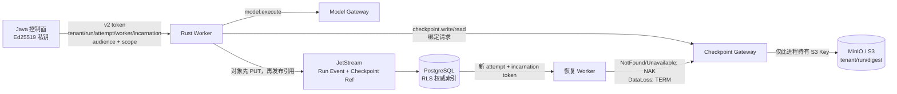

| 对标面 | Codex CLI | OpenClaw | 本平台当前实现 | 判断 |
|---|---|---|---|---|
| 工作负载身份 | 本地 Thread/进程与 sandbox policy 为主，不需要跨 Worker 服务令牌 | Gateway 与 Node 有设备连接、配对和命令身份，适合个人设备域 | 控制面签发 Ed25519 V2；共享 Rust verifier 校验 audience、scope、五元执行身份和 incarnation | 多租户无状态数据面身份更完整；设备注册、吊销与版本协商仍落后 OpenClaw |
| 凭证出口 | Provider/本地工具凭证管理成熟，但不处理租户对象代理 | Provider secret egress 与 Node 命令复核成熟，未提供 PaaS 对象凭证域 | Worker 不见 Provider Key 或 S3 Key；Model/Checkpoint Gateway 分别独占长期凭证 | 凭证隔离边界领先两个参考项目的 PaaS 适配；Vault/BYOK、mTLS 和密钥轮换尚未交付 |
| Checkpoint 交接 | rollout 本地恢复、分叉、回滚和兼容成熟 | transcript/SQLite replay、overflow compaction 和重启协调成熟 | Zstd/双摘要/内容引用经独立 Gateway 实际写入 MinIO，消息与 DB 不展开大对象 | 跨 Worker、多租户对象交接领先；历史压缩、分叉、回滚仍明显落后 Codex |
| 串租户与旧实例 | 不存在 Broker 抢占和租户对象路径问题 | Node invoke replacement 防止旧调用清理新调用 | token 与 gRPC 请求同时绑定 tenant/run/attempt/worker/incarnation；错租户和旧实例均在对象访问前拒绝 | 分布式纵深防护更强；真实节点证明和撤销仍待实现 |
| 故障语义 | rollout/compaction 错误路径和恢复操作成熟 | unsafe transcript/replay 会阻断，terminal delivery 协调更成熟 | 真实 MinIO PUT/GET；对象缺失延迟 NAK、内容损坏 TERM，双摘要失败不进入 Kernel | fail-closed 已有消息链路证据；存储中断、Gateway 丢失和 15 分钟 SLO 尚无生产演练 |
| 长任务能力 | 本地会话可持续执行并管理压缩/取消 | Gateway/Node 长连接、重连和生命周期更成熟 | 该阶段令牌最长五分钟且尚无刷新；一个 dispatch 同时获得 model 与 checkpoint scopes | 这是该阶段最大缺口，后续已由 ADR-0019 补齐身份续期 |

### 本阶段结论

- 已确认：Checkpoint Gateway、Worker gRPC client、共享 Workload Identity V2 和真实 MinIO 适配均已落地；Worker 不持有 S3/MinIO 长期密钥。
- 相比 Codex，本平台已解决其本地 rollout 不需要面对的跨租户对象代理、旧 Worker 实例隔离和 Broker 恢复分流；Codex 的 compaction、分叉、回滚及长期历史兼容仍显著领先。
- 相比 OpenClaw，本平台在多租户短期身份、对象凭证隔离、owner epoch/fencing 与可审计恢复上更强；OpenClaw 的 Node 注册/吊销、长连接重连、跨平台能力发现和 transcript repair 仍更成熟。
- 本阶段没有用 Worker 直持 S3 Key、预签名 URL 或放大 NATS 消息上限规避问题。该阶段 53% 只计入已经过真实 MinIO、JetStream、PostgreSQL 和全仓门禁验证的能力。
- 该阶段约定的下一子阶段“工作负载令牌刷新与 gRPC mTLS”现已由 ADR-0019 完成；后续进入 Gateway Kubernetes 部署与故障注入。

## 上一阶段：Checkpoint 压缩与内容寻址对象引用

该阶段完成 Base64 兼容、Zstd、双 SHA-256、512 KiB 内联阈值、16 MiB 解压上限、V10 权威索引和外部引用恢复；
实现结论已由 ADR-0017 固化，后续 Gateway 与身份边界由 ADR-0018 补齐。

## 上一阶段：稳定 Worker 与进程启动实例隔离

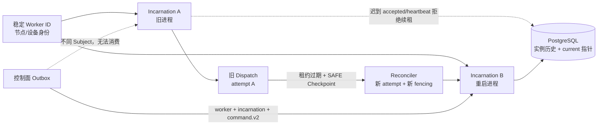

| 对标面 | Codex CLI | OpenClaw | 本平台当前实现 | 判断 |
|---|---|---|---|---|
| 稳定身份与进程身份 | `ThreadManager` 以 ThreadId 管理内存 Thread，并可从 rollout 恢复；没有分布式 Worker 启动实例 | Node Host 以 invoke ID 管理 `activeInvokes`，重复 ID 会 abort 旧进程 | Worker ID 表示稳定节点，UUIDv7 incarnation 表示本次启动；V9 同时保存 current 与历史 | 面向多租户云边调度的身份分层领先；真实设备注册与证明仍落后 OpenClaw 节点体系 |
| 命令寻址 | Tool/turn 在本地 Thread 内调度，无 Broker 抢占问题 | 命令经已连接 Node 下发，进程内按 invoke ID 处理 | 执行、恢复、取消、审批均使用 worker + incarnation 的唯一 JetStream Subject 与 durable | 分布式防串消费更强；连接级 backpressure 与节点协议成熟度仍落后 OpenClaw |
| 重复与迟到消息 | Thread/turn 生命周期和中断成熟，但不提供跨进程 accepted fencing | replacement abort 且 cleanup 只删除自己，避免旧 invoke 注销新 invoke | accepted、心跳续租、终态容量都精确匹配 incarnation；旧实例只能写历史，不能覆盖 current | 对至少一次消息投递的持久证据领先，进程内主动 kill 清理仍可借鉴 OpenClaw |
| 同设备重启恢复 | rollout resume/fork 能恢复本地历史，但不是 Scheduler 接管 | Node Host 进程重启后 `activeInvokes` 不保留，不自动从 Checkpoint 接管 | SAFE Checkpoint 可由同一稳定 Worker 的新 incarnation 接管，仍生成新 attempt/epoch/fencing | 云边断点恢复语义领先两个参考项目；大快照与跨版本迁移仍落后 Codex |
| Workspace 单写 | 以本地 cwd/sandbox 为边界 | 以 Node/Agent/Session 和命令复核为边界 | 稳定 Worker 作为 lease owner，epoch/fencing 管写所有权，incarnation 仅做进程寻址 | 三种生命周期未混用，适合多租户 PaaS |
| 升级与安全 | rollout 兼容代码成熟 | Node/Gateway 版本与能力协商更成熟 | v2 生产发布、v1 只读兼容；契约、DB 和 Rust/Java 双端测试覆盖 | 该阶段尚缺的令牌 incarnation 绑定已由 ADR-0018 补齐；节点吊销/证明和版本协商仍缺 |

### 本阶段结论

- 已确认：同一稳定 Worker 的旧、新进程使用不同 Subject；旧实例命令、accepted 和续租会被拒绝，新实例可从旧实例 SAFE Checkpoint 恢复。
- 相比 Codex，本平台增加了其本地 Thread/rollout 模型没有处理的分布式进程寻址和数据库 fencing；Codex 的历史压缩、分叉、回滚和版本兼容仍更成熟。
- 相比 OpenClaw，本平台把其进程内 replacement abort 提升为跨重启、可审计的数据库实例历史与 Broker 隔离；OpenClaw 的节点注册、能力发现、主动进程清理和跨平台覆盖仍领先。
- 本阶段没有用 incarnation 替代 attempt 或 Workspace owner epoch；三者分别承担进程、执行尝试和写所有权生命周期。
- 该阶段之后的大 Checkpoint 对象引用和工作负载令牌 incarnation 绑定已经完成；Kubernetes 故障注入与 15 分钟恢复 SLO 仍是当前后续门禁。

## 上一阶段：Checkpoint PubAck 与跨 Worker 自动接管

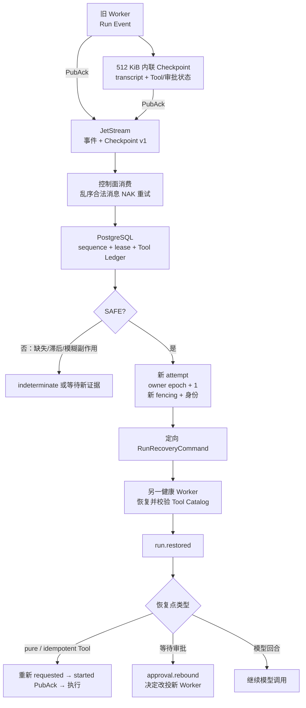

| 对标面 | Codex CLI | OpenClaw | 本平台当前实现 | 判断 |
|---|---|---|---|---|
| 会话重建 | `InitialHistory::Resumed`、rollout reconstruction、分叉与回滚链成熟 | Session replay 严格校验/修复 Tool Call 与 Result 配对 | Checkpoint 重建 Protobuf transcript、Kernel sequence、Tool 队列和审批状态 | 自动恢复主语义已接近；压缩、分叉、迁移仍落后 Codex，历史修复仍落后 OpenClaw |
| 持久化屏障 | rollout JSONL 围绕本地线程持久化，不提供跨 Worker PubAck 协议 | Gateway/Session 持久化成熟，Node invoke 主要依赖进程协议 | Event 与 Checkpoint 分别获得 JetStream PubAck；跨 Subject 乱序用延迟 NAK 收敛 | 面向分布式 PaaS 的确认边界领先，但长期重放成熟度不足 |
| 副作用恢复 | 本地恢复保留 FunctionCall/Output，不做租户级重放资格调度 | `replaySafe=false` 后阻止 replay，并标记 blocked | pure/idempotent 在新 attempt 重新产生 requested/started；non-idempotent/unknown 模糊结果进入 indeterminate | fail-closed 对齐 OpenClaw，且增加 PostgreSQL Tool Ledger 证据 |
| 审批恢复 | Shell/MCP 审批语义成熟，主要绑定本地会话 | system.run 对 argv/cwd/policy snapshot 复核成熟 | pending approval 原子改绑新 attempt/Worker，`approval.rebound` 后才允许决定 | 跨 Worker 可审计性领先；实体路径与策略快照细度仍落后 OpenClaw |
| 新所有者接管 | 恢复本地线程，不处理多租户 Workspace fencing | 重复 invoke ID 会取消旧进程，但不是 Workspace 租约 | 新 attempt + owner epoch 递增 + fencing/身份轮换；旧事件被数据库拒绝 | 多租户所有权边界领先两个参考项目 |
| 能力漂移 | 会话恢复依赖当前工具配置 | Node 能力发现与配置合并成熟 | AgentVersion、ModelPolicy、预算、Scope 和 Tool Catalog 摘要必须一致 | fail-closed 更强；动态 Skill/Node 能力调度仍明显落后 OpenClaw |
| 大历史与生命周期 | rollout 压缩、回滚、分叉和长期兼容成熟 | overflow compaction 与 replay repair 覆盖丰富 | v1 仅支持 512 KiB 内联快照；DB 有内容索引和摘要 | 这是当前最大落后项：对象存储引用、压缩、保留和迁移均未完成 |

### 本阶段结论

- 已确认：Worker→JetStream→PostgreSQL→Reconciler→新 Worker 已形成自动接管链，不再从原输入重跑；`run.restored`、replay-safe Tool 重规划和审批重绑定都有真实 NATS/数据库测试。
- 相比 Codex，本平台在跨 Worker fencing、多租户权威状态、短期身份轮换上领先；在 rollout 压缩、分叉、回滚和历史兼容上仍明显落后。
- 相比 OpenClaw，本平台已对齐副作用后的 fail-closed，并用 owner epoch 和 Tool Ledger 强化审计；在 replay repair、Worker/Node 进程实例清理和跨平台节点能力上仍明显落后。
- 本阶段没有以旧 attempt 复用、ACK 未落库消息或盲目重跑规避问题；512 KiB 上限暴露了对象存储卸载的下一硬缺口。
- 下一子阶段固定为：Worker incarnation ID → 大 Checkpoint 对象存储引用/压缩 → Kubernetes 故障注入与 15 分钟恢复 SLO；随后再进入动态 Skill 装载。

## 上一阶段：Tool Execution Ledger 与崩溃安全边界

```mermaid
flowchart LR
    AV["AgentVersion\ndelegated_scopes"] --> S["Scheduler dispatch 权限快照"]
    S --> W["Worker Tool Catalog"]
    W -->|"仅公开权限子集"| M["ModelInvocation.tools"]
    M --> P["Provider"]
    P --> C["完整 Tool Call\nID + name + arguments"]
    C --> K["Kernel Tool Policy"]
    K -->|"allow"| E["Bound Execution Request"]
    K -->|"ask"| A["Bound Approval Request"]
    K -->|"deny"| D["Tool Denied"]
    A --> CP["PostgreSQL Approval\n版本 + RLS + Outbox"]
    CP -->|"定向审批命令"| W2["当前 Worker / attempt"]
    W2 -->|"allow_once"| E
    W2 -->|"deny"| DR["绑定 Tool Result 错误"]
    E --> L1["Ledger: planned\nPostgreSQL + RLS"]
    L1 --> S1["tool.execution.started\nJetStream PubAck"]
    S1 --> L2["Ledger: started"]
    S1 --> X["Restricted OCI Executor\n只读 Workspace + 无网络"]
    X --> R["Bound Tool Result\nPubAck 持久化屏障"]
    R --> L3["Ledger: completed"]
    R --> H["assistant Tool Call + tool result 历史"]
    H --> M2["下一轮 ModelInvocation"]
    M2 --> P
```

| 对标面 | Codex CLI | OpenClaw | 本平台当前实现 | 判断 |
|---|---|---|---|---|
| Tool Call 身份 | Router 保留 call ID，并把失败转换为 FunctionCallOutput | 对不同 Provider 的 Tool Call ID 做严格规范化，修复/清理孤儿结果 | IR、gRPC、Worker transcript 和 OpenAI-compatible 消息全程保留原始 ID | 基础身份语义已对齐；跨 Provider 规范化仍落后 OpenClaw |
| Tool 调度 | Registry + Router + ToolCallRuntime；按工具能力串行/并行，取消路径成熟 | Embedded attempt 已有完整 Tool 生命周期与结果刷新 | Registry 产生 allow/deny/ask；Worker 自动完成模型—Tool—模型串行循环，事件逐段经 PubAck | 串行核心闭环已对齐；并行 Tool、动态 Tool 装载和上下文压缩仍落后 Codex |
| 权限委派 | 会话配置和 SandboxPolicy 决定本地能力，不解决租户间委派快照 | Gateway/Node/Agent 配置合并，适合个人/设备域 | AgentVersion scopes 进入不可变 dispatch 快照，Worker 仅公开权限子集 | 多租户最小权限边界领先两个参考项目 |
| 审批绑定 | Shell/MCP 审批成熟，拒绝作为 Tool 输出返回模型 | system.run 严格匹配 argv、cwd、Agent、Session、policy snapshot，并复核路径漂移 | approval ID + SHA-256 摘要绑定调用、effect、sandbox 和 scope；拒绝保持 Tool Call ID 回灌 | 拒绝语义对齐 Codex；实体路径快照仍落后 OpenClaw |
| Tool 结果回灌 | FunctionCallOutput/CustomToolOutput 类型丰富，可继续多轮 turn | ToolResult 规范化、缺失结果修复、终止时刷新成熟 | call ID + binding digest 双检；失败分类且不泄漏 stderr；PubAck 后自动发起下一轮 | 基础多轮语义已对齐；缺失结果修复、上下文压缩和跨重启回执仍落后 |
| 沙箱执行 | 统一 Tool Runtime，具备 Shell、取消、输出截断和平台沙箱适配 | Node `system.run` 重验 cwd/脚本、严格 argv、超时和输出截断 | 新增只读断网 OCI Provider：digest 固定、无 Shell argv、清空环境、cap drop、超时/取消、有界输出 | 隔离默认值更适合多租户；具体 Shell/HTTP/MCP、Kubernetes/Kata 和跨平台覆盖明显落后 |
| 持久化与恢复 | Rollout JSONL 可重建完整会话历史、设置和 usage，但不是多租户事务状态 | 持久 Session replay 会修复/拒绝 dangling call 与 orphan result | PostgreSQL Ledger 保存 planned/started/completed、effect、sandbox、request 与三个事件外键 | 执行事实与租户权威边界领先；完整 transcript 重建仍落后 Codex/OpenClaw |
| 副作用重放 | 本地会话恢复保留 FunctionCallOutput，但不提供 PaaS 级跨 Worker 调度判定 | 结构化记录潜在副作用，`replaySafe=false` 时保持 replayInvalid | started 必须先 PubAck；非幂等未完成调用进入带 call ID/摘要的 `indeterminate`，禁止盲重放 | 已对齐 OpenClaw 的 fail-closed 原则，并增加数据库审计；尚未恢复 replay-safe 调用 |
| 重投与并发决定 | 会话内审批生命周期完整，主要依赖单进程会话状态 | 重投 Node invoke ID 时取消旧进程，防止 orphan replacement | 数据库版本锁防重复决定；错误 binding 的 started/result 不入库；事件 ID 去重 | 至少一次投递边界更清晰；跨 Worker checkpoint handoff 仍未实现 |

### 上一阶段结论

- 本轮补齐了 Tool 执行权威账本、外部执行前 started PubAck、结果状态推进和带绑定证据的故障分类。
- 相比 Codex，我们已有更适合多租户调度的执行事实层，但尚不能像 rollout reconstruction 一样恢复完整 transcript、设置和上下文窗口。
- 相比 OpenClaw，我们已经对齐“潜在副作用后禁止不安全 replay”，并将证据放进 RLS/复合外键保护的数据库；其 replay 修复、Node 进程替换清理和跨平台恢复仍更成熟。
- 本平台继续领先的部分是 RLS、复合租户外键、Outbox、Workspace fencing、短期工作负载身份和显式 delegated scope；这些是两个源项目没有面向 PaaS 解决的边界。
- 下一子阶段固定为：持久 transcript/checkpoint → 恢复命令与新 owner epoch → replay-safe Tool 重试 → OCI 签名/Skill 装载。完成前不得称为跨 Worker 可恢复 Runtime。

## 参考源码

- Codex：`agent-source-research/codex/codex-rs/app-server-protocol/src/protocol/v2/thread.rs`
- Codex：`agent-source-research/codex/codex-rs/config/src/thread_config.rs`
- Codex：`agent-source-research/codex/codex-rs/core/src/tasks/mod.rs`
- Codex：`agent-source-research/codex/codex-rs/core/src/thread_manager.rs`
- Codex：`agent-source-research/codex/codex-rs/core/src/session/mod.rs`
- Codex：`agent-source-research/codex/codex-rs/core/src/responses_retry.rs`
- Codex：`agent-source-research/codex/codex-rs/core/src/session/turn.rs`
- Codex：`agent-source-research/codex/codex-rs/core/src/session/session.rs`
- Codex：`agent-source-research/codex/codex-rs/core/src/session/handlers.rs`
- Codex：`agent-source-research/codex/codex-rs/core/src/session/rollout_reconstruction_tests.rs`
- Codex：`agent-source-research/codex/codex-rs/core/src/tools/router.rs`
- Codex：`agent-source-research/codex/codex-rs/core/src/tools/parallel.rs`
- Codex：`agent-source-research/codex/codex-rs/core/src/tools/context.rs`
- Codex：`agent-source-research/codex/codex-rs/core/src/tools/approvals.rs`
- Codex：`agent-source-research/codex/codex-rs/core/src/tools/runtimes/mod.rs`
- Codex：`agent-source-research/codex/codex-rs/core/src/tools/runtimes/shell.rs`
- Codex：`agent-source-research/codex/codex-rs/core/src/tools/sandboxing.rs`
- Codex：`agent-source-research/codex/codex-rs/codex-client/src/sse.rs`
- Codex：`agent-source-research/codex/codex-rs/codex-api/src/sse/responses.rs`
- OpenClaw：`agent-source-research/openclaw/src/node-host/runtime.ts`
- OpenClaw：`agent-source-research/openclaw/src/commands/agents.commands.add.ts`
- OpenClaw：`agent-source-research/openclaw/src/agents/agent-scope-config.ts`
- OpenClaw：`agent-source-research/openclaw/src/agents/model-fallback-candidates.ts`
- OpenClaw：`agent-source-research/openclaw/src/cli/gateway-cli/run-loop.ts`
- OpenClaw：`agent-source-research/openclaw/src/gateway/server-close.ts`
- OpenClaw：`agent-source-research/openclaw/src/node-host/runtime.test.ts`
- OpenClaw：`agent-source-research/openclaw/src/node-host/runner.ts`
- OpenClaw：`agent-source-research/openclaw/src/node-host/invoke.ts`
- OpenClaw：`agent-source-research/openclaw/src/node-host/invoke-system-run-plan.ts`
- OpenClaw：`agent-source-research/openclaw/src/node-host/invoke-system-run-allowlist.ts`
- OpenClaw：`agent-source-research/openclaw/src/node-host/invoke-system-run.ts`
- OpenClaw：`agent-source-research/openclaw/src/agents/embedded-agent-runner/run/attempt.ts`
- OpenClaw：`agent-source-research/openclaw/src/agents/embedded-agent-runner/run/attempt.tool-call-normalization.ts`
- OpenClaw：`agent-source-research/openclaw/src/agents/embedded-agent-runner/run/attempt.subscription-cleanup.ts`
- OpenClaw：`agent-source-research/openclaw/src/agents/embedded-agent-runner/replay-history.ts`
- OpenClaw：`agent-source-research/openclaw/src/agents/embedded-agent-runner/run.overflow-compaction.test.ts`
- OpenClaw：`agent-source-research/openclaw/src/node-host/invoke-system-run.ts`
- OpenClaw：`agent-source-research/openclaw/src/node-host/invoke-system-run-plan.ts`
- OpenClaw：`agent-source-research/openclaw/src/node-host/pty-command.ts`
- OpenClaw：`agent-source-research/openclaw/src/agents/provider-stream.ts`
- OpenClaw：`agent-source-research/openclaw/src/agents/provider-secret-egress.ts`
